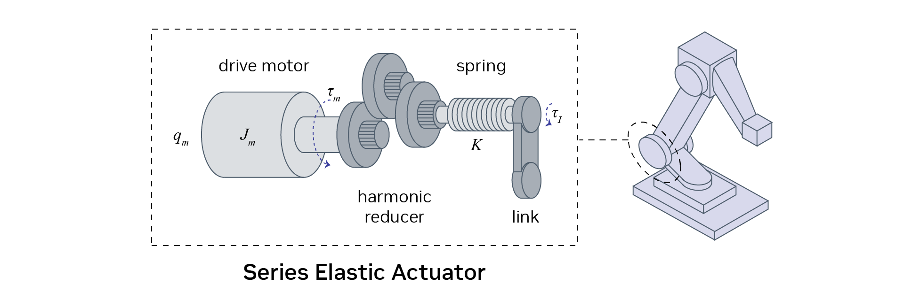

# What Is the Reality Gap?[#](#what-is-the-reality-gap "Link to this heading")

## Source Domain vs Target Domain[#](#source-domain-vs-target-domain "Link to this heading")

In the research community, we often talk about two domains:

1. The **source domain** (simulation)
2. The **target domain** (real world)
   These domains represent all the conditions a robot might encounter, including terrain, motor parameters, and other factors that define its operational environment.

As you might imagine, there is a big mismatch between simulation and reality. This is what we refer to as the **reality gap**.

So where does this gap come from? We can boil it down to three main factors: approximation errors, model errors, and unmodelled dynamics.

### Approximation Errors[#](#approximation-errors "Link to this heading")

Approximation errors arise from the inherent limitations of simulations in replicating real-world physics:

Physics and rendering simulations are approximations of the underlying laws of nature.
Discretization in simulations can lead to non-physical behaviors, such as object penetration.
Simulations may not conserve fundamental physical principles like momentum.

### Model Errors[#](#model-errors "Link to this heading")

Model errors occur due to inaccuracies in representing the physical robot and its environment:

Link lengths, body masses, and friction coefficients are never 100% accurate in simulations.
Manufacturing tolerances and wear and tear contribute to discrepancies between the simulated and real robot.

### Unmodelled Dynamics[#](#unmodelled-dynamics "Link to this heading")

There will often be parts of the dynamics which you don’t model at all:

Complex action mechanisms, such as series elastic actuators or springs, are often simplified.
Interactions involving suction cups or other complex contact scenarios are challenging to model precisely.
Sensor noise and actuator inaccuracies are often simplified or overlooked in simulations.
System delays, including network latency and actuator response times, are not always accounted for in simulations.
Diagram illustrating the complexity of a series elastic actuator.

Addressing these factors is crucial for successful sim-to-real transfer. Researchers employ various techniques such as domain randomization, real-to-sim transfer, and behavior regularization to bridge the reality gap and improve the performance of policies transferred from simulation to real-world robots.

On this page
