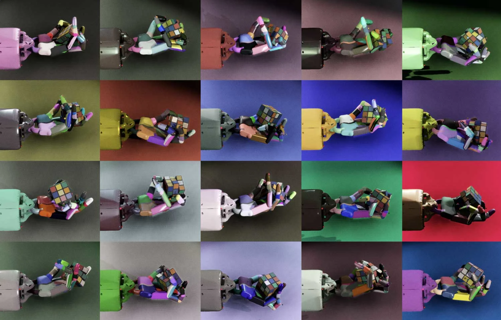
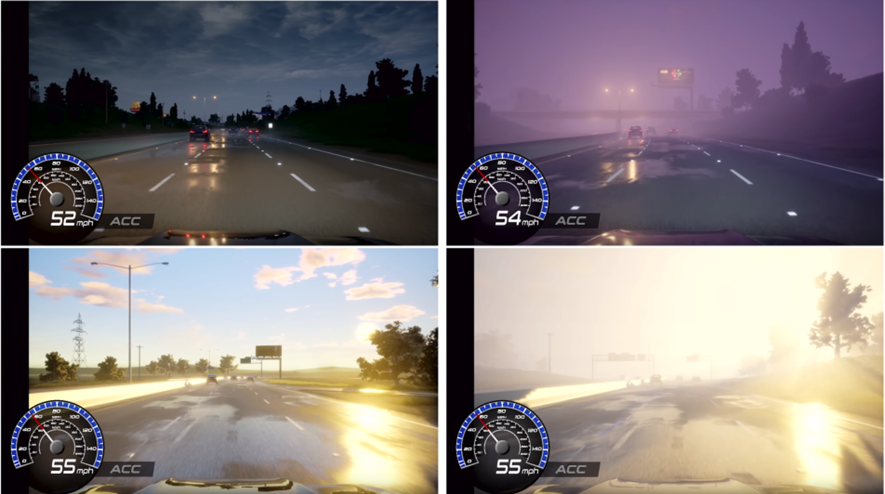

# Visual Domain Randomization[#](#visual-domain-randomization "Link to this heading")

Domain randomization extends beyond physical parameters for things like perception. We often modify various visual elements in our simulations, including:

- Texture variations across different surfaces
- Color modifications throughout the environment
- Lighting conditions and intensities
- Camera parameters to simulate different viewing conditions

*A robot solving a Rubik’s Cube, as demonstrated by OpenAI. (Source: OpenAI, <https://openai.com/index/solving-rubiks-cube/>)*[#](#id1 "Link to this image")

The goal isn’t necessarily to achieve photorealism. Instead, we focus on helping neural networks learn to identify key elements in various conditions. For instance, high contrast scenes can help networks better distinguish object locations, as seen in the image above from OpenAI where the stark contrast is helping the network learn to distinguish the location of the cube in the scene.

With [NVIDIA DRIVE Sim™](https://developer.nvidia.com/drive/simulation), we randomize weather conditions to teach systems to handle different lighting and reflection scenarios to prepare for various road conditions.

This approach helps build robust perception systems that can handle diverse real-world conditions, even when trained on stylized or non-photorealistic simulations.
