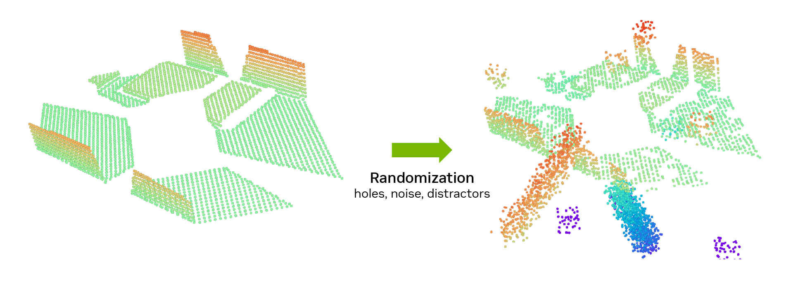

# Point Cloud Perturbations[#](#point-cloud-perturbations "Link to this heading")

For point cloud data, such as that from RealSense cameras or lidar sensors, we transform perfect simulation data by introducing spatial modifications:

- Random displacement of individual points
- Strategic holes in the point cloud
- Distractors to simulate sensor defects

These modifications help bridge the gap between pristine simulation data and the imperfect nature of real sensor readings. The goal is to train systems that can handle the noise and inconsistencies they’ll encounter in real-world deployments.

The transformation from clean simulation data to randomized point clouds helps create more robust perception systems that can handle the imperfections of real-world sensor data.

Tip

Learn more: [Neural Scene Representation for Locomotion on Structured Terrain](https://arxiv.org/pdf/2206.08077)

Through these techniques, we make the robot experience more diverse operation conditions. This will increase the size of the simulation circle and thus make the overlap between the two circles bigger.
