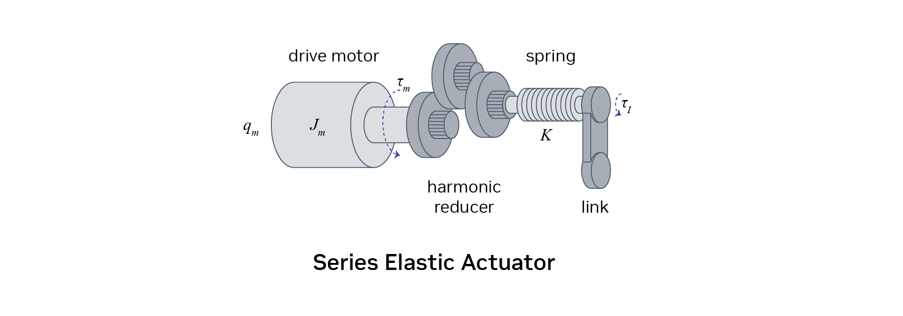
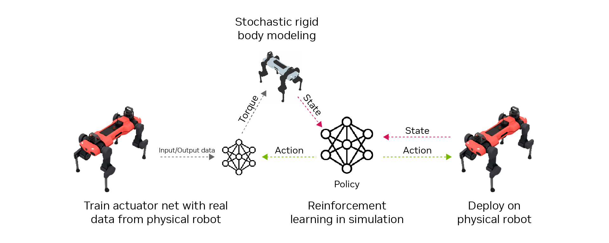

# Actuator Modeling[#](#actuator-modeling "Link to this heading")

Actuator modeling is another interesting topic in real-to-sim. In Isaac Lab, we use what we call actuator networks to replicate the behavior of real actuators on robots. These networks play a key role in bridging the gap between simulation and reality.

Let’s talk about why this is important. Actuators on robots are complex systems. Series elastic actuators, for example, have a motor, a harmonic drive, and a spring all working together in series. It’s incredibly difficult to model this accurately using traditional methods.

So, here’s what we do instead. We gather a bunch of input-output data from the actual robot’s actuators. The input includes the command given to the motor and the history of joint states up to that point. The output will be the actual joint torques, which can be measured accurately by measuring the deflection of the spring (Hooke’s Law).

Using this data, we train a neural network that captures the input-output behavior of the actuators. This approach lets us bypass all the complexity of the physical system. It can even account for system delays because we’re measuring from the moment the command is sent from the computer to when the torque is measured on the robot.

Typically robots in simulation use a proportional-integral-derivative (PID) controller to compute the torque applied on each actuator. With actuator modeling, we by-pass this and instead use the trained actuator network to compute which torque is applied on each joint at any point in time.
The actuator network is frozen when deployed in simulation, meaning it is not trained further and the weights are not updated.

How is this data collected? We send random commands to the motors, trying to excite the robot in all its possible modes of operation. This helps us gather a comprehensive dataset for training the network later on.

By using these actuator networks, we can create more accurate simulations that better reflect the behavior of real-world robots. This is a crucial step in developing robotic systems that can seamlessly transition from simulation to reality.
