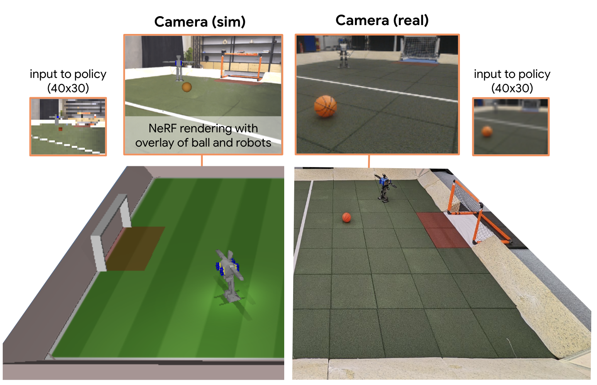

# Neural Rendering[#](#neural-rendering "Link to this heading")

**Neural rendering** offers an innovative approach to creating photorealistic images for robotic training. The process starts by capturing a NeRF (Neural Radiance Field) of the real environment where the robots will operate. You can do this using the robot and its camera. During reinforcement learning training, this NeRF serves as a rendering engine.

The system works by generating ego-centric RGB images at each timestamp based on the robot’s current position. What makes this approach particularly powerful is that additional objects can be overlaid onto the NeRF-generated scene. This creates a hybrid environment that combines the photorealistic background with simulated dynamic elements.

Source: [Learning Robot Soccer from Egocentric Vision with Deep Reinforcement Learning](https://arxiv.org/html/2405.02425v1), Google Deepmind

In the Google DeepMind soccer project, we can see how this works in practice. The simulation environment displays a standard 3D rendered view, but the actual observation the agent receives is a much more realistic representation of the terrain, generated by the NeRF. The robot’s policy receives a 40x30 input image that combines the photorealistic background with the overlaid game elements, creating a more authentic training environment that better bridges the gap between simulation and reality.

Tip

Learn more about the latest in [Neural Rendering](https://docs.omniverse.nvidia.com/materials-and-rendering/latest/neural-rendering.html)
