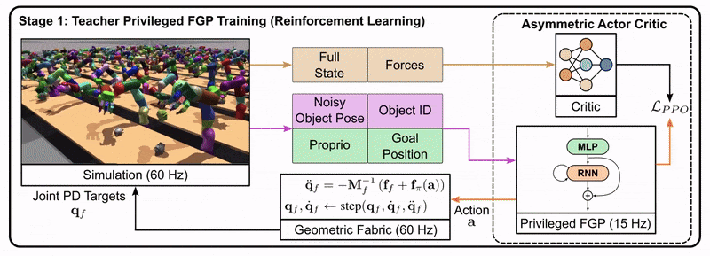
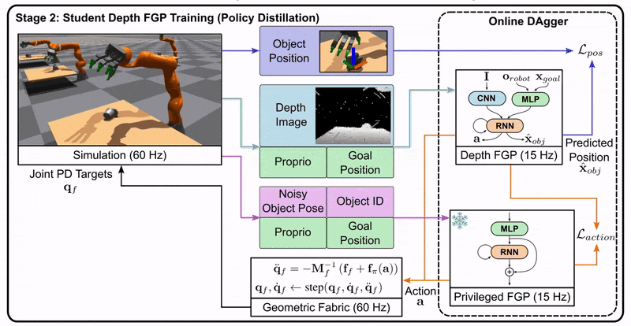
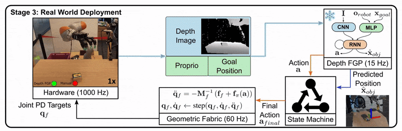

# Leveraging Privileged Information[#](#leveraging-privileged-information "Link to this heading")

The last topic we need to cover to finish our discussion on sim-to-real is privileged information, a concept we introduced at the beginning of this course. Leveraging privileged information is a crucial topic in robotics and simulation. Let’s explore what it means and how it’s used.

**Privileged information** refers to data that’s easily accessible in simulation but not readily available on a real robot. This can include:

- Ground friction coefficients
- Scene semantics
- Exact object poses

This additional information we can get from the simulation can be leveraged to make your systems even better. There are a couple different ways we can leverage this information: asymmetric actor-critic and the teacher-student approach.

## Asymmetric Actor-Critic[#](#asymmetric-actor-critic "Link to this heading")

In actor-critic methods, we train two networks: a value function (critic) and a policy (actor). The value function is necessary to update the policy during training but isn’t used during deployment. This allows us to give the value function access to privileged information, speeding up convergence.

For instance, when training a grasping task using images, the policy receives the image input. However, the value function can access ground truth information about the cube it’s trying to grasp. This approach simplifies training with images and accelerates the learning process.

## Policy Distillation / Teacher-Student Approach[#](#policy-distillation-teacher-student-approach "Link to this heading")

This widely-used method involves three stages:

1. Train a teacher with access to privileged information
2. Train a student without privileged information to imitate the teacher
3. Deploy the student on the robot

Let’s look at an example from the DextrAH-G project:

**Stage 1**: The teacher is trained using reinforcement learning. It has access to privileged information like the full state of the robot and the ground truth pose of objects.

**Stage 2**: The student is trained to imitate the teacher’s actions using only the information available to a real robot, such as depth images.

**Stage 3**: The student policy is deployed on the real robot, as it doesn’t rely on privileged information.

This approach allows us to leverage the benefits of privileged information during training while still producing a policy that can function in the real world with limited information.

By using these techniques, we can create more efficient and effective robotic systems that bridge the gap between simulation and reality.

On this page
