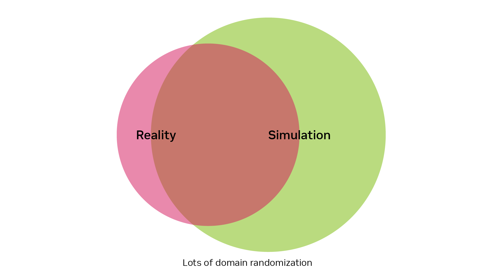
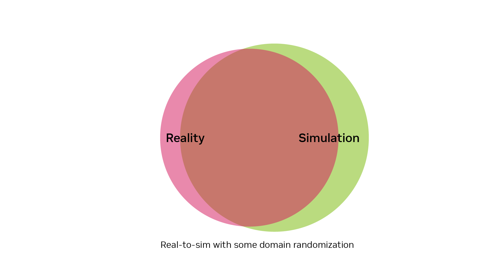

# Considerations When Bridging the Reality Gap[#](#considerations-when-bridging-the-reality-gap "Link to this heading")

Let’s talk about some important considerations regarding the steps we discussed earlier. It’s important to keep these factors in mind as you bridge the reality gap.

## Domain Randomization and Generalization[#](#domain-randomization-and-generalization "Link to this heading")

When we apply domain randomization, we’re essentially expanding the range of conditions our simulation covers. This increased coverage allows for more overlap with real-world scenarios. However, this approach comes with a trade-off:

The policy learns to perform in a wider variety of conditions
As the range of conditions grows, the policy becomes more and more of a generalist
Generalist policies often perform less effectively than specialists in a specific task

## Real-to-Sim Approach[#](#real-to-sim-approach "Link to this heading")

The real-to-sim method takes a different approach:

It aims to match real-world conditions in the simulation
Instead of expanding the range of conditions, it shifts the simulation to align more closely with reality
This approach doesn’t require the policy to become as much of a generalist
However, real-to-sim methods are more complex:

Real-world data needs to be collected, which is more time-consuming
The process is more involved and demands greater attention to detail

## Finding the Right Balance[#](#finding-the-right-balance "Link to this heading")

The key is to strike a balance between these approaches:

- Use just the right amount of domain randomization
- Incorporate some real-to-sim techniques where needed
- This balanced approach helps create a policy that’s both robust and effective in real-world scenarios
  By carefully combining these methods, we can develop policies that perform well in the real world without sacrificing too much specialization or requiring overly complex implementation.

On this page
