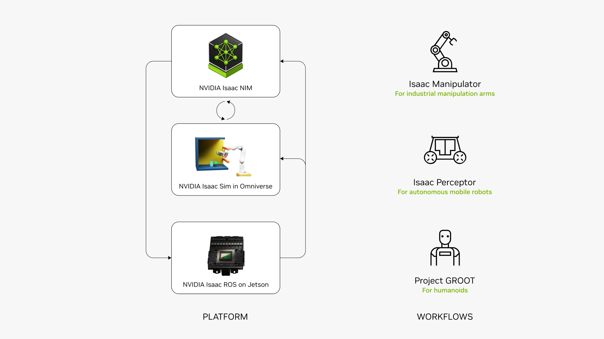

# NVIDIA Isaac[#](#nvidia-isaac "Link to this heading")

## What Is NVIDIA Isaac?[#](#what-is-nvidia-isaac "Link to this heading")

The NVIDIA Isaac AI robot development platform consists of NVIDIA CUDA-accelerated libraries, application frameworks, and AI models that accelerate the development of AI robots such as autonomous mobile robots (AMRs), manipulators, and humanoids.

To achieve its goal of enabling intelligent robots, Isaac employs several strategies:

- **Building Accelerated Components**: Isaac focuses on developing components that utilize NVIDIA’s acceleration technologies.
- **Providing Reference Solutions**: The platform offers reference solutions that allow users to either start from a pre-built foundation or customize according to their needs.
- **Improving Frameworks and Ecosystems**: Isaac contributes to the improvement of robotics frameworks and ecosystems that are crucial for both NVIDIA and the broader robotics community.
- **Productizing Cutting-Edge Research**: The platform aims to transform advanced research into production-ready components, making theoretical advancements practical for real-world applications.

On this page
