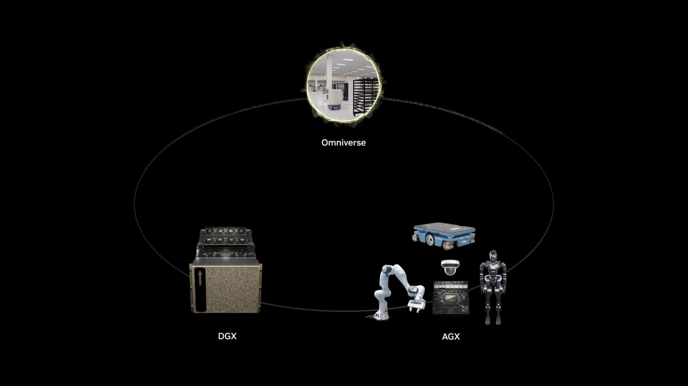

# Three Computer Solution[#](#three-computer-solution "Link to this heading")

## What is the Three Computer Solution?[#](#what-is-the-three-computer-solution "Link to this heading")

Isaac is part of NVIDIA’s broader [three computer solution](https://blogs.nvidia.com/blog/three-computers-robotics/), which integrates three distinct computing platforms, each optimized for a specific stage of the AI robotics development cycle.

- **Training Computer: NVIDIA DGX AI supercomputers**: serve as the foundation for training sophisticated AI models. Developers can leverage NVIDIA NeMo to train and fine-tune powerful foundation and generative AI models, including those developed under Project GR00T for humanoid robots.
- **Simulation and Synthetic Data Generation Computer: NVIDIA Omniverse and Cosmos on NVIDIA RTX PRO Servers**: Running NVIDIA Omniverse and Isaac Sim, these systems provide a robust development and simulation environment. This platform allows developers to test and optimize physical AI, generate synthetic data, and validate robot models in physically accurate virtual environments.
- **Runtime Computer: NVIDIA Jetson AGX Thor**: The NVIDIA Jetson AGX platform enables real-time inference and operation of AI models in robotic systems. This power-efficient solution integrates multiple AI models for vision, language processing, and motion control, allowing robots to function autonomously in dynamic environments.

By connecting these three computing platforms, NVIDIA Isaac provides a comprehensive ecosystem that empowers developers to create more intelligent and capable robot systems.

On this page
