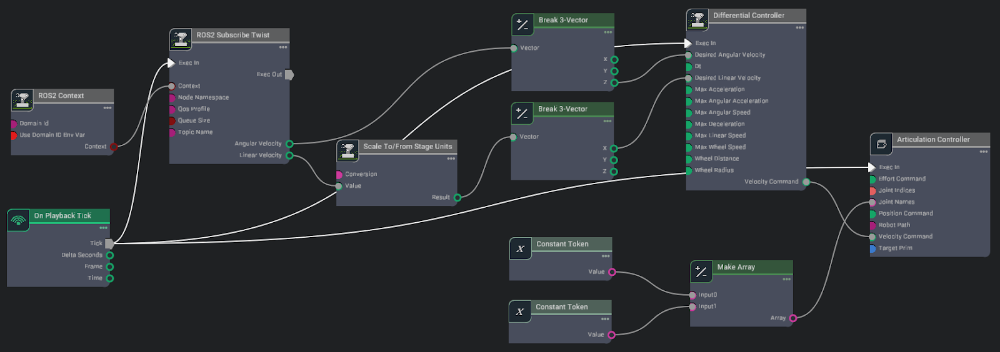

# Using OmniGraph to Drive a Robot in Isaac Sim[#](#using-omnigraph-to-drive-a-robot-in-isaac-sim "Link to this heading")

## Overview[#](#overview "Link to this heading")

In this module, we will explore the use of OmniGraph, a visual programming tool in Omniverse, to drive a robot in Isaac Sim. OmniGraph enables easy integration of functions from various systems and supports custom nodes for personalized functionality. We will learn how to use OmniGraph to connect Isaac Sim to ROS 2, add controllers to the robot, and build a simple Action Graph to drive the robot.

This module is divided into three sections:

- **Setting up the Environment and Robot** - We will set up the environment and robot in Isaac Sim.
- **Building the Action Graph using OmniGraph Nodes** - We will learn how to build a simple Action Graph using OmniGraph nodes, integrating ROS 2 and controllers to drive the robot.
- **Driving the Robot via ROS 2** - We will use the Action Graph to drive the robot via ROS 2, demonstrating the application of SIL in robotics development.

By the end of this module, you will be able to apply visual programming techniques using OmniGraph to control a robot in Isaac Sim, integrating ROS 2 for simulation-based testing.

## Installing Isaac Sim and ROS 2 Humble[#](#installing-isaac-sim-and-ros-2-humble "Link to this heading")

In this section, we will set up the simulation environment. This involves launching Isaac Sim with ROS 2 enabled, and loading the “Simple Room” environment.

### Install Isaac Sim 4.5.0[#](#install-isaac-sim-4-5-0 "Link to this heading")

1. If not already installed, follow the installation guide for Isaac Sim provided in the [Isaac Sim Installation Documentation](https://docs.isaacsim.omniverse.nvidia.com/latest/installation/index.html).
2. For this module, we assume you are using the **Workstation Installation** method.

   - Instructions can be found [here](https://docs.isaacsim.omniverse.nvidia.com/latest/installation/install_workstation.html).
3. Alternatively, if you prefer to install Isaac Sim using PIP in a virtual environment, refer to the [PIP Installation Guide](https://docs.isaacsim.omniverse.nvidia.com/latest/installation/install_python.html).

### Install ROS 2 Humble[#](#install-ros-2-humble "Link to this heading")

4. Install ROS 2 Humble on **Ubuntu 22.04** following the steps outlined in the [ROS and ROS 2 Installation Documentation](https://docs.isaacsim.omniverse.nvidia.com/latest/installation/install_ros.html).
5. For this module, we recommend using the **Running Native ROS** method. Follow the instructions under:

   - Running Native **ROS > ROS 2 > Ubuntu 22.04 > Humble**

### Launch Isaac Sim With ROS 2 Enabled[#](#launch-isaac-sim-with-ros-2-enabled "Link to this heading")

6. To enable communication between Isaac Sim and ROS 2, **launch** Isaac Sim with the ROS 2 bridge **enabled**.

   - If you are using ROS 2 Humble, Isaac Sim loads the Humble bridge by default, so no additional steps are required.
   - If you are using ROS Noetic or another version of ROS, follow the instructions under **Enabling the ROS Bridge Extension** in the [documentation](https://docs.isaacsim.omniverse.nvidia.com/latest/installation/install_ros.html#enabling-the-ros-bridge-extension).
7. Ensure that your ROS installation is sourced before launching Isaac Sim to avoid fallback to pre-packaged libraries.
8. Verify that the ROS2 Bridge is enabled:

   - In Isaac Sim, go to **Window > Extensions**.
   - Search for **ROS** in the search bar.
   - Confirm that the **ROS2 Bridge** extension is toggled **on**

### Open the Simple Room Environment[#](#open-the-simple-room-environment "Link to this heading")

Note

Follow the video to guide you through the next steps.

**Isaac Sim 4.2**

9. In Isaac Sim, navigate to

**Content > NVIDIA/Assets/Isaac/4.2/Isaac/Environments/Simple\_Room/**

10. Drag and drop the **simple\_room.usd** file into the main window.

**Isaac Sim 4.5**

9. In Isaac Sim, switch to the *Isaac Sim Assets [Beta]* and **open** Environments
10. On **simple\_room.usd** press with the right button and click on “Add at current selection”

- Wait a few seconds for it to load completely.
- Place it at the origin by **zeroing out** all Translate components in the Transform Property on the right-hand pane.
- Zoom into the scene until you can clearly see the table within the room.

---

We have successfully set up our environment in Isaac Sim. In the next section, we will bring in the Nova Carter and prepare it for simulation.

## Preparing the Nova Carter[#](#preparing-the-nova-carter "Link to this heading")

In this section, we will add the Nova Carter robot in the environment we prepared in Isaac Sim. This involves adding the robot and testing its physics. These steps will prepare us for further configuration and control of the robot in subsequent sections.

### Add the Nova Carter Robot[#](#add-the-nova-carter-robot "Link to this heading")

**Isaac Sim 4.2**

1. Navigate to **Content > NVIDIA/Assets/Isaac/4.1/Isaac/Robots/Carter**
2. Drag and drop the **nova\_carter.usd** file into the viewport near or around the table.

**Isaac Sim 4.5**

1. Open the *Isaac Sim Assets [Beta]* tab and select Robots
2. **Right click** on *nova\_carter.usd and select* **Add at current selection.**

- Select the Nova Carter using your mouse, then adjust its position as needed while it remains selected.
- Raise it slightly above ground level to prepare for testing physics.

### Test Robot Physics[#](#test-robot-physics "Link to this heading")

5. Press **Play** in Isaac Sim to start simulation mode.
6. Observe that the robot falls onto the floor due to gravity, confirming that physics is **enabled**.

---

We have successfully imported the Nova Carter and verified its physics properties. In the next section, we will configure controllers to enable movement for the Nova Carter.

## Building the Action Graph Using OmniGraph Nodes[#](#building-the-action-graph-using-omnigraph-nodes "Link to this heading")

In this section, we’ll use visual scripting with OmniGraph nodes to build an Action Graph that’ll allow us to drive the robot using ROS 2.

### Open Visual Scripting[#](#open-visual-scripting "Link to this heading")

1. Right-click on **nova\_carter** (as seen in the video) and navigate to **Create > Visual Scripting > Action Graph**
2. An *Action Graph* window will appear at the bottom of the Isaac Sim interface.

### Familiarize Yourself With OmniGraph Nodes[#](#familiarize-yourself-with-omnigraph-nodes "Link to this heading")

3. Inside of the *Action Graph* window, locate the panel on the left-hand side.

- This panel contains all the OmniGraph nodes.
- ROS2-related OmniGraph nodes are listed under `Isaac Ros2`.
- You can search for nodes by name using the search bar.

### Add Nodes to the Graph[#](#add-nodes-to-the-graph "Link to this heading")

4. To add a node to the graph, drag it from the node list into the graph window (see how in the video above).
5. Add the following nodes to your graph:

   - ROS2 Context
   - On Playback Tick
   - ROS2 Subscribe Twist
   - Scale To/From Stage Units
   - Two Break 3-Vector nodes
   - Make Array
   - Differential Controller
   - Articulation Controller
   - Two Constant Token nodes

The fully Connected OmniGraph[#](#id1 "Link to this image")

### Troubleshoot ROS Version (if necessary)[#](#troubleshoot-ros-version-if-necessary "Link to this heading")

If all ROS-related nodes are labeled ROS1 instead of ROS2:

6. Go to **Windows > Extensions**  
   7. Disable the ROS bridge  
   8. Enable the ROS2 bridge

### Connect the Nodes[#](#connect-the-nodes "Link to this heading")

9. Connect the nodes as shown in the video and image above.
10. Ensure all links are correct.

### Configure the Differential Controller Node[#](#configure-the-differential-controller-node "Link to this heading")

11. Click on the **Differential Controller** node.
12. In the right pane, set the following properties:

    - Max Linear Speed: `2.0`
    - Max Angular Speed: `3.0`
    - Wheel Distance: `0.413`
    - Wheel Radius: `0.14`

### Configure the Articulation Controller Node[#](#configure-the-articulation-controller-node "Link to this heading")

13. Click on the **Articulation Controller** node.
14. In its *property* tab on the right pane, click on **Add Target**.
15. In the window that pops up, click on **nova\_carter > chassis\_link > Select** to set the target to the **Carter** robot.

### Configure the Constant Token Nodes[#](#configure-the-constant-token-nodes "Link to this heading")

16. Click on the first **Constant Token** node.
17. Set its Input value to **joint\_wheel\_left**.
18. Click on the second **Constant Token** node.
19. Set its Input value to **joint\_wheel\_right**.

---

### Key Points About the Graph[#](#key-points-about-the-graph "Link to this heading")

- The `ROS 2 Subscribe Twist` node listens for velocity commands on the specific `/cmd_vel` topic.
- The **Differential Controller** converts linear and angular velocities to wheel velocities.
- The **Articulation Controller** applies these velocities to the robot’s wheels.
- The **Constant Token** nodes specify which joints (left and right wheels) should be controlled.

With this setup, we are now ready to communicate via ROS 2 and start driving the robot around.

## Driving the Robot via ROS 2[#](#driving-the-robot-via-ros-2 "Link to this heading")

In this section, we’ll use the popular ROS 2 package `teleop_twist_keyboard` to drive the robot in simulation based on the Action Graph we built earlier.

### Start the Simulation[#](#start-the-simulation "Link to this heading")

1. Press **Play** in Isaac Sim to start the graph and simulation.

### Verify ROS 2 Topics[#](#verify-ros-2-topics "Link to this heading")

2. Open a new terminal and source your **ROS 2** installation.

   - For example, if you have ROS 2 Humble, use the command: **source /opt/ros/humble/setup.bash**
3. Run the command: **ros2 topic list**
4. Verify that `/cmd_vel` is listed along with `/rosout` and `/parameter_events`.

### Test Robot Movement[#](#test-robot-movement "Link to this heading")

5. To drive the robot forward, **run** the following command. You should observe the Carter robot moving forward slowly in Isaac Sim. We are publishing a **/cmd\_vel** ROS topic here that specifies the robot’s linear and angular speeds.

`ros2 topic pub /cmd_vel geometry_msgs/Twist "{'linear': {'x': 0.2, 'y': 0.0, 'z': 0.0}, 'angular': {'x': 0.0, 'y': 0.0, 'z': 0.0}}"`

6. To **stop** the robot, run:

`ros2 topic pub /cmd_vel geometry_msgs/Twist "{'linear': {'x': 0.0, 'y': 0.0, 'z': 0.0}, 'angular': {'x': 0.0, 'y': 0.0, 'z': 0.0}}"`

### Install Teleop Package[#](#install-teleop-package "Link to this heading")

7. Install the `teleop_twist_keyboard` package using the following command if using ROS 2 Humble:

`sudo apt-get install ros-humble-teleop-twist-keyboard`

Note

If you are using a different version of ROS, you must specify your ROS version in the `ROS_DISTRO` variable.  
`sudo apt-get install ros-$ROS_DISTRO-teleop-twist-keyboard`

### Drive the Robot[#](#drive-the-robot "Link to this heading")

8. Start the **teleop\_twist\_keyboard** node:

`ros2 run teleop_twist_keyboard teleop_twist_keyboard`

9. Use the keyboard to control the robot:

`i`: move forward  
`,`: move backward  
`j`: rotate left  
`l`: rotate right  
`k`: stop

10. You can increase/decrease speed by following instructions that are printed on the terminal after running the node.

---

### Explore[#](#explore "Link to this heading")

Take some time to drive the robot around the simulated environment, testing its movement and responsiveness.

## Review[#](#review "Link to this heading")

In this module, we explored the fundamentals of visual scripting using OmniGraph in Isaac Sim.

In this module:

1. **Environment Setup:** We learned how to set up a simulated environment and import a robot (Carter) into Isaac Sim.
2. **OmniGraph Basics:** We introduced OmniGraph, a visual programming tool in Omniverse, and learned how to create an Action Graph.
3. **Node Configuration:** We explored how to add and configure various nodes, including ROS 2 Subscribe, Differential Controller, and Articulation Controller.
4. **ROS 2 Integration:** We learned how to integrate ROS 2 with Isaac Sim, enabling communication between the simulation and ROS 2 nodes.
5. **Robot Control:** We implemented a control system for a differential drive robot using OmniGraph nodes.
6. **Practical Application:** We used the teleop\_twist\_keyboard package to drive the simulated robot, demonstrating the practical application of our OmniGraph setup.

## It’s important to note that the concepts we learned in this module are not specific to the Carter robot. With different parameters, they can be applied to any wheeled robot imported into Isaac Sim, making this knowledge widely applicable in robotics simulation.[#](#it-s-important-to-note-that-the-concepts-we-learned-in-this-module-are-not-specific-to-the-carter-robot-with-different-parameters-they-can-be-applied-to-any-wheeled-robot-imported-into-isaac-sim-making-this-knowledge-widely-applicable-in-robotics-simulation "Link to this heading")

For further exploration:

- Dive deeper into OmniGraph by reading the [OmniGraph documentation](https://docs.omniverse.nvidia.com/isaacsim/latest/gui_tutorials/tutorial_gui_omnigraph.html#omnigraph).

In the next module, we’ll build upon these concepts to explore more advanced applications of Software-in-the-Loop (SIL) in robotics development.

---

### Quiz[#](#quiz "Link to this heading")

1. What is OmniGraph used for in Isaac Sim?

   1. To visually program and control simulations.
   2. To replace Python scripting entirely.
   3. To create physical hardware for robots.
   4. To generate 3D assets for simulations.

Answer

**A**  
OmniGraph is a visual programming tool in Isaac Sim that allows users to create and control simulations by connecting nodes, making it ideal for tasks like driving a robot.

2. Why is the Articulation Controller node necessary for driving a robot?

   1. It generates images from the robot’s camera.
   2. It sends commands to the robot’s joint drives.
   3. It creates a virtual environment for the robot.
   4. It replaces the need for physics simulation.

Answer

**B**  
The Articulation Controller node is essential for sending commands to the robot’s joint drives, ensuring that the wheels or other actuators respond correctly to input commands.

3. What is the purpose of the ROS 2 bridge in Isaac Sim?

   1. To replace the need for OmniGraph nodes.
   2. To simulate physical hardware components.
   3. To enable communication between Isaac Sim and ROS-based systems.
   4. To create 3D assets for the simulation.

Answer

**C**  
The ROS 2 bridge allows Isaac Sim to communicate with ROS-based systems, enabling seamless integration for testing and controlling robots in simulation.

On this page
