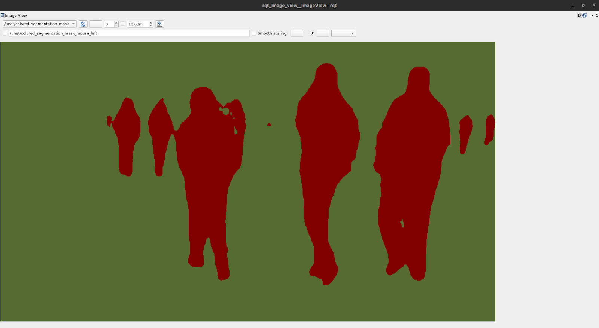

# Image Segmentation Without Simulation[#](#image-segmentation-without-simulation "Link to this heading")

## Overview[#](#overview "Link to this heading")

In this module, we will test the **Isaac ROS image segmentation** package using pre-recorded data **(rosbags)**. This step is crucial for understanding how the software works before integrating it into a simulated environment. By running the image segmentation package on pre-recorded data, we can focus on the functionality of the software itself without the added complexity of simulation.

We will use the **PeopleSemSegNet** model, a pre-trained semantic segmentation model designed to identify and segment people in images. This model leverages GPU acceleration for efficient and accurate pixel-level classification. The module will also introduce you to the Isaac ROS development container, which simplifies the setup process by providing all necessary dependencies in a pre-configured environment.

By the end of this module, you will:

- Gain hands-on experience with Isaac ROS development tools.
- Learn how to set up and run the image segmentation package using a docker-based development container.
- Test the PeopleSemSegNet model on pre-recorded data to validate its functionality.

This foundational knowledge will prepare you for the next module, where we will test the same software in a simulated environment using Isaac Sim.

## Isaac ROS Development[#](#isaac-ros-development "Link to this heading")

In this section, we will explore the basics of working with Isaac ROS, NVIDIA’s collection of GPU-accelerated ROS 2 packages designed for advanced robotics applications. While the focus here is on using Isaac ROS as a tool to understand and implement Software-in-the-Loop (SIL), we will not dive deeply into the specifics of Isaac ROS itself. For more comprehensive details, you can refer to the official [Isaac ROS documentation](https://nvidia-isaac-ros.github.io/index.html) .  
Using the **PeopleSemSegNet** model, a pre-trained semantic segmentation model for segmenting people in images, we will set up the development environment and download the necessary assets to prepare for running the image segmentation package.

### Prepare Environment[#](#prepare-environment "Link to this heading")

1. Access the documentation:

   - Navigate to the [Isaac ROS Image Segmentation documentation](https://nvidia-isaac-ros.github.io/repositories_and_packages/isaac_ros_image_segmentation/index.html) .

     - Open the [Isaac ROS Unet Quickstart](https://nvidia-isaac-ros.github.io/repositories_and_packages/isaac_ros_image_segmentation/isaac_ros_unet/index.html#quickstart) section for detailed setup instructions. We have listed them below as well.

2. Set up the [**Development Environment**](https://nvidia-isaac-ros.github.io/getting_started/dev_env_setup.html):

   - In a terminal, follow the steps provided in the link above.

     - Per **Step 2**, in [Isaac ROS Unet Quickstart](https://nvidia-isaac-ros.github.io/repositories_and_packages/isaac_ros_image_segmentation/isaac_ros_unet/index.html#quickstart), clone the `isaac_ros_common` repository into your workspace by running:

```
cd ${ISAAC\_ROS\_WS}/src &&
git clone -b release-3.1`
https://github.com/NVIDIA-ISAAC-ROS/isaac\_ros\_common.git isaac\_ros\_common
```

- Follow **Step 3** in the quickstart above to install dependencies for sensors if needed. *This is optional.*

3. Download **Quickstart Assets**:

   - Follow the instructions under [**Download Quickstart Assets**](https://nvidia-isaac-ros.github.io/repositories_and_packages/isaac_ros_image_segmentation/isaac_ros_unet/index.html#download-quickstart-assets) in the documentation.
   - This will include downloading the `PeopleSemSegNet` model, which is stored in the `isaac_ros_assets` folder within your workspace.

---

At this point, you have successfully set up your development environment and downloaded all required assets for people segmentation. These steps ensure that you are ready to use Isaac ROS for testing and validating image segmentation software in subsequent sections.

## Using Isaac ROS Development Center[#](#using-isaac-ros-development-center "Link to this heading")

In this section, we will set up and use the Isaac ROS development container to run the image segmentation ROS 2 package. The container is pre-configured with all the necessary libraries and dependencies, making it the recommended way to develop and test Isaac ROS packages. This setup ensures a streamlined environment for running the `PeopleSemSegNet` model for image segmentation.

**In this section, we’ll:**

- Launch the **Isaac ROS development container**.
- Prepare the `PeopleSemSegNet` model by converting it into a [TensorRT](https://developer.nvidia.com/tensorrt) plan file.
- Set up the container to run the image segmentation package in subsequent steps.

### Launch the Isaac ROS Development Container[#](#launch-the-isaac-ros-development-container "Link to this heading")

1. Open a **terminal** on your system.

2. Follow **Steps 1 and 2** under [Build isaac\_ros\_unet](https://nvidia-isaac-ros.github.io/repositories_and_packages/isaac_ros_image_segmentation/isaac_ros_unet/index.html#build-package-name) in the Isaac ROS documentation.

   - Step 1 will guide you through launching the Docker container.

Note

The first time you launch the container, it may take up to an hour to build and start, as it downloads and configures all required dependencies.

### Prepare the PeopleSemSegNet Model[#](#prepare-the-peoplesemsegnet-model "Link to this heading")

3. Once inside the container, follow the steps under [Prepare PeopleSemSegnet Model](https://nvidia-isaac-ros.github.io/repositories_and_packages/isaac_ros_image_segmentation/isaac_ros_unet/index.html#prepare-peoplesemsegnet-model).

This process will install model assets and convert the downloaded `PeopleSemSegNet` model into a TensorRT plan file optimized for GPU inference. This step typically takes about 5 minutes.

### Verify Setup[#](#verify-setup "Link to this heading")

## Ensure that both the container and model preparation steps have completed successfully. At this point, your environment is ready to run the image segmentation package.[#](#ensure-that-both-the-container-and-model-preparation-steps-have-completed-successfully-at-this-point-your-environment-is-ready-to-run-the-image-segmentation-package "Link to this heading")

Once the development container is set up, we will use a launch file to run the image segmentation example with pre-recorded data (**rosbag**). A launch file simplifies execution by starting all required ROS packages with a single command. Learn more about rosbags [here](https://docs.ros.org/en/foxy/Tutorials/Beginner-CLI-Tools/Recording-And-Playing-Back-Data/Recording-And-Playing-Back-Data.html) and launch files [here](https://docs.ros.org/en/humble/Tutorials/Intermediate/Launch/Launch-Main.html).

By completing this setup, you are now prepared to test image segmentation using pre-recorded data in the next section.

## Image Segmentation[#](#image-segmentation "Link to this heading")

In this section, we will run the **Isaac ROS image segmentation package** using pre-recorded data stored in a **rosbag**.

A rosbag is a file format in ROS used to record and playback data streams, such as images or sensor readings.

This step allows us to validate the functionality of the **PeopleSemSegNet** model and observe its segmentation results on pre-recorded images.


**In this section, we’ll:**

- Launch the **image segmentation** package using a ROS 2 launch file.
- Play back the **rosbag** containing pre-recorded image data (image above).
- Visualize the segmentation results using the rqt\_image\_view tool.

### Run the Launch File[#](#run-the-launch-file "Link to this heading")

1. Open a **terminal** and ensure your Isaac ROS development container is running.
2. Follow **Steps 1 and 2** under [Run Launch File](https://nvidia-isaac-ros.github.io/repositories_and_packages/isaac_ros_image_segmentation/isaac_ros_unet/index.html#run-launch-file) in the Isaac ROS documentation.

   - This will start the image segmentation package.
3. Check for the message **Node was started** in the terminal to confirm that the package is running without errors.

### Play Back the Rosbag[#](#play-back-the-rosbag "Link to this heading")

4. Open a second **terminal** and attach it to the same running container as in Step 1. Follow **Step 3** in the documentation to attach to the container.
5. Follow **Step 4** to play back the **rosbag** containing pre-recorded image data.

### Visualize Segmentation Results[#](#visualize-segmentation-results "Link to this heading")

6. Open a third **terminal** and follow **Step 1** under [Visualize Results](https://nvidia-isaac-ros.github.io/repositories_and_packages/isaac_ros_image_segmentation/isaac_ros_unet/index.html#visualize-results).
7. Run **rqt\_image\_view** by following **Step 2** in the documentation.

   - After about a minute, a window will open displaying segmentation results.
8. In **rqt\_image\_view**, switch topics to view:

   - The original input image.
   - The segmented output where people are highlighted.



## By completing these steps, you will have successfully tested the image segmentation package on pre-recorded data. The **PeopleSemSegNet** model will process the image from the **rosbag**, segmenting people in the image and displaying them as colorized masks.[#](#by-completing-these-steps-you-will-have-successfully-tested-the-image-segmentation-package-on-pre-recorded-data-the-peoplesemsegnet-model-will-process-the-image-from-the-rosbag-segmenting-people-in-the-image-and-displaying-them-as-colorized-masks "Link to this heading")

This step helps validate that the software works as expected before moving on to more complex scenarios involving simulated environments, which we will explore in the next module.

## Review[#](#review "Link to this heading")

In this module, we focused on testing the Isaac ROS image segmentation package using pre-recorded data (rosbags) to validate its functionality before integrating it into a simulated environment. This step was essential for understanding how the software processes image data and generates segmentation results.

In this module:

- **Environment Setup:** We configured the Isaac ROS development environment and downloaded the PeopleSemSegNet model assets.
- **Using the Development Container:** We utilized the pre-configured Isaac ROS development container to streamline dependency management and ensure seamless execution.
- **Testing with Rosbags:** We ran the image segmentation package on pre-recorded data, allowing us to evaluate the PeopleSemSegNet model’s ability to perform semantic segmentation on images.
- **Visualization:** Using `rqt_image_view`, we visualized segmentation results, confirming that the software successfully segmented people in the images.

## This module demonstrated how to test and validate an image segmentation package in a controlled environment without simulation. With this foundational understanding, we are now prepared to run the same package in a simulated environment using Isaac Sim in the next module, where Software-in-the-Loop (SIL) will be fully implemented.[#](#this-module-demonstrated-how-to-test-and-validate-an-image-segmentation-package-in-a-controlled-environment-without-simulation-with-this-foundational-understanding-we-are-now-prepared-to-run-the-same-package-in-a-simulated-environment-using-isaac-sim-in-the-next-module-where-software-in-the-loop-sil-will-be-fully-implemented "Link to this heading")

### Quiz[#](#quiz "Link to this heading")

1. What is the purpose of testing image segmentation software on pre-recorded data?

   1. To validate the software’s functionality in a controlled environment.
   2. To eliminate the need for simulation or real-world testing.
   3. To ensure compatibility with all types of robots.
   4. To reduce the need for GPU acceleration during testing.

Answer

**A**  
Testing on pre-recorded data, such as rosbags, allows developers to validate the functionality of image segmentation software in a controlled environment before integrating it into simulation or real-world scenarios.

2. What is a rosbag used for in ROS 2?

   1. To control robot hardware directly.
   2. To generate synthetic datasets for AI training.
   3. To store pre-recorded data streams for playback and testing.
   4. To replace the need for simulation entirely.

Answer

**C**  
A rosbag is a file format in ROS 2 used to record and playback data streams, such as sensor readings or images, making it a useful tool for testing software with pre-recorded data.

3. What is the PeopleSemSegNet model designed to do?

   1. Detect objects and estimate their poses in 3D space.
   2. Reconstruct 3D maps of an environment.
   3. Train AI models using synthetic datasets.
   4. Perform semantic segmentation to identify and highlight people in images.

Answer

**D**  
The PeopleSemSegNet model is a pre-trained semantic segmentation model specifically designed to identify and segment people in images by labeling relevant pixels.

4. How are segmentation results visualized during testing?

   1. By running commands directly in the terminal without visuals.
   2. Using rqt\_image\_view to display input images and segmented outputs.
   3. By generating 3D models of segmented objects automatically.
   4. Using physical hardware to display results on a robot screen.

Answer

**B**  
Segmentation results are visualized using rqt\_image\_view, a popular ROS tool that allows developers to view both input images and segmented outputs for debugging and validation purposes.

On this page
