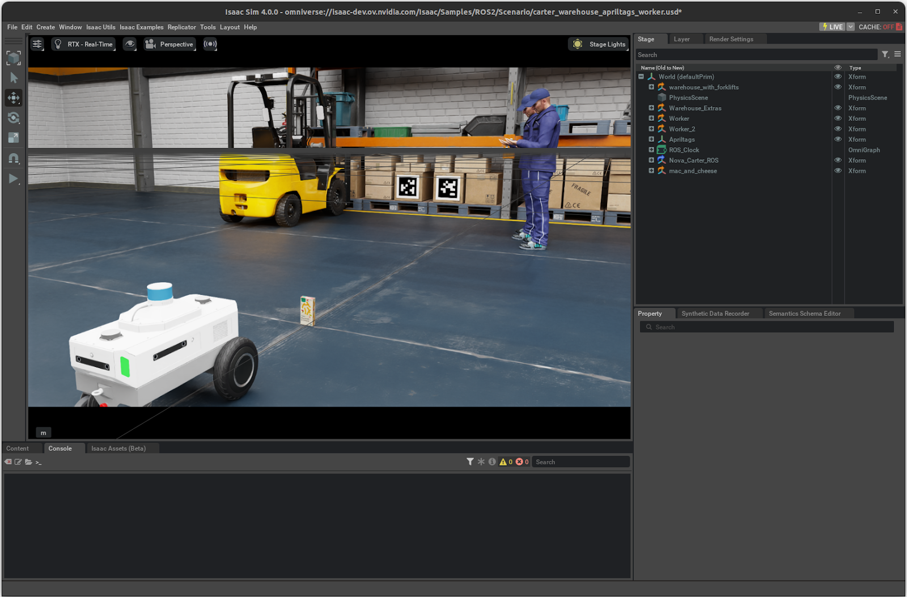

# Getting Started With Isaac Sim[#](#getting-started-with-isaac-sim "Link to this heading")

Welcome to the comprehensive Isaac Sim learning documentation. This collection of modules will guide you through building, simulating, and working with robots in NVIDIA Isaac Sim.

The modules cover five core areas: robot construction and control using OmniGraph and ROS 2 integration, URDF asset importation and physics configuration, synthetic data generation with Replicator for AI perception model training, Software-in-the-Loop (SIL) workflows for testing robotic software in simulation, and Hardware-in-the-Loop (HIL) methodologies for deploying applications on NVIDIA Jetson hardware.

Through these modules, you’ll work with sensors including RGB cameras, 2D lidar, and IMU systems, implement differential controllers and articulation systems, apply domain randomization techniques for dataset creation, execute image segmentation tasks with Isaac ROS packages, and validate models across both simulated and physical environments.
