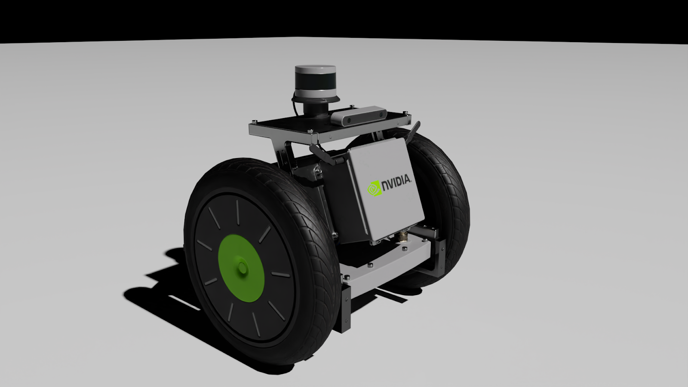

# Importing URDF Assets[#](#importing-urdf-assets "Link to this heading")

In this lesson, we’ll explore the foundational steps for importing robot assets into Isaac Sim using the URDF Importer. You’ll gain hands-on experience working with URDF files, which are essential for defining a robot’s structure, joints, and physical properties. By the end of this lesson, you’ll have successfully imported a robot into Isaac Sim and prepared it for simulation.

## Learning Objectives[#](#learning-objectives "Link to this heading")

- Identify the purpose and structure of URDF files and their role in robotics simulation.
- Navigate the URDF Importer interface to import robot models into Isaac Sim.
- Configure import settings such as joint target types and base link options to optimize robot behavior during simulation.
- Analyze the hierarchical structure of a robot’s components (links and joints) to understand their relationships and functionality.
- Demonstrate how to convert a URDF file into a USD format and validate the imported robot within Isaac Sim’s environment.

---

Isaac Sim runs on OpenUSD (Universal Scene Description), so you may encounter some new terms while working with USD assets in this module. You can learn more about OpenUSD fundamentals with our [*Learn OpenUSD: Foundations*](https://docs.nvidia.com/learn-openusd/latest/index.html) learning path.

## Introduction to URDF[#](#introduction-to-urdf "Link to this heading")

In this section, we will explore what a URDF file is, how it is structured, and why it is important for robotics simulation. By the end of this section, you will understand the purpose of a URDF file and how its components define a robot’s physical and functional properties.

### What Is a URDF File?[#](#what-is-a-urdf-file "Link to this heading")

A URDF (Unified Robot Description Format) is an XML-based file format used to describe the physical configuration of a robot. It includes details about the robot’s **links**, **joints**, **geometry**, and physical properties like **mass** and **inertia**.

Understanding the structure of a **URDF file** is essential because it serves as the blueprint for importing robots into Isaac Sim or other simulation environments.

### Prepare Isaac Sim for Importing[#](#prepare-isaac-sim-for-importing "Link to this heading")

Note

If this is your first time using Isaac Sim, we recommend taking the first module in this learning path, [*Getting Started: Simulating Your First Robot in Isaac Sim*](https://learn.nvidia.com/courses/course-detail?course_id=course-v1:DLI+S-OV-27+V1). We recommend using Isaac Sim 4.5.0 for this module, but instructions for 4.2.0 are also provided where there are differences.

1. Open a clean **terminal** to avoid conflicts with other processes.
2. Navigate to the main directory where Isaac Sim is installed:

```
cd ~/isaacsim
```

3. Run Isaac Sim using:

```
./isaac-sim.sh
```

Once launched, Isaac Sim will serve as the platform where we import and simulate our robot.

### Introduction to the Carter Robot[#](#introduction-to-the-carter-robot "Link to this heading")



Instead of creating a robot from scratch as we did in the previous module, we will use an existing robot model called “Carter” as an example. Carter’s description is provided in a URDF file named **carter.urdf**.

First, let’s explore the Carter URDF file.

Note

To locate the URDF file, check the Bookmarks folder for “Built-In URDF Files.” If the folder is missing, you can download the asset from [here](https://learn.learn.nvidia.com/assets/courseware/v1/d741d502706f2a12e22e5909701745b7/asset-v1:DLI+S-OV-29+V1+type@asset+block/carter.zip).

4. Locate and open the **carter.urdf** file in a text editor.

This text-based file contains all **relevant hierarchies**, **physics properties**, and **mesh details** that define Carter’s structure and functionality. Take a minute to scan the file and understand how it’s structured.

The file starts with a  tag that defines the robot’s name (e.g., “carter”) and serves as the root element.  
Inside the  tag:

- **Links:** Represent rigid parts of the robot (e.g., “chassis\_Link”). Each link can have child elements like  for mass distribution and  for appearance.
- **Joints:** Define how links are connected and their motion constraints (e.g., revolute or fixed joints). Joints are also children of links.

The hierarchical structure ensures that all components are logically connected, making it easier to understand relationships between parts.

---

### Key Components in Carter’s URDF[#](#key-components-in-carter-s-urdf "Link to this heading")

- The root link is named **chassis\_link,** which serves as the base of the robot.
- All other links (e.g., wheels or sensors) are children of this base link.
- Scrolling through the file reveals joint definitions that specify how these links move relative to one another.

Note

**Why Understanding URDF Matters**
A well-structured URDF simplifies importing robots into simulation environments like Isaac Sim. It provides clarity on how different parts of the robot interact, which is crucial for debugging and extending functionality during development.

Now that we’ve reviewed the structure of a URDF file, our next task will be to import this file into Isaac Sim using the URDF Importer tool and convert it into USD format for simulation purposes.

## Using the URDF Importer[#](#using-the-urdf-importer "Link to this heading")

In this section, we will use the URDF Importer in Isaac Sim to import the Carter robot. This process involves understanding the import options, configuring settings specific to the Carter robot, and converting the URDF file into USD format for simulation. By the end of this section, you’ll know how to navigate the URDF Importer and adjust its parameters for different types of robots.

### Open the URDF Importer[#](#open-the-urdf-importer "Link to this heading")

**Isaac Sim 4.2**

1. Start by navigating to the top menu bar in Isaac Sim.
2. Click on **Isaac Utils > Workflows > URDF Importer.**

- This opens the URDF Importer interface, which is specifically designed to convert URDF files (used in ROS) into USD files (used in Omniverse Isaac Sim).

**Understand the Purpose of the Importer**  
At the top of the interface, you’ll see an overview that explains that this utility is used to import URDF representations of robots into Isaac Sim.

**Explore Import Options**  
The importer provides several settings to customize how your robot is imported. These settings may vary depending on your robot type.

Note

If you’re unsure about any parameter, hover over it with your mouse to display a helpful tooltip.

**Configure the Fix Base Link Option**  
One key setting is **Fix Base Link**, which determines whether the base of your robot is fixed in world coordinates.

For manipulator-style robots (e.g., robotic arms), this option is typically checked because their base doesn’t move.

1. Since we’re using a mobile robot for this module, make sure the **Fix Base Link** setting is **unchecked**.

**Locate and Select the URDF File**

1. Scroll down to the **Input File** section and click on the **file browser**.
2. Find and select **carter.urdf**, then click **Select URDF**.

   - Once selected, you’ll notice a new sub-menu appears in the interface showing additional details about your robot’s joints and properties.

**Review and Adjust Joint Properties**

In this sub-menu, you can see all of Carter’s joints listed along with their default properties.

Let’s break down Carter’s design:

- Carter is a two-wheeled mobile robot with a third passive wheel at the back.

  - By default, joint target types are set to **Position** which works well for manipulators where precise positioning is required (e.g., gripping objects).
  - However, for Carter, we need to control wheel **Velocity** instead of position.

**Modify Joint Target Types**  
Update these joint settings as follows:

1. Change **left\_wheel** and **right\_wheel** target types to **Velocity**.

   - This allows us to control the wheels to spin forward or backward.
2. Set **rear\_axle** and **rear\_pivot** target types to **None** because these are passive components that don’t require motor control. They will rotate naturally as Carter moves.

**Leave Other Settings as Default**  
Unless specified otherwise, leave all remaining settings at their default values. These defaults are generally suitable for most use cases.

**Import the Robot**

1. Click on **Import** to begin converting and importing Carter’s URDF file into Isaac Sim.
2. When prompted, confirm the import path by selecting **Yes**.

   - The importer will process the file and add Carter as a USD asset in your simulation environment.

---

**Why These Steps Are Important:**

- The URDF Importer simplifies bringing robots from ROS-based workflows into Isaac Sim, saving time and effort.
- Configuring options like joint target types ensures that your robot behaves correctly during simulation.
- Understanding these settings prepares you to import and customize other robots in future projects.

---

You can learn more about the URDF Importer in the [Isaac Sim documentation](https://docs.omniverse.nvidia.com/isaacsim/latest/features/environment_setup/ext_omni_isaac_urdf.html).

**Isaac Sim 4.5**

**Locate and Select the URDF File to Import**

1. First, download the [Carter URDF file](https://learn.learn.nvidia.com/asset-v1:DLI%2BS-OV-29%2BV1%2Btype@asset%2Bblock@carter.zip) and extract the zip file to a known location.
2. Navigate to the top menu bar in Isaac Sim.
3. Click on **File > Import**
4. Find the folder where you extracted the zip file.
5. Click on the **carter.urdf** file. Notice that an options panel will appear on the right side in the current import window.

**Explore Import Options**  
The importer provides several settings to customize how your robot is imported. These settings may vary depending on your robot type.

Note

If you’re unsure about any parameter, hover over it with your mouse to display a helpful tooltip.

**Configure base**  
Under links, we want to select the **moveable base** option, because our robot is a mobile robot driven by wheels.

For manipulator-style robots (e.g., robotic arms), the static base option is typically checked because their base doesn’t move.

**Joints and Drives**  
Under Joints and Drives, make sure **Natural Frequency** is selected, and we will use the default values here.

In the **Joints and Drives** sub-menu, you can see all of Carter’s joints listed along with their default properties.

Let’s break down Carter’s design:

- Carter is a two-wheeled mobile robot with a third passive wheel at the back.
- By default, joint target types are set to **Position** which works well for manipulators where precise positioning is required (e.g., gripping objects).
- However, for Carter, we need to control wheel **Velocity** instead of position.

**Modify Joint Target Types**  
Update these joint settings as follows:

1. Change **left\_wheel** and **right\_wheel** target types to **Velocity**.

   - This allows us to control the wheels to spin forward or backward.
2. Set **rear\_axle** and **rear\_pivot** target types to **None** because these are passive components that don’t require motor control. They will rotate naturally as Carter moves.

**Leave Other Settings as Default**  
Unless specified otherwise, leave all remaining settings at their default values. These defaults are generally suitable for most use cases.

**Import the Robot**

1. Click on **Import** to begin converting and importing Carter’s URDF file into Isaac Sim.
2. When prompted, confirm the import path by selecting **Yes**.

   - The importer will process the file and add Carter as a USD asset in your simulation environment.

---

**Why These Steps Are Important:**

- The URDF Importer simplifies bringing robots from ROS-based workflows into Isaac Sim, saving time and effort.
- Configuring options like joint target types ensures that your robot behaves correctly during simulation.
- Understanding these settings prepares you to import and customize other robots in future projects.

---

You can learn more about the URDF Importer in the [Isaac Sim documentation](https://docs.isaacsim.omniverse.nvidia.com/latest/robot_setup/ext_isaacsim_asset_importer_urdf.html#isaac-sim-urdf-importer).

## Review[#](#review "Link to this heading")

In this lesson, we explored the foundational steps for importing robot assets into Isaac Sim using the NVIDIA URDF Importer. We reviewed the structure and purpose of URDF files, successfully imported the Carter robot, configured its settings for simulation, and analyzed its components, including links and joints, to understand their functionality.

In the next lesson, we’ll prepare a simulation environment and begin testing the Carter robot’s movement.

### Quiz[#](#quiz "Link to this heading")

1. What is the purpose of a URDF file in robotics?

   1. To define the programming logic for a robot
   2. To simulate the environment for a robot
   3. To describe the physical structure and components of a robot
   4. To control the sensors on a robot

Answer

**C**  
A URDF (Unified Robot Description Format) file is an XML-based format used to define a robot’s physical structure, including links, joints, and other properties. It does not handle programming logic, environment simulation, or direct sensor control.

2. Which option would you typically uncheck when importing a mobile robot like Carter using the URDF Importer?

   1. Use Joint Limits
   2. Fix Base Link
   3. Enable Self Collisions
   4. Add Ground Plane

Answer

**B**  
For mobile robots like Carter, you would uncheck “Fix Base Link” because the base of the robot needs to move freely in the simulation. This option is typically checked for stationary robots like manipulators.

3. What is the correct target type for the drive wheels of Carter during import?

   1. Position
   2. Velocity
   3. None
   4. Torque

Answer

**B**  
The drive wheels of Carter should have their target type set to “Velocity” because they are controlled by adjusting their rotational speed to move the robot forward or backward. “Position” is more suitable for manipulators, and “None” is used for passive joints like caster wheels.

On this page
