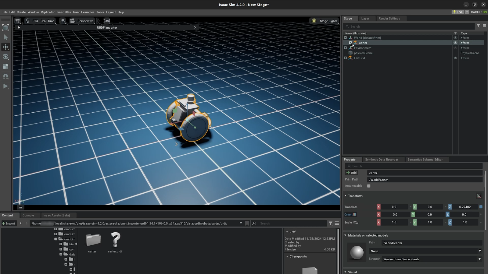

# Preparing the Simulation[#](#preparing-the-simulation "Link to this heading")

In this lesson, we’ll prepare a simulation environment for the Carter robot, configure its movement, and explore how to control it effectively within Isaac Sim. You’ll learn how to set up a simple environment, review the robot’s joints and components, simulate its behavior, and create a differential controller for precise control. By the end of this lesson, you’ll have a fully functional robot ready for advanced tasks.

## Learning Objectives[#](#learning-objectives "Link to this heading")

1. **Construct a simulation environment** by adding and configuring elements like a flat grid and physics properties.
2. **Examine the Carter robot’s joints** and their configurations to evaluate how they enable movement.
3. **Simulate the robot’s motion** to observe its behavior and validate its physics setup.
4. **Add a differential controller** to drive the robot using keyboard inputs.
5. **Modify simulation parameters**, such as velocity limits, to ensure smooth and realistic robot movement.

## Preparing the Environment[#](#preparing-the-environment "Link to this heading")

In this section, we will prepare a simple environment in Isaac Sim for our Carter robot. This step is crucial because robots need an environment to interact with during simulations. We’ll add a flat grid to serve as the ground, adjust the robot’s position, and make sure physics is active so the robot behaves realistically. By the end of this section, you’ll have a basic simulation environment ready for testing your robot.

### Understanding the Stage Window[#](#understanding-the-stage-window "Link to this heading")

The *Stage* window in Isaac Sim is where all the elements of your simulation are listed and organized. Think of it as a hierarchy that shows everything in your scene.  
When you imported the Carter robot, all the links from its URDF file were automatically converted into USD format and are now visible here. These links represent the different parts of the robot (like wheels and chassis) and how they’re connected.

### Adding a Simple Environment[#](#adding-a-simple-environment "Link to this heading")

Right now, our simulation doesn’t have any ground or environment for Carter to interact with—it’s just floating in an empty space.

**Isaac Sim 4.2**

1. To fix this, navigate to **Create > Isaac > Environments > Flat Grid.**

   - This will add a flat grid to your scene, which acts as a basic ground plane for Carter to move on.
   - Adding this environment is important because without it, physics simulations (like gravity) won’t allow Carter to act correctly.

**Isaac Sim 4.5**

1. To fix this, navigate to **Create > Environments > Flat Grid.**

   - This will add a flat grid to your scene, which acts as a basic ground plane for Carter to move on.
   - Adding this environment is important because without it, physics simulations (like gravity) won’t allow Carter to act correctly.

### Improving Visibility[#](#improving-visibility "Link to this heading")

To make things easier to see, let’s turn off the default **Environment Light**:

2. In the *Stage* window, locate the **Environment Light** object and toggle it off by clicking the small “**eye**” icon next to it.

### Adjusting Carter’s Position[#](#adjusting-carter-s-position "Link to this heading")

After adding the flat grid, you’ll notice that Carter might be intersecting with or sitting below the grid.

3. To fix this, select **Carter** in the *Stage* window and move it slightly upward so it’s positioned above the ground. You can do this by dragging it up in the viewport or adjusting its **Z-axis** position in the *Transform* settings.

### Activating Physics[#](#activating-physics "Link to this heading")

Now let’s test if physics is working correctly:

4. Press the **Play** button to start the simulation. This is located at the bottom of the left-hand toolbar.

   - This step confirms that physics is active because we observed the Carter falling due to gravity in the simulation. That Carter’s colliders (the invisible boundaries that define its physical shape) are interacting with the environment.

### Hiding and Visualizing Colliders[#](#hiding-and-visualizing-colliders "Link to this heading")

Isaac Sim can display green boxes around objects to represent their colliders. These are helpful for debugging but can get in the way visually.

To toggle them:

5. Go to **Show By Type** (the “eye” icon at the top of the viewport).
6. Navigate to **Physics > Colliders** and select **None**.

Now you can see Carter clearly without any visual obstructions.

---

Preparing an environment is one of the first steps in robotics simulation because it provides context for how your robot interacts with its surroundings. Even a simple flat grid allows you to test basic movements and physics behaviors before moving on to more complex environments or tasks.

In the next section, we’ll take a closer look at Carter itself and begin simulating its movement using a differential controller!

## The Carter Robot[#](#the-carter-robot "Link to this heading")

In this section, we will review the joints of the Carter robot to understand how they are set up and how they enable the robot to move. This step is essential because joints define the robot’s motion, and knowing how they are configured will help us debug or modify the robot in future simulations. By the end of this section, you’ll have a clear understanding of how Carter’s joints work and interact.

### Start With the Main Chassis[#](#start-with-the-main-chassis "Link to this heading")

The chassis is the central body of the Carter robot. It serves as the foundation to which all other components (wheels and joints) are connected.

**Isaac Sim 4.2**

1. In the *Stage* window, expand the **Carter** xform.

   - Here, you’ll see Carter’s main chassis along with its two **drive wheels** and **a pivot wheel** at the back. These are the key elements that allow Carter to move and rotate.

**Understand the Pivot Wheel**  
The pivot wheel is located at the back of Carter and connects to the chassis via a joint called the **rear\_pivot**. This joint allows the wheel to freely rotate clockwise or counter-clockwise based on how Carter moves. You can think of it like a caster wheel on a shopping cart—it adjusts its direction passively to follow the robot’s movement. This passive behavior is important for stability and smooth motion, especially when turning.

**Examine the Drive Wheels**  
The two front wheels are what drive Carter forward or backward. Let’s take a closer look at how their joints are set up:

- Expand **chassis\_link** in the Stage window. This is where you’ll find all joints connected to the chassis.
- Locate the **left\_wheel** joint. Notice that:

  - The joint rotates along the **Y-axis**, which means it spins forward or backward to drive motion.
  - Under properties, you’ll see that **Body 0** is set to **chassis\_link** (the base of Carter) and **Body 1** is set to **left\_wheel\_link** (the left wheel itself).
- Similarly, check the **right\_wheel** joint, which is configured in exactly the same way but controls the right wheel instead.

These two joints are **revolute joints**, meaning they allow rotation around a single axis (in this case, Y). This setup enables precise control over Carter’s movement.

**Reviewing the Rear Pivot Joint**

Let’s now look at how the rear pivot joint **rear\_pivot** is set up, Imagine again how shopping cart wheels rotate about their Z-axis to align with movement direction. The rear pivot joint works similarly.

2. Check its properties:

   - **Body 0** is connected to **chassis\_link**, and **Body 1** is connected to **rear\_pivot\_link**.
   - The joint allows rotation along its Z-axis so that it can adjust direction passively as Carter moves.

**Inspecting the Rear Axle Joint**

3. Finally, examine the **rear\_axle** joint:

   - This joint connects **rear\_pivot\_link** (the rotating part) to **rear\_wheel\_link** (the rear wheel itself).
   - As **rear\_pivot\_link** rotates about its Z-axis, this causes **rear\_axle** to rotate along its relative Y-axis, ensuring smooth motion for the rear wheel.
4. Check its properties:

   - **Body 0** is set to **rear\_pivot\_link**, and **Body 1** is set to **rear\_wheel\_link**.

**Isaac Sim 4.5**

1. In the *Stage* window, expand the **Carter** xform.

   - Here, you’ll see Carter’s main chassis along with its joints grouped together.

**Understand the Rear Wheel**  
The rear wheel is located at the back of Carter and connects to the chassis via a joint called the **rear\_pivot**. This joint allows the wheel to freely rotate clockwise or counter-clockwise based on how Carter moves. You can think of it like a caster wheel on a shopping cart—it adjusts its direction passively to follow the robot’s movement. This passive behavior is important for stability and smooth motion, especially when turning.

**Examine the Drive Wheels**  
The two front wheels are what drive Carter forward or backward. Let’s take a closer look at how their joints are set up:

- Expand **joints** in the Stage window. This is where you’ll find all joints connected to the chassis.
- Locate the **left\_wheel** joint. Notice that:

  - The joint rotates along the **Y-axis**, which means it spins forward or backward to drive motion.
  - Under properties, you’ll see that **Body 0** is set to **chassis\_link** (the base of Carter) and **Body 1** is set to **left\_wheel\_link** (the left wheel itself).
- Similarly, check the **right\_wheel** joint, which is configured in exactly the same way but controls the right wheel instead.

These two joints are **revolute joints**, meaning they allow rotation around a single axis (in this case, Y). This setup enables precise control over Carter’s movement.

Let’s now look at how the rear pivot joint **rear\_pivot** is set up. Imagine again how shopping cart wheels rotate about their Z-axis to align with movement direction. The rear pivot joint works similarly.

1. Check its properties:

   - **Body 0** is connected to **chassis\_link**, and **Body 1** is connected to **rear\_pivot\_link**.
   - The joint allows rotation along its Z-axis so that it can adjust direction passively as Carter moves.

**Inspecting the Rear Axle Joint**

2. Finally, examine the **rear\_axle** joint:

   - This joint connects **rear\_pivot\_link** (the rotating part) to **rear\_wheel\_link** (the rear wheel itself).
   - As **rear\_pivot\_link** rotates about its Z-axis, this causes **rear\_axle** to rotate along its relative Y-axis, ensuring smooth motion for the rear wheel.
3. Check its properties:

   - **Body 0** is set to **rear\_pivot\_link**, and **Body 1** is set to **rear\_wheel\_link**.

---

### Key Takeaways[#](#key-takeaways "Link to this heading")

- Each joint plays a specific role in enabling Carter’s movement:

  - The drive wheels use revolute joints for controlled rotation along their Y-axes.
  - The pivot wheel uses a combination of Z-axis rotation (for direction) and Y-axis rotation (for free rolling) through its joints.
- Together, these joints ensure that Carter can move forward, backward, and turn smoothly.

Understanding how joints are configured helps you troubleshoot issues like incorrect movement or instability during simulation. It also gives you insight into how different types of robots—manipulators vs. mobile robots—use different types of joints for their specific tasks.

In the next section, we’ll simulate Carter’s movement and create a differential controller for precise control over its wheels!

## Simulating the Carter[#](#simulating-the-carter "Link to this heading")

In this section, we will simulate the Carter robot to see how it moves and interacts with its environment. By the end of this section, you’ll know how to set velocities for Carter’s wheels and observe its movement.

### Understanding Passive Joints[#](#understanding-passive-joints "Link to this heading")

1. Before we start the simulation, let’s revisit the rear joints **rear\_pivot** and **rear\_axle:**

   - Notice that these joints don’t have any **Damping** values set. That’s because they are passive joints—they don’t have motors or forces actively controlling them.
   - When we imported Carter, we set their target types to **None** instead of **Velocity.** This means these joints move passively, influenced only by the robot’s motion and the forces exerted by the front wheels.
   - **Why does this matter?** It’s important to understand which parts of your robot are actively controlled and which are passive so you can predict how they’ll behave during simulation.

### Setting Target Velocities[#](#setting-target-velocities "Link to this heading")

Let’s make Carter move!

2. In the **Stage** window, select both **left\_wheel** and **right\_wheel**.
3. Set their **Target Velocity** values to **20**. This tells the robot to drive both wheels forward at a constant speed.

   - Why 20? This value is arbitrary for now but gives us a good starting point to see Carter in action. You can adjust it later to control how fast the robot moves.

### Run the Simulation[#](#run-the-simulation "Link to this heading")

4. Click **Play** to start the simulation. Watch as Carter begins moving forward across the flat grid environment.

**Isaac Sim 4.2**

**Testing Turning Behavior**  
While the simulation is running:

5. Select one of the wheels (e.g., **left\_wheel**) in the **Stage** window.
6. Change its **Target Velocity** to **0**. This stops that wheel from spinning while the other wheel continues moving.
7. Observe what happens:

   - Carter should start turning in place because one wheel is stationary while the other drives forward.
   - Pay attention to how the **rear\_pivot** joint adjusts its rotation as Carter turns—it’s passively rotating to align with the robot’s movement.

Note

**Fixing an Articulation Root Issue**  
There’s a known issue in this setup: The Articulation Root (which defines how all parts of Carter are connected for physics simulation) is incorrectly placed on Chassis\_link instead of at the top-level Carter xform.

Let’s fix that:

1. Select **Chassis\_link** in the *Stage* window.
2. Scroll down to find its **Articulation Root** property.
3. Click on the red **X** button next to it to delete this incorrect root.
4. Now, right-click on **Carter** (the top-level xform) in the *Stage* window.
5. Select **Add > Physics > Articulation Root**. This reassigns the articulation root to its correct location.

**Adjusting Articulation Root Properties**  
After adding the new articulation root:

1. Scroll down to its properties and locate **Self Collisions Enabled**.
2. **Disable** this option by unchecking it.

   - If self-collisions are enabled, different parts of Carter (like its wheels and chassis) might collide with each other during simulation, which can cause issues.

**Isaac Sim 4.5**

**Testing Turning Behavior**  
While the simulation is running:

5. Select one of the wheels (e.g., **left\_wheel**) in the **Stage** window.
6. Change its **Target Velocity** to **0**. This stops that wheel from spinning while the other wheel continues moving.
7. Observe what happens:

   - Carter should start turning in place because one wheel is stationary while the other drives forward.
   - Pay attention to how the **rear\_pivot** joint adjusts its rotation as Carter turns—it’s passively rotating to align with the robot’s movement.

---

### Key Takeaways[#](#id1 "Link to this heading")

- Simulating your robot allows you to test its movement and behavior before deploying it in real-world scenarios.
- Understanding how active (drive wheels) and passive (rear joints) components work together helps you design better robots and troubleshoot issues effectively.
- Fixing bugs like incorrect articulation roots ensures that your simulations are accurate and reliable.

In the next section, we’ll take things further by creating a differential controller for Carter, giving us precise control over its motion!

## Create the Differential Controller[#](#create-the-differential-controller "Link to this heading")

In this section, we’ll create a differential controller for the Carter robot, enabling us to drive it around the stage using our keyboard. A differential controller is essential for controlling robots with two independently driven wheels, like Carter, as it calculates how the wheels should move to achieve desired linear and angular velocities. By the end of this section, you’ll have set up the controller, fixed any issues with velocity limits, and successfully driven Carter around using your keyboard.

### What Is a Differential Controller?[#](#what-is-a-differential-controller "Link to this heading")

- A differential controller calculates how much each wheel should rotate to make the robot move forward, backward, or turn.
- In this setup, we’ll use Isaac Sim’s **OmniGraph** system to create and configure the differential controller.

### Add the Differential Controller[#](#add-the-differential-controller "Link to this heading")

**Isaac Sim 4.2**

1. Navigate to the top menu bar and select: **Isaac Utils > Common OmniGraphs > Differential Controller**.

   - This will add a pre-built **OmniGraph** for controlling Carter’s movement.

**Set Up the Robot Prim**  
The Robot Prim is essentially the root object that represents your robot in Isaac Sim. For Carter, this is the **Carter Xform**.

2. In the **Differential Controller** settings, add **Carter** as the Robot Prim.

**Determine Wheel Radius**  
To configure the controller correctly, we need to know the **radius** of Carter’s wheels

3. Select the **collision geometry** inside either **left\_wheel\_link** or **right\_wheel\_link**.
4. In its properties, you’ll see that the radius of the collision cylinder is **0.24** meters.
5. Enter this value into the **Wheel Radius** field in the **Differential Controller** settings.

**Calculate Distance Between Wheels**  
The distance between Carter’s left and right wheels is another critical parameter

6. Select **left\_wheel\_link** and check its position along the **Y-axis**—it’s located at **0.31** meters.

Since Carter is symmetrical, the right wheel will be at **-0.31** on the Y-axis.

7. Multiply **0.31** by **2** to get the total distance between wheels: **0.62 meters**.
8. Enter this value into the **Wheel Distance** field in the **Differential Controller** settings.

**Set Joint Names**  
The controller needs to know which joints control Carter’s wheels:

9. Set Right Joint Name to **right\_wheel**.
10. Set Left Joint Name to **left\_wheel.**

**Enable Keyboard Control**

To drive Carter using your keyboard:

11. Enable **Use Keyboard Control** in the **Differential Controller** settings, then select **Ok** to close the window.

    - This allows you to control Carter with keys like **W, A, S, and D** for forward, left, backward, and right movement.

**Inspect and Open OmniGraph**  
After setting up the controller, you’ll notice a new folder called **Graphs** in your *Stage* window.

11. In the stage, right-click on the graph named **differential\_controller** and select **Open Graph** to see how it’s structured.

    - This graph contains nodes that process keyboard input and send velocity commands to Carter’s wheels.

**Simulate and Test Movement**

12. Press **Play** to start simulating.
13. Use your keyboard **W, A, S, D** to drive Carter around.

You might notice an issue—Carter seems to stall or behave erratically when moving.

The problem occurs because the velocity commands sent by your keyboard are too high for Carter’s configuration.

14. Select the **DifferentialController** OmniGraphNode in the *Stage* window.
15. In the *properties* window, scroll down to its **Outputs** section.
16. Press **W** on your keyboard and observe that it’s trying to send a velocity command of around **20 m/s**, which is far too fast for our robot.

**Adjust Maximum Speed Limits**

17. Select the **DifferentialController** in the *Stage* window again.
18. Set both **maxLinearSpeed** and **maxAngularSpeed** to something more reasonable—let’s use **0.5 m/s** for both.

    - These limits ensure that Carter moves at a manageable speed during simulation.

**Isaac Sim 4.5**

1. Navigate to the top menu bar and select: **Tools > Robotics > OmniGraph Controllers > Differential Controller**.

   - This will add a pre-built **OmniGraph** for controlling Carter’s movement.

**Set Up the Robot Prim**  
The Robot Prim is essentially the root object that represents your robot in Isaac Sim. For Carter, this is the **Carter Xform**.

2. In the **Differential Controller** settings, add **Carter** as the Robot Prim.

**Determine Wheel Radius**  
To configure the controller correctly, we need to know the **radius** of Carter’s wheels

3. Select the **collision geometry** inside either **left\_wheel\_link** or **right\_wheel\_link**.
4. In its properties, you’ll see that the radius of the collision cylinder is **0.24** meters.
5. Enter this value into the **Wheel Radius** field in the **Differential Controller** settings.

**Calculate Distance Between Wheels**  
The distance between Carter’s left and right wheels is another critical parameter

6. Select **left\_wheel\_link** and check its position along the **Y-axis**—it’s located at **0.31** meters.

Since Carter is symmetrical, the right wheel will be at **-0.31** on the Y-axis.

7. Multiply **0.31** by **2** to get the total distance between wheels: **0.62 meters**.
8. Enter this value into the **Wheel Distance** field in the **Differential Controller** settings.

**Set Joint Names**  
The controller needs to know which joints control Carter’s wheels:

9. Set Right Joint Name to **right\_wheel**.
10. Set Left Joint Name to **left\_wheel.**

**Enable Keyboard Control**

To drive Carter using your keyboard:

11. Enable **Use Keyboard Control** in the **Differential Controller** settings, then select **Ok** to close the window.

    - This allows you to control Carter with keys like **W, A, S, and D** for forward, left, backward, and right movement.

**Inspect and Open OmniGraph**  
After setting up the controller, you’ll notice a new folder called **Graphs** in your *Stage* window.

12. In the stage, right-click on the graph named **differential\_controller** and select **Open Graph** to see how it’s structured.

    - This graph contains nodes that process keyboard input and send velocity commands to Carter’s wheels.

**Simulate and Test Movement**

13. Press **Play** to start simulating.
14. Use your keyboard **W, A, S, D** to drive Carter around.

You might notice an issue—Carter seems to stall or behave erratically when moving.

**Fixing Velocity Issues**

The problem occurs because the velocity commands sent by your keyboard are too high for Carter’s configuration.

15. Select the **DifferentialController** OmniGraphNode in the Stage window.
16. In the properties window, scroll down to its **Outputs** section.
17. Press **W** on your keyboard and observe that it’s trying to send a velocity command of around **20 m/s**, which is far too fast for our robot.

**Adjust Maximum Speed Limits**

18. Select the **DifferentialController** in the Stage window again.
19. Set both **maxLinearSpeed** and **maxAngularSpeed** to something more reasonable—let’s use **0.2 m/s** for both.

    - These limits ensure that Carter moves at a manageable speed during simulation.

### Test Again[#](#test-again "Link to this heading")

20. Press **Play** again to simulate.
21. Use your keyboard (**W, A, S, D**) and notice how much smoother Carter moves now.
22. To confirm that our speed limits are working:

    - Select **Chassis\_link** in the *Stage* window.
    - Scroll down to its **Rigid Body** properties.
    - Press **W** on your keyboard and observe that Carter’s velocity does not exceed **0.5 m/s** as we configured.

---

### Key Takeaways[#](#id2 "Link to this heading")

- Setting up a differential controller is a critical step in making your robot functional within a simulation environment.
- Understanding parameters like wheel radius and distance between wheels helps you configure controllers accurately for any robot you work with in the future.
- Limiting maximum speeds ensures that your robot operates safely and realistically during simulations.

## Review[#](#review "Link to this heading")

In this lesson, we prepared a simulation environment for the Carter robot by adding a flat grid and configuring physics properties. We reviewed the robot’s joints to evaluate their functionality, simulated its motion to validate its setup, and created a differential controller to drive the robot using keyboard inputs. We also adjusted parameters like velocity limits to ensure smooth and realistic movement.

In the next lesson, we’ll enhance the robot by adding sensors and exploring how it perceives its environment.

### Quiz[#](#quiz "Link to this heading")

1. Why is it important to add a flat grid to the simulation environment?

   1. To make the robot’s sensors function correctly
   2. To connect the robot to the simulation interface
   3. To provide a ground plane for the robot to interact with
   4. To reduce the brightness of the environment

Answer

**C**  
Adding a flat grid provides a ground plane that allows the robot to interact with gravity and simulate realistic movement. Without it, the robot would fall endlessly or not behave as expected in the simulation.

2. What is the purpose of reviewing Carter’s joints in the simulation?

   1. To adjust the visual appearance of the robot
   2. To evaluate how links and joints enable movement
   3. To add new sensors to the robot
   4. To change the robot’s size and scale

Answer

**B**  
Reviewing Carter’s joints allows you to understand how its links and joints are configured to enable movement. This step is critical for debugging or modifying the robot’s functionality during simulation.

3. Why do we set maximum linear and angular speed limits in the Differential Controller?

   1. To prevent Carter from colliding with itself
   2. To ensure smooth and realistic movement during simulation
   3. To disable keyboard control for Carter
   4. To make Carter move faster in its environment

Answer

**B**  
Setting maximum speed limits ensures that Carter moves smoothly and realistically during simulation. Without these limits, excessive velocity commands could cause erratic behavior or instability in its motion.

On this page
