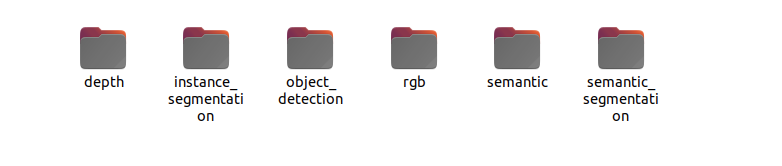
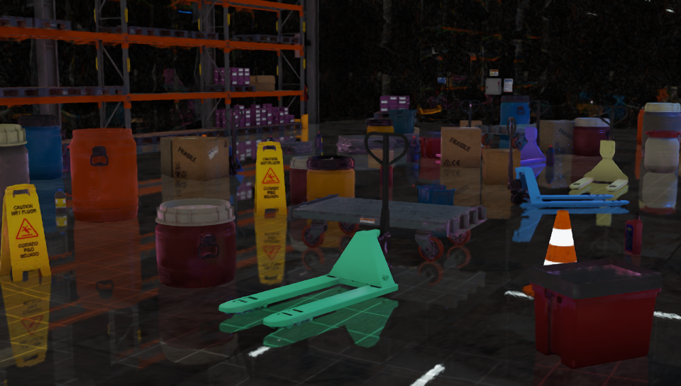
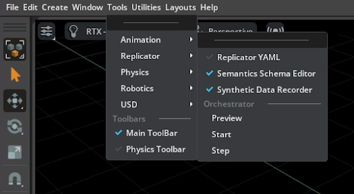

# Generating a Synthetic Dataset Using a Replicator[#](#generating-a-synthetic-dataset-using-a-replicator "Link to this heading")

In this lesson, you’ll learn how to generate a synthetic dataset using NVIDIA Replicator, focusing on creating diverse and realistic data for training AI perception models. We’ll guide you through the process of setting up a simulation environment, applying domain randomization, and capturing images with varying parameters such as object poses, lighting conditions, textures, and camera angles.

## Learning Objectives[#](#learning-objectives "Link to this heading")

- **Understand the basics of the Synthetic Data Generation** (SDG) script and its role in data creation.
- **Apply domain randomization** techniques to introduce variability into your dataset.
- **Use Python scripts with Replicator APIs** to automate data generation efficiently.
- **Explore optional advanced features** like the Semantics Schema Editor for generating detailed annotations.
- **Create a high-quality synthetic dataset** that can be used for training AI perception models.

This hands-on lesson will give you practical experience in generating synthetic data and prepare you for the next steps in fine-tuning and validating your AI models. By the end of this lesson, you’ll have created a robust dataset tailored for detecting pallet jacks in a warehouse environment.

## Understanding Basics of the SDG Script[#](#understanding-basics-of-the-sdg-script "Link to this heading")

In this section, we’ll break down the key components of the Synthetic Data Generation (SDG) script. Using Isaac Sim, we’ll generate a synthetic dataset for detecting pallet jacks in a warehouse environment. By changing the color and pose of pallet jacks and varying the camera position, we’ll introduce enough diversity into the dataset to serve as a strong starting point. While this example generates 5,000 images, the focus here is on understanding the data generation process rather than creating a large dataset.

### Install Isaac Sim[#](#install-isaac-sim "Link to this heading")

1. Ensure you have [Isaac Sim](https://docs.isaacsim.omniverse.nvidia.com/latest/installation/install_workstation.html) installed on your system. If you’re using the previous version, *Isaac Sim 4.2.0*, follow installation instructions [here](https://docs.omniverse.nvidia.com/isaacsim/latest/installation/install_workstation.html). If you’re using a cloud or remote instance, refer to this [guide](https://docs.isaacsim.omniverse.nvidia.com/latest/installation/install_cloud.html#) for setup

### Clone the Project[#](#clone-the-project "Link to this heading")

2. Open a terminal and clone the [Synthetic Data Generation Training Workflow](https://github.com/NVIDIA-AI-IOT/synthetic_data_generation_training_workflow) repository: `git clone https://github.com/NVIDIA-AI-IOT/synthetic_data_generation_training_workflow.git`

### Locate and Configure `generate_data.sh`[#](#locate-and-configure-generate-data-sh "Link to this heading")

The script [`generate_data.sh`](https://github.com/NVIDIA-AI-IOT/synthetic_data_generation_training_workflow/blob/main/local/generate_data.sh) is located in **synthetic\_data\_generation\_training\_workflow/local**. This script requires the absolute path of your Isaac Sim installation folder to be specified in the variable ISAAC\_SIM\_PATH. To find your Isaac Sim installation path:

**Isaac Sim 4.2**

3. In Omniverse Launcher, go to the *Library* tab and select **Isaac Sim**
4. Click on the hamburger icon next to the *Launch* button and select **Settings**
5. This will open up a window with the install path. **Copy this path**, we will use it in the next step.

   - For example:

```
#!/bin/bash
# This is the path where Isaac Sim is installed which contains the python.sh script
ISAAC\_SIM\_PATH="/home/abc/.local/share/ov/pkg/isaac-sim-4.2.0/"
```

Next, let’s make generate\_data.sh executable.

6. **Run** the following command to make the script executable:

`chmod +x synthetic_data_generation_training_workflow/local/generate_data.sh`

**Isaac Sim 4.5**

3. Copy the absolute path of your Isaac Sim installation. This is where you unzipped the package during installation. If you followed the standard workstation installation steps, this will be ***/home//isaacsim.***
4. Copy this path in generate\_data.sh in ISAAC\_SIM\_PATH and don’t forget to save it. For Example:

```
#!/bin/bash
# This is the path where Isaac Sim is installed which contains the python.sh script
ISAAC\_SIM\_PATH="/home/abc/isaacsim"
```

5. **Run** the following command to make the script executable:

```
chmod +x synthetic\_data\_generation\_training\_workflow/local/generate\_data.sh
```

### Understand What the Script Does[#](#understand-what-the-script-does "Link to this heading")

Before running generate\_data.sh, let’s review its functionality:

- It calls a Python file named [standalone\_palletjack\_sdg.py](https://github.com/NVIDIA-AI-IOT/synthetic_data_generation_training_workflow/blob/main/palletjack_sdg/standalone_palletjack_sdg.py), located in synthetic\_data\_generation\_training\_workflow/palletjack\_sdg.

  - This Python script sets up a warehouse environment, adds pallet jacks from the SimReady Asset Library, and applies **domain randomization** (DR) by varying object poses, colors, lighting, and camera positions.

Note

You do not need to run the code snippets in the rest of this section. These are just given here to understand what the data generation code does. We’ll run it in the next section.

### Warehouse Environment Setup[#](#warehouse-environment-setup "Link to this heading")

The following lines in standalone\_palletjack\_sdg.py load a simple warehouse environment in Isaac Sim:

`ENV_URL = "/Isaac/Environments/Simple_Warehouse/warehouse.usd"`  
`open_stage(prefix_with_isaac_asset_server(ENV_URL))`

### Adding Pallet Jacks and Camera[#](#adding-pallet-jacks-and-camera "Link to this heading")

Pallet jacks are added from the [SimReady library](https://developer.nvidia.com/omniverse/simready-assets), and a camera is placed in the scene:

`PALLETJACKS = ["http://omniverse-content-production.s3-us-west-2.amazonaws.com/Assets/DigitalTwin/Assets/Warehouse/Equipment/Pallet_Trucks/Scale_A/PalletTruckScale_A01_PR_NVD_01.usd",`  
`"http://omniverse-content-production.s3-us-west-2.amazonaws.com/Assets/DigitalTwin/Assets/Warehouse/Equipment/Pallet_Trucks/Heavy_Duty_A/HeavyDutyPalletTruck_A01_PR_NVD_01.usd",`  
`"http://omniverse-content-production.s3-us-west-2.amazonaws.com/Assets/DigitalTwin/Assets/Warehouse/Equipment/Pallet_Trucks/Low_Profile_A/LowProfilePalletTruck_A01_PR_NVD_01.usd"]`  
`cam = rep.create.camera(clipping_range=(0.1, 1000000))`

### Applying Domain Randomization (DR)[#](#applying-domain-randomization-dr "Link to this heading")

Domain randomization is applied by randomizing camera positions, pallet jack colors, and object poses:

```
1with cam:
2 rep.modify.pose(position=rep.distribution.uniform((-9.2, -11.8, 0.4), (7.2, 15.8, 4)),
3 look\_at=(0, 0, 0))
4
5# Get the Palletjack body mesh and modify its color
6with rep.get.prims(path\_pattern="SteerAxle"):
7 rep.randomizer.color(colors=rep.distribution.uniform((0, 0, 0), (1, 1, 1)))
8
9# Randomize the pose of all added palletjack
10with rep\_palletjack\_group:
11 rep.modify.pose(position=rep.distribution.uniform((-6, -6, 0), (6, 12, 0)),
12 rotation=rep.distribution.uniform((0, 0, 0), (0, 0, 360)),
13 scale=rep.distribution.uniform((0.01, 0.01, 0.01), (0.01, 0.01, 0.01)))
```

### Annotations With KITTI Writer[#](#annotations-with-kitti-writer "Link to this heading")

The script uses Replicator’s [KITTI Writer](https://docs.cvat.ai/docs/manual/advanced/formats/format-kitti/#:~:text=The%20KITTI%20format%20is%20widely,tracking%2C%20and%20scene%20flow%20estimation.) to annotate data for object detection tasks:

```
1# Set up the writer
2writer = rep.WriterRegistry.get("KittiWriter")
```

### Additional Features[#](#additional-features "Link to this heading")

- **Varying Lighting Conditions**: The script randomizes lighting attributes like color and intensity:

`with rep.get.prims(path_pattern="RectLight"):`  
`rep.modify.attribute("color", rep.distribution.uniform((0, 0, 0), (1, 1, 1)))`  
`rep.modify.attribute("intensity", rep.distribution.normal(100000.0, 600000.0))`  
`rep.modify.visibility(rep.distribution.choice([True, False, False, False]))`

- **Adding Distractors:** Additional objects like traffic cones or barrels are added for scene diversity:

```
1DISTRACTORS\_WAREHOUSE = ["/Isaac/Environments/Simple\_Warehouse/Props/S\_TrafficCone.usd", "/Isaac/Environments/Simple\_Warehouse/Props/S\_WetFloorSign.usd", "/Isaac/Environments/Simple\_Warehouse/Props/SM\_BarelPlastic\_A\_01.usd"]
2
3
4# Modify poses of distractors
5with rep\_distractor\_group: rep.modify.pose(position=rep.distribution.uniform((-6, -6, 0), (6, 12, 0)), rotation=rep.distribution.uniform((0, 0, 0), (0, 0, 360)), scale=rep.distribution.uniform(1, 1.5))
6
```

---

With these steps understood and configured correctly in your environment setup files ([generate\_data.sh](https://github.com/NVIDIA-AI-IOT/synthetic_data_generation_training_workflow/blob/main/local/generate_data.sh) and [standalone\_palletjack\_sdg.py](https://github.com/NVIDIA-AI-IOT/synthetic_data_generation_training_workflow/blob/main/palletjack_sdg/standalone_palletjack_sdg.py)), **you’re ready to run the script to start generating synthetic data!**

We’ll cover this process in detail in the next section.

## Running the Script for Generating Training Data[#](#running-the-script-for-generating-training-data "Link to this heading")

In this section, we’ll run the script to generate **synthetic training data** for pallet jack detection. The script uses Isaac Sim and Replicator to create diverse scenes with **domain randomization**, capturing images from different camera positions and configurations. Follow these steps to execute the script and understand the output:

### Time Required for Data Generation[#](#time-required-for-data-generation "Link to this heading")

The time taken depends on your GPU and dataset size. Using an NVIDIA RTX A6000 GPU with default settings (5000 images), data generation takes approximately one hour.

### Navigate to the Script Directory[#](#navigate-to-the-script-directory "Link to this heading")

1. Open a **terminal** and navigate to the directory where the script is located:

```
cd synthetic\_data\_generation\_training\_workflow/local/
```

### Run the Script[#](#run-the-script "Link to this heading")

2. **Execute** the script using the following command:

```
./generate\_data.sh
```

### Wait for Isaac Sim to Load[#](#wait-for-isaac-sim-to-load "Link to this heading")

After running the script, the Isaac Sim window will open.

3. A smaller window might pop up asking if you would like to “Force Quit” or “Wait” - **click on Wait.**
4. Allow up to a minute for the scene to load and data generation to begin. You will see scenes being rapidly generated with varying lighting, object positions, colors, and camera angles.

This process demonstrates domain randomization in action.

Isaac Sim 4.2

Isaac Sim 4.5

### Default Dataset Configuration[#](#default-dataset-configuration "Link to this heading")

By default, the `generate_data.sh` script generates:

- **2000 images** with warehouse distractors (e.g., cones, bins, boxes).
- **2000 images** with additional distractors (e.g., furniture, bags, wheelchairs).
- **1000 images** with no distractors (only pallet jacks).

These numbers can be modified in the script by changing the **num\_frames** parameter in the following lines:

```
./python.sh $SCRIPT\_PATH --height 544 --width 960 --num\_frames 2000 --distractors warehouse --data\_dir $OUTPUT\_WAREHOUSE
```

```
`./python.sh $SCRIPT\_PATH --height 544 --width 960 --num\_frames 2000 --distractors additional --data\_dir $OUTPUT\_ADDITIONAL`
```

```
`./python.sh $SCRIPT\_PATH --height 544 --width 960 --num\_frames 1000 --distractors None --data\_dir $OUTPUT\_NO\_DISTRACTORS`
```

### Customizing Parameters[#](#customizing-parameters "Link to this heading")

You can adjust other parameters in the script as needed:

- **Image Dimensions** : Modify height and width.
- **Distractor Types** : Specify warehouse, additional, or None.
- **Output Folder** : Change the directory where images are saved.

### Generated Dataset Location[#](#generated-dataset-location "Link to this heading")

By default, generated images are saved in this folder:

`synthetic_data_generation_training_workflow/palletjack_sdg/palletjack_data/`

After running the script, you’ll see three new folders:

- **distractors\_warehouse** : Contains images with warehouse objects like cones and bins alongside pallet jacks.

  - **distractors\_additional:** Contains images with non-warehouse objects like furniture or wheelchairs alongside pallet jacks.
  - **no\_distractors** : Contains images with only pallet jacks.

### Explore Generated Data[#](#explore-generated-data "Link to this heading")

5. Navigate into one of the folders (e.g., **distractors\_warehouse**) and then into the **Camera** folder. You’ll find subfolders containing different types of data:

   - **rgb:** RGB images for training models that use image input.
   - **object\_detection** : Annotations in KITTI format corresponding to each image in **rgb**. These annotations include information about pallet jack locations in each image.



The generated dataset is now ready for use in training AI models! Below are some sample images generated by this process:


Generated Dataset with Wheelchair[#](#id2 "Link to this image")



Generated Dataset Pallet Jack[#](#id3 "Link to this image")

---

### Key Takeaways[#](#key-takeaways "Link to this heading")

- Running generate\_data.sh creates a synthetic dataset with domain randomization applied to lighting, object positions, colors, and camera angles.
- By default, 5000 images are generated across three categories: warehouse distractors, additional distractors, and no distractors.
- Parameters such as image dimensions (height, width), number of frames (num\_frames), and distractor types can be customized in the script.
- The dataset includes RGB images for model training and KITTI-format annotations for object detection tasks.
- Generated data is saved in structured folders under palletjack\_data, ready for use in AI model training workflows.

In the next section, we’ll explore advanced techniques for customizing data generation further using Replicator’s APIs.

## Advanced Techniques With Replicator[#](#advanced-techniques-with-replicator "Link to this heading")

Note

This section introduces an advanced feature you can explore if you’re interested, though **it is not required** to continue with the module.

The [**Semantics Schema Editor**](https://docs.isaacsim.omniverse.nvidia.com/latest/replicator_tutorials/tutorial_replicator_overview.html#the-semantics-schema-editor), an Omniverse extension, allows you to generate annotations such as segmentation masks and bounding boxes by assigning semantic information to objects in your scene. Semantic information includes object classes, which are essential for creating ground truth data for training AI models.

### Using the Semantics Schema Editor[#](#using-the-semantics-schema-editor "Link to this heading")

First, let’s enable the extension:

**Isaac Sim 4.2**

1. Open the *Extension Manager* in Isaac Sim by navigating to **Window > Extensions**.
2. Search for and **enable** the **Semantics Schema Editor**.

**Isaac Sim 4.5**

​​Access the Editor via **Tools > Replicator > Semantics Schema Editor.**

1. Make sure it is enabled with a blue tick:



### Assign Semantic Labels[#](#assign-semantic-labels "Link to this heading")

There are two methods to assign semantic labels to objects in your scene.

1. **Using Selected Objects**: Select a group of objects, and for each object, specify the Type field as class and the Data field as the desired semantic label.
2. **Using Prim Names**: Use a heuristic-based approach to assign semantic labels based on object names (prim names). Prefixes or suffixes like SM (Static Mesh) or SK (Skeletal Mesh) can be removed to simplify labels.

### Generate Annotations[#](#generate-annotations "Link to this heading")

More information on this process can be found in the [**Semantics Schema Editor**](https://docs.isaacsim.omniverse.nvidia.com/latest/replicator_tutorials/tutorial_replicator_overview.html#the-semantics-schema-editor) documentation.

3. Once semantic labels are assigned, annotations such as segmentation masks or bounding boxes can be generated. These annotations are critical for tasks like object detection or instance segmentation.

### Programmatic Labeling (Optional)[#](#programmatic-labeling-optional "Link to this heading")

4. For advanced users, semantics can also be defined programmatically using Python scripts. For example:

`rep.modify.semantics([('class', 'avocado')])`

### Filtering Semantics (Optional)[#](#filtering-semantics-optional "Link to this heading")

5. Semantic filters can be applied globally to extract specific ground truth data. For instance:

   - Retrieve all objects labeled as vehicle or person:  
     class:vehicle|person
   - Exclude objects labeled as sports\_car:  
     !class:sports\_car

By using these techniques, you can create tailored datasets with detailed annotations for training complex AI models.

---

### Key Takeaways[#](#id1 "Link to this heading")

- The Semantics Schema Editor is an Omniverse extension that enables you to assign semantic labels to objects for generating annotations like segmentation masks and bounding boxes.
- Semantic labels can be assigned manually through selected objects or automatically using prim names.
- Advanced users can define semantics programmatically or apply filters to extract specific ground truth data.
- This tool is useful for creating high-quality datasets with detailed annotations, but it is optional for this beginner-friendly module.

Feel free to explore this feature if you want to dive deeper into advanced annotation techniques, but it is not necessary to proceed with the rest of the module.

## Review[#](#review "Link to this heading")

In this lesson, we generated a synthetic dataset for detecting pallet jacks in a warehouse environment using NVIDIA Replicator and Isaac Sim. By modifying pallet jack colors, poses, and camera positions, we applied domain randomization to create a robust dataset of 5,000 images with varying lighting, object placements, and distractors. Additionally, we introduced the Semantics Schema Editor for advanced users to assign semantic labels and generate detailed annotations like segmentation masks and bounding boxes.

While optional, these techniques enhance dataset quality for specific AI tasks. By the end of this lesson, you gained hands-on experience in synthetic data generation and prepared for fine-tuning and validating AI perception models.

---

### Quiz[#](#quiz "Link to this heading")

1. What is the primary purpose of using NVIDIA Replicator in synthetic data generation?

   1. To create diverse and realistic synthetic datasets for training AI models
   2. To manually label real-world datasets
   3. To train AI models directly without data
   4. To replace the need for model validation

Answer

**A**  
NVIDIA Replicator is used to generate synthetic datasets with domain randomization, introducing variability in parameters like lighting, textures, and object poses. This helps create diverse and realistic data for training AI models.

2. Which technique is used in this lesson to introduce variability into the dataset?

   1. Data augmentation
   2. **Domain randomization**
   3. Generative AI modeling
   4. Manual scene adjustments

Answer

**B**  
Domain randomization is used to introduce variability in parameters such as lighting, object positions, textures, and camera angles during synthetic data generation. This ensures a robust and diverse dataset.

3. What optional advanced feature can be used to add semantic labels to objects in the dataset?

   1. Domain Randomizer Tool
   2. Semantics Schema Editor
   3. Texture Mapping Tool
   4. Object Pose Estimator

Answer

**B**  
The Semantics Schema Editor is an optional advanced tool that allows users to assign semantic labels to objects, enabling the generation of detailed annotations like segmentation masks and bounding boxes.

On this page
