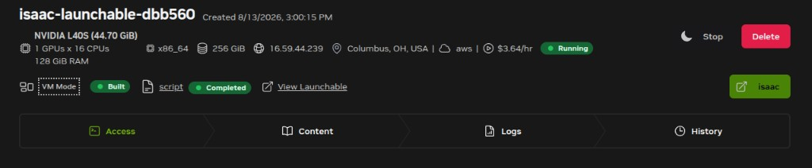

# Getting Started[#](#getting-started "Link to this heading")

This course has two modules. Each module can run either on your local workstation or in its own NVIDIA Brev environment:

- **Newton Fundamentals** uses Newton directly.
- **Isaac Lab and Newton** uses Newton as the physics engine for an Isaac Lab reinforcement-learning task.

## Tested Versions[#](#tested-versions "Link to this heading")

The course was tested with:

- **Newton Fundamentals:** Newton **1.5.x**, Python **3.10 or 3.11**, Linux x86-64, an NVIDIA RTX GPU, and CUDA **12.8** user-space libraries with driver version 550 or newer.
- **Isaac Lab and Newton:** Isaac Lab **v3.0.0-beta2** on Linux x86-64 with a supported NVIDIA GPU.

Other configurations may work but were not tested for this course.

## Newton Fundamentals[#](#newton-fundamentals "Link to this heading")

NVIDIA Brev

1. Open the [Newton Fundamentals launchable](https://brev.nvidia.com/launchable/deploy/now?launchableID=env-3FXwX26E1BxEz6VCubhb6rYkIyI).
2. Deploy the environment.
3. Open JupyterLab and start the Newton Fundamentals notebook.

Important

Brev GPU instances are billed while they are running, including when idle. Stop the instance when taking a break, or delete it when finished.

Local machine

Install [uv](https://docs.astral.sh/uv/), then verify the tested Newton release:

```
curl -LsSf https://astral.sh/uv/install.sh | sh
uv run --with "newton[examples]==1.5.\*" --with viser \
python -m newton.examples basic\_pendulum
```

Download the Newton Fundamentals code in [Course Code](#download-the-course-code). Run any lesson script with:

```
uv run --with "newton[examples]==1.5.\*" --with viser \
python lesson1\_core\_concepts.py
```

Open `http://localhost:8080` before running a lesson, then reload the page when the Viser server starts. Each Newton script starts a **Viser web viewer** at the preloaded URL and prints the address in the terminal. Reload the browser tab when the server is ready. The viewer stays open after the script finishes so you can orbit and inspect the final scene; press `Ctrl+C` in the terminal to exit.

## Isaac Lab and Newton[#](#isaac-lab-and-newton "Link to this heading")

NVIDIA Brev

1. Open the [Isaac Lab and Newton launchable](https://brev.nvidia.com/launchable/deploy/now?launchableID=env-35JP2ywERLgqtD0b0MIeK1HnF46).
2. Deploy the environment. Initial provisioning takes about 20 minutes.
3. Click the green **isaac** button to open VS Code.



4. Download the Franka Cube project from [Course Code](#download-the-course-code). Unzip it, and upload it to the environment. In VSCode, you can click and drag to upload or right click in the file explorer to upload.
5. Install the project:

```
cd /workspace/franka\_cube
/workspace/isaaclab/isaaclab.sh -p -m pip install -e source/franka\_cube
```

Important

Brev GPU instances are billed while they are running, including when idle. Stop the instance when taking a break, or delete it when finished.

Local machine

1. Install Isaac Sim and Isaac Lab **v3.0.0-beta2** by following the [Isaac Lab installation guide](https://isaac-sim.github.io/IsaacLab/).
2. Download and extract the Franka Cube project from [Course Code](#download-the-course-code).
3. Activate the Python environment containing Isaac Lab, then install the project:

```
cd franka\_cube
python -m pip install -e source/franka\_cube
```

If your installation uses the Isaac Lab wrapper, replace `python` with `PATH/TO/isaaclab.sh -p`.

Continue with [Isaac Lab and Newton](../isaac-lab-newton/overview.html) after installation.

## Download the Course Code[#](#download-the-course-code "Link to this heading")

- [Download Newton Fundamentals examples](https://developer.nvidia.com/downloads/Omniverse/learning/Courses/GettingStartedNewton/getting_started_with_newton_fundamentals_examples.zip) — four standalone lesson scripts.
- [Download the Isaac Lab and Newton Franka Cube project](https://developer.nvidia.com/downloads/Omniverse/learning/Courses/GettingStartedNewton/getting_started_with_newton_franka_cube.zip) — the Isaac Lab extension, training scripts, and final trained checkpoint.

## Prerequisites[#](#prerequisites "Link to this heading")

You should be comfortable reading and running Python. Robotics, simulation, and reinforcement-learning experience is helpful but not required.

You’ll get the most out of this course if you’re comfortable reading and running Python, and if you have some background in robotics, simulation, or reinforcement learning. No prior experience with Newton, Warp, or MuJoCo is required, because we build those concepts up from the beginning.

## Key Takeaways[#](#key-takeaways "Link to this heading")

You now have a ready-to-run environment for the rest of the course. In the next module, we’ll dive into the Newton abstractions and build our first simulation from scratch.

On this page
