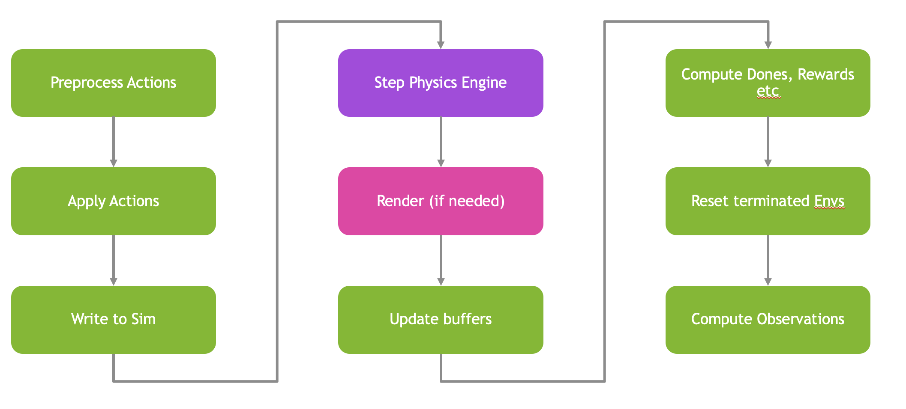

# Building the RL Pipeline[#](#building-the-rl-pipeline "Link to this heading")

Every call to `env.step(actions)` runs a fixed pipeline: apply the actions, step the physics, compute observations, compute rewards, check termination, and reset any finished environments. In this lesson we’ll walk through each stage of the Franka cube-lift task so you understand exactly what the agent senses, does, and is rewarded for.

In this lesson, we will:

- **Apply** policy actions with per-joint scaling and a staged gripper.
- **Describe** the reach-grasp-lift reward and the terms that shape it.
- **Reset** environments with randomized arm and cube positions.
- **Assemble** the 41-dimensional observation vector.



## Apply Actions[#](#apply-actions "Link to this heading")

`_pre_physics_step` clamps raw policy outputs to `[-1, 1]`, applies per-joint arm scales relative to the default pose, and keeps the gripper open until the cube is centered well enough between the fingertips to start closing. `_apply_action` then stabilizes the robot state and writes the joint position targets.

```
notebook\_env\_cfg.action\_scale = (0.45, 1.60, 0.70, 2.70, 0.45, 0.80, 0.30)
def \_pre\_physics\_step(self, actions: torch.Tensor) -> None:
self.actions = actions.clone().clamp(-1.0, 1.0)
arm\_targets = self.robot\_default\_joint\_pos[:, self.arm\_joint\_indices] + self.arm\_action\_scale.unsqueeze(
0
) \* self.actions[:, : len(self.arm\_joint\_indices)]
self.robot\_dof\_targets[:, self.arm\_joint\_indices] = torch.clamp(
arm\_targets,
self.arm\_dof\_lower\_limits.unsqueeze(0),
self.arm\_dof\_upper\_limits.unsqueeze(0),
)
allow\_close\_control = self.gripper\_close\_enabled
self.actions[:, 7] = torch.where(allow\_close\_control, self.actions[:, 7], torch.ones\_like(self.actions[:, 7]))
finger\_cmd = 0.5 \* (self.actions[:, 7] + 1.0)
finger\_target = self.gripper\_close\_pos + finger\_cmd \* (self.gripper\_open\_pos - self.gripper\_close\_pos)
self.robot\_dof\_targets[:, self.finger\_joint\_indices] = finger\_target.unsqueeze(-1).expand(
-1, len(self.finger\_joint\_indices)
)
def \_apply\_action(self) -> None:
self.\_stabilize\_robot\_state()
self.robot.set\_joint\_position\_target\_index(target=self.robot\_dof\_targets)
```

Gating the gripper (`gripper_close_enabled`) is a small but important detail: it stops the policy from closing the fingers before the cube is well positioned, which prevents the agent from learning to bat the cube away.

## Rewards[#](#rewards "Link to this heading")

`_get_rewards` implements a reach-grasp-lift pipeline: reach the cube, center it between the fingertips while the gripper stays open, close into a grasp, and then lift. The reward is a weighted sum of stage terms plus small penalties on action magnitude and joint velocity.

```
notebook\_env\_cfg.reaching\_object\_scale = 1.0
notebook\_env\_cfg.reaching\_object\_std = 0.1
notebook\_env\_cfg.gripper\_open\_reward\_scale = 0.2
notebook\_env\_cfg.grasp\_reward\_scale = 4.0
notebook\_env\_cfg.lifting\_object\_scale = 16.0
notebook\_env\_cfg.lift\_progress\_reward\_scale = 8.0
notebook\_env\_cfg.action\_penalty\_scale = 1e-4
notebook\_env\_cfg.joint\_vel\_penalty\_scale = 1e-4
notebook\_env\_cfg.lifted\_height = 0.08
```

The environment computes grasp-quality metrics (how centered, balanced, and enclosed the cube is between the fingers) and uses them to gate the later stages. Once the cube is reached and well positioned, `gripper_close_enabled` is turned on; once grasped, incremental lifting is rewarded. The stage terms are combined like this:

```
rewards = (
self.cfg.reaching\_object\_scale \* reaching\_reward
+ self.cfg.gripper\_open\_reward\_scale \* enclosure\_reward
+ self.cfg.grasp\_reward\_scale \* grasp\_reward
+ self.cfg.lift\_progress\_reward\_scale \* lift\_progress\_reward
+ self.cfg.lifting\_object\_scale \* lifting\_reward
- self.cfg.action\_penalty\_scale \* action\_penalty
- self.cfg.joint\_vel\_penalty\_scale \* joint\_vel\_penalty
)
rewards = torch.nan\_to\_num(rewards, nan=0.0, posinf=0.0, neginf=0.0)
```

Tip

The relative weights encode the task’s priorities: lifting (16.0) dominates once a grasp is secured, while reaching (1.0) is a gentle, always-on shaping signal that guides the arm early in training. The full grasp-metric helpers live in the `franka_cube` extension source.

## Reset[#](#reset "Link to this heading")

`_reset_idx` resets the robot and cube state, adds small arm and cube position noise for variety, and reopens the gripper. Randomizing initial conditions is what forces the policy to generalize instead of memorizing one trajectory.

```
notebook\_env\_cfg.episode\_length\_s = 3.0
notebook\_env\_cfg.object\_drop\_height = -0.05
notebook\_env\_cfg.object\_reset\_pos\_x\_range = (-0.08, 0.03)
notebook\_env\_cfg.object\_reset\_pos\_y\_range = (-0.2, 0.2)
notebook\_env\_cfg.reset\_arm\_noise = 0.1
```

On reset, the environment restores the default root pose and velocity, applies uniform noise to the arm joints (clamped to limits), reopens the fingers, and re-randomizes the cube’s x and y position within the configured ranges. It also clears the action buffers and resets `gripper_close_enabled` to `False` so the staged gripper logic starts fresh each episode.

## Observations[#](#observations "Link to this heading")

`_get_observations` builds a **41-dimensional observation vector** per environment:

| Slice | Dim | Description |
| --- | --- | --- |
| `[0:9]` | 9 | Joint positions relative to default pose |
| `[9:18]` | 9 | Joint velocities |
| `[18:21]` | 3 | Cube position relative to the grasp frame |
| `[21:24]` | 3 | Cube position relative to the left fingertip |
| `[24:27]` | 3 | Cube position relative to the right fingertip |
| `[27:30]` | 3 | Cube position relative to the fingertip midpoint |
| `[30:38]` | 8 | Previous actions |
| `[38:39]` | 1 | Finger open fraction |
| `[39:40]` | 1 | Enclosure gate |
| `[40:41]` | 1 | Grasp reward proxy |

```
def \_get\_observations(self) -> dict:
self.\_stabilize\_robot\_state()
joint\_pos = self.robot.data.joint\_pos.torch
joint\_vel = self.robot.data.joint\_vel.torch
object\_pos = self.\_get\_object\_pos()
grasp\_pos = self.\_get\_grasp\_pos()
left\_finger\_pos, right\_finger\_pos = self.\_get\_finger\_positions()
finger\_joint\_pos = joint\_pos[:, self.finger\_joint\_ids].mean(dim=-1)
finger\_midpoint, \_, enclosure\_gate, grasp\_reward, finger\_open\_fraction = self.\_compute\_grasp\_metrics(
object\_pos=object\_pos,
left\_finger\_pos=left\_finger\_pos,
right\_finger\_pos=right\_finger\_pos,
finger\_joint\_pos=finger\_joint\_pos,
)
obs = torch.cat(
[
joint\_pos - self.robot\_default\_joint\_pos,
joint\_vel,
object\_pos - grasp\_pos,
object\_pos - left\_finger\_pos,
object\_pos - right\_finger\_pos,
object\_pos - finger\_midpoint,
self.previous\_actions,
finger\_open\_fraction.unsqueeze(-1),
enclosure\_gate.unsqueeze(-1),
grasp\_reward.unsqueeze(-1),
],
dim=-1,
)
obs = torch.nan\_to\_num(obs, nan=0.0, posinf=100.0, neginf=-100.0)
obs = torch.clamp(obs, -100.0, 100.0)
self.previous\_actions[:] = self.actions
return {"policy": obs}
```

Notice the observation is expressed in **relative** terms (positions relative to the default pose and to the fingertips) rather than absolute world coordinates. Relative features generalize better and make the policy robust to where the cube spawns.

## Key Takeaways[#](#key-takeaways "Link to this heading")

You now understand every stage of the RL pipeline for the Franka cube-lift task: how actions are scaled and gated, how the reach-grasp-lift reward is composed, how resets randomize the scene, and how the 41-dimensional relative observation is assembled. These design choices are the difference between a policy that learns and one that flails. Next, we’ll run the full loop and then load a trained policy to see the payoff.

On this page
