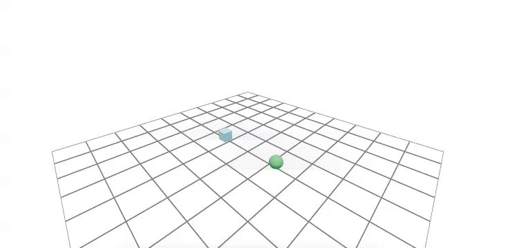
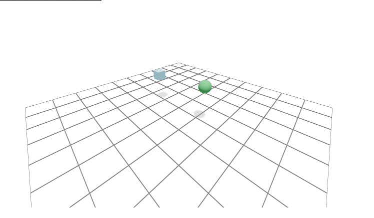
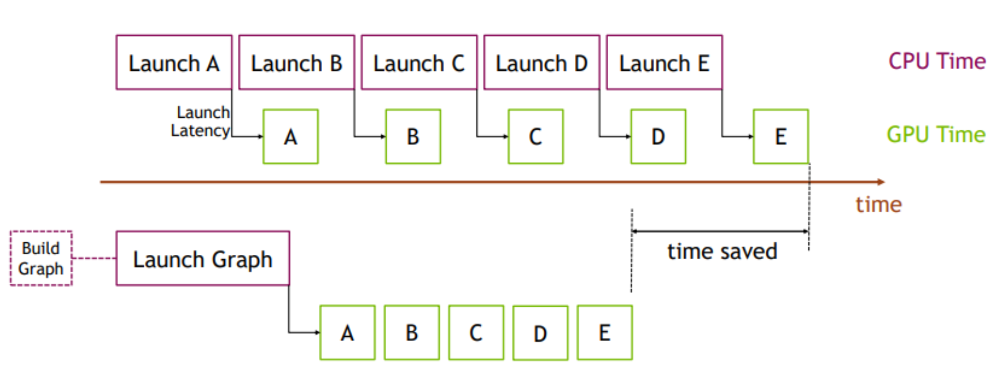
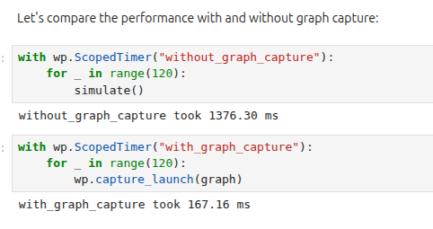

# Core Concepts and Your First Simulation[#](#core-concepts-and-your-first-simulation "Link to this heading")



In this lesson, we’ll meet the handful of abstractions that every Newton simulation is built from, assemble a minimal scene, and step it forward in time. We’ll finish by accelerating the loop with CUDA graph capture and measuring the speedup for ourselves.

Tip

Short on time? [Jump to the final example](#complete-script) for the complete runnable script.

In this lesson, we will:

- **Describe** the roles of `ModelBuilder`, `Model`, `State`, `Control`, `Contacts`, and `Solver`.
- **Build** a two-object scene and finalize it into a simulation-ready `Model`.
- **Step** the simulation with a solver and watch it live in the viewer.
- **Apply** CUDA graph capture and compare timings.

## Setup and Imports[#](#setup-and-imports "Link to this heading")

We use Warp for numerical compute and Newton for simulation. Setting `wp.config.quiet = True` keeps Warp’s logging tidy while kernels compile.

```
import numpy as np
import warp as wp
import newton
import newton.examples
import newton.utils
import newton.ik as ik
wp.config.quiet = True
newton.solvers.SolverMuJoCo.import\_mujoco()
```

We’ll also reuse one small helper throughout the module. The `make_viewer()` function opens a Viser web viewer. Before running a script, open `http://localhost:8080` in a browser tab. Reload that tab when the Viser server starts so the simulation does not finish before you open the viewer.

```
from pathlib import Path
def make\_viewer(name: str):
"""Open a Viser web viewer; it prints a URL (normally http://localhost:8080)."""
return newton.viewer.ViewerViser(verbose=False)
```

Note

The interactive notebook version of this module also defines HTML progress-bar and diagram helpers for display inside Jupyter. Those are cosmetic and notebook-only, so the run-at-home scripts below use plain loops instead.

## The Newton Building Blocks[#](#the-newton-building-blocks "Link to this heading")

Newton simulations revolve around a small set of core abstractions:

- **`ModelBuilder`** is the construction API. You use it to import assets from USD, MJCF, or URDF and to assemble bodies, shapes, joints, and their properties.
- **`Model`** is the compiled, simulation-ready data (arrays and metadata) that lives on the compute device.
- **`State`** holds time-varying data such as positions, velocities, and forces.
- **`Control`** holds the control inputs for joints, such as target positions and torques.
- **`Contacts`** holds the geometric contact information produced by the collision-detection pipeline.
- **`Solver`** advances the simulation by integrating physics and resolving constraints.

In each substep, the solver consumes the model, state, control, and contacts plus a timestep `dt`, and writes the next state. Everything else in this module is a variation on that single idea.

### Newton Is Built on NVIDIA Warp[#](#newton-is-built-on-nvidia-warp "Link to this heading")

Warp is NVIDIA’s Python framework for writing high-performance simulation and geometry code without hand-writing CUDA. You write kernels in Python (for example with `@wp.kernel`), and Warp just-in-time compiles them into optimized native code that runs on the CPU or GPU. In practice, Warp gives you a Python workflow with near low-level performance for physics, robotics, and graphics workloads. The first time you launch a kernel, Warp parses it, generates CUDA C++, and compiles it, so the first step of any simulation is always the slowest.

## Building a Scene: ModelBuilder to Model[#](#building-a-scene-modelbuilder-to-model "Link to this heading")

Let’s build a minimal scene: a ground plane, one box, and one sphere. Keeping the scene small lets us focus on the API.

```
builder = newton.ModelBuilder()
# Static ground
builder.add\_ground\_plane()
# Dynamic box
box\_body = builder.add\_body(xform=wp.transform(wp.vec3(0.0, -1.0, 1.0), wp.quat\_identity()))
builder.add\_shape\_box(box\_body, hx=0.15, hy=0.15, hz=0.15)
# Dynamic sphere
sphere\_body = builder.add\_body(xform=wp.transform(wp.vec3(0.0, 1.0, 1.2), wp.quat\_identity()))
builder.add\_shape\_sphere(sphere\_body, radius=0.18)
print(f"Bodies: {builder.body\_count}, Shapes: {builder.shape\_count}")
```

Each `add_body` call registers a rigid body at a world transform, and each `add_shape_*` call attaches collision and visual geometry to a body.



The assembled scene rendered in the Viser viewer: a ground plane, one box, and one sphere before stepping the solver.[#](#id1 "Link to this image")

### Finalize Into a Model, State, Control, and Contacts[#](#finalize-into-a-model-state-control-and-contacts "Link to this heading")

Finalizing converts the builder into a device-ready `Model`. From that model we allocate two `State` objects, one `Control`, and one reusable `Contacts` buffer. We use two states so the solver can read from one and write into the other, then swap them.

```
model = builder.finalize()
state\_0 = model.state()
state\_1 = model.state()
control = model.control()
collision\_pipeline = newton.CollisionPipeline(model)
contacts = collision\_pipeline.contacts()
print(f"Model device: {model.device}")
print(f"Body count: {model.body\_count}")
```

`Contacts` is populated by the collision pipeline at each substep and passed into `solver.step(...)` alongside state, control, and `dt`.

Tip

In the Viser viewer you can orbit the camera by dragging with the left mouse button, pan by dragging with the right mouse button, and zoom with the mouse wheel.

## The Solver and Simulation Loop[#](#the-solver-and-simulation-loop "Link to this heading")

We’ll use the XPBD solver for this tiny scene. The loop always follows the same pattern: clear forces, collide, step, then swap the state buffers.

```
solver = newton.solvers.SolverXPBD(model, iterations=10)
fps = 60
frame\_dt = 1.0 / fps
sim\_substeps = 8
sim\_dt = frame\_dt / sim\_substeps
def simulate():
global state\_0, state\_1
for \_ in range(sim\_substeps):
state\_0.clear\_forces()
collision\_pipeline.collide(state\_0, contacts)
solver.step(state\_in=state\_0, state\_out=state\_1, control=control, contacts=contacts, dt=sim\_dt)
state\_0, state\_1 = state\_1, state\_0
```

We run several substeps per rendered frame. Smaller substeps improve stability at the cost of compute.

### Visualize the Simulation[#](#visualize-the-simulation "Link to this heading")

We open a `ViewerViser` window and log each frame as `simulate()` advances the scene. Reload the `http://localhost:8080` browser tab you opened before starting the script to watch it live.

```
viewer = make\_viewer("01\_simple\_scene")
viewer.set\_model(model)
print("Starting simulation, this may take a minute to compile the CUDA kernels...")
sim\_time = 0.0
num\_frames = 180
for \_ in range(num\_frames):
simulate()
viewer.begin\_frame(sim\_time)
viewer.log\_state(state\_0)
viewer.end\_frame()
sim\_time += frame\_dt
```

Watch the box and sphere fall under gravity and settle on the ground plane.

[Your browser does not support the video tag.](../_images/02-first-simulation.mp4)

*In the viewer: the box and sphere drop from their initial poses, bounce slightly, and come to rest on the ground.*

## Accelerating With CUDA Graph Capture[#](#accelerating-with-cuda-graph-capture "Link to this heading")

On the GPU, repeatedly launching many tiny kernels can dominate runtime. Warp supports CUDA graph capture, which records the exact sequence of kernel launches inside `simulate()` once, so we can replay the whole batch with a single call.



```
# CUDA graphs capture the exact buffers used inside simulate().
# Do not reallocate state\_0/state\_1 after capture.
graph = None
if wp.get\_device().is\_cuda:
with wp.ScopedCapture() as capture:
simulate()
graph = capture.graph
print("CUDA graph captured")
else:
print("Running on CPU; graph capture skipped")
```

Warning

Graph capture records the exact memory buffers used during capture. Do not reallocate `state_0` or `state_1` after you capture the graph, or the replay will operate on stale memory.

Once captured, replay the graph with `wp.capture_launch(graph)` instead of calling `simulate()`. Let’s compare the two approaches with Warp’s `ScopedTimer`:

```
with wp.ScopedTimer("without\_graph\_capture"):
for \_ in range(120):
simulate()
with wp.ScopedTimer("with\_graph\_capture"):
for \_ in range(120):
wp.capture\_launch(graph)
```

On a GPU you should see the graph-capture loop run meaningfully faster, because it removes most of the per-launch Python and driver overhead.



Example `ScopedTimer` output from one run: 120 iterations took roughly 1376 ms without graph capture and roughly 167 ms with it. Absolute numbers vary by GPU, but graph capture is consistently faster.[#](#id2 "Link to this image")

## Complete Script[#](#complete-script "Link to this heading")

Here’s everything from this lesson assembled into one self-contained script. Download [`lesson1_core_concepts.py`](https://developer.nvidia.com/downloads/Omniverse/learning/Courses/GettingStartedNewton/getting_started_with_newton_fundamentals_examples.zip), or save the script below as `lesson1_core_concepts.py` in the launchable environment (see [Getting Started](../getting-started/setup.html)). Open `http://localhost:8080` in a browser tab first, then run the pinned `uv` command from the setup guide and reload the tab when Viser starts.

Show the complete runnable script

```
1"""Newton Fundamentals - Lesson 1: Core concepts, first simulation, CUDA graphs.
2
3Run: python lesson1\_core\_concepts.py
4Before running, open http://localhost:8080 in a browser tab and reload it when
5the Viser server starts.
6"""
7
8import time
9
10import numpy as np # noqa: F401 (imported for parity with later lessons)
11import warp as wp
12
13import newton
14
15wp.config.quiet = True
16
17
18def make\_viewer(name: str):
19 """Open a Viser web viewer; it prints a URL (normally http://localhost:8080)."""
20 return newton.viewer.ViewerViser(verbose=False)
21
22
23# 1) Build a minimal scene: ground plane, one box, one sphere.
24builder = newton.ModelBuilder()
25builder.add\_ground\_plane()
26
27box\_body = builder.add\_body(xform=wp.transform(wp.vec3(0.0, -1.0, 1.0), wp.quat\_identity()))
28builder.add\_shape\_box(box\_body, hx=0.15, hy=0.15, hz=0.15)
29
30sphere\_body = builder.add\_body(xform=wp.transform(wp.vec3(0.0, 1.0, 1.2), wp.quat\_identity()))
31builder.add\_shape\_sphere(sphere\_body, radius=0.18)
32
33print(f"Bodies: {builder.body\_count}, Shapes: {builder.shape\_count}")
34
35# 2) Finalize into a device-ready Model and allocate simulation buffers.
36model = builder.finalize()
37state\_0 = model.state()
38state\_1 = model.state()
39control = model.control()
40collision\_pipeline = newton.CollisionPipeline(model)
41contacts = collision\_pipeline.contacts()
42print(f"Model device: {model.device}, Body count: {model.body\_count}")
43
44# 3) Create a solver and define the stepping loop.
45solver = newton.solvers.SolverXPBD(model, iterations=10)
46
47fps = 60
48frame\_dt = 1.0 / fps
49sim\_substeps = 8
50sim\_dt = frame\_dt / sim\_substeps
51
52
53def simulate():
54 global state\_0, state\_1
55 for \_ in range(sim\_substeps):
56 state\_0.clear\_forces()
57 collision\_pipeline.collide(state\_0, contacts)
58 solver.step(state\_in=state\_0, state\_out=state\_1, control=control, contacts=contacts, dt=sim\_dt)
59 state\_0, state\_1 = state\_1, state\_0
60
61
62# 4) Open a live viewer and log the drop.
63viewer = make\_viewer("01\_simple\_scene")
64viewer.set\_model(model)
65
66print("Simulating (the first run compiles CUDA kernels, this can take a minute)...")
67sim\_time = 0.0
68for \_ in range(180):
69 simulate()
70 viewer.begin\_frame(sim\_time)
71 viewer.log\_state(state\_0)
72 viewer.end\_frame()
73 sim\_time += frame\_dt
74
75# 5) Accelerate with CUDA graph capture (GPU only) and compare timings.
76graph = None
77if wp.get\_device().is\_cuda:
78 with wp.ScopedCapture() as capture:
79 simulate()
80 graph = capture.graph
81 print("CUDA graph captured")
82else:
83 print("Running on CPU; graph capture skipped")
84
85with wp.ScopedTimer("without\_graph\_capture"):
86 for \_ in range(120):
87 simulate()
88
89if graph is not None:
90 with wp.ScopedTimer("with\_graph\_capture"):
91 for \_ in range(120):
92 wp.capture\_launch(graph)
93
94print("Simulation finished. Reload the pre-opened viewer tab; press Ctrl+C to exit.")
95try:
96 while viewer.is\_running():
97 time.sleep(0.1)
98except KeyboardInterrupt:
99 pass
100viewer.close() # stops the viser server and frees the port
```

## Key Takeaways[#](#key-takeaways "Link to this heading")

You now understand the Newton pipeline end to end: a `ModelBuilder` assembles a scene, `finalize()` compiles it into a device-ready `Model`, and a `Solver` advances `State` using `Control` and `Contacts` one `dt` at a time. You also saw how CUDA graph capture collapses many kernel launches into a single replayable call for a real speedup. In the next lesson, we’ll swap our toy shapes for a real robot and start driving its joints.

On this page
