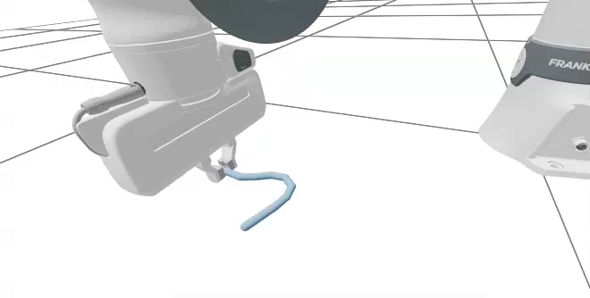

# Coupled Manipulation[#](#coupled-manipulation "Link to this heading")



The previous lesson used Newton IK to move a Franka end effector through target poses. Now we’ll use that same IK pattern for a task that needs more than one solver: picking up a deformable cable and moving it to a target location. This is where Newton’s coupled-solver framework shines, letting each subsystem use the solver that fits it best.

This lesson is adapted from the standalone Newton example `newton/examples/multiphysics/example_franka_cable_ik_pick_place.py`. We split the same idea into digestible pieces.

Tip

Short on time? [Jump to the final example](#complete-script) for the complete runnable script.

Note

This lesson downloads the Franka asset on first use. The `newton[examples]` extra in [Getting Started](../getting-started/setup.html) installs the required GitPython dependency automatically.

In this lesson, we will:

- **Explain** why a rigid arm and a deformable cable need different solvers.
- **Build** one model that contains both subsystems and track their body, joint, and shape indices.
- **Configure** a coupled solver with proxy coupling between the gripper and the cable.
- **Run** a scripted IK pick-and-place sequence on the coupled scene.

## Why Coupling?[#](#why-coupling "Link to this heading")

A rigid Franka arm and a deformable cable have different numerical needs. Newton’s coupled-solver framework lets each subsystem use a solver that fits it:

- **`SolverMuJoCo`** handles the Franka articulation and its joint targets.
- **`SolverVBD`** handles the cable, represented as a rod.
- **`SolverCoupledProxy`** exposes selected gripper bodies as proxy bodies to the VBD side, so the cable can contact the gripper while the arm stays solved by MuJoCo.

The high-level control loop stays familiar: IK produces Franka joint targets, the gripper target changes through the task sequence, collision contacts are refreshed, and the coupled solver advances the full model.

## Task Constants and Warp Kernels[#](#task-constants-and-warp-kernels "Link to this heading")

We start with the constants that describe the cable, the gripper poses, and the grip forces, taken from the standalone example.

```
from newton.solvers import SolverMuJoCo, SolverVBD
from newton.solvers.experimental.coupled import SolverCoupled, SolverCoupledProxy
FRANKA\_Q = [
-3.6802115e-03, 2.3901723e-02, 3.6804110e-03, -2.3683236e00,
-1.2918962e-04, 2.3922248e00, 7.8549200e-01, 0.04, 0.04,
]
CABLE\_CENTER = wp.vec3(0.5, 0.0, 0.256)
CABLE\_LENGTH = 0.38
CABLE\_CONTACT\_KE = 1.0e4
CABLE\_CONTACT\_KD = 1.0e-5 \* CABLE\_CONTACT\_KE
GRIPPER\_DOWN = (1.0, 0.0, 0.0, 0.0) # qx, qy, qz, qw: hand points straight down
GRIP\_OPEN = 0.04
GRIP\_CLOSE = 0.0
GRIP\_HOLD = 0.0
GRIP\_FORCE = 1500.0
GRIP\_STIFFNESS = 1000.0
world\_count = 1
payload\_segments = 19
payload\_radius = 0.005
surface\_z = float(CABLE\_CENTER[2]) - payload\_radius
```

Two small Warp kernels write the gripper finger width and the per-frame IK task targets on the device, avoiding host-device round trips.

```
@wp.kernel
def set\_gripper\_q(joint\_q: wp.array2d[float], finger\_pos: wp.array[float], idx0: int, idx1: int):
world\_idx = wp.tid()
joint\_q[world\_idx, idx0] = finger\_pos[world\_idx]
joint\_q[world\_idx, idx1] = finger\_pos[world\_idx]
@wp.kernel
def set\_task\_targets(
target\_positions: wp.array[wp.vec3],
target\_rotations: wp.array[wp.vec4],
finger\_pos: wp.array[float],
pos: wp.vec3,
rot: wp.vec4,
grip\_width: float,
):
world\_idx = wp.tid()
target\_positions[world\_idx] = pos
target\_rotations[world\_idx] = rot
finger\_pos[world\_idx] = grip\_width
```

## Build the Coupled Scene[#](#build-the-coupled-scene "Link to this heading")

We build one model that contains both subsystems. As we add the Franka and then the cable, we record the ranges of body, joint, and shape indices each subsystem owns, so the coupled solver can hand each entry only the part of the model it’s responsible for.

```
def build\_coupled\_scene():
builder = newton.ModelBuilder(gravity=-9.81)
builder.rigid\_gap = 0.01
SolverMuJoCo.register\_custom\_attributes(builder)
SolverVBD.register\_custom\_attributes(builder, dahl\_defaults\_enabled=False)
franka\_body\_start = builder.body\_count
franka\_joint\_start = builder.joint\_count
franka\_shape\_start = builder.shape\_count
add\_franka(builder, surface\_z)
# ... set arm/gripper gains, effort limits, and armature ...
franka\_bodies = list(range(franka\_body\_start, builder.body\_count))
# ... record franka\_joints, franka\_shapes, then add the VBD cable rod ...
# ... record payload\_bodies/joints/shapes and locate the gripper bodies ...
builder.color()
model = builder.finalize()
return {"model": model, "franka\_bodies": franka\_bodies, ...}
```

The cable itself is a rod built from a straight line of points, with stretch and bend stiffness that make it behave like a springy cable rather than a rigid bar. The gripper bodies are found by label so the proxy coupling knows which bodies to share with the VBD side. The complete script below shows every line.

[Your browser does not support the video tag.](../_images/13-coupled-scene-preview.mp4)

*Preview of the coupled scene before the task runs: the MuJoCo-solved Franka arm above the VBD-solved cable, sharing one model.*

## Create the Coupled Solvers[#](#create-the-coupled-solvers "Link to this heading")

The coupled solver receives two model views. The MuJoCo view owns the Franka bodies and joints; the VBD view owns the cable. The proxy coupling sends the gripper bodies from the MuJoCo side into the VBD collision world so the cable feels the gripper.

```
solver = SolverCoupledProxy(
model=model,
entries=[
SolverCoupled.Entry(
name="mjc",
solver=lambda view: SolverMuJoCo(model=view, solver="newton", integrator="implicitfast", ...),
bodies=scene\_data["franka\_bodies"],
joints=scene\_data["franka\_joints"],
),
SolverCoupled.Entry(
name="vbd",
solver=lambda view: SolverVBD(model=view, iterations=20, ...),
bodies=scene\_data["payload\_bodies"],
joints=scene\_data["payload\_joints"],
),
],
coupling=SolverCoupledProxy.Config(
proxies=[
SolverCoupledProxy.Proxy(
source="mjc",
destination="vbd",
bodies=scene\_data["gripper\_bodies"],
mode="lagged",
...
)
],
iterations=1,
),
)
solver.prepare\_contacts(contacts)
```

## Build the Franka IK System and Keyframes[#](#build-the-franka-ik-system-and-keyframes "Link to this heading")

IK runs on a Franka-only model. Because the Franka is added to the coupled model first, its joint coordinates line up with the first coordinates of the full model, so we can copy IK results straight into the coupled model’s joint targets.

The task is described as a list of keyframes: approach the cable, descend, close the gripper, lift, move to the place location, descend, release, and retreat. Each keyframe carries a duration, a target position, an orientation, and a grip width.

```
def build\_keyframes():
cx, cy, cz = CABLE\_CENTER[0], CABLE\_CENTER[1], CABLE\_CENTER[2]
approach\_z = cz + 0.20
grasp\_z = cz
target\_x, target\_y = 0.4, 0.25
qx, qy, qz, qw = GRIPPER\_DOWN
poses = np.array(
[
[1.0, cx, cy, approach\_z, qx, qy, qz, qw, GRIP\_OPEN],
[0.5, cx, cy, grasp\_z, qx, qy, qz, qw, GRIP\_OPEN],
[1.0, cx, cy, grasp\_z, qx, qy, qz, qw, GRIP\_CLOSE],
[1.0, cx, cy, approach\_z, qx, qy, qz, qw, GRIP\_HOLD],
[1.0, target\_x, target\_y, approach\_z, qx, qy, qz, qw, GRIP\_HOLD],
[0.5, target\_x, target\_y, grasp\_z, qx, qy, qz, qw, GRIP\_HOLD],
[0.5, target\_x, target\_y, grasp\_z, qx, qy, qz, qw, GRIP\_HOLD],
[1.0, target\_x, target\_y, grasp\_z, qx, qy, qz, qw, GRIP\_OPEN],
[0.5, target\_x, target\_y, approach\_z, qx, qy, qz, qw, GRIP\_OPEN],
],
dtype=np.float32,
)
return poses[:, 1:], np.cumsum(poses[:, 0]), (target\_x, target\_y)
```

## Run the Pick-and-Place[#](#run-the-pick-and-place "Link to this heading")

Each rendered frame interpolates the next task-space target, solves IK, copies the solved Franka coordinates into the coupled model’s joint targets, refreshes contacts, and advances the coupled solver.

```
def simulate\_coupled\_frame():
global state\_0, state\_1
ik\_solver.step(ik\_joint\_q, ik\_joint\_q, iterations=ik\_iters)
wp.launch(set\_gripper\_q, dim=world\_count, inputs=[ik\_joint\_q, finger\_pos\_buf, finger\_idx0, finger\_idx1], device=device)
wp.copy(dest=control\_joint\_target\_q[:, :n\_coords], src=ik\_joint\_q)
for \_ in range(sim\_substeps):
state\_0.clear\_forces()
collision\_pipeline.collide(state\_0, contacts)
solver.step(state\_0, state\_1, control, contacts, sim\_dt)
newton.eval\_ik(model, state\_1, state\_1.joint\_q, state\_1.joint\_qd)
state\_0, state\_1 = state\_1, state\_0
```

[Your browser does not support the video tag.](../_images/14-franka-cable-pick-and-place.mp4)

*The full coupled pick-and-place: IK drives the arm through the keyframes while the coupled solver lets the gripper grasp and carry the deformable cable.*

## Complete Script[#](#complete-script "Link to this heading")

This is the full coupled pick-and-place task in one file. Before running it, open `http://localhost:8080` in a browser tab and reload the tab when Viser starts. Download [`lesson4_coupled_manipulation.py`](https://developer.nvidia.com/downloads/Omniverse/learning/Courses/GettingStartedNewton/getting_started_with_newton_fundamentals_examples.zip), or save the script below as `lesson4_coupled_manipulation.py` and run it with the pinned Newton 1.5 command from [Getting Started](../getting-started/setup.html).

Show the complete runnable script

```
1"""Newton Fundamentals - Lesson 4: Coupled Franka cable pick-and-place.
2
3Combines a MuJoCo-solved Franka, a VBD-solved cable, and proxy coupling.
4Before running, open http://localhost:8080 in a browser tab and reload it when
5the Viser server starts.
6"""
7
8import time
9
10import numpy as np
11import warp as wp
12
13import newton
14import newton.utils
15import newton.ik as ik
16from newton.solvers import SolverMuJoCo, SolverVBD
17from newton.solvers.experimental.coupled import SolverCoupled, SolverCoupledProxy
18
19wp.config.quiet = True
20SolverMuJoCo.import\_mujoco()
21
22
23def make\_viewer(name: str):
24 """Open a Viser web viewer; it prints a URL (normally http://localhost:8080)."""
25 return newton.viewer.ViewerViser(verbose=False)
26
27
28# --- Task constants ---
29FRANKA\_Q = [
30 -3.6802115e-03, 2.3901723e-02, 3.6804110e-03, -2.3683236e00,
31 -1.2918962e-04, 2.3922248e00, 7.8549200e-01, 0.04, 0.04,
32]
33CABLE\_CENTER = wp.vec3(0.5, 0.0, 0.256)
34CABLE\_LENGTH = 0.38
35CABLE\_CONTACT\_KE = 1.0e4
36CABLE\_CONTACT\_KD = 1.0e-5 \* CABLE\_CONTACT\_KE
37GRIPPER\_DOWN = (1.0, 0.0, 0.0, 0.0)
38GRIP\_OPEN = 0.04
39GRIP\_CLOSE = 0.0
40GRIP\_HOLD = 0.0
41GRIP\_FORCE = 1500.0
42GRIP\_STIFFNESS = 1000.0
43
44world\_count = 1
45payload\_segments = 19
46payload\_radius = 0.005
47surface\_z = float(CABLE\_CENTER[2]) - payload\_radius
48
49
50# --- Warp kernels and helpers ---
51@wp.kernel
52def set\_gripper\_q(joint\_q: wp.array2d[float], finger\_pos: wp.array[float], idx0: int, idx1: int):
53 world\_idx = wp.tid()
54 joint\_q[world\_idx, idx0] = finger\_pos[world\_idx]
55 joint\_q[world\_idx, idx1] = finger\_pos[world\_idx]
56
57
58@wp.kernel
59def set\_task\_targets(
60 target\_positions: wp.array[wp.vec3],
61 target\_rotations: wp.array[wp.vec4],
62 finger\_pos: wp.array[float],
63 pos: wp.vec3,
64 rot: wp.vec4,
65 grip\_width: float,
66):
67 world\_idx = wp.tid()
68 target\_positions[world\_idx] = pos
69 target\_rotations[world\_idx] = rot
70 finger\_pos[world\_idx] = grip\_width
71
72
73def find\_label\_index(labels, suffix):
74 for index, label in enumerate(labels):
75 if label.endswith(suffix):
76 return index
77 raise ValueError(f"Could not find label ending in {suffix!r}")
78
79
80def add\_franka(builder, base\_z):
81 builder.add\_urdf(
82 newton.utils.download\_asset("franka\_emika\_panda") / "urdf/fr3\_franka\_hand.urdf",
83 xform=wp.transform(wp.vec3(0.0, 0.0, base\_z), wp.quat\_identity()),
84 floating=False,
85 enable\_self\_collisions=False,
86 parse\_visuals\_as\_colliders=False,
87 force\_show\_colliders=False,
88 )
89 builder.joint\_q[: len(FRANKA\_Q)] = FRANKA\_Q
90 builder.joint\_target\_q[: len(FRANKA\_Q)] = FRANKA\_Q
91
92
93def build\_coupled\_scene():
94 builder = newton.ModelBuilder(gravity=-9.81)
95 builder.rigid\_gap = 0.01
96 SolverMuJoCo.register\_custom\_attributes(builder)
97 SolverVBD.register\_custom\_attributes(builder, dahl\_defaults\_enabled=False)
98
99 franka\_body\_start = builder.body\_count
100 franka\_joint\_start = builder.joint\_count
101 franka\_shape\_start = builder.shape\_count
102
103 add\_franka(builder, surface\_z)
104
105 builder.joint\_target\_ke[:7] = [400.0] \* 7
106 builder.joint\_target\_kd[:7] = [80.0] \* 7
107 builder.joint\_target\_ke[7:9] = [GRIP\_STIFFNESS, GRIP\_STIFFNESS]
108 builder.joint\_target\_kd[7:9] = [100.0, 100.0]
109 builder.joint\_effort\_limit[:4] = [87.0] \* 4
110 builder.joint\_effort\_limit[4:7] = [12.0] \* 3
111 builder.joint\_effort\_limit[7:9] = [GRIP\_FORCE, GRIP\_FORCE]
112 builder.joint\_armature[:7] = [1.0e-3] \* 7
113 builder.joint\_armature[7:9] = [0.0, 0.0]
114
115 franka\_bodies = list(range(franka\_body\_start, builder.body\_count))
116 franka\_joints = list(range(franka\_joint\_start, builder.joint\_count))
117 franka\_shapes = list(range(franka\_shape\_start, builder.shape\_count))
118
119 gravcomp = builder.custom\_attributes["mujoco:gravcomp"]
120 if gravcomp.values is None:
121 gravcomp.values = {}
122 for body in franka\_bodies:
123 gravcomp.values[body] = 1.0
124
125 payload\_body\_start = builder.body\_count
126 payload\_joint\_start = builder.joint\_count
127 payload\_shape\_start = builder.shape\_count
128
129 cable\_cfg = newton.ModelBuilder.ShapeConfig(
130 density=100.0, ke=CABLE\_CONTACT\_KE, kd=CABLE\_CONTACT\_KD, mu=1.0, margin=0.0, gap=0.01,
131 )
132 points, quats = newton.utils.create\_straight\_cable\_points\_and\_quaternions(
133 start=CABLE\_CENTER - wp.vec3(0.5 \* CABLE\_LENGTH, 0.0, 0.0),
134 direction=wp.vec3(1.0, 0.0, 0.0),
135 length=CABLE\_LENGTH,
136 num\_segments=payload\_segments,
137 twist\_total=0.0,
138 )
139 bend\_stiffness = 5.0e-4
140 builder.add\_rod(
141 positions=points,
142 quaternions=quats,
143 radius=payload\_radius,
144 body\_frame\_origin="start",
145 cfg=cable\_cfg,
146 stretch\_stiffness=1.0e6,
147 stretch\_damping=1.0e-1,
148 bend\_stiffness=bend\_stiffness,
149 bend\_damping=2.0e-3 \* bend\_stiffness,
150 label="vbd\_cable",
151 )
152
153 payload\_bodies = list(range(payload\_body\_start, builder.body\_count))
154 payload\_joints = list(range(payload\_joint\_start, builder.joint\_count))
155 payload\_shapes = list(range(payload\_shape\_start, builder.shape\_count))
156
157 gripper\_bodies = [
158 body for body in franka\_bodies
159 if "hand" in builder.body\_label[body] or "finger" in builder.body\_label[body]
160 ]
161 if not gripper\_bodies:
162 raise RuntimeError("Could not locate Franka gripper bodies for proxy coupling")
163
164 plane\_cfg = newton.ModelBuilder.ShapeConfig(
165 ke=CABLE\_CONTACT\_KE, kd=CABLE\_CONTACT\_KD, mu=1.0, margin=0.0, gap=0.01,
166 )
167 ground\_shapes = [builder.add\_ground\_plane(height=surface\_z, cfg=plane\_cfg, label="cable\_ground\_plane")]
168
169 builder.color()
170 model = builder.finalize()
171 model.shape\_material\_ke.fill\_(CABLE\_CONTACT\_KE)
172 model.shape\_material\_kd.fill\_(CABLE\_CONTACT\_KD)
173 model.shape\_material\_mu.fill\_(1.0)
174
175 return {
176 "model": model,
177 "franka\_bodies": franka\_bodies,
178 "franka\_joints": franka\_joints,
179 "franka\_shapes": franka\_shapes,
180 "payload\_bodies": payload\_bodies,
181 "payload\_joints": payload\_joints,
182 "payload\_shapes": payload\_shapes,
183 "gripper\_bodies": gripper\_bodies,
184 "ground\_shapes": ground\_shapes,
185 }
186
187
188def ground\_shape\_pairs(model, franka\_shapes, payload\_shapes, ground\_shapes):
189 dynamic\_shapes = set(franka\_shapes) | set(payload\_shapes)
190 ground\_shapes = set(ground\_shapes)
191 pairs = [
192 (int(a), int(b))
193 for a, b in model.shape\_contact\_pairs.numpy()
194 if ({int(a), int(b)} & dynamic\_shapes) and ({int(a), int(b)} & ground\_shapes)
195 ]
196 if not pairs:
197 raise RuntimeError("No robot- or cable-ground contact pairs were generated")
198 return wp.array(np.asarray(pairs, dtype=np.int32), dtype=wp.vec2i, device=model.device)
199
200
201def build\_keyframes():
202 cx, cy, cz = CABLE\_CENTER[0], CABLE\_CENTER[1], CABLE\_CENTER[2]
203 approach\_z = cz + 0.20
204 grasp\_z = cz
205 target\_x, target\_y = 0.4, 0.25
206 qx, qy, qz, qw = GRIPPER\_DOWN
207 poses = np.array(
208 [
209 [1.0, cx, cy, approach\_z, qx, qy, qz, qw, GRIP\_OPEN],
210 [0.5, cx, cy, grasp\_z, qx, qy, qz, qw, GRIP\_OPEN],
211 [1.0, cx, cy, grasp\_z, qx, qy, qz, qw, GRIP\_CLOSE],
212 [1.0, cx, cy, approach\_z, qx, qy, qz, qw, GRIP\_HOLD],
213 [1.0, target\_x, target\_y, approach\_z, qx, qy, qz, qw, GRIP\_HOLD],
214 [0.5, target\_x, target\_y, grasp\_z, qx, qy, qz, qw, GRIP\_HOLD],
215 [0.5, target\_x, target\_y, grasp\_z, qx, qy, qz, qw, GRIP\_HOLD],
216 [1.0, target\_x, target\_y, grasp\_z, qx, qy, qz, qw, GRIP\_OPEN],
217 [0.5, target\_x, target\_y, approach\_z, qx, qy, qz, qw, GRIP\_OPEN],
218 ],
219 dtype=np.float32,
220 )
221 return poses[:, 1:], np.cumsum(poses[:, 0]), (target\_x, target\_y)
222
223
224# --- Build the scene and coupled solver ---
225scene\_data = build\_coupled\_scene()
226model = scene\_data["model"]
227device = model.device
228print(f"Model device: {device}")
229print(f"Bodies: {model.body\_count}, Joints: {model.joint\_count}, Shapes: {model.shape\_count}")
230
231control = model.control()
232state\_0 = model.state()
233state\_1 = model.state()
234newton.eval\_fk(model, model.joint\_q, model.joint\_qd, state\_0)
235newton.eval\_fk(model, model.joint\_q, model.joint\_qd, state\_1)
236
237collision\_pipeline = newton.CollisionPipeline(
238 model,
239 broad\_phase="explicit",
240 shape\_pairs\_filtered=ground\_shape\_pairs(
241 model, scene\_data["franka\_shapes"], scene\_data["payload\_shapes"], scene\_data["ground\_shapes"]
242 ),
243)
244contacts = collision\_pipeline.contacts()
245
246solver = SolverCoupledProxy(
247 model=model,
248 entries=[
249 SolverCoupled.Entry(
250 name="mjc",
251 solver=lambda view: SolverMuJoCo(
252 model=view, solver="newton", integrator="implicitfast", cone="elliptic",
253 iterations=100, ls\_iterations=20, use\_mujoco\_contacts=False, njmax=256, nconmax=64,
254 ),
255 bodies=scene\_data["franka\_bodies"],
256 joints=scene\_data["franka\_joints"],
257 ),
258 SolverCoupled.Entry(
259 name="vbd",
260 solver=lambda view: SolverVBD(
261 model=view, iterations=20, rigid\_avbd\_beta=1.0e2,
262 rigid\_contact\_k\_start=1.0e3, rigid\_contact\_history=False,
263 ),
264 bodies=scene\_data["payload\_bodies"],
265 joints=scene\_data["payload\_joints"],
266 ),
267 ],
268 coupling=SolverCoupledProxy.Config(
269 proxies=[
270 SolverCoupledProxy.Proxy(
271 source="mjc",
272 destination="vbd",
273 bodies=scene\_data["gripper\_bodies"],
274 mass\_scale=1.0,
275 mode="lagged",
276 collision\_pipeline=lambda proxy\_model: newton.CollisionPipeline(proxy\_model, broad\_phase="explicit"),
277 collide\_interval=1,
278 )
279 ],
280 iterations=1,
281 ),
282)
283solver.prepare\_contacts(contacts)
284print("Coupled solver ready")
285
286# --- Build the IK system ---
287targets, key\_times, place\_target\_xy = build\_keyframes()
288
289ik\_builder = newton.ModelBuilder(gravity=-9.81)
290add\_franka(ik\_builder, surface\_z)
291ik\_model = ik\_builder.finalize(device=device)
292
293n\_coords = ik\_model.joint\_coord\_count
294ik\_joint\_q = wp.clone(model.joint\_q.reshape((world\_count, -1))[:, :n\_coords])
295control\_joint\_target\_q = control.joint\_target\_q.reshape((world\_count, -1))
296finger\_idx0 = n\_coords - 2
297finger\_idx1 = n\_coords - 1
298finger\_pos\_buf = wp.full(world\_count, GRIP\_OPEN, dtype=float, device=device)
299hand\_body = find\_label\_index(ik\_model.body\_label, "fr3\_hand")
300
301target\_pos = wp.vec3(\*targets[0][:3].tolist())
302target\_rot = wp.vec4(\*targets[0][3:7].tolist())
303ik\_target\_positions = wp.array([target\_pos] \* world\_count, dtype=wp.vec3, device=device)
304ik\_target\_rotations = wp.array([target\_rot] \* world\_count, dtype=wp.vec4, device=device)
305
306pos\_obj = ik.IKObjectivePosition(
307 link\_index=hand\_body, link\_offset=wp.vec3(0.0, 0.0, 0.107), target\_positions=ik\_target\_positions,
308)
309rot\_obj = ik.IKObjectiveRotation(
310 link\_index=hand\_body, link\_offset\_rotation=wp.quat\_identity(), target\_rotations=ik\_target\_rotations,
311)
312joint\_limit\_lower = wp.clone(model.joint\_limit\_lower.reshape((world\_count, -1))[:, :n\_coords])
313joint\_limit\_upper = wp.clone(model.joint\_limit\_upper.reshape((world\_count, -1))[:, :n\_coords])
314joint\_limits\_obj = ik.IKObjectiveJointLimit(
315 joint\_limit\_lower=joint\_limit\_lower.flatten(), joint\_limit\_upper=joint\_limit\_upper.flatten(), weight=10.0,
316)
317ik\_solver = ik.IKSolver(
318 model=ik\_model, n\_problems=world\_count,
319 objectives=[pos\_obj, rot\_obj, joint\_limits\_obj],
320 lambda\_initial=0.05, jacobian\_mode=ik.IKJacobianType.ANALYTIC,
321)
322ik\_iters = 24
323print(f"IK model bodies: {ik\_model.body\_count}, joint coordinates: {n\_coords}")
324print(f"Task duration: {key\_times[-1]:.1f} seconds")
325
326# --- Run the pick-and-place ---
327fps = 60
328frame\_dt = 1.0 / fps
329sim\_substeps = 10
330sim\_dt = frame\_dt / sim\_substeps
331sim\_time = 0.0
332
333
334def update\_ik\_targets(sim\_time):
335 t = min(sim\_time, float(key\_times[-1]) - 1.0e-6)
336 interval = int(np.searchsorted(key\_times, t))
337 t\_start = key\_times[interval - 1] if interval > 0 else 0.0
338 t\_end = key\_times[interval]
339 alpha = float(np.clip((t - t\_start) / max(t\_end - t\_start, 1.0e-6), 0.0, 1.0))
340 cur = targets[interval]
341 prev = targets[interval - 1] if interval > 0 else cur
342 interp = (1.0 - alpha) \* prev + alpha \* cur
343 wp.launch(
344 set\_task\_targets,
345 dim=world\_count,
346 inputs=[
347 ik\_target\_positions, ik\_target\_rotations, finger\_pos\_buf,
348 wp.vec3(\*interp[:3].tolist()), wp.vec4(\*interp[3:7].tolist()), float(interp[-1]),
349 ],
350 device=device,
351 )
352
353
354def simulate\_coupled\_frame():
355 global state\_0, state\_1
356 ik\_solver.step(ik\_joint\_q, ik\_joint\_q, iterations=ik\_iters)
357 wp.launch(set\_gripper\_q, dim=world\_count, inputs=[ik\_joint\_q, finger\_pos\_buf, finger\_idx0, finger\_idx1], device=device)
358 wp.copy(dest=control\_joint\_target\_q[:, :n\_coords], src=ik\_joint\_q)
359 for \_ in range(sim\_substeps):
360 state\_0.clear\_forces()
361 collision\_pipeline.collide(state\_0, contacts)
362 solver.step(state\_0, state\_1, control, contacts, sim\_dt)
363 newton.eval\_ik(model, state\_1, state\_1.joint\_q, state\_1.joint\_qd)
364 state\_0, state\_1 = state\_1, state\_0
365
366
367viewer = make\_viewer("10\_franka\_cable\_pick\_place")
368viewer.set\_model(model)
369try:
370 viewer.set\_camera(wp.vec3(0.9, -1.4, 0.9), -22, 120)
371except Exception:
372 pass
373
374num\_frames = int(np.ceil(float(key\_times[-1]) \* fps))
375print(f"Running {num\_frames} frames (the first frame compiles kernels)...")
376for \_ in range(num\_frames):
377 update\_ik\_targets(sim\_time)
378 simulate\_coupled\_frame()
379 viewer.begin\_frame(sim\_time)
380 viewer.log\_state(state\_0)
381 try:
382 viewer.log\_contacts(contacts, state\_0)
383 except Exception:
384 pass
385 viewer.end\_frame()
386 sim\_time += frame\_dt
387
388print("Simulation finished. Reload the pre-opened viewer tab; press Ctrl+C to exit.")
389try:
390 while viewer.is\_running():
391 time.sleep(0.1)
392except KeyboardInterrupt:
393 pass
394viewer.close() # stops the viser server and frees the port
```

## Key Takeaways[#](#key-takeaways "Link to this heading")

You built a scene where two different solvers cooperate: `SolverMuJoCo` for the rigid Franka and `SolverVBD` for the deformable cable, joined by `SolverCoupledProxy` so the gripper can grasp the cable. The control loop reused the exact IK pattern from the previous lesson, driving a scripted keyframe sequence to pick up the cable and place it. This coupling framework is what lets Newton mix rigid, articulated, and deformable systems in a single simulation.

On this page
