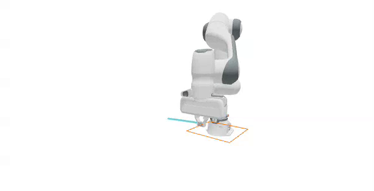
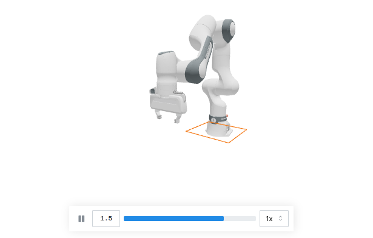

# Inverse Kinematics[#](#inverse-kinematics "Link to this heading")



So far we’ve commanded joints directly. But we usually want to think in *task space*: “put the end effector *here*, pointing *this way*.” Inverse kinematics (IK) solves for the joint angles that achieve a desired end-effector pose. In this lesson we’ll use Newton’s GPU-first IK module to move a Franka end effector to a point, then add an orientation constraint, and finally trace a full rectangle in the air.

Tip

Short on time? [Jump to the final example](#complete-script) for the complete runnable script.

Note

This lesson downloads the Franka asset on first use. The `newton[examples]` extra in [Getting Started](../getting-started/setup.html) installs the required GitPython dependency automatically.

In this lesson, we will:

- **Explain** how Newton composes IK objectives, optimizers, and Jacobian modes.
- **Solve** a position-only IK task on a single target.
- **Add** an orientation objective to constrain the end-effector rotation.
- **Track** a full rectangular path by feeding interpolated targets to the solver.

## How Newton IK Works[#](#how-newton-ik-works "Link to this heading")

Newton’s IK module, `newton.ik`, is a GPU-first, batched inverse-kinematics system built on Warp. It lets you compose multiple objectives into a single solve, then choose the optimization strategy (`LM` or `LBFGS`), the Jacobian backend (`ANALYTIC`, `AUTODIFF`, or `MIXED`), and optional multi-seed sampling. Because it solves many IK problems in parallel and can use CUDA graph execution for low-overhead repeated solves, Newton scales especially well in large batched workloads, with throughput and solve quality competitive with modern GPU IK libraries such as PyRoKi and cuRobo.

An `IKSolver` is assembled from a list of objectives. In this lesson we use three:

- **`IKObjectivePosition`** pulls a link to a target position.
- **`IKObjectiveRotation`** aligns a link to a target orientation.
- **`IKObjectiveJointLimit`** keeps the solution inside the joint limits.

We keep the joint-limit objective active in every solve.

## The IK Building Blocks[#](#the-ik-building-blocks "Link to this heading")

Every IK task in this lesson follows the same recipe. First, build a Franka-only world and grab the end-effector link index (`11` for this URDF). Then define the objectives and construct the solver.

```
ee\_index = 11
home\_pos\_np = state\_0.body\_q.numpy()[ee\_index][:3].astype(np.float32)
single\_target\_np = home\_pos\_np + np.array([0.0, 0.52, 0.04], dtype=np.float32)
# Position objective
pos\_obj = ik.IKObjectivePosition(
link\_index=ee\_index,
link\_offset=wp.vec3(0.0, 0.0, 0.0),
target\_positions=wp.array([single\_target\_np], dtype=wp.vec3),
)
joint\_limit\_obj = ik.IKObjectiveJointLimit(
joint\_limit\_lower=model.joint\_limit\_lower,
joint\_limit\_upper=model.joint\_limit\_upper,
)
joint\_q\_ik = wp.clone(model.joint\_q.reshape((1, -1)))
ik\_solver = ik.IKSolver(
model=model,
n\_problems=1,
objectives=[pos\_obj, joint\_limit\_obj],
lambda\_initial=0.1,
jacobian\_mode=ik.IKJacobianType.ANALYTIC,
)
```

Each frame we solve IK, copy the solved arm coordinates into the joint targets, and step the physics. The gripper fingers are held closed at zero here since we’re only tracking a pose.

```
for \_ in range(120):
pos\_obj.set\_target\_positions(wp.array([single\_target\_np], dtype=wp.vec3))
ik\_solver.step(joint\_q\_ik, joint\_q\_ik, iterations=24)
joint\_target\_q\_view = control.joint\_target\_q.reshape((1, -1))
wp.copy(dest=joint\_target\_q\_view[:, :7], src=joint\_q\_ik[:, :7])
wp.copy(dest=joint\_target\_q\_view[:, 7:9], src=wp.array([[0.0, 0.0]], dtype=wp.float32))
# ... run\_sim\_substeps() + viewer logging ...
```

## Step 1: Position-Only IK[#](#step-1-position-only-ik "Link to this heading")

The simplest task is a single fixed end-effector position target. Only the position and joint-limit objectives are active, and the arm drives its tip to the target point. That’s exactly the recipe above.

[Your browser does not support the video tag.](../_images/07-ik-position-only.mp4)

*Position-only IK: the solver drives the end effector to the target position while the orientation is left free.*

## Step 2: Add an Orientation Objective[#](#step-2-add-an-orientation-objective "Link to this heading")

Keeping the same position target, we add an `IKObjectiveRotation` so the end effector also holds a desired orientation. This isolates the effect of the rotation objective.

```
fixed\_rot = wp.quat\_from\_axis\_angle(wp.vec3(1.0, 0.0, 0.0), wp.pi / 2)
rot\_obj = ik.IKObjectiveRotation(
link\_index=ee\_index,
link\_offset\_rotation=wp.quat\_identity(),
target\_rotations=wp.array([fixed\_rot[:4]], dtype=wp.vec4),
)
ik\_solver = ik.IKSolver(
model=model,
n\_problems=1,
objectives=[pos\_obj, rot\_obj, joint\_limit\_obj],
lambda\_initial=0.1,
jacobian\_mode=ik.IKJacobianType.ANALYTIC,
)
```

Inside the loop we now also call `rot_obj.set_target_rotations(...)` before stepping the solver.

[Your browser does not support the video tag.](../_images/08-ik-position-and-orientation.mp4)

*Position plus orientation IK: the end effector holds the target point while also aligning to the commanded orientation.*

## Step 3: Preview the Path[#](#step-3-preview-the-path "Link to this heading")

Before solving IK on a moving target, it helps to see the geometric target on its own. We build a rectangle of corner points in front of the robot and draw it with `viewer.log_lines`, without running any IK yet.

```
rect\_center = home\_pos\_np + np.array([0.0, 0.25, 0.0], dtype=np.float32)
rect\_half = 0.08
rect\_corners\_np = np.array(
[
[rect\_center[0] - rect\_half, rect\_center[1] - rect\_half, rect\_center[2]],
[rect\_center[0] + rect\_half, rect\_center[1] - rect\_half, rect\_center[2]],
[rect\_center[0] + rect\_half, rect\_center[1] + rect\_half, rect\_center[2]],
[rect\_center[0] - rect\_half, rect\_center[1] + rect\_half, rect\_center[2]],
],
dtype=np.float32,
)
rect\_starts\_np = rect\_corners\_np
rect\_ends\_np = np.roll(rect\_corners\_np, -1, axis=0)
viewer.log\_lines("/ik/rectangle\_preview", rect\_starts\_np, rect\_ends\_np, colors=(1.0, 0.4, 0.0), width=0.012)
```

[Your browser does not support the video tag.](../_images/09-ik-rectangle-preview.mp4)

*The rectangle target path drawn with `viewer.log_lines`. No IK runs yet; this is the geometry the arm will track next.*

## Step 4: Track the Full Rectangle[#](#step-4-track-the-full-rectangle "Link to this heading")

Now we combine all three objectives and feed the solver a stream of interpolated targets along the rectangle. We sample points along each edge, and for each point we set the position target, solve IK, and step the simulation. Tracing the end-effector path lets us compare the commanded target against the achieved motion.

```
edge\_frames = 45
rect\_path\_points = []
for i in range(len(rect\_corners\_np)):
start = rect\_corners\_np[i]
end = rect\_corners\_np[(i + 1) % len(rect\_corners\_np)]
for t in np.linspace(0.0, 1.0, edge\_frames, endpoint=False):
rect\_path\_points.append(start \* (1.0 - t) + end \* t)
rect\_path\_np = np.array(rect\_path\_points, dtype=np.float32)
for p in rect\_path\_np:
target\_wp = wp.vec3(p[0], p[1], p[2])
pos\_obj.set\_target\_positions(wp.array([target\_wp], dtype=wp.vec3))
rot\_obj.set\_target\_rotations(wp.array([fixed\_rot[:4]], dtype=wp.vec4))
ik\_solver.step(joint\_q\_ik, joint\_q\_ik, iterations=24)
# ... copy targets, step physics, log trace ...
```



The orange rectangle is the commanded target path fed to the IK solver, one interpolated point per frame.[#](#id1 "Link to this image")

[Your browser does not support the video tag.](../_images/11-ik-rectangle-tracking.mp4)

*Full rectangle tracking: the solver follows the interpolated targets around all four edges while the cyan line traces the achieved end-effector path.*

## Complete Script[#](#complete-script "Link to this heading")

This script runs the full rectangle-tracking task end to end. Before running it, open `http://localhost:8080` in a browser tab and reload the tab when Viser starts. Download [`lesson3_inverse_kinematics.py`](https://developer.nvidia.com/downloads/Omniverse/learning/Courses/GettingStartedNewton/getting_started_with_newton_fundamentals_examples.zip), or save the script below as `lesson3_inverse_kinematics.py` and run it with the pinned Newton 1.5 command from [Getting Started](../getting-started/setup.html).

Show the complete runnable script

```
1"""Newton Fundamentals - Lesson 3: Inverse kinematics path following.
2
3Tracks a rectangle in front of a Franka arm using position + rotation + joint-limit IK.
4Before running, open http://localhost:8080 in a browser tab and reload it when
5the Viser server starts.
6"""
7
8import time
9
10import numpy as np
11import warp as wp
12
13import newton
14import newton.utils
15import newton.ik as ik
16
17wp.config.quiet = True
18newton.solvers.SolverMuJoCo.import\_mujoco()
19
20
21def make\_viewer(name: str):
22 """Open a Viser web viewer; it prints a URL (normally http://localhost:8080)."""
23 return newton.viewer.ViewerViser(verbose=False)
24
25
26def build\_franka\_scene(include\_table=True, include\_cube=True, use\_targets=True):
27 builder = newton.ModelBuilder()
28 builder.default\_shape\_cfg.gap = 0.0
29 newton.solvers.SolverMuJoCo.register\_custom\_attributes(builder)
30
31 table\_height = 0.1
32 table\_pos = wp.vec3(0.0, -0.5, 0.5 \* table\_height)
33 table\_top\_center = table\_pos + wp.vec3(0.0, 0.0, 0.5 \* table\_height)
34 if include\_table:
35 builder.add\_shape\_box(body=-1, hx=0.4, hy=0.4, hz=0.5 \* table\_height, xform=wp.transform(table\_pos))
36
37 robot\_base\_pos = table\_top\_center + wp.vec3(-0.5, 0.0, 0.0)
38 builder.add\_urdf(
39 str(newton.utils.download\_asset("franka\_emika\_panda") / "urdf/fr3\_franka\_hand.urdf"),
40 xform=wp.transform(robot\_base\_pos, wp.quat\_identity()),
41 floating=False,
42 enable\_self\_collisions=False,
43 parse\_visuals\_as\_colliders=False,
44 )
45
46 builder.joint\_q[:9] = [
47 -3.6802115e-03, 2.3901723e-02, 3.6804110e-03, -2.3683236e00,
48 -1.2918962e-04, 2.3922248e00, 7.8549200e-01, 0.05, 0.05,
49 ]
50 builder.joint\_target\_q[:9] = [
51 -3.6802115e-03, 2.3901723e-02, 3.6804110e-03, -2.3683236e00,
52 -1.2918962e-04, 2.3922248e00, 7.8549200e-01, 1.0, 1.0,
53 ]
54 builder.joint\_target\_ke[:9] = [4500, 4500, 3500, 3500, 2000, 2000, 2000, 100, 100]
55 builder.joint\_target\_kd[:9] = [450, 450, 350, 350, 200, 200, 200, 10, 10]
56 builder.joint\_effort\_limit[:9] = [87, 87, 87, 87, 12, 12, 12, 100, 100]
57 builder.joint\_armature[:9] = [0.195] \* 4 + [0.074] \* 3 + [0.1] \* 2
58 return builder, None, None, None
59
60
61# Build a Franka-only world.
62builder, \_, \_, \_ = build\_franka\_scene(include\_table=False, include\_cube=False, use\_targets=True)
63model = builder.finalize()
64
65state\_0, state\_1 = model.state(), model.state()
66control = model.control()
67collision\_pipeline = newton.CollisionPipeline(model)
68contacts = collision\_pipeline.contacts()
69
70solver = newton.solvers.SolverMuJoCo(
71 model,
72 solver="newton",
73 integrator="implicitfast",
74 iterations=20,
75 ls\_iterations=100,
76 nconmax=500,
77 njmax=1000,
78 cone="elliptic",
79 impratio=1000.0,
80)
81
82newton.eval\_fk(model, model.joint\_q, model.joint\_qd, state\_0)
83
84fps = 60
85frame\_dt = 1.0 / fps
86sim\_substeps = 8
87sim\_dt = frame\_dt / sim\_substeps
88
89ee\_index = 11
90fixed\_rot = wp.quat\_from\_axis\_angle(wp.vec3(1.0, 0.0, 0.0), wp.pi)
91home\_pos\_np = state\_0.body\_q.numpy()[ee\_index][:3].astype(np.float32)
92rect\_center = home\_pos\_np + np.array([0.0, 0.25, 0.0], dtype=np.float32)
93rect\_half = 0.08
94edge\_frames = 45
95rect\_corners\_np = np.array(
96 [
97 [rect\_center[0] - rect\_half, rect\_center[1] - rect\_half, rect\_center[2]],
98 [rect\_center[0] + rect\_half, rect\_center[1] - rect\_half, rect\_center[2]],
99 [rect\_center[0] + rect\_half, rect\_center[1] + rect\_half, rect\_center[2]],
100 [rect\_center[0] - rect\_half, rect\_center[1] + rect\_half, rect\_center[2]],
101 ],
102 dtype=np.float32,
103)
104
105# Interpolate target points along the rectangle edges.
106rect\_path\_points = []
107for i in range(len(rect\_corners\_np)):
108 start = rect\_corners\_np[i]
109 end = rect\_corners\_np[(i + 1) % len(rect\_corners\_np)]
110 for t in np.linspace(0.0, 1.0, edge\_frames, endpoint=False):
111 rect\_path\_points.append(start \* (1.0 - t) + end \* t)
112rect\_path\_np = np.array(rect\_path\_points, dtype=np.float32)
113
114# Objectives: position + rotation + joint limits.
115home\_wp = wp.vec3(home\_pos\_np[0], home\_pos\_np[1], home\_pos\_np[2])
116pos\_obj = ik.IKObjectivePosition(
117 link\_index=ee\_index,
118 link\_offset=wp.vec3(0.0, 0.0, 0.0),
119 target\_positions=wp.array([home\_wp], dtype=wp.vec3),
120)
121rot\_obj = ik.IKObjectiveRotation(
122 link\_index=ee\_index,
123 link\_offset\_rotation=wp.quat\_identity(),
124 target\_rotations=wp.array([fixed\_rot[:4]], dtype=wp.vec4),
125)
126
127joint\_limit\_obj = ik.IKObjectiveJointLimit(
128 joint\_limit\_lower=model.joint\_limit\_lower,
129 joint\_limit\_upper=model.joint\_limit\_upper,
130)
131
132joint\_q\_ik = wp.clone(model.joint\_q.reshape((1, -1)))
133ik\_solver = ik.IKSolver(
134 model=model,
135 n\_problems=1,
136 objectives=[pos\_obj, rot\_obj, joint\_limit\_obj],
137 lambda\_initial=0.1,
138 jacobian\_mode=ik.IKJacobianType.ANALYTIC,
139)
140
141viewer = make\_viewer("08\_franka\_ik\_rectangle\_full")
142viewer.set\_model(model)
143viewer.set\_camera(wp.vec3(0.5, 0.0, 0.5), -15, -140)
144
145target\_starts\_np = rect\_path\_np[:-1]
146target\_ends\_np = rect\_path\_np[1:]
147
148sim\_time = 0.0
149ee\_trace = []
150graph = None
151
152
153def run\_sim\_substeps():
154 global state\_0, state\_1
155 for \_ in range(sim\_substeps):
156 state\_0.clear\_forces()
157 collision\_pipeline.collide(state\_0, contacts)
158 solver.step(state\_in=state\_0, state\_out=state\_1, control=control, contacts=contacts, dt=sim\_dt)
159 state\_0, state\_1 = state\_1, state\_0
160
161
162print("Tracking the rectangle (the first solve compiles kernels)...")
163for p in rect\_path\_np:
164 target\_wp = wp.vec3(p[0], p[1], p[2])
165 pos\_obj.set\_target\_positions(wp.array([target\_wp], dtype=wp.vec3))
166 rot\_obj.set\_target\_rotations(wp.array([fixed\_rot[:4]], dtype=wp.vec4))
167 ik\_solver.step(joint\_q\_ik, joint\_q\_ik, iterations=24)
168
169 joint\_target\_q\_view = control.joint\_target\_q.reshape((1, -1))
170 wp.copy(dest=joint\_target\_q\_view[:, :7], src=joint\_q\_ik[:, :7])
171 wp.copy(dest=joint\_target\_q\_view[:, 7:9], src=wp.array([[0.0, 0.0]], dtype=wp.float32))
172
173 if graph is not None:
174 wp.capture\_launch(graph)
175 elif wp.get\_device().is\_cuda:
176 with wp.ScopedCapture() as capture:
177 run\_sim\_substeps()
178 graph = capture.graph
179 else:
180 run\_sim\_substeps()
181
182 viewer.begin\_frame(sim\_time)
183 viewer.log\_state(state\_0)
184 try:
185 viewer.log\_lines("/ik/rectangle\_full/target", target\_starts\_np, target\_ends\_np, colors=(1.0, 0.4, 0.0), width=0.01)
186 except ValueError:
187 pass
188
189 ee\_trace.append(state\_0.body\_q.numpy()[ee\_index][:3].astype(np.float32))
190 if len(ee\_trace) > 1:
191 ee\_trace\_np = np.asarray(ee\_trace, dtype=np.float32)
192 try:
193 viewer.log\_lines("/ik/rectangle\_full/trace", ee\_trace\_np[:-1], ee\_trace\_np[1:], colors=(0.1, 0.8, 1.0), width=0.03)
194 except ValueError:
195 pass
196
197 viewer.end\_frame()
198 sim\_time += frame\_dt
199
200print("Simulation finished. Reload the pre-opened viewer tab; press Ctrl+C to exit.")
201try:
202 while viewer.is\_running():
203 time.sleep(0.1)
204except KeyboardInterrupt:
205 pass
206viewer.close() # stops the viser server and frees the port
```

## Challenge: Change the Path[#](#challenge-change-the-path "Link to this heading")

Try replacing the rectangle with a different trajectory, such as a circle or a figure-eight, by generating a different set of `rect_path_points`. Observe how closely the traced end-effector path follows your new target when you vary the number of solver `iterations`.

## Key Takeaways[#](#key-takeaways "Link to this heading")

You used Newton’s batched IK to command the Franka in task space: first a single position, then a position plus orientation, and finally a full path built from interpolated targets. The pattern is always the same: define objectives, build an `IKSolver`, and each frame set the targets, solve, and push the result into the joint targets. Next we’ll take on a task that a single solver can’t handle well: manipulating a deformable cable.

On this page
