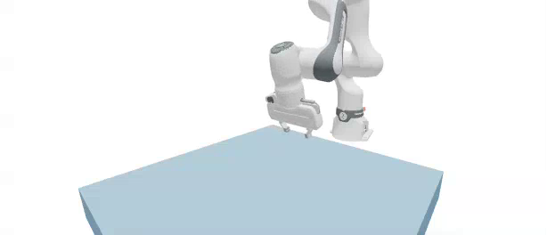
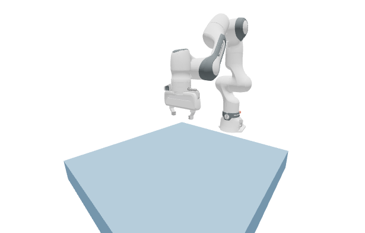

# Controlling a Robot[#](#controlling-a-robot "Link to this heading")



In this lesson, we’ll load a Franka Emika Panda arm from a URDF and drive it two different ways. First we’ll apply raw joint torques with `Control.joint_f`, then we’ll command joint position targets with `Control.joint_target_q`. These are the two control interfaces you’ll use most often, and they map directly onto how policies and classical controllers actuate robots.

Tip

Short on time? [Jump to the final example](#complete-script) for the complete runnable script.

In this lesson, we will:

- **Load** a Franka arm and a table into a Newton scene from a URDF.
- **Apply** a sinusoidal torque to a single joint with `Control.joint_f`.
- **Command** a sinusoidal joint target with `Control.joint_target_q` and PD gains.
- **Reuse** CUDA graph capture inside a control loop.

## A Reusable Scene Builder[#](#a-reusable-scene-builder "Link to this heading")

Both demos start from the same scene, so we wrap scene construction in a helper. It loads the Franka from URDF, sets sensible initial joint positions, and optionally adds a table and a cube. The `use_targets` flag decides whether the joints get PD gains for position control or are left free for torque control.

```
def build\_franka\_scene(include\_table=True, include\_cube=True, use\_targets=True):
"""Build a Franka + table scene and optionally add a cube.
Args:
include\_table: Whether to add a table.
include\_cube: Whether to add a cube on the table.
use\_targets: Whether to enable joint target gains for PD control.
Returns:
Tuple of (builder, cube\_size, table\_pos, cube\_body).
"""
builder = newton.ModelBuilder()
builder.default\_shape\_cfg.gap = 0.0
newton.solvers.SolverMuJoCo.register\_custom\_attributes(builder)
table\_height = 0.1
table\_pos = wp.vec3(0.0, -0.5, 0.5 \* table\_height)
table\_top\_center = table\_pos + wp.vec3(0.0, 0.0, 0.5 \* table\_height)
if include\_table:
builder.add\_shape\_box(body=-1, hx=0.4, hy=0.4, hz=0.5 \* table\_height, xform=wp.transform(table\_pos))
# Franka
robot\_base\_pos = table\_top\_center + wp.vec3(-0.5, 0.0, 0.0)
builder.add\_urdf(
str(newton.utils.download\_asset("franka\_emika\_panda") / "urdf/fr3\_franka\_hand.urdf"),
xform=wp.transform(robot\_base\_pos, wp.quat\_identity()),
floating=False,
enable\_self\_collisions=False,
parse\_visuals\_as\_colliders=False,
)
# Initial joint positions (arm + gripper)
builder.joint\_q[:9] = [
-3.6802115e-03, 2.3901723e-02, 3.6804110e-03, -2.3683236e00,
-1.2918962e-04, 2.3922248e00, 7.8549200e-01, 0.05, 0.05,
]
if use\_targets:
builder.joint\_target\_q[:9] = [
-3.6802115e-03, 2.3901723e-02, 3.6804110e-03, -2.3683236e00,
-1.2918962e-04, 2.3922248e00, 7.8549200e-01, 1.0, 1.0,
]
builder.joint\_target\_ke[:9] = [4500, 4500, 3500, 3500, 2000, 2000, 2000, 100, 100]
builder.joint\_target\_kd[:9] = [450, 450, 350, 350, 200, 200, 200, 10, 10]
else:
builder.joint\_target\_q[:9] = builder.joint\_q[:9]
builder.joint\_target\_ke[:9] = [0] \* 9
builder.joint\_target\_kd[:9] = [0] \* 9
builder.joint\_effort\_limit[:9] = [87, 87, 87, 87, 12, 12, 12, 100, 100]
builder.joint\_armature[:9] = [0.195] \* 4 + [0.074] \* 3 + [0.1] \* 2
# Optional cube to pick
cube\_size = 0.05
cube\_body = None
if include\_cube:
cube\_pos = table\_top\_center + wp.vec3(0.0, 0.15, 0.5 \* cube\_size)
cube\_body = builder.add\_body(xform=wp.transform(cube\_pos, wp.quat\_identity()))
shape\_cfg = newton.ModelBuilder.ShapeConfig(margin=1e-3, density=400.0)
builder.add\_shape\_box(body=cube\_body, hx=0.5 \* cube\_size, hy=0.5 \* cube\_size, hz=0.5 \* cube\_size, cfg=shape\_cfg)
return builder, cube\_size, table\_pos, cube\_body
```

Note

`newton.utils.download_asset("franka_emika_panda")` fetches the robot description on first use and caches it. This requires an internet connection. The `newton[examples]` extra in the setup command installs the required GitPython dependency automatically.

After building, we finalize and initialize forward kinematics once so the `State` matches the model’s `joint_q`:

```
builder, \_, \_, \_ = build\_franka\_scene(include\_cube=False, use\_targets=False)
model = builder.finalize()
state\_0 = model.state()
state\_1 = model.state()
control = model.control()
collision\_pipeline = newton.CollisionPipeline(model)
contacts = collision\_pipeline.contacts()
# Initialize FK once so State matches the model's joint\_q
newton.eval\_fk(model, model.joint\_q, model.joint\_qd, state\_0)
```



The Franka arm after loading from URDF and initializing forward kinematics, shown in its initial home joint configuration before any control is applied.[#](#id1 "Link to this image")

## Torque Control With `Control.joint_f`[#](#torque-control-with-control-joint-f "Link to this heading")

`Control.joint_f` is the lowest-level control interface: you write a torque for every degree of freedom. This is what you’d use for direct torque control or for a learned policy that outputs torques. Here we drive one joint (the elbow) with a sinusoid and leave the rest at zero.

We use the MuJoCo solver for the articulated robot. Notice the solver configuration: it selects the Newton constraint solver, an implicit-fast integrator, and elliptic friction cones.

```
solver = newton.solvers.SolverMuJoCo(
model,
solver="newton", # Constraint solver ("cg" or "newton")
integrator="implicitfast", # Integration method
iterations=20, # Number of solver iterations
ls\_iterations=100, # Number of line-search iterations
nconmax=1000, # Maximum number of contact points per world
njmax=2000, # Maximum number of constraints per world
cone="elliptic", # Contact friction cone
impratio=1000.0, # Frictional-to-normal impedance ratio
use\_mujoco\_contacts=False, # Use Newton contacts in step()
)
```

The control loop writes a fresh torque each frame and steps the substeps. On the first GPU frame we capture the substep loop into a CUDA graph and replay it afterward.

```
fps = 60
frame\_dt = 1.0 / fps
sim\_substeps = 8
sim\_dt = frame\_dt / sim\_substeps
num\_frames = 180
sim\_time = 0.0
graph = None
def run\_sim\_substeps():
global state\_0, state\_1
for \_ in range(sim\_substeps):
state\_0.clear\_forces()
collision\_pipeline.collide(state\_0, contacts)
solver.step(state\_in=state\_0, state\_out=state\_1, control=control, contacts=contacts, dt=sim\_dt)
state\_0, state\_1 = state\_1, state\_0
for frame in range(num\_frames):
joint\_forces = np.zeros(model.joint\_dof\_count, dtype=np.float32)
joint\_forces[2] = 35.0 \* np.sin(2.0 \* np.pi \* frame / num\_frames)
control.joint\_f.assign(joint\_forces)
if graph is not None:
wp.capture\_launch(graph)
elif wp.get\_device().is\_cuda:
with wp.ScopedCapture() as capture:
run\_sim\_substeps()
graph = capture.graph
else:
run\_sim\_substeps()
```

The elbow joint swings back and forth as the torque oscillates. Because we only actuate one joint, gravity and the arm’s dynamics shape the rest of the motion.

[Your browser does not support the video tag.](../_images/05-franka-joint-forces.mp4)

*The joint-torque demo: a sinusoidal torque on the elbow produces an oscillating swing, and the unactuated joints respond to gravity and coupling.*

## Position Control With `Control.joint_target_q`[#](#position-control-with-control-joint-target-q "Link to this heading")

Most robot controllers don’t command raw torques; they command target positions and let a PD controller compute the torques. To use position targets, we rebuild the scene with `use_targets=True` so the joints receive PD gains, then write a sinusoidal target to one joint each frame.

```
builder, \_, \_, \_ = build\_franka\_scene(include\_cube=False, use\_targets=True)
model = builder.finalize()
state\_0 = model.state()
state\_1 = model.state()
control = model.control()
collision\_pipeline = newton.CollisionPipeline(model)
contacts = collision\_pipeline.contacts()
# ... same SolverMuJoCo configuration as above ...
newton.eval\_fk(model, model.joint\_q, model.joint\_qd, state\_0)
base\_target = model.joint\_q.numpy().astype(np.float32)
base\_target[7:9] = 0.04 # keep the gripper fingers open
for frame in range(num\_frames):
target = base\_target.copy()
target[3] = base\_target[3] + 0.4 \* np.sin(2.0 \* np.pi \* frame / num\_frames)
control.joint\_target\_q.assign(target)
# ... run\_sim\_substeps() with graph capture, same as before ...
```

With position targets the motion is far smoother and more controllable than with raw torques, because the PD gains absorb the dynamics and track the commanded trajectory.

[Your browser does not support the video tag.](../_images/07-ik-position-only.mp4)

*The joint-target demo: with PD gains the same joint follows a sinusoidal position target smoothly, in contrast to the torque-driven motion above.*

## Complete Script[#](#complete-script "Link to this heading")

This script runs both demos back to back. Before running it, open `http://localhost:8080` in a browser tab; reload the tab when each Viser server starts so a demo does not finish before you connect. Download [`lesson2_robot_control.py`](https://developer.nvidia.com/downloads/Omniverse/learning/Courses/GettingStartedNewton/getting_started_with_newton_fundamentals_examples.zip), or save the script below as `lesson2_robot_control.py` and run it with the pinned Newton 1.5 command in [Getting Started](../getting-started/setup.html).

Show the complete runnable script

```
1"""Newton Fundamentals - Lesson 2: Controlling a Franka arm.
2
3Runs a joint-torque demo and a joint-target demo.
4Before running, open http://localhost:8080 in a browser tab and reload it when
5each Viser server starts.
6"""
7
8import time
9
10import numpy as np
11import warp as wp
12
13import newton
14import newton.utils
15
16wp.config.quiet = True
17newton.solvers.SolverMuJoCo.import\_mujoco()
18
19
20def make\_viewer(name: str):
21 """Open a Viser web viewer; it prints a URL (normally http://localhost:8080)."""
22 return newton.viewer.ViewerViser(verbose=False)
23
24
25def build\_franka\_scene(include\_table=True, include\_cube=True, use\_targets=True):
26 builder = newton.ModelBuilder()
27 builder.default\_shape\_cfg.gap = 0.0
28 newton.solvers.SolverMuJoCo.register\_custom\_attributes(builder)
29
30 table\_height = 0.1
31 table\_pos = wp.vec3(0.0, -0.5, 0.5 \* table\_height)
32 table\_top\_center = table\_pos + wp.vec3(0.0, 0.0, 0.5 \* table\_height)
33 if include\_table:
34 builder.add\_shape\_box(body=-1, hx=0.4, hy=0.4, hz=0.5 \* table\_height, xform=wp.transform(table\_pos))
35
36 robot\_base\_pos = table\_top\_center + wp.vec3(-0.5, 0.0, 0.0)
37 builder.add\_urdf(
38 str(newton.utils.download\_asset("franka\_emika\_panda") / "urdf/fr3\_franka\_hand.urdf"),
39 xform=wp.transform(robot\_base\_pos, wp.quat\_identity()),
40 floating=False,
41 enable\_self\_collisions=False,
42 parse\_visuals\_as\_colliders=False,
43 )
44
45 builder.joint\_q[:9] = [
46 -3.6802115e-03, 2.3901723e-02, 3.6804110e-03, -2.3683236e00,
47 -1.2918962e-04, 2.3922248e00, 7.8549200e-01, 0.05, 0.05,
48 ]
49 if use\_targets:
50 builder.joint\_target\_q[:9] = [
51 -3.6802115e-03, 2.3901723e-02, 3.6804110e-03, -2.3683236e00,
52 -1.2918962e-04, 2.3922248e00, 7.8549200e-01, 1.0, 1.0,
53 ]
54 builder.joint\_target\_ke[:9] = [4500, 4500, 3500, 3500, 2000, 2000, 2000, 100, 100]
55 builder.joint\_target\_kd[:9] = [450, 450, 350, 350, 200, 200, 200, 10, 10]
56 else:
57 builder.joint\_target\_q[:9] = builder.joint\_q[:9]
58 builder.joint\_target\_ke[:9] = [0] \* 9
59 builder.joint\_target\_kd[:9] = [0] \* 9
60
61 builder.joint\_effort\_limit[:9] = [87, 87, 87, 87, 12, 12, 12, 100, 100]
62 builder.joint\_armature[:9] = [0.195] \* 4 + [0.074] \* 3 + [0.1] \* 2
63
64 cube\_size = 0.05
65 cube\_body = None
66 if include\_cube:
67 cube\_pos = table\_top\_center + wp.vec3(0.0, 0.15, 0.5 \* cube\_size)
68 cube\_body = builder.add\_body(xform=wp.transform(cube\_pos, wp.quat\_identity()))
69 shape\_cfg = newton.ModelBuilder.ShapeConfig(margin=1e-3, density=400.0)
70 builder.add\_shape\_box(body=cube\_body, hx=0.5 \* cube\_size, hy=0.5 \* cube\_size, hz=0.5 \* cube\_size, cfg=shape\_cfg)
71
72 return builder, cube\_size, table\_pos, cube\_body
73
74
75def make\_solver(model):
76 return newton.solvers.SolverMuJoCo(
77 model,
78 solver="newton",
79 integrator="implicitfast",
80 iterations=20,
81 ls\_iterations=100,
82 nconmax=1000,
83 njmax=2000,
84 cone="elliptic",
85 impratio=1000.0,
86 use\_mujoco\_contacts=False,
87 )
88
89
90FPS = 60
91FRAME\_DT = 1.0 / FPS
92SIM\_SUBSTEPS = 8
93SIM\_DT = FRAME\_DT / SIM\_SUBSTEPS
94NUM\_FRAMES = 180
95
96
97def demo\_joint\_forces():
98 builder, \_, \_, \_ = build\_franka\_scene(include\_cube=False, use\_targets=False)
99 model = builder.finalize()
100 state\_0, state\_1 = model.state(), model.state()
101 control = model.control()
102 collision\_pipeline = newton.CollisionPipeline(model)
103 contacts = collision\_pipeline.contacts()
104 newton.eval\_fk(model, model.joint\_q, model.joint\_qd, state\_0)
105
106 solver = make\_solver(model)
107 viewer = make\_viewer("03\_franka\_joint\_forces")
108 viewer.set\_model(model)
109 viewer.set\_camera(wp.vec3(0.5, 0.0, 0.5), -15, -140)
110
111 sim\_time = 0.0
112 graph = None
113
114 def run\_sim\_substeps():
115 nonlocal state\_0, state\_1
116 for \_ in range(SIM\_SUBSTEPS):
117 state\_0.clear\_forces()
118 collision\_pipeline.collide(state\_0, contacts)
119 solver.step(state\_in=state\_0, state\_out=state\_1, control=control, contacts=contacts, dt=SIM\_DT)
120 state\_0, state\_1 = state\_1, state\_0
121
122 print("Joint-force demo (first run compiles MuJoCo-Warp kernels)...")
123 for frame in range(NUM\_FRAMES):
124 joint\_forces = np.zeros(model.joint\_dof\_count, dtype=np.float32)
125 joint\_forces[2] = 35.0 \* np.sin(2.0 \* np.pi \* frame / NUM\_FRAMES)
126 control.joint\_f.assign(joint\_forces)
127
128 if graph is not None:
129 wp.capture\_launch(graph)
130 elif wp.get\_device().is\_cuda:
131 with wp.ScopedCapture() as capture:
132 run\_sim\_substeps()
133 graph = capture.graph
134 else:
135 run\_sim\_substeps()
136
137 viewer.begin\_frame(sim\_time)
138 viewer.log\_state(state\_0)
139 viewer.end\_frame()
140 sim\_time += FRAME\_DT
141
142 # Close this viewer so the next demo can reuse the same browser URL.
143 viewer.close()
144
145
146def demo\_joint\_targets():
147 builder, \_, \_, \_ = build\_franka\_scene(include\_cube=False, use\_targets=True)
148 model = builder.finalize()
149 state\_0, state\_1 = model.state(), model.state()
150 control = model.control()
151 collision\_pipeline = newton.CollisionPipeline(model)
152 contacts = collision\_pipeline.contacts()
153 newton.eval\_fk(model, model.joint\_q, model.joint\_qd, state\_0)
154
155 solver = make\_solver(model)
156 viewer = make\_viewer("04\_franka\_joint\_targets")
157 viewer.set\_model(model)
158 viewer.set\_camera(wp.vec3(0.5, 0.0, 0.5), -15, -140)
159
160 base\_target = model.joint\_q.numpy().astype(np.float32)
161 base\_target[7:9] = 0.04
162
163 sim\_time = 0.0
164 graph = None
165
166 def run\_sim\_substeps():
167 nonlocal state\_0, state\_1
168 for \_ in range(SIM\_SUBSTEPS):
169 state\_0.clear\_forces()
170 collision\_pipeline.collide(state\_0, contacts)
171 solver.step(state\_in=state\_0, state\_out=state\_1, control=control, contacts=contacts, dt=SIM\_DT)
172 state\_0, state\_1 = state\_1, state\_0
173
174 print("Joint-target demo...")
175 for frame in range(NUM\_FRAMES):
176 target = base\_target.copy()
177 target[3] = base\_target[3] + 0.4 \* np.sin(2.0 \* np.pi \* frame / NUM\_FRAMES)
178 control.joint\_target\_q.assign(target)
179
180 if graph is not None:
181 wp.capture\_launch(graph)
182 elif wp.get\_device().is\_cuda:
183 with wp.ScopedCapture() as capture:
184 run\_sim\_substeps()
185 graph = capture.graph
186 else:
187 run\_sim\_substeps()
188
189 viewer.begin\_frame(sim\_time)
190 viewer.log\_state(state\_0)
191 viewer.end\_frame()
192 sim\_time += FRAME\_DT
193
194 return viewer
195
196
197if \_\_name\_\_ == "\_\_main\_\_":
198 demo\_joint\_forces()
199 viewer = demo\_joint\_targets()
200 print("Simulation finished. Reload the pre-opened viewer tab; press Ctrl+C to exit.")
201 try:
202 while viewer.is\_running():
203 time.sleep(0.1)
204 except KeyboardInterrupt:
205 pass
206 viewer.close() # stops the viser server and frees the port
```

## Key Takeaways[#](#key-takeaways "Link to this heading")

You loaded a real robot from a URDF and drove it two ways: raw torques through `Control.joint_f` and position targets through `Control.joint_target_q` with PD gains. Position targets gave smoother, more predictable motion, which is why most controllers and RL action spaces use them. Next, instead of hand-authoring joint angles, we’ll compute them automatically with inverse kinematics so we can command the end effector in task space.

On this page
