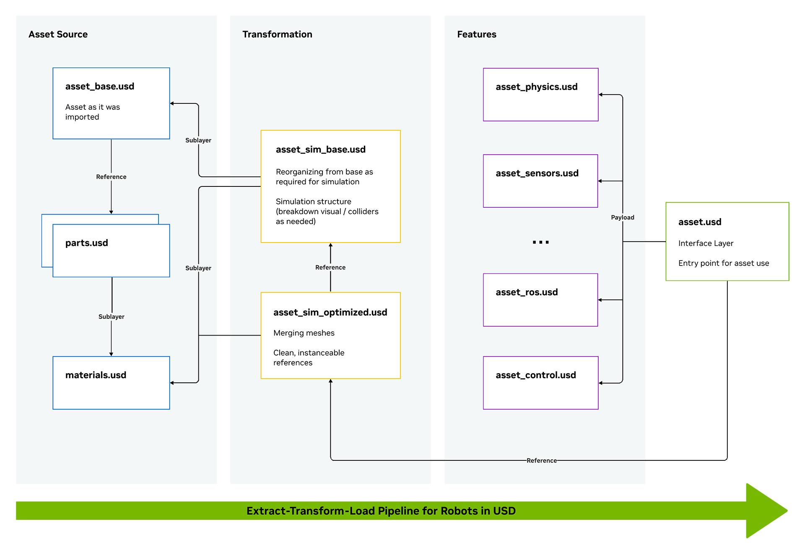
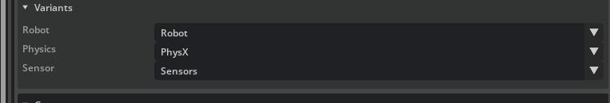

# Anatomy of a Robot Asset Structure[#](#anatomy-of-a-robot-asset-structure "Link to this heading")

## URDF Overview[#](#urdf-overview "Link to this heading")

URDF or Universal Robotics Description Format, is an XML-based file convention often used in the robotics world to describe physical aspects of a robot. This is important information for building an accurate simulation, and can be converted to USD for use in Isaac Sim.

Let’s take a look at some of the attributes a URDF can describe, and their USD counterparts.

- Links, which are rigid bodies of a robot
- Joints, which define relationships between links

  - Table for comparing USD vs URDF:

| USD Joint Name | URDF Joint Name | Description |
| --- | --- | --- |
| Prismatic | Prismatic | Linear joints (ex. elevator) |
| Revolute | Revolute | Revolute joint with joint limits (ex. Arm joint) |
|  | Continuous | Revolute joint without joint limits (ex. wheels) |
| Fixed | Fixed | Fixes the robot in place |
| D6 | N/A | Allow movement in selected DOF. If all are selected, then it is equivalent to a floating joint |
| Spherical | N/A | Allow movement in x,y,z rotation, equivalent to 3 revolute joints |
| Distance | N/A | Total freedom until reaches maximum distances between two bodies, Like tying the rope between two bodies |
| Gear | N/A | Gears |
| Rack and Pinion | N/A | Rotation converted to translation |
| Mimic Joint (attribute) | Mimic tag | Allow one joint to follow the specific attribute of another joint. Similar to Gear and Rack and pinion joints but for articulation |
| No Joint | Floating | No restrictions to the joint. |
| N/A | Planar | Linear motions along a plane (2 DOF) |

- Physical properties such as mass, inertia
- Sensors - both type and mount locations
- Visual and Collision components

### USD Overview[#](#usd-overview "Link to this heading")

To use a URDF in Isaac Sim, we need to convert it to USD, or Universal Scene Description. USD is an open and extensible ecosystem for 3D worlds, which Isaac Sim is based around. Let’s review a few important components of USD.

- Prim

  - Prims are fundamental building blocks or elements of a scene within the USD framework. Prim is short for “primitive” and it represents an individual object or entity within the scene hierarchy.
- Geometry

  - A simple pre-defined shape, such as cube, cylinder.
- Rigid Body

  - A mesh that can interact with physics.
- Colliders

  - A mesh used to define the colliders.
- Articulation

  - Creates a tree of rigid bodies and joints to represent the robot structure.
- Joints

  - A mechanism to connect two rigid bodies (As mentioned in URDF section before).
- Materials
- Layers, References, and Overrides.

You may be seeing some overlap in concepts between these two formats. Thankfully, the conversion process is handled for you with tools inside of Isaac Sim. Let’s use those next.

---

### Asset Structure - Making Module Assets to Suit Multiple Workflows[#](#asset-structure-making-module-assets-to-suit-multiple-workflows "Link to this heading")

In this lecture we’ll show the proposed structure to follow when dealing with a robotics asset.



This structure allows the asset to be composed in a modular and non-destructive way, such that each time some component is modified it streamlines towards the final asset to be used, and enables a single point of entry to all different workflows.

Let’s open the gripper asset and inspect its structure. We’ll be using this asset throughout the module.

#### Open the Asset in Isaac Sim[#](#open-the-asset-in-isaac-sim "Link to this heading")

1. To open Isaac Sim, open a terminal run the following command:

```
~/IsaacSim-main/\_build/linux-x86\_64/release/isaac-sim.sh --reset-user
```

Note

If you’re using the pre-built version of Isaac Sim, simply run the `isaac-sim.sh --reset-user` command from the root of the Isaac Sim installation.

2. Using **File > Open** or the Content panel at the bottom of the UI, locate the gripper asset `starting_point/robotiq_2f_140_unoptimized/robotiq_2f_140.usd`. This is the “interface layer” of our gripper structure.
3. **Double-click** the file to open it.

### Analyze the available variants[#](#analyze-the-available-variants "Link to this heading")

1. In the *Stage* panel on the top right of the UI, select the defaultPrim (`robotiq_arg2f_140_model`)
2. In the *Property* panel, find the *Variants* section.

Under the Variants section, there are multiple drop downs indicating the feature options you can pick on the asset. If you navigate to the Configuration folder, you’ll see the individual feature assets, along with the base asset.  


### Visualize Colliders for the Gripper[#](#visualize-colliders-for-the-gripper "Link to this heading")

1. Click the “eye” icon and choose **Show by Type > Physics > Colliders > All**.
2. Select the gripper or its individual parts to display green outlines indicating collider locations and shapes.
3. Check how closely the colliders match the visuals, especially inside the gripper fingers.

In the Stage panel, expand the `left_inner_finger`, and the `right_inner_finger` by clicking the “+” icon next to their names. You’ll notice that they are not quite equal, and contain multiple meshes inside, which can hurt performance.

Let’s fix that next.

On this page
