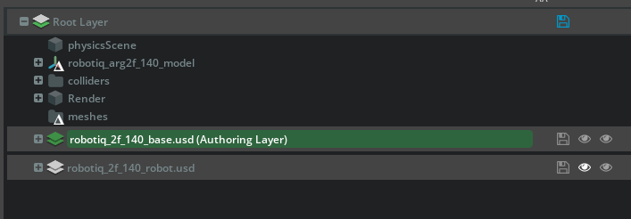
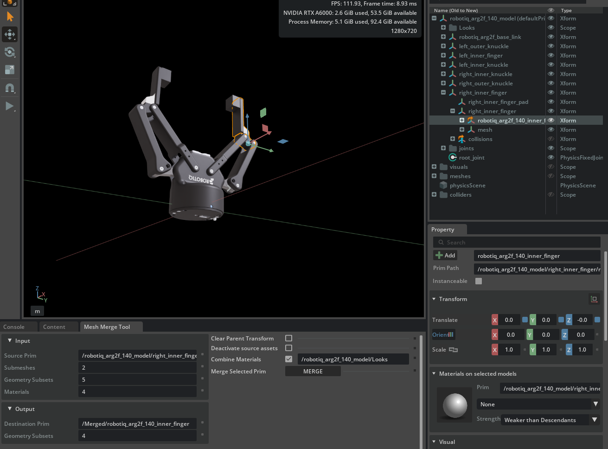
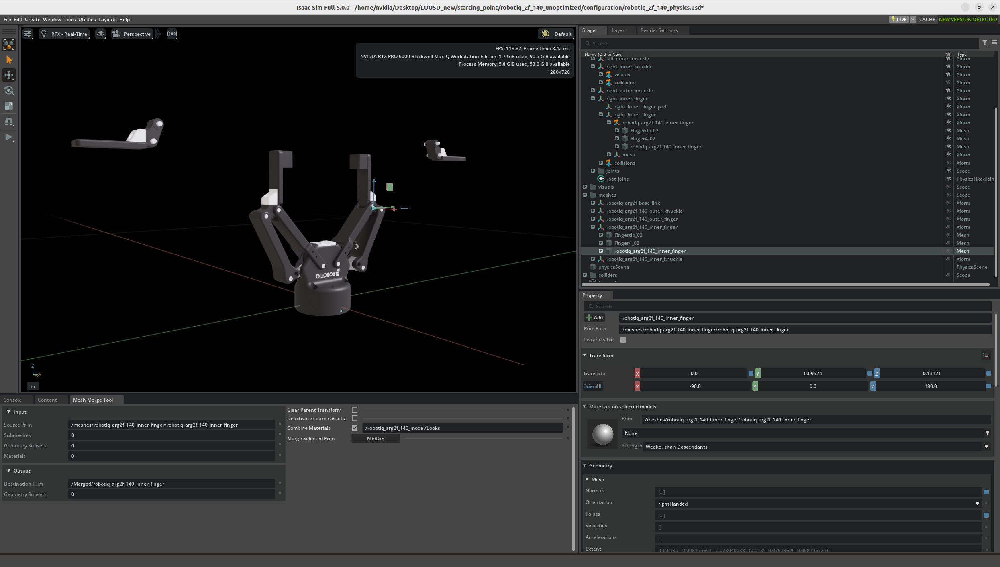
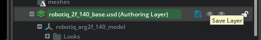
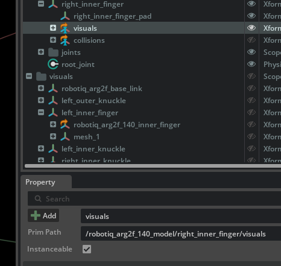
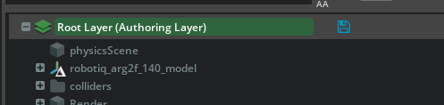
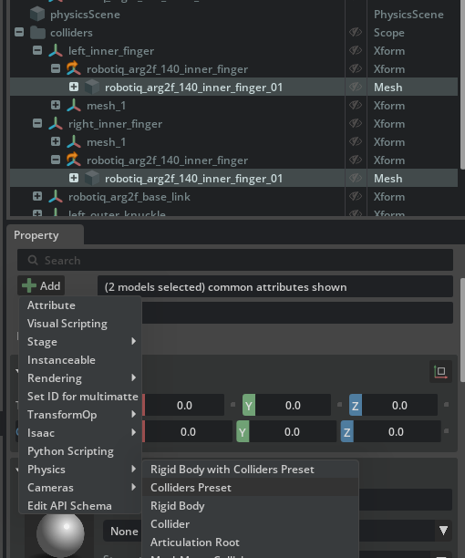
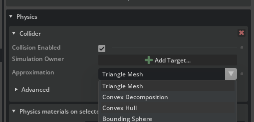
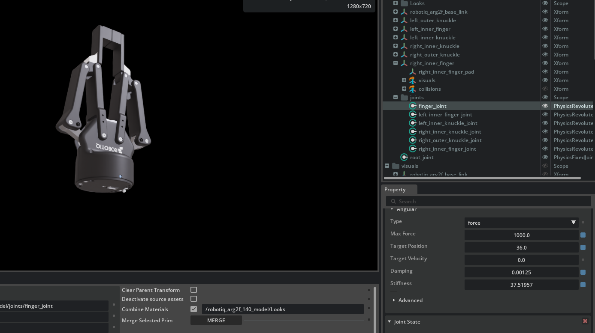
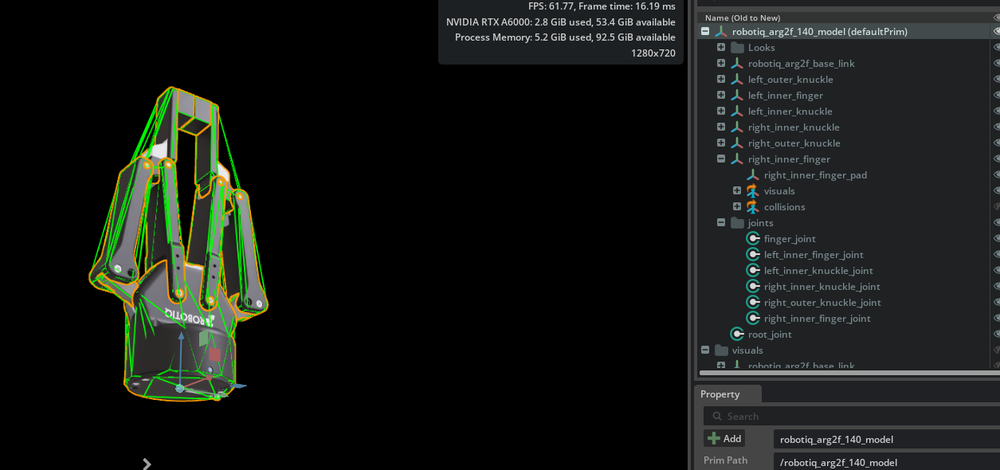

# Asset Optimizations[#](#asset-optimizations "Link to this heading")

In this section we’ll cover optimizations to assets which improve performance. In the previous module, everything came with a satisfactory level of optimization, and the URDF importer handled much of the process for us.

But if you import the asset from a different source, for example from custom CAD, you may end up with numerous meshes per rigid body. This can severely impact performance.

As an example, look at this Jetbot asset imported from CAD.

- On the right is an unoptimized asset, only achieving 40 FPS.
- On the left is an optimized asset, achieving 64FPS.

## Set Authoring Layer[#](#set-authoring-layer "Link to this heading")

1. Open the `robotiq_2f_140_physics.usd` file from this folder`starting_point/robotiq_2f_140_unoptimized/configuration/`. We will be working with this layered USD file.
2. On the top right of the UI, switch to the *Layer* tab.
3. Double click on `robotiq_2f_140_base.usd` layer. This will change the authoring layer to this one.  
   
4. Switch back to the *Stage* tab, and proceed.

## Mesh Merging[#](#mesh-merging "Link to this heading")

In this activity, we will demonstrate a workflow with the multi-layered asset structure introduced earlier, by creating an optimized version of an asset.

This guide walks you through the process of optimizing a robotic gripper asset in Isaac Sim, focusing on merging meshes, setting up instanceable references, and ensuring colliders are set up efficiently for simulation. These steps are designed to enhance performance and streamline simulation workflows.

### Merge Meshes for the Gripper Finger[#](#merge-meshes-for-the-gripper-finger "Link to this heading")

1. Select the `robotiq_arg2f_140_inner_finger` located at `/robotiq_arg2f_140_model/right_inner_finger/right_inner_finger/`.
2. Go to **Tools > Robotics > Asset Editors > Merge Mesh Tool**

   - In the Merge Mesh dialog:

     - Selected submeshes are listed, showing geometry subsets and assigned materials.
     - We can combine materials to minimize the number of subsets and improve efficiency.
3. Check the **Combine Materials** checkbox and set the path to `/robotiq_arg2f_140_model/Looks`
4. Click **Merge** to create a new, merged mesh asset for the finger.
5. Move the new mesh (`/Merged/robotiq_arg2f_140_inner_finger`) from the Merged scope into the meshes scope under the Xform: `/meshes/robotiq_arg2f_140_inner_finger`.

   

At this step it will look like the fingers of the gripper are floating. Let’s fix that.

### Cleanup[#](#cleanup "Link to this heading")

Let’s reset the transform for the fingers so they move back into place.

1. Select the mesh `/meshes/robotiq_arg2f_140_inner_finger/robotiq_arg2f_140_inner_finger`.
2. In the *Property* panel, click the blue squares next to each XYZ translation and orientation value. This resets them to their default values.
3. Delete the other meshes from `/meshes/robotiq_arg2f_140_inner_finger`: **Fingertip\_02** and **Finger4\_02**. Use right-click, delete or press the delete key.
4. Delete the scope (folder) named **Merged**.
5. Switch to the Layer Panel, and on the authoring layer (`robotiq_2f_140_base.usd`), click on the Save Icon to save your changes.

### Update References to Use the Instanceable Mesh[#](#update-references-to-use-the-instanceable-mesh "Link to this heading")

Let’s remove the old `right_inner_finger`, and replace it with an internal reference to our new, optimized asset.

1. Select and delete the prim `/robotiq_arg2f_140_model/right_inner_finger/right_inner_finger`.
2. Select the `/robotiq_arg2f_140_model/right_inner_finger/visuals` Xform.
3. In the Properties panel, check the **Instanceable** option to enable instancing. This leverages USD to efficiently create multiple instances of this robot later.

   

### Verify Collider Configuration[#](#verify-collider-configuration "Link to this heading")

Before we work on the colliders, let’s set the Physics layer as our authoring layer. Remember, we currently have our `robotiq_2f_140_physics.usd` file open, which means it is our current Root layer.

1. On the layer pane, click on the blue save icon next to the authoring layer, then double click **Root Layer**

   
2. Switch back to the *Stage* tab.
3. Within the Colliders scope, select these two prims:

   1. `/colliders/left_inner_finger/robotiq_arg2f_140_inner_finger/robotiq_arg2f_140_inner_finger`
   2. `/colliders/right_inner_finger/robotiq_arg2f_140_inner_finger/robotiq_arg2f_140_inner_finger`

Tip

Hold the control key and click, to select multiple prims from different parts of the hierarchy.

3. Apply colliders to both meshes by clicking the +Add button then clicking **Physics > Colliders Preset**. If this option isn’t available, a collider is already applied and you can move on.

   
4. Ensure the collision approximation is set to **Convex Hull**.

   
5. Save your changes to the base and interface layers by going to **File > Save** or pressing **Ctrl+S**.

Checkpoint

If you had any troubles with these steps, a USD file of the completed gripper asset is located on your computer at:
`robotiq_2f_140_final/robotiq_2f_140.usd`

### Test the Optimized Gripper[#](#test-the-optimized-gripper "Link to this heading")

1. Press **Play** to run a simulation.
2. Select the gripper’s **finger\_joint** in the *Stage* panel.
3. Scroll down in the Property Panel until you find the Angular Drive section.
4. Click and drag on the **Target Position** number to actuate the joint. You can also click in this field and type a number.
5. Observe proper finger movement and confirmation that mimic joints are functioning correctly. Visually, this means all fingers move when one target is actuated.
6. Verify the colliders are applied to all bodies by selecting the default prim. If they are all green, that’s good.

Tip

To see colliders, click the “eye” icon in the Viewport and choose **Show by Type > Physics > Colliders > All**.

  
7. Stop the simulation.

## What Did This Optimization Achieve?[#](#what-did-this-optimization-achieve "Link to this heading")

- **Merged Meshes**

  Simplified asset structure and improved simulation performance.
- **Instanceable References**

  Enabled reuse of subcomponents for greater memory and GPU efficiency.
- **Aligned Colliders**

  Ensured physics accuracy in simulation interactions.

By following these steps, your gripper asset is optimized for scalable, performant simulation use, including reinforcement learning and robotic manipulation tasks.

---

On this page
