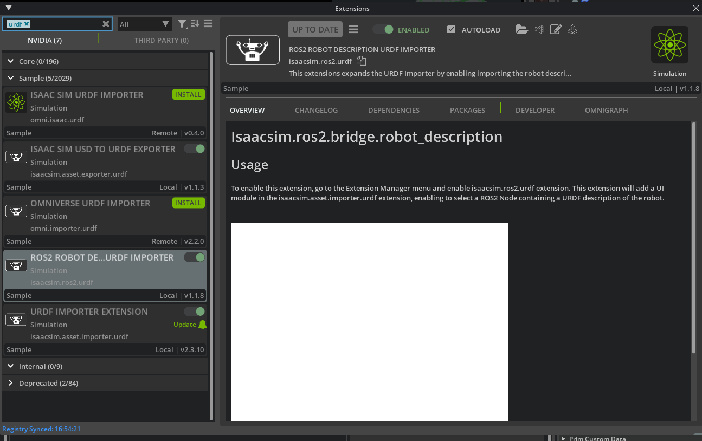
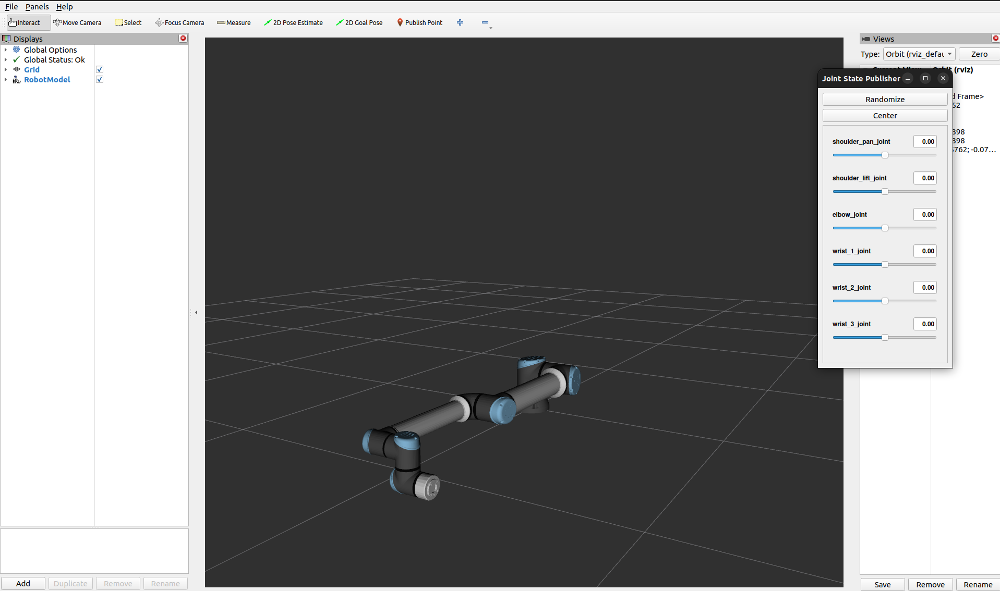
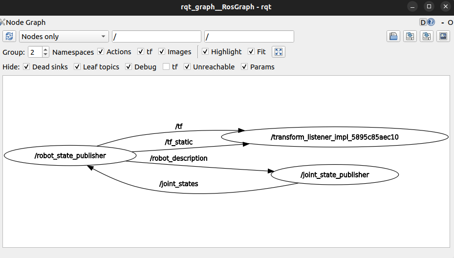
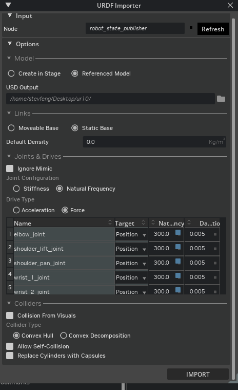
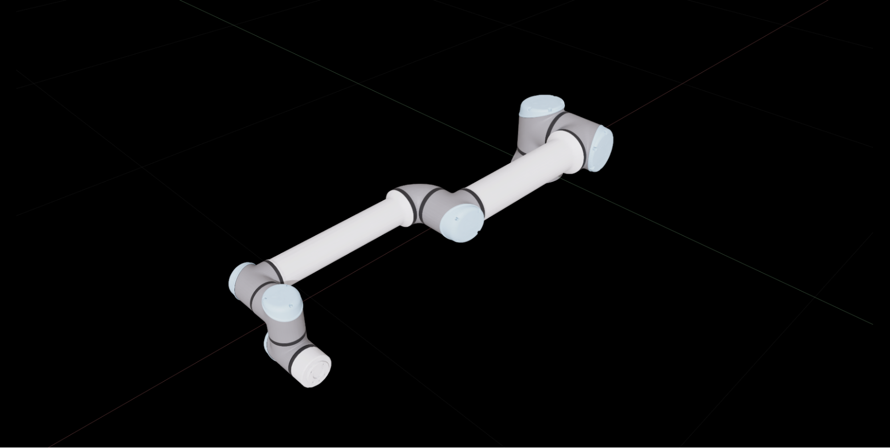

# Import UR10e Robot Using the URDF Importer[#](#import-ur10e-robot-using-the-urdf-importer "Link to this heading")

Let’s try out the URDF import to USD process, starting with a ROS Package provided by Universal Robots.

## Install the UR ROS package[#](#install-the-ur-ros-package "Link to this heading")

1. Navigate to the IsaacSim-ros\_workspaces folder, under humble\_ws/src.

```
cd ~/IsaacSim-ros\_workspaces/humble\_ws/src
```

2. Clone the UR description package into the src folder of the Isaac Sim ROS workspace,

```
git clone https://github.com/UniversalRobots/Universal\_Robots\_ROS2\_Description.git
```

2.Source this package

```
source ~/IsaacSim-ros\_workspaces/humble\_ws/install/setup.bash
```

Now that this package is installed,you can launch the Robot Description then import the robot using the `robot_state_publisher` node.

## Build Isaac Sim ROS workspace[#](#build-isaac-sim-ros-workspace "Link to this heading")

1. Open a new terminal.
2. Build Isaac Sim ROS workspace

```
cd ~/IsaacSim-ros\_workspaces
./build\_ros.sh
```

3. Keep this terminal open, and use it for the following steps.

## Source ROS and Launch Isaac Sim[#](#source-ros-and-launch-isaac-sim "Link to this heading")

To convert the robot description topic generated by this package, we’ll start by setting up a few aspects of our environment.

First we’ll open a new terminal, source Isaac Sim ROS Workspace, source `humble_ws`, then launch Isaac Sim, then enable a special Extension in Isaac Sim to import URDF files.

Tip

An Extension is like a plugin for Omniverse applications.

Isaac Sim 5.0 uses Python 3.11 while ROS 2 Humble uses Python 3.10. To accommodate this discrepancy, in the terminal that we launch Isaac Sim, we need to source a special version of ROS 2 Humble that we built from source using Python 3.11.

That special version is included in the Isaac Sim ROS Workspace and you can source it using the command below.

### Source ROS Workspaces and Launch Isaac Sim[#](#source-ros-workspaces-and-launch-isaac-sim "Link to this heading")

1. Close Isaac Sim if it’s still open.
2. Open a new terminal.
3. Source ROS workspaces and run Isaac Sim by running these commands:

```
source ~/IsaacSim-ros\_workspaces/build\_ws/humble/humble\_ws/install/local\_setup.bash
source ~/IsaacSim-ros\_workspaces/build\_ws/humble/isaac\_sim\_ros\_ws/install/local\_setup.bash
~/IsaacSim-main/\_build/linux-x86\_64/release/isaac-sim.sh --reset-user
```

Sourcing sets up several things to allow us to interact with ROS in the context of that terminal session. Depending on the step, we will either source ROS in general using the command above (notice it references a particular ROS installation), or both ROS and a specific workspace, for example in a repository.

Tip

Use tab to auto-complete as you type on the terminal.

### Enable the ROS 2 Robot Description URDF Importer Extension[#](#enable-the-ros-2-robot-description-urdf-importer-extension "Link to this heading")

1. In Isaac Sim, go to **Window > Extensions**
2. Type “URDF” in the search box, and find the **ROS2 Robot Description URDF Importer** Extension.

   1. If you can’t find it, remove the **@feature** filter from the search box.
   2. If you still can’t find it, make sure Isaac Sim was launched from the same terminal where ROS was sourced.
      
3. Select the **ROS2 Robot Description URDF Importer** Extension.
4. On the right side of the UI, enable the extension by clicking the toggle button labeled **ENABLED**.
5. Check the box for **AUTOLOAD**, just to the right of *ENABLED*.

### Launch URDF Publisher Topic[#](#launch-urdf-publisher-topic "Link to this heading")

In this section we will launch two terminal windows for ROS tools, in addition to the one running Isaac Sim. This allows us import the robot description, and inspect topics.

1. Open a new terminal.
2. Source both the system ROS and Isaac Sim ROS workspace by running these two commands:

   ```
   source /opt/ros/humble/setup.bash
   source ~/IsaacSim-ros\_workspaces/humble\_ws/install/setup.bash
   ```
3. Launch the **UR10e** description by running this command:

   ```
   ros2 launch ur\_description view\_ur.launch.py ur\_type:=ur10e
   ```
4. You should now see an RViz window like this:

   

   Let’s set up one more terminal for `rqt_graph`, to see ROS nodes and topics being published.
5. Open another terminal, and only source the system ROS:

   ```
   source /opt/ros/humble/setup.bash
   ```
6. Visualize the ROS computation graph by running:

   ```
   rqt\_graph
   ```
7. If the nodes are not showing up rqt\_graph, press the refresh button next to the drop down on the top left of the UI.

   

Notice that the `robot_description` topic is published by the `robot_state_publisher`

Now that ROS is set up and we’ve confirmed joint data is being published, let’s attach the gripper to the robot within Isaac Sim.

### Import UR10e[#](#import-ur10e "Link to this heading")

Next we’ll import two URDFs into Isaac Sim: one for the robot, and one for the gripper.

1. Go back to Isaac Sim.
2. Navigate to **File > Import from the ROS2 URDF Node**.

   - In the **Node** field, type `robot_state_publisher`, click **Refresh.** This might take a minute.
   - In the **USD Output** field, set it to `~/Desktop` or a folder of your choice.
   - Select **Natural Frequency** for joint configuration.
   - Shift-click Select all the joints listed below, then set the **Natural Frequency** to **300** to ensure the joints are sufficiently stiff

     
3. Click **Import** to complete the process.

   
4. Close the URDF Importer Window.

Now that the robot has been converted to USD, let’s assemble it with the gripper in the next module.

Checkpoint

If you had any troubles with these steps, a USD file of the completed robot up to this point is located in the course assets at: `/starting_point/ur/ur.usd`

On this page
