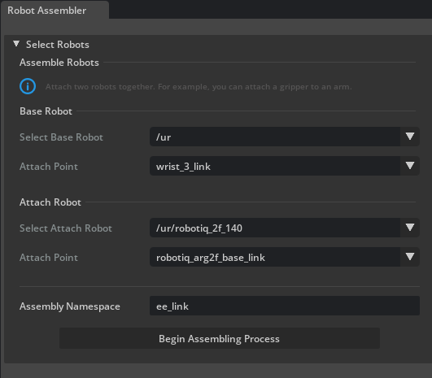
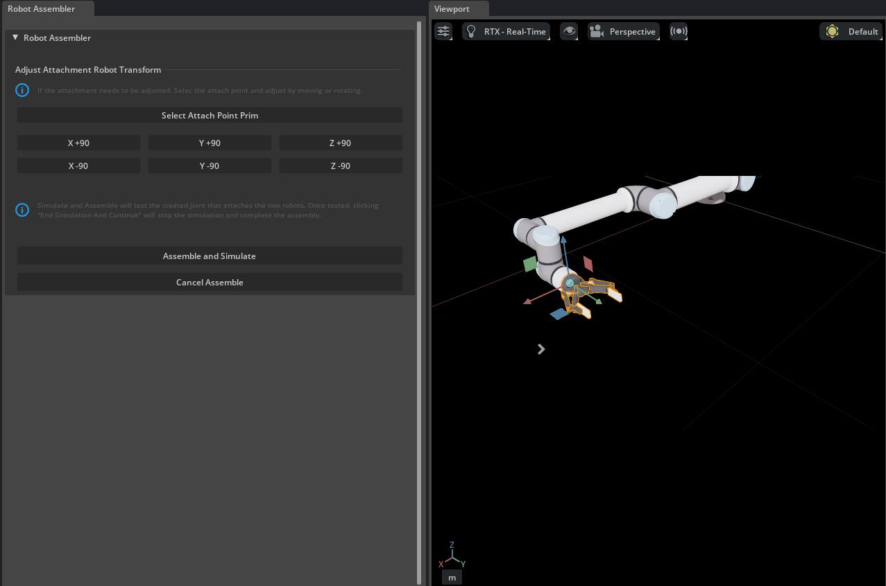

# Create a Variant of the UR10e Robot With the 2F-140 Gripper[#](#create-a-variant-of-the-ur10e-robot-with-the-2f-140-gripper "Link to this heading")

Just like a real robot can have its tools changed for different tasks, simulated robots benefit from the same capability.

We’ll use a USD capability called a **variant**, to allow the robot to be changed from a gripper or non-gripper configuration. This feature allows us to encapsulate several robot configurations in one USD asset.

The Isaac Sim Robot Assembler is a tool built to automate this process of assembling two robots together, such as a gripper and an arm.

1. Open the UR10e we converted into USD during the import process. It should be on the Desktop.

Checkpoint

If you need a checkpoint asset, load the course asset `robotiq_2f_140_final/robotiq_2f_140.usd`.

2. Drag and drop the `robotiq_2f_140.usd` file we created earlier into the *Stage* panel.
3. Open the robot assembler by going to **Tools > Robotics > Asset Editors > Robot Assembler**.  
   In this dialog, we’ll tell the assembler which prims represent both the base robot, and the “attach” robot, and at which points they should be attached.

   1. Under *Base Robot*

      1. Set **Select Base Robot** to `/ur`
      2. Set **Attach Point** to `wrist_3_link`.
   2. Under Attach Robot

      1. Set **Select Attach Robot** to `/ur/robotiq_2f_140`,
      2. Set **Attach Point** to `robotiq_arg2f_base_link`.
   3. Set **Assembly Namespace** to `ee_link`.
4. Click **Begin Assembling Process** to start the process.

   
5. Adjust the attachment point orientation to make sure the end effector is attached to the gripper correctly. Rotate the gripper 90 degrees around the z-axis by **clicking Z +90**.

   
6. Click **Assemble and Simulate** to test the configuration. If the gripper stays in place, you’re good to go.
7. Click **End Simulation And Finish** to complete the process.

Great, let’s try it out!

## Set the Variant[#](#set-the-variant "Link to this heading")

1. In the *Stage* panel, select the `ur` prim.
2. In the *Property* Editor at the bottom right, find the *Variant* section.
3. Select the ee\_link variant **None**, gripper is gone. It may need to be done twice.
4. Select the ee\_link variant **robotiq\_2f\_140**, gripper appears again.
5. Go to **File > Save** or press **Ctrl+S** to save your work.

   

Checkpoint

If you had any troubles with these steps, a USD file of the completed robot up to this point is located in the course assets under `imported_manipulator/ur/ur.usd`

On this page
