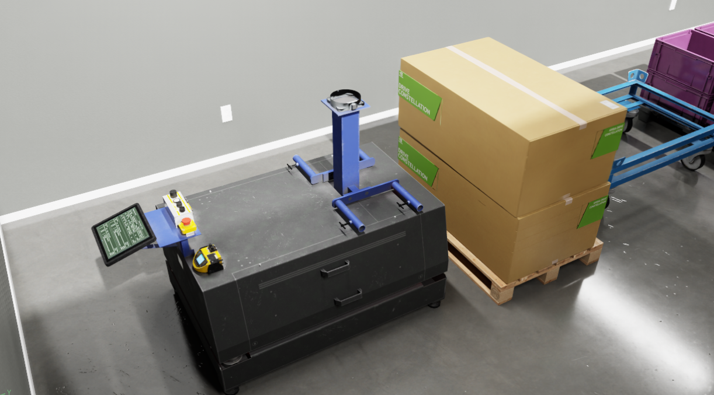
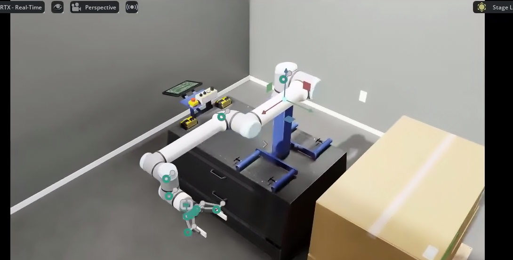
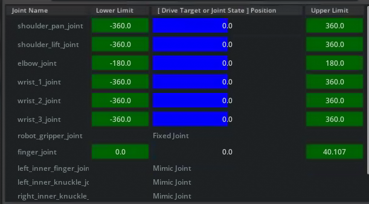
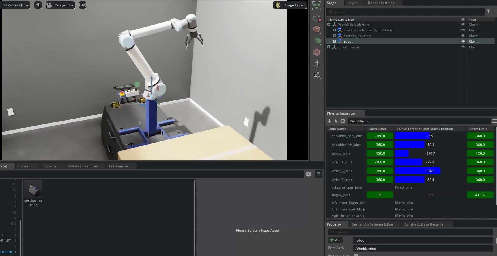
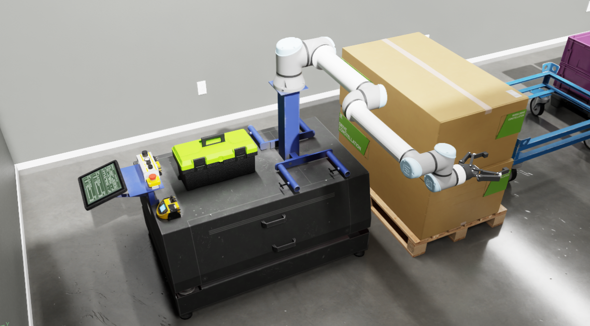

# Assembling a Robot Training Scene[#](#assembling-a-robot-training-scene "Link to this heading")

Now that we’ve converted URDF files and shown how to optimize an asset, let’s bring the UR10e robot we started with into a useful training scene. This scene will include the UR10e, an accompanying housing called Sortbot.

## Create the new stage[#](#create-the-new-stage "Link to this heading")

1. Create an empty stage by going to **File > New**.
2. Open the Content Browser and locate this file in the course assets at: `starting_point/small_warehouse_digital_twin.usd`
3. Drag and drop the asset onto the Stage panel to load it as a reference

Tip

To control the scene camera:

- **Alt + Left Click**: Rotate about object
- **Right Mouse Button**: Rotate about camera
- **Scroll wheel:** Zoom
- **Middle Mouse Button:** Pan

## Add the Sortbot to the stage[#](#add-the-sortbot-to-the-stage "Link to this heading")

1. Open the Content Browser and locate the sortbot housing USD file in the course assets under `/starting_point/sortbot_housing/sortbot_housing.usd`
2. Drag and drop the USD onto the *Stage* panel, and make sure it’s under the World (defaultPrim).
3. Select `sortbot_housing` in the *Stage* panel.
4. In the *Property* panel under Transform, click **Add Transforms** if a Transform does not exist already.
5. Set the **Translate** property to `(-4.0, -5.0, 0.0)`
6. Select `sortbot_housing` in the *Stage* panel.
7. Press **F** to frame it in the Viewport.
8. Confirm the Sortbot looks like this in the Viewport:  
   
9. Save your work by going to **File > Save** or pressing **Ctrl+S**.

## Add the UR10e to the stage[#](#add-the-ur10e-to-the-stage "Link to this heading")

1. In the *Content Browser*, locate the UR10e robot USD file we made earlier, or the completed robot in the course assets folder under `imported_manipulator/ur`
2. Select it and drag it onto the Stage panel onto `/World` to load it as a payload.
3. Rename the `ur` prim to `robot`.
4. Select `robot` and set these values in the *Property* panel.

   1. **Translate:** `(0.02, 0.285, 1.175)`
   2. It should now be resting on the stand like this:  
      
5. Save your work.

Checkpoint

If you had any troubles with these steps, a USD file of the completed warehouse is located in the course assets under`completed_warehouse/warehouse_complete.usd`

## Inspect physics and control the robot[#](#inspect-physics-and-control-the-robot "Link to this heading")

1. Go to **Tools > Physics > Physics Inspector**.
2. Click on Physics Inspector.
3. Select `robot` in the *Stage* panel.
4. Click on the **refresh** button on the top left of the Physics Inspector UI.
5. Now you can adjust the drive target by moving the Drive Target or Joint State position.

   1. Either enter a number into the target area, or click and drag on the blue sliders to move the robot!  
        
      
6. Close the Physics Inspector.

Now that you have verified the physics simulation works, you can import this environment in Isaac Sim or Isaac Lab for training or testing.

If you’d like to learn more about the Physics Inspector, see the [documentation](https://docs.omniverse.nvidia.com/extensions/latest/ext_physics/support-ui.html#physics-inspector%20).

## Add the Toolbox to the stage[#](#add-the-toolbox-to-the-stage "Link to this heading")

1. Using the *Content* panel, locate the toolbox USD asset at `starting_point/Collected_toolbox.usd`
2. Drag and drop the USD onto the *Stage* panel.
3. In the *Stage* panel, select the **toolbox** prim.
4. In the *Property* panel under Transform, click **Add Transforms** if a Transform does not exist already.
5. Set the **Translate** property of toolbox to `(-4.0, -5.2, 0.66)`
6. Confirm the **Sortbot** looks like this in the Viewport:  
   
7. Save your work.

On this page
