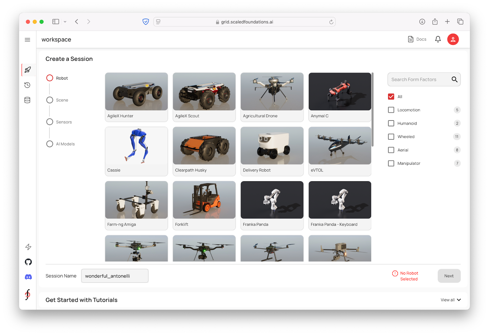
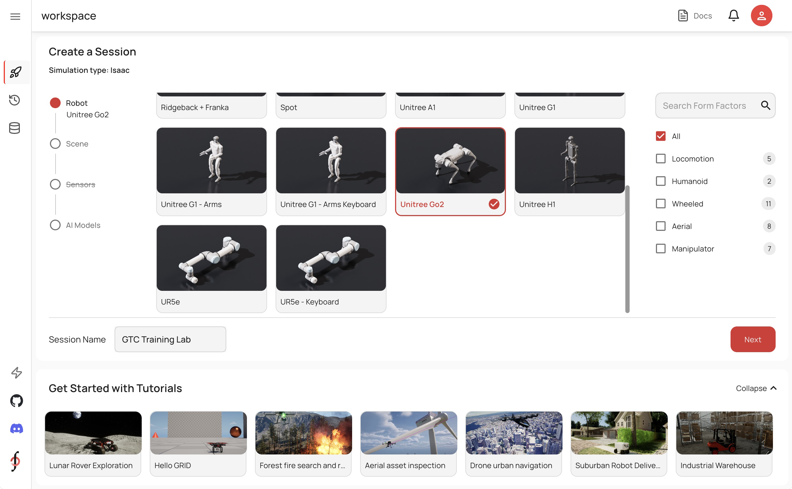
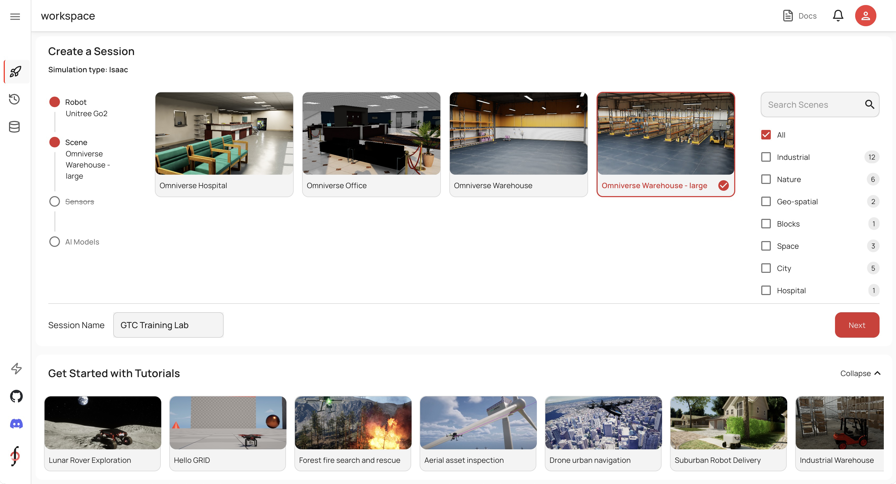
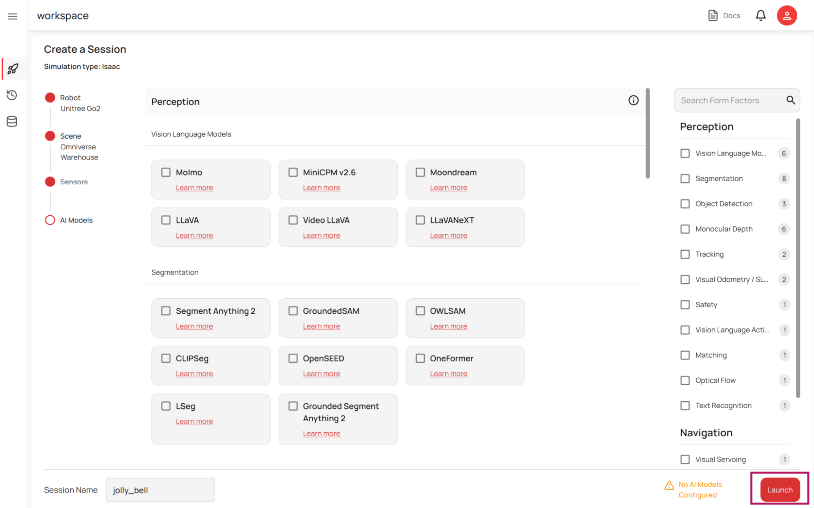

# Setting Up a Session[#](#setting-up-a-session "Link to this heading")

## Understanding the GRID Platform[#](#understanding-the-grid-platform "Link to this heading")

Open GRID is a fully web-based platform to develop, train, validate and deploy intelligent skills for a variety of robots. The Workspace is where you configure and launch your user sessions. It serves as a starting point for the development environment where you can select the following:

- **Robot Configuration**: Choose your robot
- **Simulation Environment**: Select and configure (if needed) your virtual environment.
- **AI Models**: Integrate AI models for various tasks and capabilities.

All robots start with a pre-configured set of sensors such as RGB, depth camera etc.

## What Is GRID?[#](#what-is-grid "Link to this heading")

## Configuring a Custom Session[#](#configuring-a-custom-session "Link to this heading")

To create a custom session, follow these general steps.

### Select a Robot and Scene[#](#select-a-robot-and-scene "Link to this heading")

1. From the *Workspace* screen, scroll through the list of available robots.
2. For this session, go ahead and choose **Unitree Go2** from the list of available robots.

Note

Feel free to explore other robots or environments if you’re curious—there are plenty of options tailored for different industries like agriculture or space exploration.

3. For this session, choose the “**Omniverse Warehouse - large**” environment.

4. Select **Next** to move onto the next page.

---

### Pre-Configured Sensors[#](#pre-configured-sensors "Link to this heading")

The robots in Isaac Sim come pre-configured with several sensors, like RGB cameras and depth cameras. We don’t need to select anything under the Sensors section at this time.

Note

Support for more advanced sensors, like lidar, will be added in future updates.

These configurations allow your robot to perceive its environment effectively right out of the box.

---

### Adding AI Models[#](#adding-ai-models "Link to this heading")

Once you’ve selected a robot and scene, you can augment your simulation with AI models. The AI Models Screen provides access to a wide range of state-of-the-art models relevant to robotics.

Examples include:

- Vision-language reasoning models like Llama or MoonDream.
- Segmentation models like SAM or CLIP.
- Object detection models.
- RGB-to-depth mapping models.
- Advanced tools like SLAM (Simultaneous Localization and Mapping) or visual odometry for tracking.

You can pre-select models here to have them automatically integrated into your notebook.

However, this step is optional—we’re not going to choose any of these models here, because we’ll show you how to invoke models at runtime.

---

5. Select Launch to launch your session.

Great, now we’re ready to develop within the Open GRID session!

On this page
