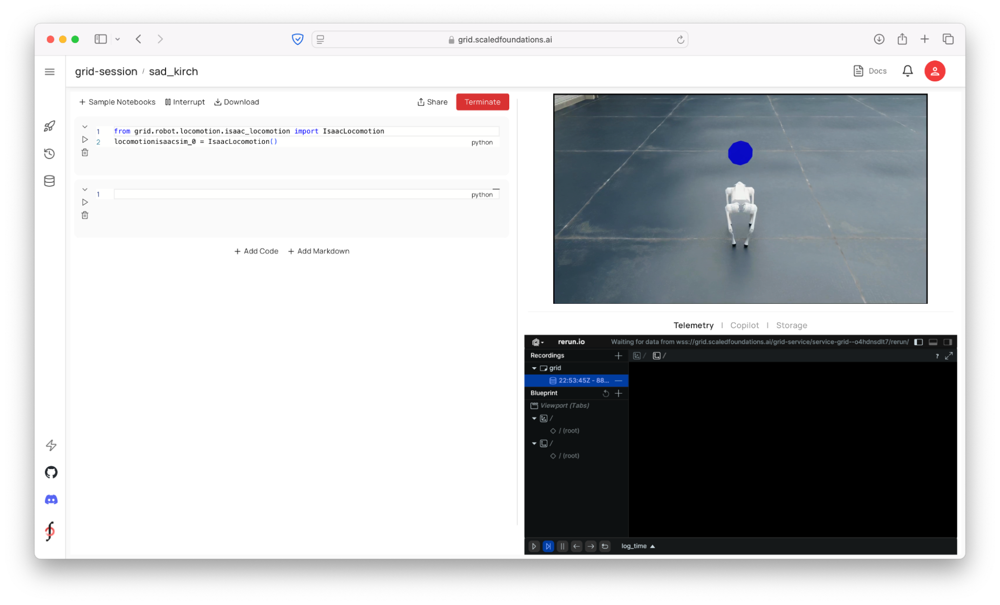
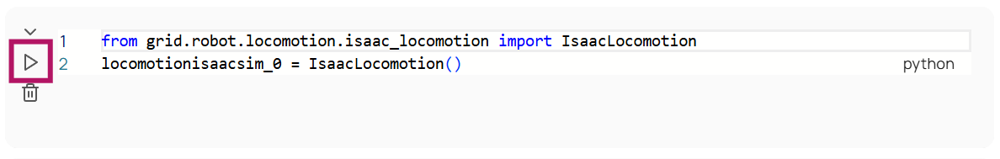
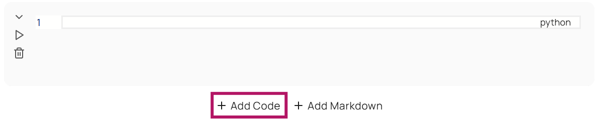
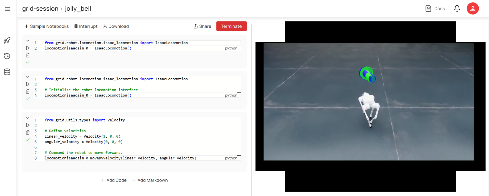
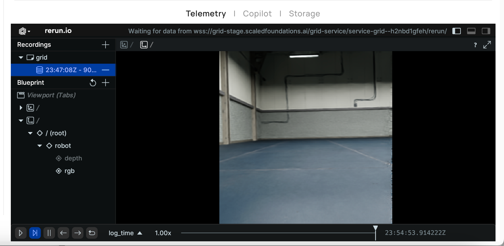

# Developing Within the GRID Session[#](#developing-within-the-grid-session "Link to this heading")

## Overview[#](#overview "Link to this heading")

In this tutorial, you’ll learn how to use the GRID session to work with the robot and build skills. We’ll cover:

- **Session UI Overview**: Understand the different elements in the session UI and how to use them.
- **Robot Initialization**: Setting up robot using GRID + Isaac Sim.
- **Sending Control Commands**: Send velocity commands to move the robot within the scene.
- **Data Capture**: Retrieving and logging RGB and depth images along with other data.
- **Perception Models**: Running visual language, segmentation, depth, and object detection models.

Note

The video references a PDF, but we’ve included the same information in the following pages. If you would prefer to use the PDF, [you can download it here](../_downloads/1228fc3105060cb2c508eb829d7db007/gtc25-GRID.pdf).

### Reviewing Session UI[#](#reviewing-session-ui "Link to this heading")

Once launched, the GRID session has three main panels.



**Python notebook** (left): Essentially a Jupyter notebook, where you can interact with the GRID API for robot control, data capture, and AI models. You can also download any custom packages (!pip install) if needed.

**Real-time simulation streaming** (top right): See the Isaac Sim stream in real time. Please note that upon launch, it might take a while for the stream to come up depending on the complexity of the scene loaded in Isaac Sim/Omniverse.

**Telemetry / Copilot / Storage**: This panel has three tabs: the telemetry tab shows a Rerun window where you can log and visualize any data stream from the session – such as robot positions, 2D images from the sensors or AI model outputs, or 3D point clouds or maps etc. Copilot consists of an LLM integration to send text commands to the robot (which then results in code generation). Storage tab is a view of the cloud storage corresponding to the current session, where users can save and retrieve any files.

## Robot Initialization[#](#robot-initialization "Link to this heading")

When you open the session, the first thing you’ll want to do is import the module corresponding to the robot and start the robot’s control interface. This gives you access to methods for commanding movement and accessing camera data. For convenience, this cell will be preloaded upon session start.

```
1from grid.robot.locomotion.isaac\_locomotion import IsaacLocomotion
2
3# Initialize the robot locomotion interface.
4locomotionisaacsim\_0 = IsaacLocomotion()
```

This is where we invoke what we call the **GRID Robot API**. For example, you’ll see a command like grid\_robot.locomotion, which is part of the API for controlling robot locomotion. This particular example uses the IsaacLocomotion class, which is instantiated and ready for use.

Similar to locomotion, there are classes available for other robot types, including aerial robots, wheeled robots, humanoids, and more. One of the key features of this API is its emphasis on **sim-to-real transfer**, which addresses a common challenge in robotics: how much effort is required to transition from simulation to real-world deployment?

1. Start by running the very first cell in your notebook by pressing the **Run** icon.

This step initializes the interfaces between the simulation and your notebook environment.



Once executed, you’ll see an acknowledgment indicating that the setup has been completed.

From here, we can begin sending locomotion commands to the robot.

## Sending Control Commands[#](#sending-control-commands "Link to this heading")

In this section, you’ll find code blocks for controlling your robot’s movement. For example:

- You can define linear and angular velocities for your robot.
- To make the robot walk straight, set a forward velocity (e.g., x = 1 meter/second) and no angular velocity.

---

First, let’s define a certain velocity and have the robot move forward. Note that the commands latch – so until you send another velocity command or stop the robot, it will continue in the commanded direction.

1. Add a new cell to the notebook by selecting **Add Code** at the bottom.



2. **Add the following code snippet** to the cell.

```
1from grid.utils.types import Velocity
2
3# Define velocities.
4linear\_velocity = Velocity(1, 0, 0)
5angular\_velocity = Velocity(0, 0, 0)
6
7# Command the robot to move forward.
8locomotionisaacsim\_0.moveByVelocity(linear\_velocity, angular\_velocity)
```

The cell we just added defines a **linear velocity** (`linear_velocity = Velocity(1, 0, 0)`) and an **angular velocity** (`angular_velocity = Velocity(0, 0, 0)`) for the robot. In this case, we want the robot to walk straight in a forward direction by one meter per second, and no angular velocity, which is represented by the linear velocity and angular velocity .

3. **Run the cell** to see the robot move.



---

### Visualizing Robot Behavior[#](#visualizing-robot-behavior "Link to this heading")

Once your robot starts moving, you’ll notice visual indicators in the simulation:

- **Green Vector**: Represents the target velocity vector.
- **Blue Vector**: Indicates how closely the robot is following its target.

You can also experiment with angular velocities to make your robot turn while moving forward.

4. Adjust the angular velocity if you wish to rotate the robot as shown below:

```
1angular\_velocity = Velocity(0, 0, 1)
2# Command the robot to turn counter-clockwise.
3locomotionisaacsim\_0.moveByVelocity(linear\_velocity, angular\_velocity)
```

5. Stop the robot using the stop() function.

```
1locomotionisaacsim\_0.stop()
```

This ensures no active commands are interfering with your adjustments.

Tip

See the [documentation](https://docs.generalrobotics.dev/robot-api/overview) for more information on the Robot API.

Tip

If something seems off—for example, if the robot isn’t responding or appears stuck—you can reset it by pressing Backspace in the simulation window. This will return the robot to its initial position within the environment.

## Accessing the Camera Data and Other Ground Truth[#](#accessing-the-camera-data-and-other-ground-truth "Link to this heading")

This section shows how to acquire images from both the RGB and depth cameras, which will be used as input for the perception models.

We can capture various types of data such as:

- Sensor readings (e.g., camera images).
- Positional data.
- Environmental mappings.

---

### Adding RGB images[#](#adding-rgb-images "Link to this heading")

Since the robot already has sensors, let’s start to capture some imagery as the robot moves around in the scene. This data will be critical for tasks like perception and reasoning later on.

1. Add a new cell to the notebook by selecting **Add Code** at the bottom.


2. **Add the following code** to the cell:

```
1# Capture an RGB image.
2rgb\_image = locomotionisaacsim\_0.getImage()
3
4# Log the RGB image to Rerun
5from grid.utils.logger import log
6log("robot/rgb", rgb\_image)
```

Just like how we have `moveByVelocity` as a function in the previous cell, we have a standard function called `getImage`. This exists for different robots. If we call this function on this robot object `locomotionisaacsim_0.getImage()` without any arguments, it’ll give you an RGB image by default.

1. Go ahead and **run** the cell.
   You should see an image in the bottom right that is being captured from the front-facing camera.



---

Let’s move on. At this point, we have a robot in the simulation, we’re looking at the scene, and we’re capturing images. Next, let’s show you how to change sensor modalities—for example, if you want to access a depth image instead of an RGB image.

```
1# Capture and log a depth image.
2depth\_image = locomotionisaacsim\_0.getImage("camera\_depth\_0")
3log("robot/depth", depth\_image)
```

There’s a specific naming convention you can use to access other modalities. For instance:

- The format follows `camera_sensor_[modality]`.
- If you specify “depth,” you’ll get a depth image.

Once you retrieve the depth image, you can hover over it to inspect values such as the depth at a specific point or the pixel value at that location.

---

### Challenge[#](#challenge "Link to this heading")

Next, let’s do some coding on the fly.

1. First, import the necessary libraries.

`import time`

`import rerun as rr`

`from grid.utils.types import Pose`

What we’re going to try to do is have the robot walk around in the little trajectory and just log its positions and poses.

2. Let’s make it walk for a period of time.

`t1 = time.time()`

3. That means we need to specify a velocity - let’s say 1 meters per second forward.

`linear_velocity = Velocity(1, 0, 0)`

4. Then, we need to specify an angular velocity - give it a value just like we did earlier.
   `angular_velocity = Velocity(0, 0, 1)`
5. Then we want to track positions over time. Let’s create an empty list.
   `positions = []`
6. As long as the time is under five seconds, we’ll tell it to apply the velocity.

```
1while time.time() - t1 < 5.0:
2 locomotionisaacsim\_0.moveByVelocity(linear\_velocity, angular\_velocity)
```

7. Then we can do something like give me the position at this particular position you’re at and the orientation.
   `pos = locomotionisaacsim_0.getPosition()`
   `ori = locomotionisaacsim_0.getOrientation()`
8. Log the positions that you’re getting to the list you created earlier:
   `positions.append(pos.to_list())`
9. Use the rerun library to log the set of points you’re getting.
   `rr.log("points", rr.Points3D(positions))`
   `pose = Pose(pos, ori)`
   `log("robot_pose", pose)`
10. Finally, after this process is done, we’d like it to stop.

`locomotionisaacsim_0.stop()`

Your code should look like this:

```
1import time
2import rerun as rr
3
4from grid.utils.types import Pose
5
6t1 = time.time()
7
8linear\_velocity = Velocity(1, 0, 0)
9angular\_velocity = Velocity(0, 0, 1)
10
11positions = []
12
13while time.time() - t1 < 5.0:
14 locomotionisaacsim\_0.moveByVelocity(linear\_velocity, angular\_velocity)
15 pos = locomotionisaacsim\_0.getPosition()
16 ori = locomotionisaacsim\_0.getOrientation()
17 positions.append(pos.to\_list())
18 rr.log("points", rr.Points3D(positions))
19 pose = Pose(pos, ori)
20 log("robot\_pose", pose)
21
22locomotionisaacsim\_0.stop()
```

When you run the cell, you should be able to see a transform moving through space tracking the robot itself.

On this page
