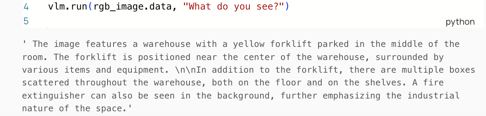
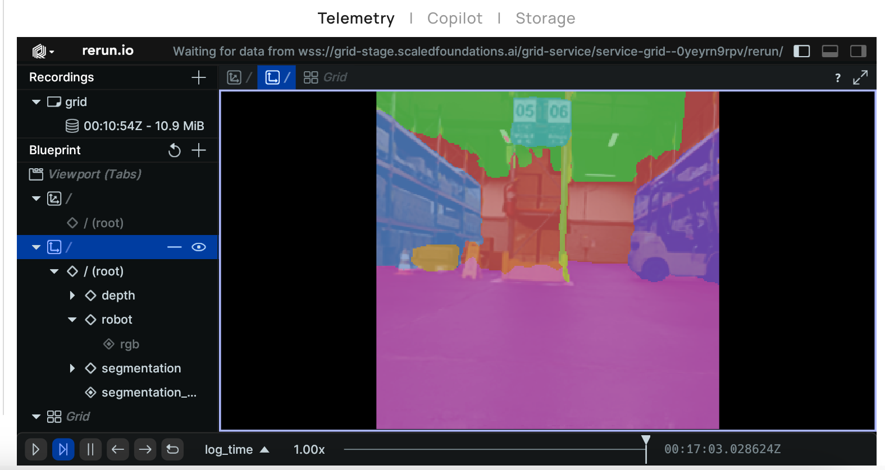
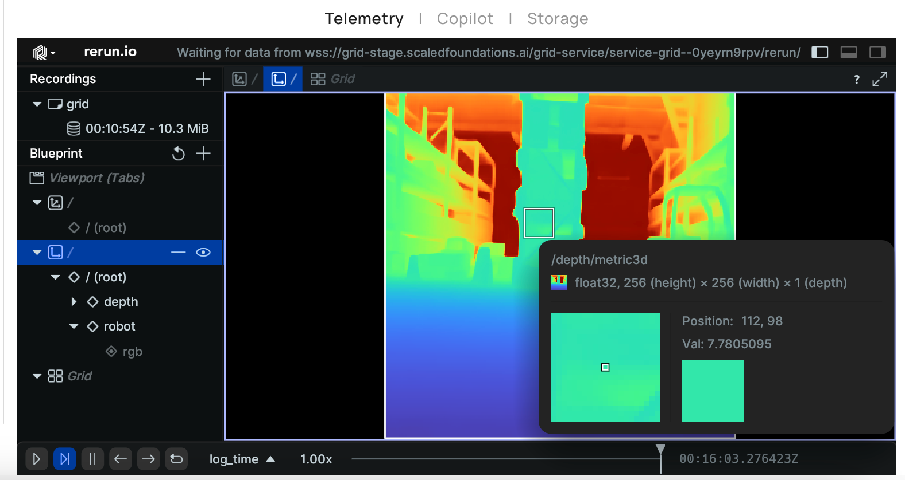

# Accessing AI Models[#](#accessing-ai-models "Link to this heading")

## Overview[#](#overview "Link to this heading")

Leverage the GRID AI models to process the sensor data. Each model provides a different type of environmental understanding. In this section, we provide some examples of how to use models of different categories. Feel free to choose and play with other models or combine these models in creative ways to achieve intelligent capabilities!

Tip

You can find more information on the available AI models in the [documentation](https://docs.scaledfoundations.ai/models/overviewhttps://docs.scaledfoundations.ai/models/overview).

### Visual Language Model: MoonDream[#](#visual-language-model-moondream "Link to this heading")

Use the MoonDream VLM to interpret the scene by answering a natural language question based on the RGB image. GRID allows you to access state-of-the-art vision-language intelligence in just 2-3 lines of code.

```
1from grid.model.perception.vlm.moondream import MoonDream
2
3vlm = MoonDream()
4vlm.run(rgb\_image.data, "What do you see?")
```



Try a few different prompts to see how it responds.

### Segmentation Model: OneFormer[#](#segmentation-model-oneformer "Link to this heading")

Segment the scene to distinguish different objects or regions. This code block performs panoptic segmentation, which returns all the categories visible.

```
1from grid.model.perception.segmentation.oneformer import OneFormer
2seg\_model = OneFormer()
3seg\_mask = seg\_model.run(rgb\_image.data, mode="panoptic")
4
5import rerun as rr
6rr.log("segmentation\_model", rr.SegmentationImage(seg\_mask))
```



### Depth Estimation Model: Metric3D[#](#depth-estimation-model-metric3d "Link to this heading")

**Monocular depth**, which is the idea of going from RGB images directly to depth without having a depth camera, is a rapidly advancing field. With this AI model, you can enable a constrained robot to use a neural network to generate a depth map from a monocular RGB image to understand the distance to various parts of the scene.

Use the following snippet to import Metric3D.

```
1from grid.model.perception.depth.metric3d import Metric3D
2depth\_model = Metric3D()
3depth\_image = depth\_model.run(rgb\_image.data)
4rr.log("depth\_model", rr.DepthImage(depth\_image))
```



Feel free to experiment with this workflow or try out different AI models.

### Object Detection Model: OWLv2[#](#object-detection-model-owlv2 "Link to this heading")

OWLv2 is an object detection model that can enable your robot to detect different objects—in this example, a forklift—from the RGB image.

```
1from grid.model.perception.detection.owlv2 import OWLv2
2det\_model = OWLv2()
3
4boxes, scores, labels = det\_model.run(rgbimage=rgb\_image.data, prompt=”forklift”)
```

The forklift might not be visible directly from where the robot is. Try to combine this with rotation or other movement commands to ‘search’ for the forklift!

On this page
