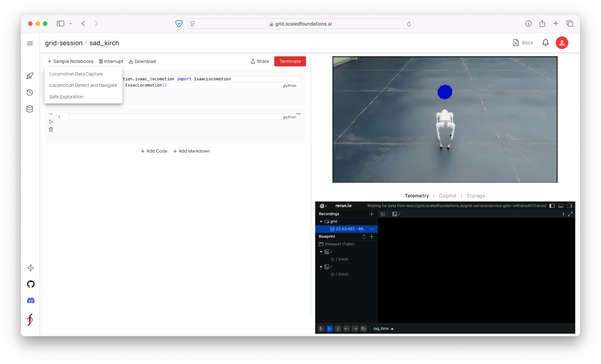

# Building Perception-Action Skills[#](#building-perception-action-skills "Link to this heading")

## Reviewing the Sample Notebooks[#](#reviewing-the-sample-notebooks "Link to this heading")

During the session, you will learn further how to use these fundamental capabilities to build more complex skills. For reference, you can also view the notebooks corresponding to these skills under the Sample Notebooks tab. For example, you can use the Detect and Navigate notebook to find and detect the forklift.

---

Watch the video to review the safe exploration sample notebook together.

---

## Transferring From Simulation to Reality[#](#transferring-from-simulation-to-reality "Link to this heading")

Finally, let’s dive into how we take a robot policy from simulation and bring it to life on a real robot right using the same script and logic we used in simulation. We’ll show you how the robot uses a depth inference model to navigate safely, avoiding obstacles in real-time.

### Sim-to-Real Made Simpler[#](#sim-to-real-made-simpler "Link to this heading")

The GRID Robot API is designed to wrap not only simulation environments like Isaac Sim but also real robot APIs. For instance, it integrates with the Unitree SDK for those working with Unitree robots. This means that when you develop a capability for your robot in GRID, transitioning from simulation code to real-world code may only require one or two lines of changes.

On this page
