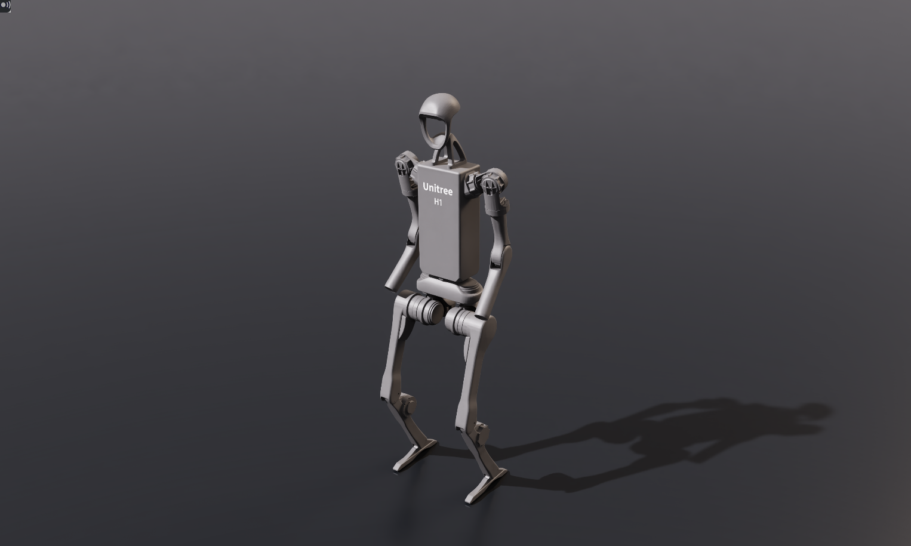
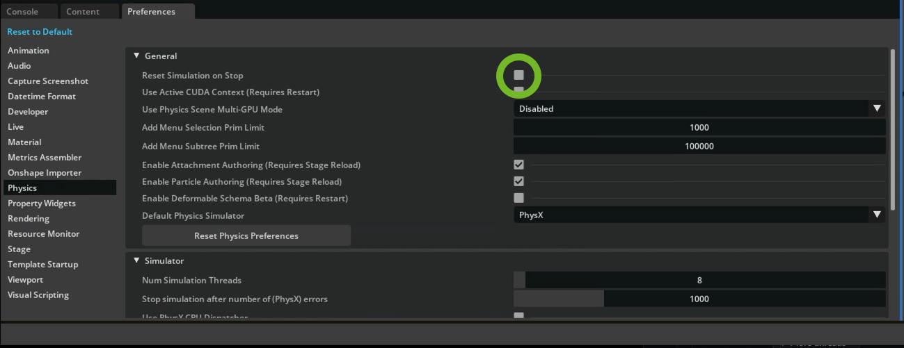
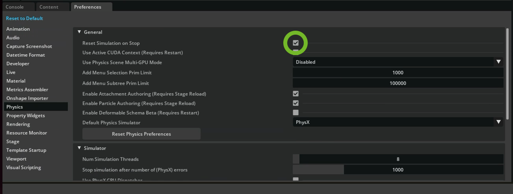

# Configuring the H1 Humanoid[#](#configuring-the-h1-humanoid "Link to this heading")

## Initial Positions and Verifying Our Work[#](#initial-positions-and-verifying-our-work "Link to this heading")

Now that we’ve walked through the process of configuring the robot, let’s actually do these steps together in Isaac Sim.

### Using Isaac Sim With ROS[#](#using-isaac-sim-with-ros "Link to this heading")

Isaac Sim 5.0 uses Python 3.11 while ROS2 Humble uses Python 3.10. To accommodate these requirements we handle Isaac Sim’s terminal differently from other packages.

In the terminal that we launch Isaac Sim from, we need to source a special version of ROS2 Humble that we built from source using Python 3.11. That special version is included in the Isaac Sim ROS Workspace.

#### Launch Isaac Sim With ROS[#](#launch-isaac-sim-with-ros "Link to this heading")

1. Open a new terminal window.
2. Source the workspaces and launch Isaac Sim from the same terminal.

```
# Source the local ROS workspace
`source ~/IsaacSim-ros\_workspaces/build\_ws/humble/humble\_ws/install/local\_setup.bash`
# Source the Isaac Sim ROS workspace
`source ~/IsaacSim-ros\_workspaces/build\_ws/humble/isaac\_sim\_ros\_ws/install/local\_setup.bash`
# Launch Isaac Sim - assuming using the open source build
`~/isaacsim/\_build/linux-x86\_64/release/isaac-sim.sh --reset-user`
```

Tip

If you download a pre-built version of Isaac Sim, simply run the `./isaac-sim.sh` script from the root of the Isaac Sim folder.

Tip

If you need to re-launch Isaac Sim during the module, run this same sequence of commands.

You can also put these commands into a `.sh` file and run that directly. For example:
`~/Desktop/launch_isaac_sim_sourced.sh`

### What Is Sourcing?[#](#what-is-sourcing "Link to this heading")

In short, sourcing sets up your terminal to use ROS.

ROS sourcing refers to running a command in your terminal to set up environment variables so you can access ROS commands and packages in that session.

Depending on the step, we will either source the system ROS, a combination of sources, or a particular workspace such as:

```
source ~/IsaacSim-ros\_workspaces/humble\_ws/install/setup.bash
```

#### Configuring the Left Elbow Joint[#](#configuring-the-left-elbow-joint "Link to this heading")

Now we will configure a single joint of the robot, to demonstrate this conversion process. The rest of the robot is already configured for us, just to save time today.

1. Go to **File > Open**, and locate the **h1.usd** file in the course assets under: `h1/h1.usd`
2. In the *Stage* panel, locate the Joints scope folder.
3. Inside the *Joints* scope, locate the **left\_elbow** joint, at `/h1/Joints/left_elbow`, and select it. You can also search at the top of the *Stage* panel.

   
4. In the Property Panel under **Physics > Drive > Angular**, set the following parameters:

   1. Max Force to **300** (Nm)
   2. Target Position to **29.79** deg
   3. Leave Target Velocity as-is.
   4. Damping to **0.174533** (kgm^2/(deg s))
   5. Stiffness to **0.698132** (kgm^2/(deg s^2))
5. In the *Property* Panel under **Physics > Joint > Advanced > Maximum Joint Velocity** to **5729.58** (deg/s)
6. Save your work by pressing **Ctrl+S** or going to **File > Save**.

#### Configure Initial Positions[#](#configure-initial-positions "Link to this heading")

Now we need to bake the target position into the joint settings so the robot will start at that position.

We’ll use a trick to accomplish this, by reconfiguring Isaac Sim to not reset the simulation on stop, playing and letting the joint settle to its target position, then reverting the setting.

First, we’ll create a temporary fixed joint between the robot and the World to stop it from falling.

1. Select the `/h1/torso_link` prim.
2. Right click and choose **Create > Physics > Joint > Fixed Joint**.

Important

Make sure this joint is created before proceeding, otherwise you’ll need to open the original file again.

3. On the top menu bar, open preferences under **Edit > Preferences**.
4. Select the Preferences window at the bottom, on the left side, click on the **Physics** tab.
5. Uncheck **Reset Simulation on Stop**.
6. Press **Play** to start the simulation.
7. Wait about 5 seconds for the robot arm to stop moving.
8. Save by pressing **Ctrl+S** or going to **File > Save**.
9. Delete the **Fixed Joint** that you have created using the right-click menu. Navigate to **torso\_link** and right click on the **Fixed Joint** and delete it.
10. In Preferences, enable **Reset Simulation on Stop** again.
11. Save your work again by pressing **Ctrl+S** or going to **File > Save**.

Checkpoint

If you had any issues with this section, see the file `h1_rigged/h1.usd` for the completed asset in the course assets folder.

### Verify your work[#](#verify-your-work "Link to this heading")

To check that the robot is configured correctly, we’ll use Python APIs to print out data about the articulation or collection of joints describing the robot.

#### Printing articulation data[#](#printing-articulation-data "Link to this heading")

Note

The robot will fall, that’s expected and okay for now. When you stop, it’ll reset. It won’t get hurt.

1. **Play** the simulation by clicking the button on the left side of the UI.
2. Open script editor by going to **Window > Script Editor**.
3. Copy and paste the following code into the Script Editor.

```
1from isaacsim.core.prims import SingleArticulation
2prim\_path = "/h1"
3prim = SingleArticulation(prim\_path=prim\_path, name="h1")
4print(prim.dof\_names)
5print(prim.dof\_properties)
```

4. Press the **Run** button at the bottom of the Script Editor.

You should see the console output similar to this. If the data in columns 6, 7, 8, and 9 matches max velocity, max force, stiffness, damping values from Isaac Lab (in radians), then the robot is set up correctly.

```
['left\_hip\_yaw', 'right\_hip\_yaw', 'torso', 'left\_hip\_roll', 'right\_hip\_roll', 'left\_shoulder\_pitch', 'right\_shoulder\_pitch', 'left\_hip\_pitch', 'right\_hip\_pitch', 'left\_shoulder\_roll', 'right\_shoulder\_roll', 'left\_knee', 'right\_knee', 'left\_shoulder\_yaw', 'right\_shoulder\_yaw', 'left\_ankle', 'right\_ankle', 'left\_elbow', 'right\_elbow']
[(0, True, -0.42999998, 0.42999998, 1, 100.00003815, 300., 149.54197693, 5.00000191)
(0, True, -0.42999998, 0.42999998, 1, 100.00003815, 300., 149.54197693, 5.00000191)
(0, True, -2.34999967, 2.34999967, 1, 100.00003815, 300., 200.00009155, 4.98473263)
(0, True, -0.42999998, 0.42999998, 1, 100.00003815, 300., 149.54197693, 5.00000191)
(0, True, -0.42999998, 0.42999998, 1, 100.00003815, 300., 149.54197693, 5.00000191)
(0, True, -2.86999965, 2.86999965, 1, 100.00003815, 300., 40.00001526, 10.00000381)
(0, True, -2.86999965, 2.86999965, 1, 100.00003815, 300., 40.00001526, 10.00000381)
(0, True, -3.13999987, 2.52999973, 1, 100.00003815, 300., 199.96228027, 4.99619198)
(0, True, -3.13999987, 2.52999973, 1, 100.00003815, 300., 199.96228027, 4.99619198)
(0, True, -0.33999997, 3.1099999 , 1, 100.00003815, 300., 40.00001526, 10.00000381)
(0, True, -3.1099999 , 0.33999997, 1, 100.00003815, 300., 40.00001526, 10.00000381)
(0, True, -0.25999996, 2.04999971, 1, 100.00003815, 300., 200.00009155, 4.98473263)
(0, True, -0.25999996, 2.04999971, 1, 100.00003815, 300., 200.00009155, 4.98473263)
(0, True, -1.29999983, 4.44999933, 1, 100.00003815, 300., 40.00001526, 10.00000381)
(0, True, -4.44999933, 1.29999983, 1, 100.00003815, 300., 40.00001526, 10.00000381)
(0, True, -0.86999995, 0.51999992, 1, 100.00003815, 100., 19.99622726, 4.00000191)
(0, True, -0.86999995, 0.51999992, 1, 100.00003815, 100., 19.99622726, 4.00000191)
(0, True, -1.24999988, 2.6099999 , 1, 100.00003815, 300., 40.00001526, 10.00000381)
(0, True, -1.24999988, 2.6099999 , 1, 100.00003815, 300., 40.00001526, 10.00000381)]
```

Tip

If you don’t see output here, make sure you press Play on the simulation then run the script.

This is because the script only reads active values from the H1 robot. You can also look at the terminal for the output of the script (the one which is running Isaac Sim) for a wider, more convenient view.

Checkpoint

If you had any issues with this section, see the file `h1_rigged/h1.usd` from the course assets. Open the file in Isaac Sim and continue with the next steps.

On this page
