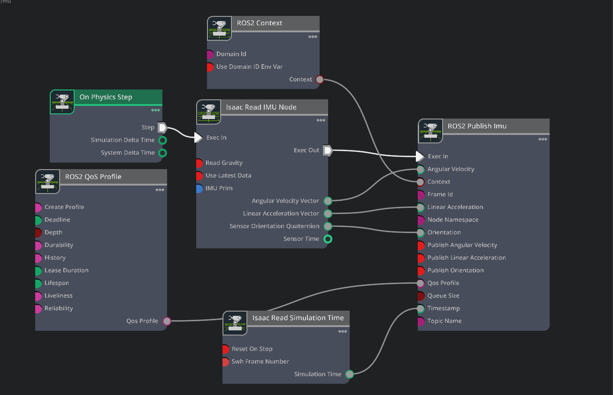

# Create IMU and OmniGraph for publishing IMU data[#](#create-imu-and-omnigraph-for-publishing-imu-data "Link to this heading")

Now that the robot’s physical properties match the Isaac Lab requirements, we can start connecting simulation data to the policy.

OmniGraph is a visual programming framework in Omniverse. We’ll leverage Action Graphs, a specific event-driven type of OmniGraph, to make this connection and provide the synthetic sensor data that the neural network needs to construct the observation data.

First, let’s set up the IMU and publish its data through ROS.

## Adding an Inertial Measurement Unit (IMU)[#](#adding-an-inertial-measurement-unit-imu "Link to this heading")

A simulated IMU sensor can publish linear acceleration, angular velocity, and orientation data. We can use the angular velocity, get linear velocity by integrating the linear acceleration, and use the orientation to compute the projected gravity vector for the observation.

### Open the Existing Action Graph[#](#open-the-existing-action-graph "Link to this heading")

We’ve already configured most of this Action Graph for you for time, but let’s take a look to understand how it’s configured.

Checkpoint

If you had any troubles with rigging the h1 asset, use the checkpoint file `h1_rigged/h1.usd`

1. Return to Isaac Sim with the **h1.usd** file we’ve been working on, or the checkpoint file mentioned above.
2. In the Stage panel, select the prim `h1/pelvis.`
3. Right click on `pelvis` prim and go to **Create > Isaac > Sensors > Imu Sensor**.
4. In the Stage panel, locate the Graph scope (folder), and expand it by clicking the “+” button.
5. Right click on the existing **ROS\_Imu** graph, and click **Open Graph**.

### Inspect the Action Graph[#](#inspect-the-action-graph "Link to this heading")

Observe the following nodes into the Action graph that uses data from the IMU.

- **On Physics Step:** This node is triggered when the Isaac Sim physics steps, and runs the entire graph.
- **ROS2 Context:** This node creates a context for the ROS2 node.
- **ROS2 QoS Profile:** This node sets the QoS (Quality of Service) profile for the ROS2 node.
- **Isaac Read IMU Node:** This node reads the IMU data from Isaac Sim.
- **Isaac Read Simulation Time:** This node reads the simulation time from Isaac Sim.
- **ROS2 Publish IMU:** This node publishes the IMU data to ROS2 using the Isaac Read IMU Node and Isaac Read Simulation Time nodes as source.

### Double Check the Following[#](#double-check-the-following "Link to this heading")

1. On the **Isaac Read IMU Node**, make sure the input **readGravity** is **unchecked**.

   1. This is to avoid reading the gravity vector from the pelvis link. This is because we only want the linear and angular velocity from the pelvis link.
2. On the Isaac Read Simulation Time node, make sure **Reset on Stop** input is **checked** to reset the simulation time when the simulation stops.

### Finish the Action Graph[#](#finish-the-action-graph "Link to this heading")

Let’s finish a few more configuration tasks for this Action Graph.

1. Select the **Isaac Read IMU Node** in the Action Graph panel.
2. In the Property panel, under Isaac Read IMU Node > IMU Prim, click **Add Target**.
3. In the popup window, choose `/h1/pelvis/Imu_Sensor`. Now the Read IMU Node will use this sensor.
4. Connect the *Step* connection of the **On Physics Step** node to the **Exec In** connection of Isaac Read IMU Node by clicking and dragging from one, to the other.

Below is a screenshot of the complete graph.

On this page
