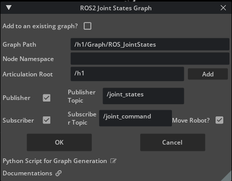
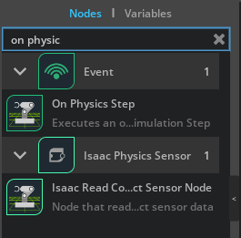
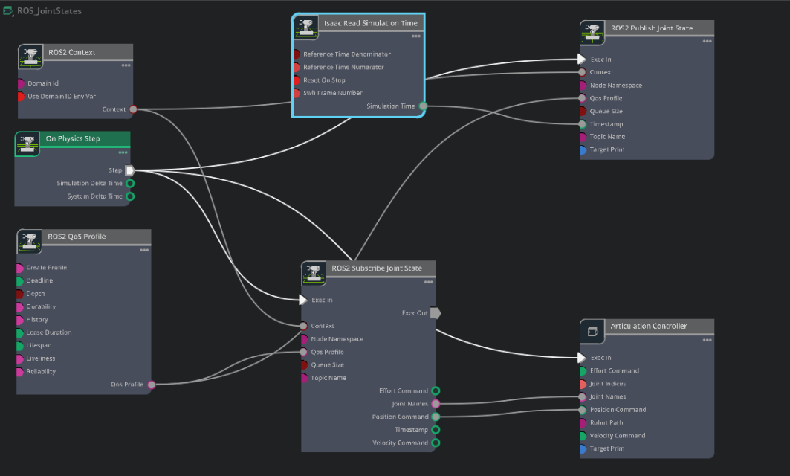

# Create Joint State Publisher and Subscriber[#](#create-joint-state-publisher-and-subscriber "Link to this heading")

A joint state publisher pushes the joint state data to ROS, the subscriber node subscribes to the action commands from the neural network and applies the command to the robot.

This is a common task, so we’ll leverage a shortcut in Isaac Sim to create this graph for us.

## Setup the Joint States Graph[#](#setup-the-joint-states-graph "Link to this heading")

1. Go to **Tools > Robotics > ROS 2 OmniGraphs > Joint States**.
2. In the popup window, set:

   1. **Graph Path** to **/h1/Graph/ROS\_JointStates to place the new graph in the existing Graph scope.**
   2. **Articulation Root** to `/h1`
   3. Ensure the **Publisher** option is checked.
   4. Ensure the **Subscriber** option is checked.
   5. Ensure the **Move Robots** option is checked.
   6. Press **OK**.

      ****
3. Select the **ROS\_JointStates** graph in the Stage panel.
4. In the Property panel, under Raw USD Properties, set the pipelineStage to **pipelineStageOnDemand.**
5. Right click on **ROS\_JointStates** and choose **Open Graph.**
6. Select and delete the **On Playback Tick** node
7. In the left side of the Action Graph UI, search for **On Physics Step** and drag this node onto the graph.

   
8. Connect the Exec node to Exec of these other nodes:

   1. ROS2 Subscribe Joint State
   2. ROS2 Publish Joint State
   3. Articulation Controller
9. Select the **Isaac Read Simulation Time** node
10. In the Property Panel, check the **Reset on Stop** input. This resets the simulation time when the simulation stops.
11. In the left side of the Action Graph UI, search for **ROS2 QoS Profile** and drag this node onto the graph.
12. Connect the QoS Profile output to both the **Publisher** and **Subscriber** node inputs.
13. Save your work by going to **Ctrl+S** or going to **File > Save**.

## Inspecting the Graph[#](#inspecting-the-graph "Link to this heading")

Observe the following nodes into the Action graph:

- **On Physics Step:** This node is triggered when the Isaac Sim physics steps, and runs the entire graph.
- **ROS2 Context:** This node creates a context for the ROS2 node.
- **ROS2 QoS Profile:** This node sets the QoS profile for the ROS2 node.
- **ROS2 Subscribe Joint States:** This node subscribes to the joint states commands from the external policy node.
- **ROS2 Publish Joint States:** This node publishes the current joint states to ROS2 from Isaac Sim
- **Isaac Read Simulation Time:** This node reads the simulation time from Isaac Sim.
- **Articulation Controller:** This node will execute the joint state commands from the Subscribe joint States node

## Review the following configuration[#](#review-the-following-configuration "Link to this heading")

These should be set up for you already, but for your reference:

- **ROS2 Publish Joint States** input Target Prim to /h1, topicName set to `/joint_states`
- **ROS2 Subscribe Joint States** input Topic Name set to `/joint_command`
- **Articulation Controller** input Target Prim to `/h1`

Checkpoint

If you had any troubles with these steps, load the completed environment checkpoint file from the course assets:  
`h1_ROS/h1_ROS.usd`

On this page
