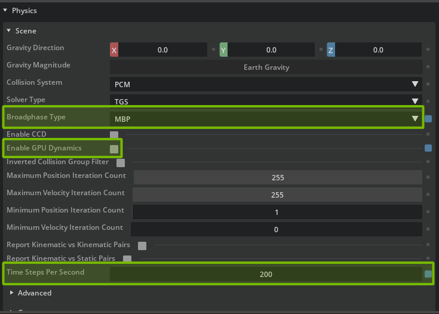
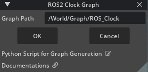
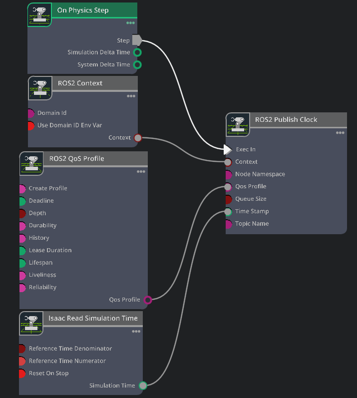

# Create Simulation Environment and Clock Publisher[#](#create-simulation-environment-and-clock-publisher "Link to this heading")

Now that the robot is set up, let’s add it into a larger simulation scenario. We’ll reference the robot, a warehouse scene, configure physics settings, and publish a ROS clock.

Tip

If you need to relaunch Isaac Sim at any point, open a new terminal and run these same commands from earlier:

```
# Source the local ROS workspace
`source ~/IsaacSim-ros\_workspaces/build\_ws/humble/humble\_ws/install/local\_setup.bash`
# Source the Isaac Sim ROS workspace
`source ~/IsaacSim-ros\_workspaces/build\_ws/humble/isaac\_sim\_ros\_ws/install/local\_setup.bash`
# Launch Isaac Sim
`~/isaacsim/\_build/linux-x86\_64/release/isaac-sim.sh --reset-user`
```

## Setup Simulation Scenario[#](#setup-simulation-scenario "Link to this heading")

### Add Warehouse as Reference[#](#add-warehouse-as-reference "Link to this heading")

1. Create a new file by going to **File > New**.
2. Go to **File > Add Reference**
3. Navigate to the course asset folder `/empty_warehouse` and locate the **`warehouse.usd`** file.
4. Click the **Add Reference** button.

### Add Humanoid as Reference[#](#add-humanoid-as-reference "Link to this heading")

5. Go to **File > Add Reference** again.
6. Locate the **h1** USD file you’ve been using, or use the checkpoint **h1\_ROS** asset.
7. Click the **Add Reference** button.
8. Select the `h1` prim in the Stage panel.
9. In the Property Panel under Set the Z transform to **1.0** so it is above the ground.

### Add and Configure Physics Scene[#](#add-and-configure-physics-scene "Link to this heading")

1. Create a Physics Scene by right clicking on the *Stage Panel* and selecting **Create > Physics > Physics Scene**.
2. Select the Physics Scene in the *Stage Panel*.
3. In the *Property* panel:

   1. Uncheck **Enable GPU Dynamics**.
   2. Set the Broadphase Type to **MBP**.
   3. Set **Time Steps Per Second** to 200.
4. Go to **File > Save** or press **Ctrl+S**.

Tip

When we are simulating very few robots, CPU physics is faster because it avoids the memory copy between CPU and GPU memory.

However when we are simulating many robots in a complex scene, GPU physics becomes significantly faster than CPU.

## Set up ROS 2 Clock Publisher[#](#set-up-ros-2-clock-publisher "Link to this heading")

### Create ROS clock[#](#create-ros-clock "Link to this heading")

1. Go to **Tools > Robotics > ROS 2 OmniGraphs > Clock**.
2. Set the Graph Path to `/World/Graph/ROS_Clock`

   
3. Select the **ROS\_Clock** graph in the *Stage* panel.
4. In the *Property* panel under Raw USD Properties, set the pipelineStage to **pipelineStageOnDemand**.
5. Right click on **ROS\_Clock** in the *Stage* panel and choose **Open Graph**.
6. Select and delete the **On Playback Tick** node
7. In the left side of the Action Graph UI, search for **On Physics Step** and drag this node onto the graph.
8. Attach the Exec output of On Physics Step to the Exec input of the **ROS2 Publish Clock** node.
9. Select the **Isaac Read Simulation Time** node
10. Check the **Reset on Stop** input of Read Simulation Time node to reset the simulation time when the simulation stops.
11. In the left side of the Action Graph UI, search for **ROS2 QoS Profile** and drag this node onto the graph.
12. Connect the QoS Profile output to both the **ROS2 Publish Clock** node’s **QoS Profile** input.
13. Go to **File > Save** or press **Ctrl+S**.

    

### Inspecting the graph[#](#inspecting-the-graph "Link to this heading")

- **On Physics Step:** This node is triggered when the Isaac Sim physics steps, and runs the entire graph.
- **ROS2 Context:** This node creates a context for the ROS2 node.
- **ROS2 QoS Profile:** This node sets the QoS profile for the ROS2 node.
- **ROS2 Publish Clock:** This node publishes the ROS2 clock to ROS2.
- **Isaac Read Simulation Time:** This node reads the simulation time from Isaac Sim.

Checkpoint

If you had any troubles with these steps, load the completed environment checkpoint file from the course assets:  
`h1_ros_locomotion_warehouse/h1_ros_locomotion_policy_tutorial.usd`

On this page
