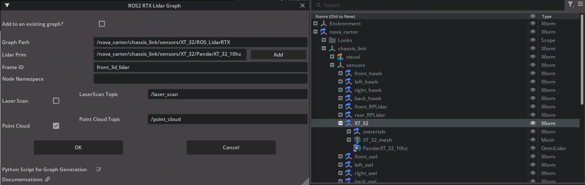
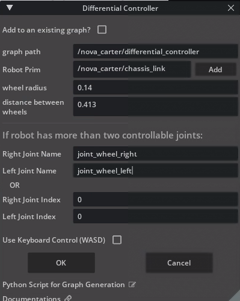
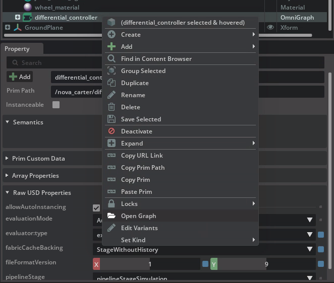
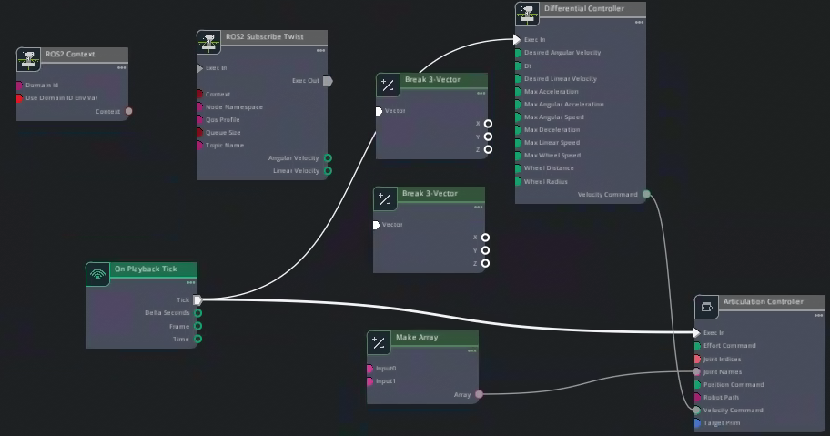
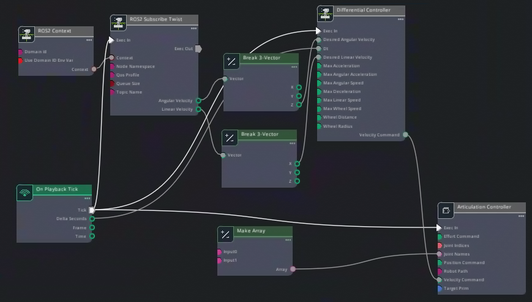
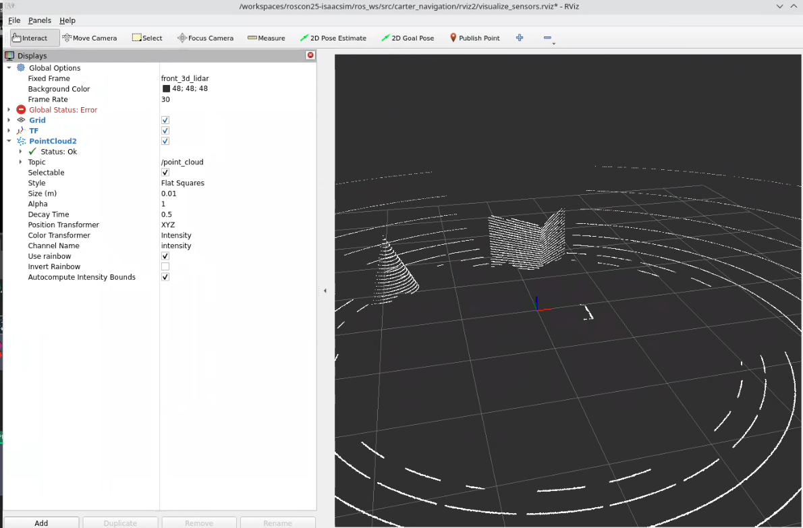

# Create ROS Graphs for Nova Carter[#](#create-ros-graphs-for-nova-carter "Link to this heading")

## Overview[#](#overview "Link to this heading")

We’re now going to focus on establishing a seamless connection between the Nova Carter robot in Isaac Sim and ROS through the creation of Action Graphs. In this module, we generate and configure several graph components that enable the robot to communicate sensor data, control commands, and state information with ROS. We use built-in shortcuts to create ROS-compatible graphs that streamline these interactions.

### Publishing a Lidar Graph[#](#publishing-a-lidar-graph "Link to this heading")

We will start by publishing the synthetic lidar pointcloud generated by Isaac Sim to ROS.

1. In Isaac Sim, go to **File > Open**
2. Open the Nova Carter robot from the course assets: `Starting_Point/nova_carter.usd`.
3. Navigate to **Tools > Robotics > ROS 2 OmniGraphs > RTX Lidar**. This shortcut simplifies the process of adding a Lidar graph.


4. In the window that appears, set the **Graph Path** to: **`/nova_carter/chassis_link/sensors/XT_32/ROS_LidarRTX`**
5. For the **Lidar Prim**, click Add and select the **PandarXT\_32\_10hz** prim at :  
   **`/nova_carter/chassis_link/sensors/XT_32/PandarXT_32_10hz`**

   - Press Select to confirm.

Note

The paths are important here, because they will be used for namespacing later.

6. Set the Frame ID to: **front\_3d\_lidar**.
7. Uncheck the box for **Laser Scan**, as it is not needed for this configuration.
8. Check the box for **Point Cloud** to enable publishing point cloud data.



9. Press **OK**.

You have successfully integrated a Lidar sensor into your simulation environment, preparing it for real-time interaction with ROS nodes in subsequent modules. Next, we’ll look at the graph we just created.

---

### Reviewing the Generated Action Graph[#](#reviewing-the-generated-action-graph "Link to this heading")

We’ve used the shortcut tool to create and configure a ROS-compatible Lidar sensor. Next, let’s take a look at the Action Graph which runs this sensor. Action Graphs are event-driven tools for visual programming.

1. Find the lidar Action Graph in the *Stage* panel: */nova\_carter/chassis\_link/sensors/XT\_32/ROS\_LidarRTX*.
2. Right-click on **ROS\_LidarRTX**, then select Open Graph.


3. Finally to complete the setup, select the **ROS2 RTX Lidar Helper** node
4. In the Property panel, set the **Reset Time On Stop** property to True.

Important

This setting is key because we would like the clock to start from 0.0 every time the simulation is reset.

4. Save your file by going to **File > Save As**. Name the file **nova\_carter\_ROS.usd** and save it under `Starting_Point` folder inside the course assets.

This graph is now ready to publish synthetic point cloud data from Isaac Sim to ROS, enabling downstream robotics applications like mapping and obstacle detection.

Let’s keep going and make the robot start moving.

---

### Create Twist Subscriber[#](#create-twist-subscriber "Link to this heading")

In this section, we will create a ROS-compatible Twist subscriber for the Nova Carter robot. This will allow the wheels to be driven through ROS messages.

1. Navigate to **Tools > Robotics > OmniGraph Controllers > Differential Controller**.

   - This tool provides a preconfigured graph for controlling differential drive robots.



In the dialog window, set the following parameters:

- Graph Path: /nova\_carter/differential\_controller
- Robot Prim: /nova\_carter.
- Wheel Radius: 0.14
- Distance Between Wheels: 0.413
- Right Joint Name: joint\_wheel\_right
- Left Joint Name: joint\_wheel\_left

2. Press **OK** to create the graph.



3. Right-click on the newly created graph in the Stage Tree and select **Open Graph**.

---

#### Adding ROS 2 Nodes to the Graph[#](#adding-ros-2-nodes-to-the-graph "Link to this heading")

Let’s build upon our Action Graph that uses a Differential Controller to move the Nova Carter robot, using messages from ROS.

1. Add the following nodes to the graph. To add nodes, use the panel on the left side of the Action Graph panel to locate them, then click and drag onto the main area of the Action Graph.

   Tip

   You can search in the Nodes panel to quickly locate desired nodes.

   - **ROS2 Context** Node
   - **ROS2 Subscribe Twist** Node
   - Two instances of the **Break 3-Vector** Node





2. Connect the node inputs and output as follows:

   - Connect the On Playback Tick output to **ROS 2 Subscribe Twist: Exec In** input.
   - Connect **ROS 2 Context: Context** output to **ROS 2 Subscribe Twist: Context** input.
   - Connect **ROS 2 Subscribe Twist Angular Velocity** output to one of the **Break 3-Vector** nodes’ inputs.
   - Connect **ROS 2 Subscribe Twist Linear Velocity** to the other **Break 3-Vector** node’s input.
   - From the Break 3-Vector nodes:

     - Connect **Z** of the node coming from *Angular Velocity* to **Desired Angular Velocity** on the Differential Controller.
     - Connect **X** of node coming from *Linear Velocity* to **Desired Linear Velocity** on the Differential Controller.
   - Connect *On Playback Tick’s* **Delta Seconds** output to **Dt** input on the Differential Controller.
3. Ensure that the output array names for left and right wheels match your robot’s configuration. Select the **Make Array** node and look in the *Property panel* for *Construct Array Node > Inputs*. Compare with the image below.


4. Save your work.

This setup allows Nova Carter to interpret Twist messages from ROS and convert them into physical motion within Isaac Sim.

#### **Verify connections**[#](#verify-connections "Link to this heading")

Let’s run a quick test to verify the Action Graphs work as expected.

Before running any commands, ensure that the `ROS_DOMAIN_ID` environment variable is set.

```
export ROS\_DOMAIN\_ID=42 # Replace number with your own station number
```

1. Run teleop\_twist\_keyboard node to verify robot moves:

```
source /opt/ros/humble/setup.bash
ros2 run teleop\_twist\_keyboard teleop\_twist\_keyboard
```

2. In another terminal, open RViz2 to visualize the lidar sensor data.

```
source /opt/ros/humble/setup.bash
# cd into the course materials folder
rviz2 -d sim\_control\_script\_and\_carter\_ws/ros\_ws/src/carter\_navigation/rviz2/visualize\_sensors.rviz
```



#### Verify Functionality[#](#verify-functionality "Link to this heading")

1. Press the **Play** button in Isaac Sim to activate the publisher.
2. Open a ROS-sourced terminal and run the following command:

```
ros2 topic list
```

3. Confirm that **/joint\_states** is listed among the available topics.

By completing this section, you have successfully set up a Joint State Publisher for Nova Carter, enabling seamless communication of its joint states with ROS.  
Remember to save the robot file.

---

## Review[#](#review "Link to this heading")

In this module, we successfully created and configured ROS Action Graphs for the Nova Carter robot, including the Lidar graph, Twist subscriber, and Odometry publisher, Joint state publisher. These graphs enable Nova Carter to interact with ROS by publishing sensor data, receiving motion commands, and sharing odometry information.

With these foundational components in place, Nova Carter is now ready to perform advanced tasks such as navigation and mapping in subsequent modules.

Let’s move forward and continue building on this solid groundwork!

Checkpoint 1

The robot file should now be saved.

The backup robot file is located in the course assets folder under: `/Backup/nova_carter_ROS.usd`.

If you need to use the backup robot USD file, copy and replace it into the Starting Point folder at: `Starting_Point/nova_carter_ROS.usd`.

On this page
