# Set Up Additional ROS Features[#](#set-up-additional-ros-features "Link to this heading")

## Robot Automatic Namespacing[#](#robot-automatic-namespacing "Link to this heading")

### Overview[#](#overview "Link to this heading")

We will first add a namespace to the robot file.  
We will then open an environment and add our nova carter robots to complete the scene.

### Add lidar namespace to Nova Carter[#](#add-lidar-namespace-to-nova-carter "Link to this heading")

Note: If you are using the backup robot asset, this section is already completed.

Now we can add an automatic namespace attribute to the 3d lidar inside the nova carter robot. This will namespace the **/point\_cloud** topic with the lidar name.

1. Open **nova\_carter\_ROS.usd** if you don’t already have it open (this is the file we’ve been working in).
2. Select the XT\_32 prim located at **/nova\_carter/chassis\_link/sensors/XT\_32**.
3. Right click on the prim, then select **Add > Isaac > Namespace**

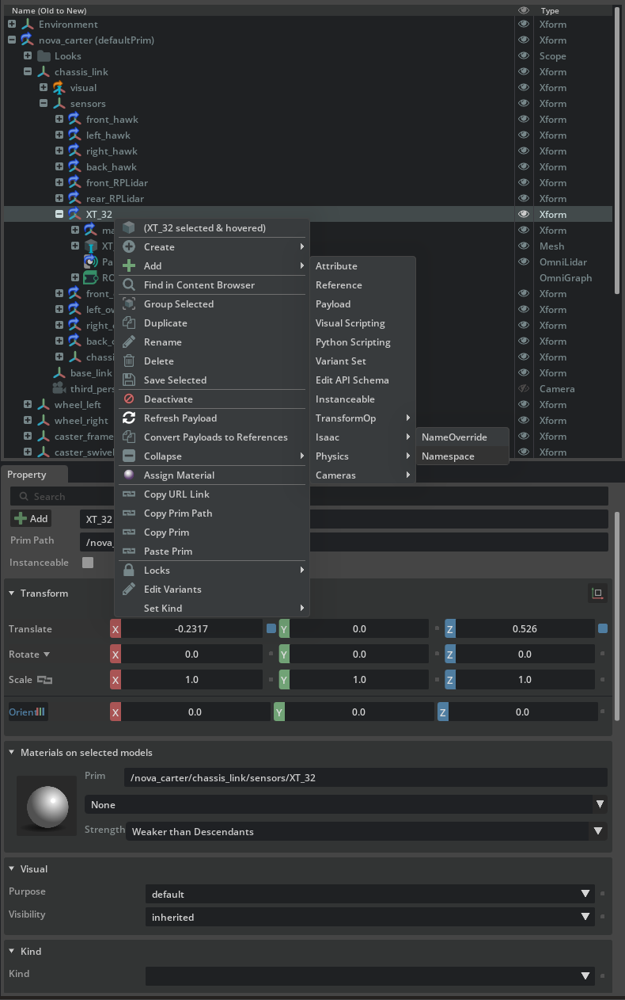

4. In the property panel, find the Namespace field and update the namespace to **xt\_32.** (Note the lower case of “xt” to match conventions for ROS topics)

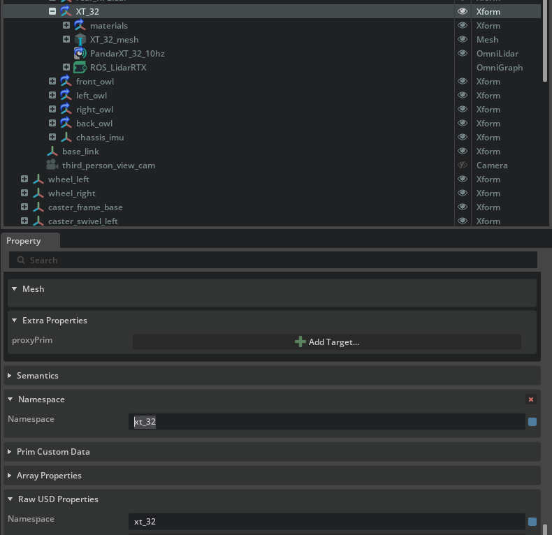

5. Save the robot file.

#### Verify Functionality[#](#verify-functionality "Link to this heading")

1. Press the **Play** button in Isaac Sim to activate the publisher.
2. Open a ROS-sourced terminal and run the following command:

```
ros2 topic list
```

If you do not see an output, ensure that the `ROS_DOMAIN_ID` environment variable is set and try again.

```
export ROS\_DOMAIN\_ID=42 # Replace number with your own station number
```

3. Confirm that **/xt\_32/point\_cloud** has replaced the older **/point\_cloud** topic is listed among the available topics.

---

## Automatic Namespacing[#](#automatic-namespacing "Link to this heading")

### Overview[#](#id1 "Link to this heading")

Here we will manually set up the scene to perform multi robot navigation. In later modules of the workshop we will use Simulation Interfaces to load the scene, spawn robots and other props and run through a fun scenario!

### Add a Nova Carter #1 Into Warehouse Test Scene[#](#add-a-nova-carter-1-into-warehouse-test-scene "Link to this heading")

1. From the course assets, open `Starting_Point/warehouse_test_scene.usd`
2. Drag and drop your nova carter asset to the warehouse env. `Starting_Point/nova_carter_ROS.usd`
3. Rename the robot prim name to **nova\_carter\_ROS\_1**.
4. Select the prim and set the value of the transform to:

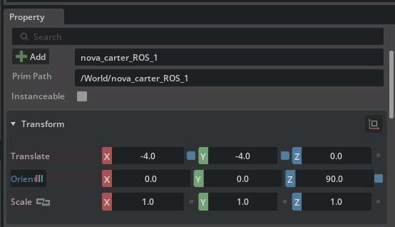

#### Create Auto Name Space attribute[#](#create-auto-name-space-attribute "Link to this heading")

Now we can add the overall namespace attribute to the nova carter robot. This ensures that all ROS topics and services associated with the robot are properly namespaced, preventing conflicts when working with multiple robots or systems.

1. Select the **/World/nova\_carter\_ROS\_1** prim.
2. Right click on the prim, then select **Add > Isaac > Namespace**

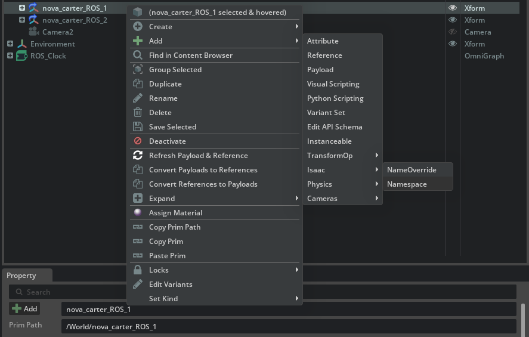

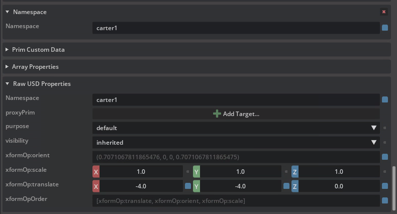

1. In **Raw USD Properties** within the *Property* panel, locate the newly added *isaac:namespace* attribute.
2. Set its value to **carter1**.
3. Save your changes.
4. Press the Play button in Isaac Sim to activate the simulation.

#### Verify Namespaced Topics[#](#verify-namespaced-topics "Link to this heading")

1. Open a ROS-sourced terminal and run:

```
ros2 topic list
```

2. Verify that all Nova Carter-related topics are now prefixed with **/carter1**. You should see output similar to:

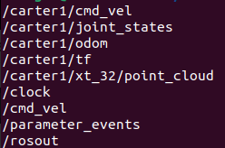

### Setting up automatic namespacing for Carter 2[#](#setting-up-automatic-namespacing-for-carter-2 "Link to this heading")

1. Duplicate nova\_carter\_ROS\_1 and rename robot prim to **nova\_carter\_ROS\_2**.
2. Set the value of the transform to:

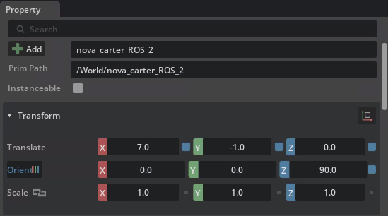

3. In **Raw USD Properties** within the *Property* panel, locate the newly added *isaac:namespace* attribute.
4. Set its value to **carter2**.
5. Save your changes.
6. Press the Play button in Isaac Sim to activate the simulation.

#### Verify Namespaced Topics[#](#id2 "Link to this heading")

1. Open a ROS-sourced terminal and run:

```
ros2 topic list
```

2. Verify that all Nova Carter-related topics are now prefixed with **/carter2**. You should see output similar to:

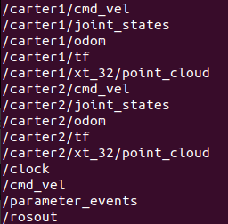

## Setup Environment - Analyze the Environment[#](#setup-environment-analyze-the-environment "Link to this heading")

### Overview[#](#id3 "Link to this heading")

In this module we will analyze the props and other ROS graphs in the environment scene.

### Clock Publisher[#](#clock-publisher "Link to this heading")

1. Right-click on the ROS\_Clock graph in the Stage Tree and select **Open Graph**.
2. The graph should resemble the following:

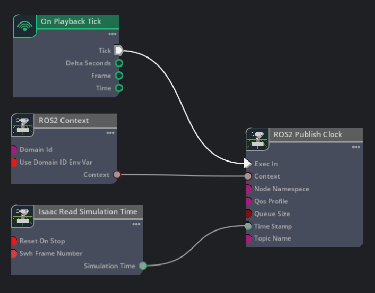

The **ROS 2 Publish Clock** OmniGraph node publishes simulation time that is fed in from the **Isaac Read Simulation Time** OmniGraph node. The **ROS 2 Context** OmniGraph node passes in the context while the **On Playback Tick** OmniGraph node executes the publisher every frame.

### Demo Tables[#](#demo-tables "Link to this heading")

Let’s take a look at where the tables are located. In later modules, we’ll spawn these demo tables and cubes as well as other helper robots that will be used to push the cube into the nova carter’s front bin, all using Simulation Interfaces.

1. Notice the following transform for /World/Demo\_table\_1:

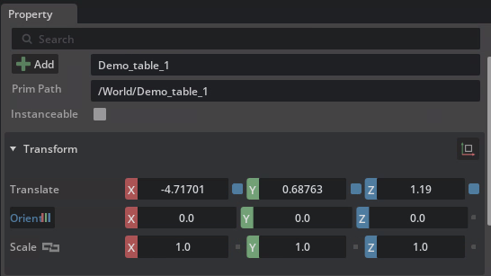

2. Notice the following transform for /World/Demo\_table\_2:

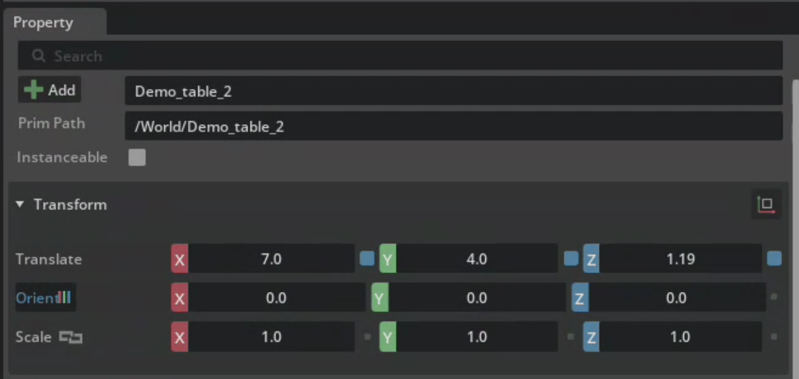

## Review[#](#review "Link to this heading")

We looked at the clock ROS graph and noticed where the cubes are located.

Checkpoint 2

At this checkpoint, the full Environment is ready to be used.

The backup scene USD file is located in the course assets folder at `/Backup/warerhouse_test_scene.usd`.

If you need to use the backup robot USD file, copy and replace it into the Starting Point folder at: `Starting_Point/warerhouse_test_scene.usd`.

On this page
