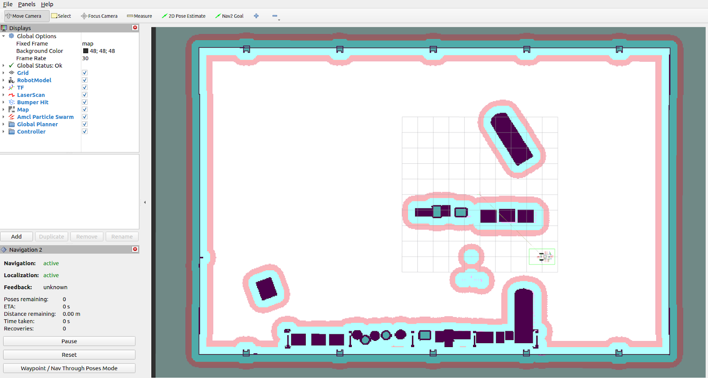
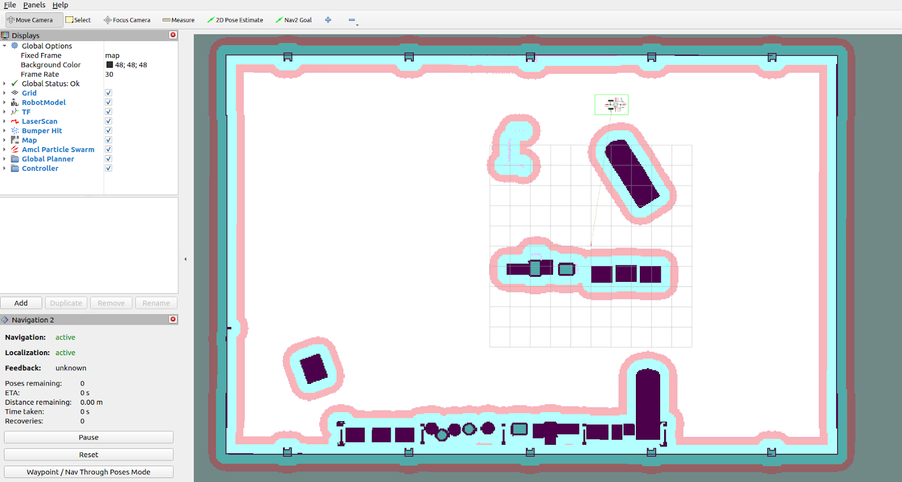

# Autonomous Navigation With Nav2[#](#autonomous-navigation-with-nav2 "Link to this heading")

## Overview[#](#overview "Link to this heading")

Throughout this lab, you’ve configured and tested key components for Nova Carter instances and prepared a shared simulation environment. In this module, we’ll bring everything together by setting up autonomous navigation using the Nav2 stack. By the end of this module, Nova Carter will be able to navigate the environment autonomously, completing the foundation for multi-robot collaboration.

### Sourcing your workspace[#](#sourcing-your-workspace "Link to this heading")

It is important to source your workspace so that all packages can be found by ROS. Make sure to source your workspace each time you open a new terminal for the remainder of this lab.

```
source ~/.bashrc
source sim\_control\_script\_and\_carter\_ws/ros\_ws/install/setup.bash
export ROS\_DOMAIN\_ID=42 # Replace number with your own station number
```

#### Running the Nav Stack[#](#running-the-nav-stack "Link to this heading")

1. Press the **Play** button in Isaac Sim to activate the manual test scene that you created earlier.
2. Open a new terminal and source your ROS workspace:

```
source ~/.bashrc
source sim\_control\_script\_and\_carter\_ws/ros\_ws/install/setup.bash
export ROS\_DOMAIN\_ID=42 # Replace number with your own station number
```

3. Start **Nav2** for multi robot simulation for both Nova Carters by running the following command in the same terminal.

```
export ROS\_DOMAIN\_ID=42 # Replace number with your own station number
ros2 launch carter\_navigation multiple\_robot\_carter\_navigation\_warehouse.launch.py
```

Carter 1 Navigation



Carter 2 Navigation



You should see two RVIZ windows that look like the above. The white areas means free space, the dark areas means obstacles that the robot needs to avoid. The pink and blue areas are regions with low and high costs to discourage the robot from going there to avoid potentially colliding with the environment

4. Now, left click on **Nav2 Goal** at the top of the RViz UI to set the target position and orientation of the robot. The robot should begin moving towards the goal!

Tip

If you can’t see the robot in RViz, make sure Isaac Sim is playing.

Tip

To watch the Carter robot from different vantage points:  
In Isaac Sim’s Viewport, switch cameras to the “third\_person\_view\_cam” or one of the other cameras mounted to the Carter robot while it’s moving.

5. To stop the command, select the terminal running the command and press **CTRL+C** just once.

Important

Ensure the Nav stack is stopped before moving on.

## Review[#](#review "Link to this heading")

By completing this section, you have successfully configured and run the Nav2 stack for Nova Carter, enabling autonomous navigation within the simulation environment.

On this page
