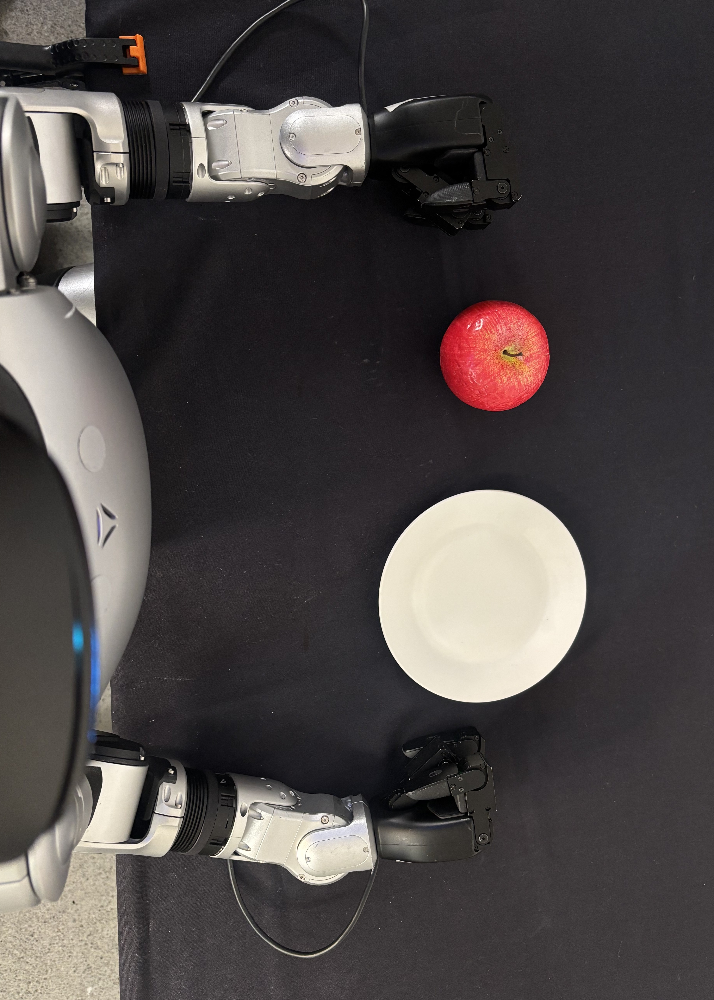
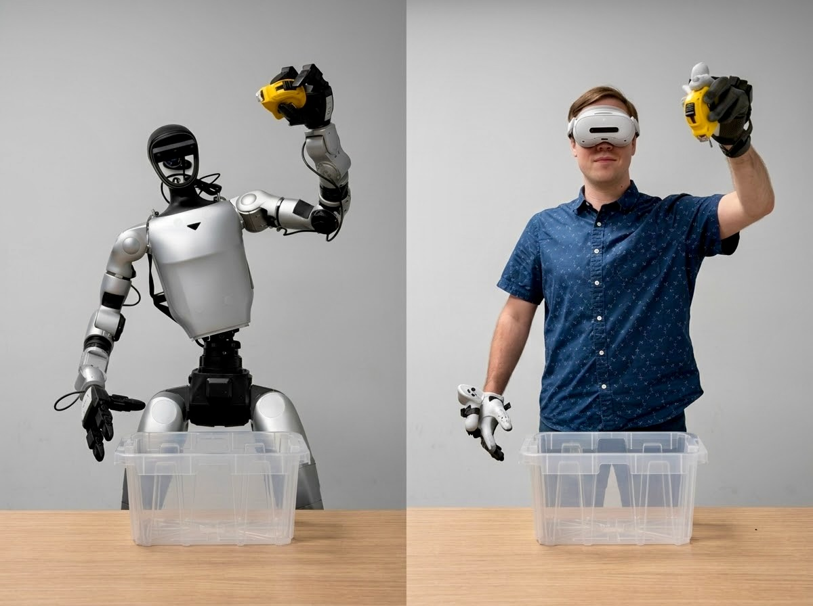
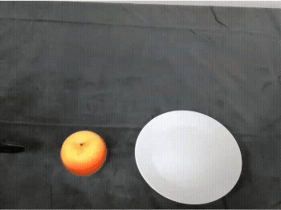

# Concepts Overview[#](#concepts-overview "Link to this heading")

## Overview[#](#overview "Link to this heading")

This section covers the core concepts of the GR00T reference workflow.

This **reference workflow** packages supported models, libraries, frameworks, and a task into a single reproducible workflow for the Unitree G1 humanoid robot.

## What Is the GR00T Reference Workflow[#](#what-is-the-gr00t-reference-workflow "Link to this heading")

The GR00T reference workflow is a structured workflow for Unitree G1 humanoid robot policy learning, spanning from simulation to real hardware.

It targets engineers who need to understand:

- each stage of the pipeline
- how those stages connect for a specific manipulation task
- how to perform the workflow in practice

The workflow also serves as an end-to-end blueprint, not a fixed product stack that every team must adopt unchanged. Its modular design lets robotics teams use the full platform or integrate selected capabilities into existing development pipelines, helping them scale humanoid development without rebuilding the same infrastructure for each robot or task.

Robotics teams can start from validated development workflows, then adapt them for their own tasks, sensors, and humanoid configurations.

The architecture diagram illustrates how each component in the reference workflow connects, from setup to deployment.[#](#id1 "Link to this image")

### What End-to-End Means[#](#what-end-to-end-means "Link to this heading")

Here is a high-level overview of what this workflow covers:

In this course, **end-to-end** refers to all major stages required to build a humanoid manipulation policy for a task, starting in simulation and ending on the real robot.

1. **Environment setup** establishes the software stack, task assets, robot embodiment, sensors, and workspace within a simulation environment.
2. **Teleoperation and data collection** records demonstrations in simulation or on the real robot.
3. **Data conversion** transforms demonstrations into LeRobot-format datasets.
4. **GR00T Vision-Language-Action (VLA) post-training** fine-tunes a GR00T policy for the apple pick-and-place task from collected demonstrations.
5. **Evaluation in simulation** measures the policy in Isaac Lab-Arena before hardware deployment.
6. **Deployment on G1** packages and runs the post-trained VLA policy on the physical robot.

Conceptually, the reference workflow follows a sim-first to deployment flow for a given task. Each stage still needs clear validation.

Warning

A weak dataset, incorrect action mapping, unstable controller, or unrepeatable workspace can break the pipeline even if the surrounding tools are connected correctly.

### How Humanoid Robots Learn Tasks[#](#how-humanoid-robots-learn-tasks "Link to this heading")

In this workflow, humanoid robots learn manipulation tasks by combining demonstrations, perception, robot state, control, and policy learning.

A human operator demonstrates the desired behavior through teleoperation. The system records what the robot sees, where its body is, and which actions move the task forward. GR00T then fine-tunes a vision-language-action (VLA) policy on those demonstrations.

Humanoid manipulation adds another challenge because the robot must move its arms and hands while staying balanced. A standing humanoid must solve manipulation and stability at the same time, unlike a robotic manipulator arm with a fixed base.

GR00T Whole-Body Control (WBC) supports multiple controller options. AGILE is currently the recommended default for the GR00T end-to-end workflow.

In this workflow, AGILE is the baseline whole-body controller for standing and balance only, so the operator or learned policy **can focus on upper-body task execution**.

#### The Task: Apple Pick-and-Place[#](#the-task-apple-pick-and-place "Link to this heading")

In the target task for this course, the Unitree G1 stands at a table, picks up an apple, and places it on a plate.

#### Why This Task[#](#why-this-task "Link to this heading")

The apple pick-and-place task exercises the full workflow without requiring complex multi-step reasoning. The task requires:

- Stable standing and balance during reaching
- Visual identification of the apple and plate
- Coordinated arm and hand motion for grasping
- Whole-body adjustment during the transfer
- Release on the target

This task is intentionally bounded. It is complex enough to exercise perception, teleoperation, whole-body control, policy training, evaluation, and deployment, but simple enough to debug stage by stage.

With the big picture in place, the following sections examine each stage of the workflow in detail.

## Environment Setup[#](#environment-setup "Link to this heading")

### Everything in Its Place[#](#everything-in-its-place "Link to this heading")

First, configure the robot and establish a workspace in both simulation and the real world.

Before collecting data, training a model, or evaluating a policy, the workflow requires a consistent task definition and a repeatable execution environment.

### Simulation Setup[#](#simulation-setup "Link to this heading")

In simulation, environment setup involves:

- Configuring Isaac Lab-Arena
- Defining the evaluation task
- Registering the robot embodiment
- Adding task objects
- Setting up observation and action spaces

#### What Is Isaac Lab-Arena[#](#what-is-isaac-lab-arena "Link to this heading")

[Isaac Lab-Arena](https://developer.nvidia.com/isaac/lab-arena) is an open-source framework built on NVIDIA Isaac Lab for rapidly creating, managing, and evaluating large-scale embodied AI tasks with modular components, rich task variation, and scalable benchmarking tools.

This lets you define tasks from reusable pieces instead of creating each environment from scratch. It also supports GPU-accelerated evaluation across many simulated rollouts, task variations, objects, and environments.

#### Bringing in New Assets[#](#bringing-in-new-assets "Link to this heading")

Bringing in new assets means adding task objects, robot configurations, scene elements, and observation sources in a way that the rest of the pipeline can consume. The asset setup must support the simulation task and the data schema used later for training.

The goal is not to make simulation and reality identical. The goal is to make each path explicit, inspectable, and repeatable so you can debug failures at the right layer.

### Real-Robot Setup[#](#real-robot-setup "Link to this heading")

For the real robot, environment setup involves:

- Validating workstation hardware
- Confirming robot connectivity
- Checking camera placement
- Controlling lighting
- Setting workspace boundaries
- Placing objects in the work area

A small physical change can alter the data distribution, so the workspace needs to stay repeatable across collection and evaluation.

## Data Collection[#](#data-collection "Link to this heading")

High-quality demonstration data is necessary for training robust robot policies. This course uses teleoperation to collect demonstrations.

### Teleoperation[#](#teleoperation "Link to this heading")

Teleoperation is the most common way to collect this task data. A human expert performs the task while the system records demonstrations for [imitation learning](https://www.nvidia.com/en-us/glossary/imitation-learning/).

Humanoids require more sophisticated teleoperation systems to capture the full range of motion required for complex tasks.

Humanoid tasks usually require upper-body control so that the operator can demonstrate reaching, grasping, and placement behavior.

In this workflow, teleoperation is scoped to the device and control paths described in the instructions, such as a PICO headset with inverse kinematics (IK) and AGILE for standing and balance.

Because human and robot limbs differ in proportion, joint limits, and reachable configurations, teleoperation needs a step called **retargeting**. A retargeting layer maps human motion into commands the robot can physically execute.

Tips for Successful Teleoperation

High-quality demonstrations matter more than raw volume. Keep successful episodes, discard failed or interrupted attempts, and vary object placement within the task’s valid range. Consistent pacing also matters because long pauses, abrupt corrections, or inconsistent grasp timing can create confusing action labels for post-training.

Learn More About XR Devices for Teleoperation

A good way to capture this type of teleoperation data is using extended reality (XR) devices like the PICO 4 Ultra, Meta Quest 3, and Apple Vision Pro headsets.

Learn More About Other Teleoperation Methods

Very simple tasks and robot embodiments can use a keyboard or gamepad by sending velocity or joint-position commands. These devices provide limited degrees of freedom for dexterous tasks.

Leader-follower systems, such as the popular SO-101 robot, can provide more natural control by letting the human expert physically move a leader arm while the follower arm mirrors those motions.

#### Tools for Collecting Data[#](#tools-for-collecting-data "Link to this heading")

This workflow uses three primary tools:

- **Isaac Teleop** for teleoperation and recording
- **Isaac Lab-Arena** for simulation-side task execution
- **AGILE** as the recommended default GR00T WBC controller for standing and balance

### Isaac Teleop[#](#isaac-teleop "Link to this heading")

[NVIDIA Isaac Teleop](https://nvidia.github.io/IsaacTeleop/main/index.html) is a teleoperation platform for high-fidelity data collection.

It provides a standardized device interface for XR headsets and peripherals, a retargeting pipeline, and a data schema for MCAP recording.

In simulation, Isaac Teleop capabilities integrate with Isaac Lab-Arena and can use CloudXR to stream the simulated environment to the demonstrator’s XR headset in real time. This enables immersive teleoperation from a first-person view.

On the real robot, Isaac Teleop records live robot and sensor streams for downstream conversion.

A key benefit is consistency across simulation and real-robot collection. Isaac Teleop and Isaac Lab-Arena use shared concepts for device interfaces, retargeting, and recording schemas, which reduces the amount of rework needed when moving from simulated teleoperation to physical robot data collection.

#### Using AGILE With Teleoperation[#](#using-agile-with-teleoperation "Link to this heading")

Teleoperating a humanoid robot like the G1 is difficult because the operator needs to control arms, hands, torso, legs, and balance at the same time.

AGILE enables the robot to stand on its own, allowing the operator to focus on fewer axes of motion during teleoperation.

**AGILE** is the baseline whole-body control component for standing and balance in the G1 workflow.

When integrated with the teleoperation stack, AGILE manages standing and balance while the operator manages upper-body manipulation through XR teleoperation.

In this course, the key architectural idea is **decoupled whole-body control**. AGILE provides the standing and balance baseline, while upper-body degrees of freedom remain available for inverse kinematics or vision-language-action manipulation policies.

## Data Conversion[#](#data-conversion "Link to this heading")

For both simulation and real-world collection, convert the data to a correctly mapped format. If observations, robot state, or actions are mapped incorrectly, training quality drops or completely fails, even when the files appear structurally valid.

Different formats serve different priorities. At teleoperation time, the system requires fast recording, data recovery, and efficient replay.

LeRobot dataset format is a standardized, machine-learning-optimized format designed specifically for training robot learning models, while MCAP serves as a general-purpose recording format for heterogeneous robotics data.

The key difference lies in their intended use cases. **MCAP excels at data capture, while LeRobot excels at training and sharing models.**

### LeRobot Standardization[#](#lerobot-standardization "Link to this heading")

This workflow standardizes on the [Hugging Face LeRobot dataset schema](https://huggingface.co/docs/lerobot/lerobot-dataset-v3) because it stores episodes as observations, robot state, and actions in a structure that aligns with GR00T training (vision-language-action).

Simulation and real-world collection use different recording formats:

| Source | Recording Format | Conversion Path |
| --- | --- | --- |
| Simulation with Isaac Lab-Arena | HDF5 | HDF5 to LeRobot |
| Real robot with Isaac Teleop | MCAP | MCAP to LeRobot |

### For Simulation: HDF5 to LeRobot Conversion[#](#for-simulation-hdf5-to-lerobot-conversion "Link to this heading")

For simulation data, Isaac Lab-Arena records demonstrations as **HDF5** files.

These files contain joint states, end-effector poses, RGB images, and action labels. A LeRobot converter transforms these HDF5 recordings into the LeRobot dataset format by mapping simulation-specific fields to the standardized schema.

### For the Real-Robot: MCAP to LeRobot Conversion[#](#for-the-real-robot-mcap-to-lerobot-conversion "Link to this heading")

For real-world data collection, Isaac Teleop records demonstrations in MCAP (“em-cap”), an open-source container format designed for multimodal robotics logging. MCAP files serialize sensor streams, robot commands, and camera feeds with timestamps and optional compression.

Learn More About MCAP Recording

MCAP is designed for multimodal robotics logging. It can store camera streams, robot state, and commands in a single time-indexed file. MCAP uses efficient binary serialization and supports optional compression, such as LZ4 or Zstandard, which helps with real-time recording where write speed and storage efficiency matter.

The system captures real robot demonstrations as live sensor streams across multiple ROS 2 topics, including camera feeds, joint states, wrist force-torque readings, and teleoperation commands. These streams may arrive asynchronously and at different frequencies. A ROS 2 bag records that live stream to disk, and modern ROS 2 systems can store those bag files in MCAP format.

The MCAP-to-LeRobot converter extracts, synchronizes, and restructures this data into the LeRobot schema.

After conversion, LeRobot-format datasets can also be pushed to the Hugging Face Hub for sharing, reuse, and direct access from training workflows.

## Post-Training a Policy[#](#post-training-a-policy "Link to this heading")

After collecting and converting demonstration data into the LeRobot dataset format, the next step is to post-train a policy.

Post-training starts from a pretrained GR00T 1.7 foundation model and adapts it to the target task and robot embodiment through imitation learning.

### VLA Inputs and Outputs[#](#vla-inputs-and-outputs "Link to this heading")

GR00T 1.7 is a vision-language-action model. It takes visual information, language instructions, and robot state as inputs, then outputs actions for the robot to execute.

| Category | Role in Training |
| --- | --- |
| **Vision inputs** | RGB images from one or more cameras mounted on or around the robot, such as wrist cameras or head cameras |
| **Language inputs** | A natural language instruction, such as `move the apple to the plate` |
| **Robot state inputs** | The current proprioceptive state of the robot, including joint positions, joint velocities, and end-effector pose |
| **Action outputs** | A sequence of joint position targets or action chunks for the controller to execute |

GR00T uses action chunking, which means the model predicts a short horizon of future actions at once instead of a single next action. This can improve temporal consistency and smoothness during execution.

The LeRobot dataset schema is organized around the same structure:

- `observation.images`
- `observation.state`
- `action`

That alignment is why format unification during data conversion matters.

### Set Up a New Embodiment[#](#set-up-a-new-embodiment "Link to this heading")

Because GR00T 1.7 was pretrained on specific robot hardware, adapting it to a new embodiment requires describing the robot’s physical configuration and data layout. This ability to work across new embodiments is one of GR00T’s key features.

This involves:

- **Defining the action space** by specifying which joints are controlled and what ranges are valid.
- **Configuring the observation space** by specifying camera count, camera resolution, and how robot state fields map to the model’s expected inputs.
- **Running embodiment fine-tuning** by post-training on collected demonstrations so the model adapts to the robot’s morphology, dynamics, and task context.

The GR00T training scripts use configuration files to declare the embodiment’s sensor and actuator layout.

Tips for Post-Training

Before launching post-training, verify the:

- foundation model checkpoint
- training schedule
- output location for logs and checkpoints

The checkpoint defines the pretrained GR00T 1.7 model you start from. The training schedule controls how long the model trains on the dataset. The output directory stores checkpoints, metrics, and logs for later evaluation.

During training, monitor health signals early. Verify that:

- loss starts moving in the expected direction
- GPU memory usage is stable
- validation loss does not diverge immediately
- action prediction error is within a reasonable range

This helps catch dataset mapping errors or configuration issues before spending unnecessary compute.

### Hyperparameters to Tune[#](#hyperparameters-to-tune "Link to this heading")

Hyperparameters are settings that control how training is performed. For GR00T post-training, the key hyperparameters include:

| Hyperparameter | Why It Matters |
| --- | --- |
| **Learning rate** | Controls how aggressively the model updates during training. Too high can overwrite the pretrained prior. Too low can prevent adaptation. |
| **Batch size** | Controls how many demonstration steps are processed per training update. Larger batches can stabilize gradients but require more GPU memory. |
| **Number of training steps** | Controls training duration. Too many steps with limited data can cause overfitting. |
| **Action chunk size** | Controls how many future actions the model predicts at once. Larger chunks can improve smoothness but reduce reactivity. |
| **Dataset mixing ratio** | Controls sampling frequency when using more than one dataset source. |

The resulting artifact is a post-trained GR00T policy checkpoint.

## Preparing Trained Models for Real-Robot Deployment[#](#preparing-trained-models-for-real-robot-deployment "Link to this heading")

In simulation, Isaac Lab-Arena can evaluate a trained GR00T checkpoint directly. The real-robot path requires an additional export step.

A training checkpoint is built for training flexibility, not real-time robot execution. It preserves training-time framework behavior that helps during fine-tuning but adds unnecessary overhead during deployment. On the G1, the policy must run as part of a low-latency inference pipeline that handles:

- **Preprocessing** robot observations
- **Running GR00T inference**
- **Postprocessing** predicted actions for the robot controller

LEAPP, or **Lightweight Export Annotations for Policy Pipelines**, packages that pipeline for deployment. It traces the annotated GR00T policy pipeline, exports the model stages, and produces a deployment descriptor that tells the robot software stack how data flows through preprocessing, inference, and postprocessing.

Note

This export step applies only to the real-robot path. Simulation evaluation uses the trained checkpoint directly in Isaac Lab-Arena.

The detailed export commands, validation steps, and output checks appear later in the real-robot workflow.

## Inference and Evaluation[#](#inference-and-evaluation "Link to this heading")

Training produces a policy, but a trained policy does not guarantee strong task performance. The next step is to measure how well the policy performs in simulation and on the real robot. Learning and performing well are different milestones.

Determine policy success by running **inference** to generate actions during test trials, then using **evaluation** to measure task performance.

**Inference** is the process of running a trained policy in an environment. The policy receives live observations and produces actions. In this workflow the model is a VLA, so at each step it perceives the scene and decides what action to take next. Model weights are frozen at this point, so no additional learning happens.

**Evaluation** is the process of combining inference with measurement. Run the policy against many trials and track its success in objective terms.

Start by evaluating in simulation where failure is cheap and iteration is fast. Automation is straightforward because simulation exposes the full state of the world. After validating in simulation, evaluate on the real robot as the hardware validation point.

### Simulation: Isaac Lab-Arena[#](#simulation-isaac-lab-arena "Link to this heading")

Simulation evaluation acts as a validation gate before deploying on the real robot. Isaac Lab-Arena provides a controlled environment with parallel rollouts, instant resets, task randomization, and safe failure.

The same task environment used for data collection also supports evaluation. Isaac Lab-Arena spawns the robot, sets up the scene, and feeds simulated observations to the policy.

**A low task success rate in simulation is a strong signal that the policy is not ready for hardware testing.**

Because simulation trials can be repeated quickly, you can use evaluation results to identify failure modes, refine the training setup, add demonstrations, and re-evaluate.

Evaluation is also a decision point. Use the results to determine whether the policy meets the target success rate, whether failures cluster around a specific task phase, and whether the failures are safe enough to continue testing. If the policy misses the apple, drops the object, places off target, or destabilizes the robot, return to data collection, dataset validation, or training configuration before moving forward.

### Real-Robot: Running on Edge[#](#real-robot-running-on-edge "Link to this heading")

After validating the policy in simulation, move to hardware evaluation on the real robot.

On the real robot, inference runs on **edge compute**. In this course, that means deploying the LEAPP-exported policy pipeline on Jetson Thor and connecting it to live robot sensor and actuator streams through the robot software stack.

At each timestep, the robot’s cameras and joint encoders feed observations into the pipeline. The policy predicts the next action chunk, and the system sends commands to the low-level controller for execution.

The policy inference must run at the frequency required to control the robot in real time, on hardware with limited memory and compute compared to a training machine.

Real-robot evaluation measures whether the policy completes the apple pick-and-place task while the G1 remains stable and within operational limits. It is the hardware validation point for the real-robot path.

For this course, a successful real-robot evaluation should show that the policy can:

- Identify the apple and target plate
- Reach and grasp the apple
- Move the apple to the plate
- Release the apple on the target
- Maintain stable standing behavior
- Complete the task without a safety abort

**Real-robot evaluation is the ultimate test of the end-to-end workflow**.

Success here means the post-trained policy can execute the apple pick-and-place task on the physical G1 under the tested workspace, hardware, and safety conditions.

## Conclusion[#](#conclusion "Link to this heading")

This module covered how the major pieces of the GR00T reference workflow fit together.

- Isaac Lab-Arena supports simulation task setup and evaluation.
- Isaac Teleop supports demonstration collection.
- AGILE, one controller option provided by GR00T WBC, provides the baseline controller for standing and balance during teleoperation and policy execution.
- LeRobot conversion prepares data for training.
- GR00T fine-tuning adapts a VLA policy to the task and embodiment.
- LEAPP prepares the real-robot deployment pipeline.

Now that you have this mental model, verify prerequisites and set up the environment so you can start the hands-on modules.

## What’s Next[#](#what-s-next "Link to this heading")

Proceed to [Agent Skills](agents.html) to explore the optional agent skills for troubleshooting, tutoring, and working through the rest of this course.

---

On this page
