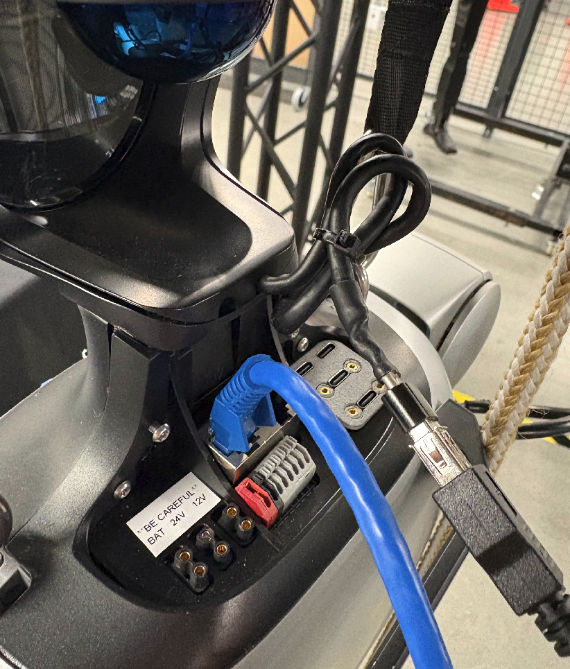
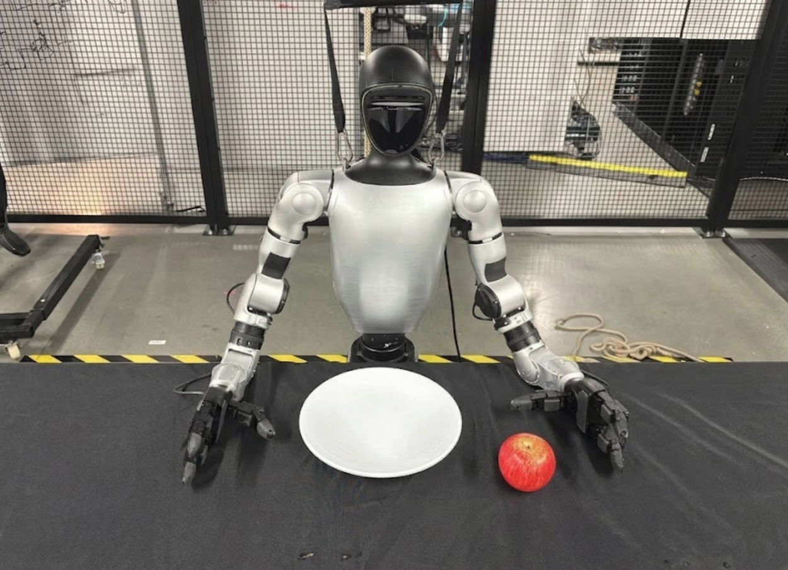

# G1 Introduction and Safety[#](#g1-introduction-and-safety "Link to this heading")

Before working with the physical Unitree G1, review the workflow-specific safety checkpoints that apply to teleoperation, data recording, and policy deployment.

Important

This course is a workflow guide, not an operating guide for the Unitree G1.

Use the manufacturer’s documentation and your organization’s robot safety procedures for robot operation, stop and abort behavior, power-on, power-down, recovery, maintenance, and lab safety approval. Start with the [Unitree G1 Developer Guide](https://support.unitree.com/home/en/G1_developer/about_G1).

In this lesson, we’ll:

- **Review** workflow safety checkpoints before teleoperation, recording, and deployment.
- **Configure** the physical workspace for safe and effective data collection.

See also

For G1 hardware connections and Thor setup, refer to [G1 Hardware Overview](real-overview.html#unitree-g1-hardware-overview) on the Real Robot Workflow overview page.

## Safety Protocols[#](#safety-protocols "Link to this heading")

Danger

The G1 is a powerful humanoid robot with substantial mass and moving limbs. Improper operation can result in injury to the operator or damage to the robot and workspace. Follow all safety protocols without exception.

### Workflow Safety Checks[#](#workflow-safety-checks "Link to this heading")

Complete the following checks before each teleoperation, recording, or deployment session:

- Clear the workspace of unnecessary objects and obstacles
- Verify the table and task objects are positioned correctly
- Ensure all cables are routed safely and won’t interfere with the robot’s motion
- Confirm at least one person can activate the approved external stop or abort mechanism at all times
- Verify bystanders are outside the robot’s reach envelope

### Stop and Abort Procedure[#](#stop-and-abort-procedure "Link to this heading")

Important

The Unitree G1 does not include a built-in e-stop button.

To mitigate this risk, the tutorial introduces a safety controller that allows you to stop the robot motion, but this does not fully replace an e-stop.

When you need to stop the robot during teleoperation or deployment, use this order:

1. **Disable control first.** Set `blend_ratio` to `0.0` on the active safety controllers. Refer to [Teleoperation](real-teleop.html#disable-and-enable-control) or [Deployment](real-deployment.html) for the exact commands.
2. **Stop the ROS launch stack.** Press **Ctrl+C** in the terminal running the launch file and wait for the process to exit cleanly.
3. **Disconnect Ethernet only as a last resort.** If the robot still behaves unexpectedly after steps 1 and 2, disconnect the Ethernet cable between the G1 and Thor to cut motor commands.

Do not disconnect Ethernet while controllers are still active if you can avoid it. Stopping the stack first gives the safety controller a chance to ramp down cleanly.

### Manufacturer Operating Procedures[#](#manufacturer-operating-procedures "Link to this heading")

Important

Use the manufacturer’s operating procedures for power-on, power-down, recovery, and emergency behavior. **Do not use this course as the authority for those procedures.**

### Operational Safety Guidelines[#](#operational-safety-guidelines "Link to this heading")

Follow these guidelines during all robot operations:

1. Never place hands or body parts within the robot’s active workspace during autonomous operation.
2. Maintain visual contact with the robot at all times during policy deployment.
3. Start with slow execution speeds when testing new policies.
4. If the robot behaves unexpectedly, activate the approved stop or abort mechanism immediately. Don’t attempt to physically restrain the robot.

## Robot Setup[#](#robot-setup "Link to this heading")

To prepare the hardware, connect Thor to the G1 with two cables:

- a USB connection from the RealSense camera mounted in the G1 head to Thor
- a direct Ethernet connection from the G1 to Thor for network communication

Note

If you are using a Thor backpack, plug the RealSense camera directly into Thor. If you are using an external Thor, you likely need a USB extension cable.

Note

The Ethernet connection must always be direct between the G1 and Thor. Do not use a network switch or a USB-to-Ethernet dongle.

**Unitree G1 USB and Ethernet connections**[#](#id1 "Link to this image")

**NVIDIA Thor USB and Ethernet connections**[#](#id2 "Link to this image")

## Workspace Setup[#](#workspace-setup "Link to this heading")

This course uses a tabletop pick-and-place task. The robot picks up a red apple, and places it on a white plate with the left hand.

Set up the workspace as shown in the following figure:

Recommended workspace layout for the G1 tabletop manipulation task.[#](#id3 "Link to this image")

Next to the robot, you need:

- **Table**: Approximately 75 cm high, covered with a black tablecloth.
- **Apple**: Use a red apple.
- **Plate**: Use a white circular plate, approximately 19 cm diameter.
- **Background**: Use a white wall behind the table.

Example apple-to-plate workspace from the robot’s point of view. Keep the apple on the robot’s left and the plate on the robot’s right.[#](#id4 "Link to this image")

### Lighting[#](#lighting "Link to this heading")

Consistent lighting is critical for visual policy performance. Set up lighting to:

- Eliminate harsh shadows on the table surface
- Avoid direct glare on camera lenses
- Provide uniform illumination across the workspace
- Remain stable between data collection and deployment sessions

### Task Objects[#](#task-objects "Link to this heading")

Position the apple and plate so that both are visible in the RealSense camera’s field of view and within comfortable reach of the left arm.

Use a white circular plate approximately 19 cm in diameter. Use a red apple so the visual appearance stays consistent across data collection and deployment.

Important

The apple must always start to the left of the plate. The pretrained policy was only trained with data where the apple is to the left of the plate.

### Robot Start Pose[#](#robot-start-pose "Link to this heading")

Place the G1 pelvis very close to the table edge, essentially touching or lightly pushing against the table at the start pose. Keep the robot facing the table with the head in a neutral position so the neck plane stays parallel to the top of the torso.

## Key Takeaways[#](#key-takeaways "Link to this heading")

This lesson covered workflow safety checkpoints and workspace configuration. Use manufacturer procedures for robot operation, and review these workflow checks before each session. The next lesson connects the teleoperation interface and begins demonstration data collection.

On this page
