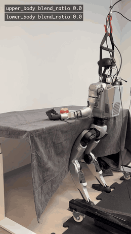
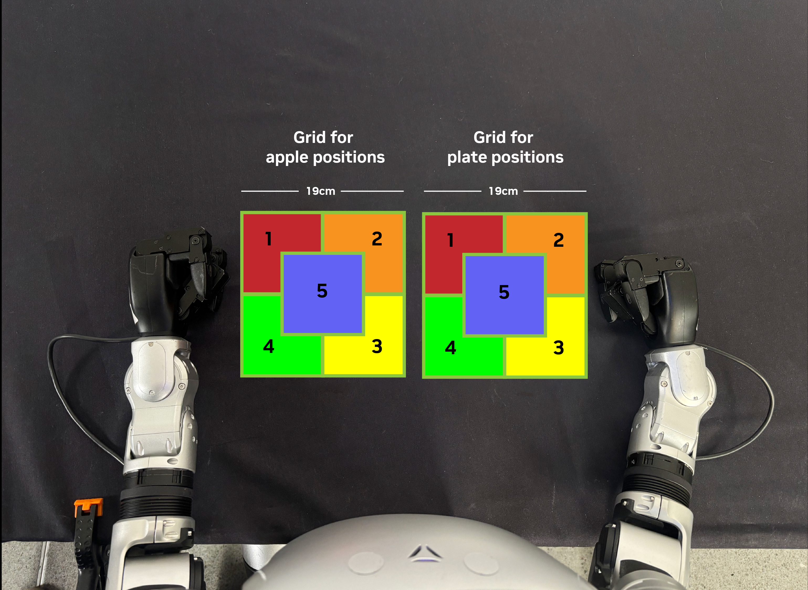
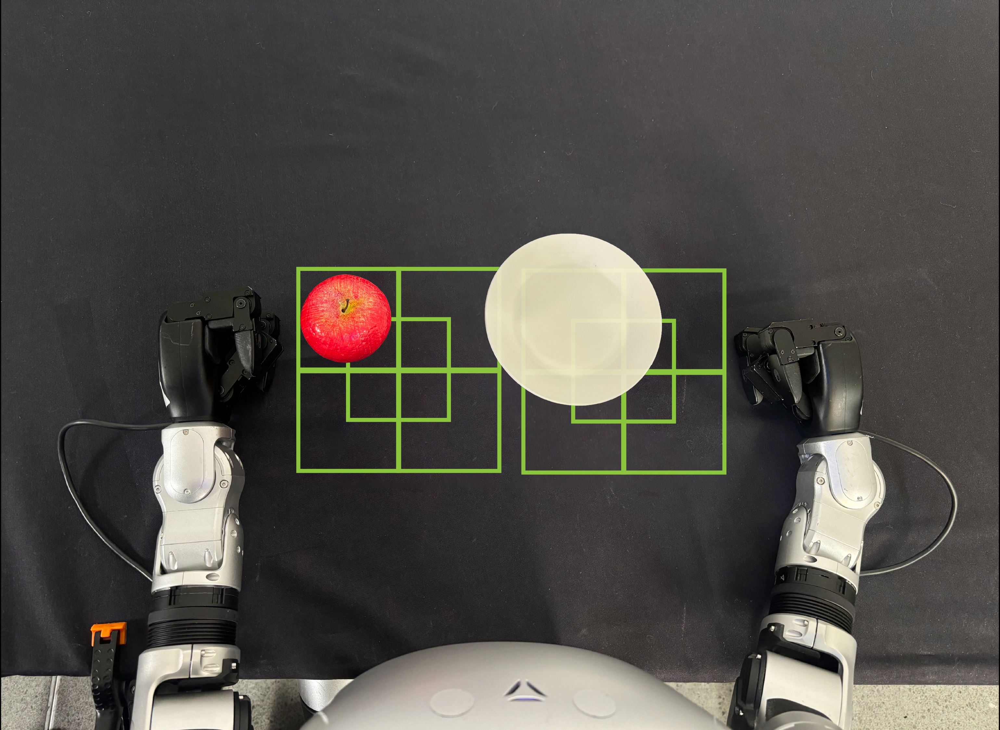
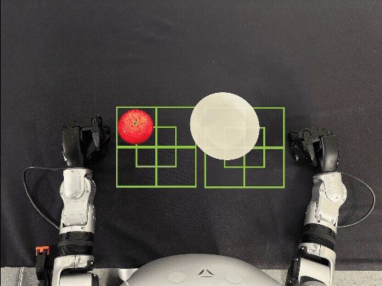

# Deployment[#](#deployment "Link to this heading")

In this lesson, we’ll deploy a GR00T policy to the physical Unitree G1 and evaluate its performance on the pick-and-place task. We’ll start with the bundled apple-to-plate policy, then replace it with your own LEAPP-exported policy.

To do that, we’ll:

- **Deploy** the pretrained apple-to-plate policy to a Thor on the G1.
- **Replace** the pretrained policy with a custom fine-tuned policy.
- **Measure** real-world success rate and document results.

## Prepare for Deployment[#](#prepare-for-deployment "Link to this heading")

Run this tutorial on a Jetson AGX Thor connected to the G1, either as an external system or as a Thor backpack. Complete [Isaac ROS Setup on Thor](isaac-ros-setup.html) first so the workspace and source repositories are ready.

1. Activate the Isaac ROS environment:

   ```
   isaac-ros activate
   ```
2. Download and install the pre-trained GR00T Unitree G1 policy assets. For model reference, see the provided [real robot model](../resources/models-and-datasets.html#real-robot-workflow), [`nvidia/GR00T-N1.7-ApplePnP-V1`](https://huggingface.co/nvidia/GR00T-N1.7-ApplePnP-V1):

   ```
   ros2 run isaac\_ros\_gr00t\_unitree\_g1\_install install\_gr00t\_unitree\_g1.sh --eula
   ```

   This stores the bundled model files and LEAPP YAML under `${ISAAC_ROS_WS}/isaac_ros_assets/models/gr00t_unitree_g1/`. Run this command in the same container and workspace used for deployment so asset paths and file permissions match the runtime environment.

## Run the Policy on Real Hardware[#](#run-the-policy-on-real-hardware "Link to this heading")

Danger

Before running the policy autonomously:

1. Clear all people from the robot’s workspace.
2. Maintain visual contact with the robot at all times.

Review [G1 Introduction and Safety](g1-introduction-and-safety.html) before enabling autonomous policy control. This course is a workflow guide, not a robot operating guide.

1. Before launching, recreate the [workspace setup](g1-introduction-and-safety.html#workspace-setup):

   - Black tablecloth
   - Approximately 75 cm table height
   - White 19 cm plate
   - Red apple
2. Use a gantry to position the robot at the table. Roll it close so the torso is almost touching the table, then rest the robot’s hands flat on the table before enabling any controller. Lower the robot from the gantry before step 7. Position the robot similar to the reference below.

   [](../_images/g1-groot-deploy.gif "Unitree G1 deployment at the table showing lower-body balancing enabled first, then upper-body apple-to-plate manipulation")

   **Expected deploy positioning and policy execution**[#](#expected-deploy-sequence "Link to this image")

   The animation shows the full deploy sequence. Lower-body joints enable first for balancing, then upper-body joints pick up the apple and place it on the plate.
3. Set up the network to communicate with the robot. **Run on the Thor host**, outside the container. Skip this step if you already ran network setup during [teleoperation](real-teleop.html) and have not rebooted Thor. Re-run it after a reboot or if you reconnect Ethernet.

   ```
   ${ISAAC\_ROS\_WS}/src/isaac\_ros\_robots/isaac\_ros\_robots\_tools/scripts/setup\_network.py
   ```

   Select the network interface connected to the G1. On Thor this is normally `enP2p1s0`.
4. Activate the Isaac ROS Docker environment (**inside the container**):

   ```
   isaac-ros activate
   ```
5. Set up CUDA MPS (**inside the container**). This allows the GPU to be partitioned so the whole-body control
   policy runs in real time without contention from the GR00T policy.

   Without MPS the two controllers can fight for GPU resources which can lead
   the robot to lose balance.

   ```
   ${ISAAC\_ROS\_WS}/src/isaac\_ros\_physical\_ai/isaac\_ros\_unitree\_g1\_gr00t/scripts/setup\_mps.sh
   ```
6. Launch the deploy stack with the pre-trained apple-to-plate policy (**inside the container**). Use the network interface you selected during network setup in step 3, for example `enP2p1s0` on Thor:

   ```
   ros2 launch isaac\_ros\_unitree\_g1\_gr00t unitree\_g1\_gr00t\_agile.launch.py \
   hardware\_type:=real \
   network\_interface:=enP2p1s0 \
   use\_foxglove:=false
   ```

   This uses the default pretrained policy installed by `install_gr00t_unitree_g1.sh --eula`.

   The command loads the policy onto the GPU, which takes up to 30 seconds.

   You can enable Foxglove by changing the last parameter. It is disabled here to keep the terminal output simpler.

   Before enabling control, check the camera view. Open a second terminal, run `isaac-ros activate`, then `rviz2`. Add **/realsense\_d435\_rgb/color/image\_raw/Image** and confirm the apple, plate, and table are visible and within reach. Adjust the scene or camera if needed while both safety controllers are still at `blend_ratio=0.0`.
7. Enable the lower body:

   Lower the robot from the gantry so its feet are on the ground before you enable lower-body control. The AGILE policy balances the robot while standing, so **do not enable lower-body control while the robot is still suspended in air.**

   The [deployment animation above](#expected-deploy-sequence) shows the full sequence. Lower-body control enables first, then upper-body manipulation follows.

   Similar to [teleoperation](real-teleop.html), the GR00T deploy stack uses a
   `blend_ratio` parameter to smoothly enable control.

   Unlike teleoperation, the GR00T deployment stack uses separate `blend_ratio`
   values (and separate safety controllers) for the lower and upper body.

   Enable balancing by setting the lower-body `blend_ratio` to `1.0`:

   ```
   ros2 param set /safety\_controller\_lower\_body blend\_ratio 1.0
   ```

   The robot should now balance and stand on its own.

   Tip

   Keep `ros2 param set /safety_controller_lower_body blend_ratio 0.0` in your
   shell history so you can disable control quickly if needed.
8. Enable the upper body:

   Important

   If you are testing your own fine-tuned policy for the first time, gradually increase `blend_ratio` rather than jumping directly to `1.0`.

   When you set the upper-body blend ratio to `1.0`, the GR00T policy immediately starts picking up the apple and placing it on the plate.

   ```
   ros2 param set /safety\_controller\_upper\_body blend\_ratio 1.0
   ```

   To repeat the trial you can disable the upper body, reset the apple and plate
   on the table, and then enable the upper body again:

   ```
   ros2 param set /safety\_controller\_upper\_body blend\_ratio 0.0
   ```

   Now, reset the apple and plate, then run again:

   ```
   ros2 param set /safety\_controller\_upper\_body blend\_ratio 1.0
   ```

## Use Your Own Policy[#](#use-your-own-policy "Link to this heading")

The steps above used the pretrained GR00T apple-to-plate policy. To deploy the policy you fine-tuned in [Fine-Tuning](real-fine-tuning-and-leapp.html) and exported in [LEAPP Export](real-leapp-export.html), follow the steps below.

1. Place the exported LEAPP bundle in a directory that is mounted into the
   container, such as `${ISAAC_ROS_WS}/policies/`.
2. Make the LEAPP bundle world-readable inside the Docker container:

   ```
   chmod -R a+rX ${ISAAC\_ROS\_WS}/policies
   ```
3. Repeat the same instructions as before, but now when launching the app add
   the launch argument `gr00t_leapp_yaml_path` and point it to the YAML file in
   your exported LEAPP bundle.

   ```
   ros2 launch isaac\_ros\_unitree\_g1\_gr00t unitree\_g1\_gr00t\_agile.launch.py \
   hardware\_type:=real \
   network\_interface:=enP2p1s0 \
   use\_foxglove:=false \
   gr00t\_leapp\_yaml\_path:=${ISAAC\_ROS\_WS}/policies/<path/to/leapp\_export/your\_policy.yaml>
   ```

   You can enable Foxglove by changing the parameter to `true`. It is disabled here to keep the terminal output simpler.

## Structured Evaluation Approach[#](#structured-evaluation-approach "Link to this heading")

Evaluate the success rate of the policy.

The success rate depends on how closely your environment matches the environment used during data collection.

Run the evaluation with two people: one person stays at the computer to enable and disable the policy, while the other person resets the scene.

Tip

You can define your own evaluation process. Below is a description of the conventions we used for this course.

### Setup[#](#setup "Link to this heading")

Set up the evaluation grid:

1. With a dark marker or another subtle marking system, mark two `19 cm x 19 cm` squares on the table in front of the robot. One is for the apple positions, one is for the plate.
2. Mark an additional square at the center of each rectangle to create a 5th position.

[](../_images/real-eval-grids-labeled.png "Evaluation grid layout with labels")

Labeled Evaluation Grid

[](../_images/real-eval-grids.png "Evaluation grid layout")

Evaluation Start Position Example

These regions support a structured evaluation of the policy. Each smaller square defines where to center the objects for each evaluation trial.

### Process[#](#process "Link to this heading")

1. Begin evaluations. For the first, keep the apple in the first grid position and rotate the plate through all five plate positions.
2. Move the apple to the next grid position and rotate the plate through all five plate positions again.
3. Repeat this pattern until all apple and plate combinations have been evaluated.

[](../_images/real-eval-setups.gif "Structured policy evaluation procedure")

*Structured policy evaluation procedure. Example sequence showing 15 of 25 possible environment resets between rollouts.*

This produces **25 unique apple-to-plate placement combinations**. Run the full set as many times as needed for your evaluation target.

In the reference evaluation pass, the process was repeated four times for a total of 100 rollouts, measuring a **68% success rate**.

## Troubleshooting[#](#troubleshooting "Link to this heading")

- If the robot does not stand after enabling lower-body control, verify
  real-time prerequisites (`rtprio` and CUDA MPS) and network interface settings.
- If a custom upper-body policy does not start, verify that
  `gr00t_leapp_yaml_path` points to a container-visible LEAPP YAML file. For
  bundled-policy deployment, leave `gr00t_leapp_yaml_path` empty.
- If Triton or ONNX Runtime cannot load a custom LEAPP policy, make the bundle world-readable:

  ```
  chmod -R a+rX /path/to/your/leapp\_export\_dir
  ```
- If behavior regresses between runs, reset upper-body `blend_ratio` to `0.0`, re-place objects, and re-enable.

## Conclusion[#](#conclusion "Link to this heading")

You deployed a fine-tuned GR00T policy to the physical Unitree G1 and measured task execution on real hardware.

See also

Refer to the [Isaac ROS Unitree G1 GR00T package reference](https://nvidia-isaac-ros.github.io/repositories_and_packages/isaac_ros_physical_ai/isaac_ros_unitree_g1_gr00t/index.html) for additional package details.

On this page
