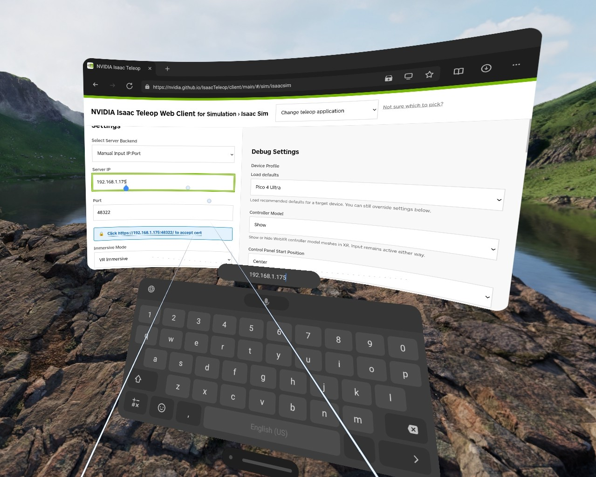
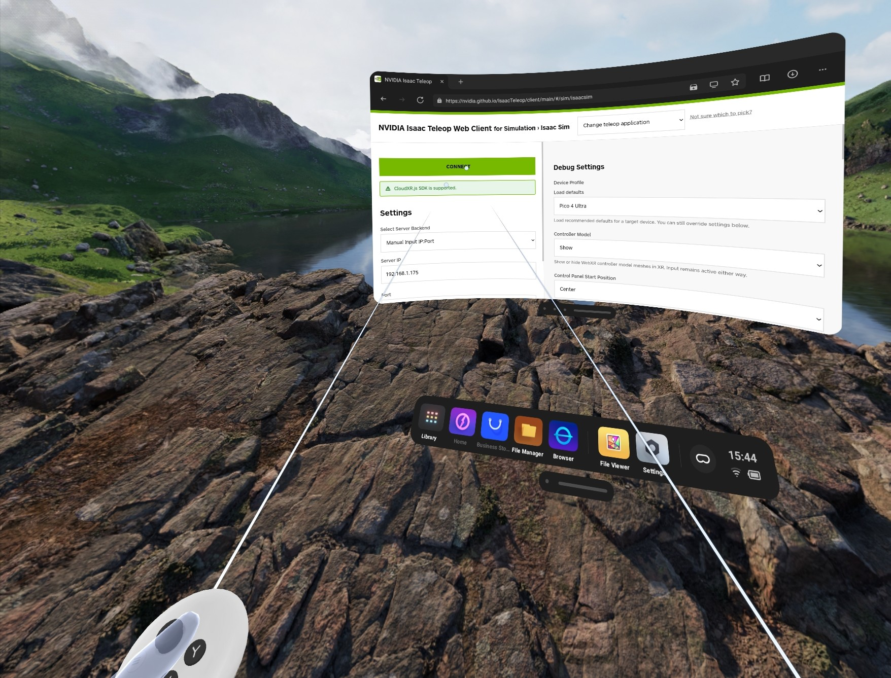

# Teleoperation[#](#teleoperation "Link to this heading")

This lesson covers whole-body XR teleoperation on the Unitree G1. The teleop application combines the AGILE WBC policy, bimanual inverse kinematics, and finger control driven by an XR headset.

We’ll begin with a simulation test to verify the XR headset, CloudXR session, and teleoperation commands, then connect to the physical G1 and teleoperate on real hardware.

Run these steps on a Jetson AGX Thor connected to the G1, either as an external system or as a Thor backpack.

We’ll cover:

- **Activating** the Isaac ROS environment for teleoperation
- **Starting** CloudXR and connecting an XR headset
- **Launching** real-hardware teleoperation
- **Enabling** and **disabling** robot control using the safety controller

Tip

Before collecting data, review the [Teleoperation Data Collection Guide](../shared/teleoperation-data-collection-guide.html).

It covers warm-up runs, smooth motion, body stability, scene variation, side-grasp approach, recovery examples, camera field of view, and completion behavior for GR00T training.

This keeps the operator out of the left-hand camera view and avoids blocking the teleoperator’s view during apple-to-plate demonstrations.

Warning

Having at least two people work on this workflow is recommended:

- One person for teleoperation
- One person to monitor the robot for safety purposes

## Prerequisites[#](#prerequisites "Link to this heading")

This lesson assumes the previous module is complete, the XR headset is ready, and the G1 is powered on and connected directly to Thor through Ethernet.

## Activate Isaac ROS[#](#activate-isaac-ros "Link to this heading")

The `gr00t_workflow` Docker layer from [Isaac ROS Setup on Thor](isaac-ros-setup.html) includes the teleop bringup package.

Start a new terminal and activate the Isaac ROS environment:

```
isaac-ros activate
```

## Start CloudXR[#](#start-cloudxr "Link to this heading")

Note

As a best practice, **update your teleop headset** before beginning this lesson.

Network Requirements

Before using XR teleoperation, verify the network can support CloudXR streaming. Refer to the [CloudXR Network Setup guide](https://docs.nvidia.com/cloudxr-sdk/latest/requirement/network_setup.html#network-requirements).

1. Start the CloudXR runtime and accept the EULA:

   ```
   python3 -m isaacteleop.cloudxr --accept-eula
   ```

   Keep this application running until you finish teleoperation.
2. On the XR headset, open the native browser and navigate to `https://nvidia.github.io/IsaacTeleop/client/release-1.3.x/#/real/isaacros`.
3. Enter the Thor’s host IP address in the **Server IP** field.

   [](../_images/pico-sim-teleop-ip-entry.jpeg "Example Isaac Teleop web client in a PICO headset browser with the Server IP and port fields visible.")

   Example headset client layout before connection.[#](#id1 "Link to this image")
4. Select the **Click https://:48322/ to accept cert** link that appears on the page after entering the IP address.
5. Accept the certificate in the new browser page, then return to the CloudXR.js client page.
6. Select **Connect** to connect the headset to the teleop server.

   [](../_images/pico-teleop-web-client-port-connect.jpeg "Example Isaac Teleop web client in a PICO headset browser after connecting to the CloudXR server.")

   Example connected headset client layout.[#](#id2 "Link to this image")

Note

On the PICO headset, use the Isaac Teleop client in the native browser to set **Video Codec** to **H.264**. Other codecs can prevent the headset from connecting.

## Initial Test in MuJoCo[#](#initial-test-in-mujoco "Link to this heading")

Before connecting to a physical G1, use MuJoCo to verify that the headset, CloudXR session, and teleoperation commands are working.

This test runs on Thor without a real G1 connected. A display must be connected to Thor for this step.

Two headset options are available:

- Wear the headset normally with `AR Immersive` passthrough enabled on the client page. The simulation is not streamed to the headset.
- Remove the cushion and pull it down to the neck, then watch the monitor instead. When wearing the headset on the neck, ensure clothing does not block the bottom cameras of the headset for tracking.

1. Open a new terminal and activate Isaac ROS:

   ```
   isaac-ros activate
   ```
2. Activate the CloudXR environment variables:

   ```
   source ~/.cloudxr/run/cloudxr.env
   ```
3. Launch the teleop application in MuJoCo:

   ```
   ros2 launch isaac\_ros\_unitree\_g1\_teleop\_bringup unitree\_g1\_teleop.launch.py \
   hardware\_type:=mujoco \
   input\_mode:=teleop
   ```

   The MuJoCo viewer opens with the G1 robot on Thor desktop. A virtual gantry holds the robot upright during startup.

   - Press `g` key to toggle the gantry on or off
   - Press `[` and `]` keys to shorten or lengthen the rope of the gantry
4. With the XR controllers in your hands, move them and confirm that the
   simulated robot’s arms track your motion. You can also use the joysticks on the
   XR controllers to make the robot walk.

   Controller Conventions

   The pose of the XR controllers is used to command the pose of the robot’s hands.

   The left joystick rotates the robot. The right joystick walks the robot forwards, backwards, or sideways.
5. After verifying controller tracking, stop the app with **Ctrl+C**.

## Set Up the Robot Network[#](#set-up-the-robot-network "Link to this heading")

The `isaac_ros_robots` repository is cloned during [Isaac ROS Setup on Thor](isaac-ros-setup.html).

1. Confirm the G1 Ethernet cable is plugged directly into Thor and the robot is
   powered on.
2. Open a new terminal on the Thor and run the network setup script. Run this on the host, not inside the Docker container.

   ```
   ${ISAAC\_ROS\_WS}/src/isaac\_ros\_robots/isaac\_ros\_robots\_tools/scripts/setup\_network.py
   ```
3. When prompted, select the network interface that is physically connected to
   the G1. On Thor, this is normally `enP2p1s0`.

## Launch Real-Hardware Teleoperation[#](#launch-real-hardware-teleoperation "Link to this heading")

Before operating real hardware, complete this checklist:

- Clear the work area of people and hazards.
- Ensure the waist yaw joint is close to zero before launch.

1. Open a new terminal and start the Isaac ROS environment:

   ```
   isaac-ros activate
   ```
2. Activate the CloudXR environment variables:

   ```
   source ~/.cloudxr/run/cloudxr.env
   ```
3. Launch the teleop application. Use the network interface you selected during [network setup](#set-up-the-robot-network), for example `enP2p1s0` on Thor:

   ```
   ros2 launch isaac\_ros\_unitree\_g1\_teleop\_bringup unitree\_g1\_teleop.launch.py \
   hardware\_type:=real \
   input\_mode:=teleop \
   network\_interface:=enP2p1s0
   ```
4. Verify that teleoperation commands are arriving from the XR headset. Open a new terminal, enter the Isaac ROS environment, and echo the ROS topic. New commands should appear multiple times per second.

   ```
   isaac-ros activate
   ```

   ```
   ros2 topic echo /xr\_teleop/ee\_poses
   ```
5. Reset the headset’s world frame by pressing the `Home` button (the button
   with the circle) on the right XR controller for 2 seconds.

## Disable and Enable Control[#](#disable-and-enable-control "Link to this heading")

By default, control is disabled. The stack uses a `blend_ratio` parameter to smoothly enable control. At launch, `blend_ratio` is `0.0`, so only default motor commands are sent. When you set `blend_ratio` to `1.0`, the controllers are fully active. Changes ramp smoothly between values.

Note

**Simulation vs. real hardware:** In the simulation test, `blend_ratio` defaults to 1.0, so control is active from the start.

Important

Before setting `blend_ratio`, confirm that the inference controller is available.

Watch the logs and wait for the `InferenceController activated` message. Until then, the controller prints a message once per second indicating it is still waiting for an input message.

Example:

```
[ros2\_control\_node-1] [INFO] [1780620035.588796262] [inference\_controller]: Waiting for topic messages before activating core controller: '/cmd\_vel'
[ros2\_control\_node-1] [INFO] [1780620040.605301453] [inference\_controller]: Waiting for topic messages before activating core controller: '/cmd\_vel'
[ros2\_control\_node-1] [INFO] [1780620044.232195753] [inference\_controller]: Core InferenceController activated
```

This may take about 40 seconds.

1. To disable the robot, set the blend ratio to zero:

   ```
   ros2 param set /safety\_controller blend\_ratio 0.0
   ```

   Tip

   Keep this command in your shell history so you can execute it quickly if something goes wrong.
2. To enable the robot, set the blend ratio to one. On real hardware, do this only after launch is healthy and the robot is standing on the ground:

   ```
   ros2 param set /safety\_controller blend\_ratio 1.0
   ```

The robot starts balancing and tracking your hand movements.

Note

You can stop teleoperation by either setting `blend_ratio` to `0.0` or quitting the main application.

## Key Takeaways[#](#key-takeaways "Link to this heading")

This lesson covered installing teleop bringup, connecting XR control, launching real-hardware teleoperation, and verifying that the robot tracks controller commands.

On this page
