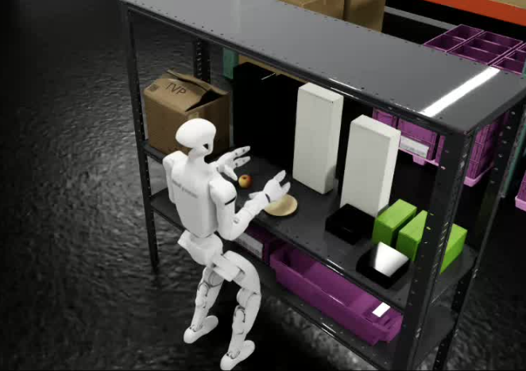

# Simulation Workflow[#](#simulation-workflow "Link to this heading")

In this section, we’ll complete the Unitree G1 static apple-to-plate workflow in Isaac Lab-Arena. The workflow covers environment setup and validation, OpenXR teleoperation data collection, GR00T 1.7 policy post-training, and closed-loop evaluation.

The task is a static, no-locomotion apple-to-plate task.

Teleoperation environment for this task.[#](#id1 "Link to this image")

The G1 stands in front of a shelf, uses its arms to pick up an apple, and places it onto a plate on the same shelf. WBC actively balances the standing pose, and the lower body does not walk, squat, or turn.

The training and evaluation steps use a standalone clone of NVIDIA’s Isaac-GR00T repository rather than the GR00T submodule pinned inside Arena.

Evaluation runs over Arena’s server-client remote-policy architecture: the GR00T server hosts the fine-tuned checkpoint in its own virtual environment, and Arena’s client runs the simulation in the standard Arena container and queries the server over ZeroMQ.

## Task Overview[#](#task-overview "Link to this heading")

Task Specification (click to expand)

| Property | Value |
| --- | --- |
| Task name | `galileo_g1_static_pick_and_place` |
| Tags | Tabletop manipulation, no locomotion |
| Skills | Pick, place; no walk, squat, or turn |
| Embodiment | Unitree G1, 29 DOF humanoid with WBC for balance only |
| Interop | LeRobot dataset format, converted from teleoperation HDF5 |
| Scene | Galileo Lab Environment with a single shelf |
| Manipulated object | Apple rigid body |
| Destination | Clay plate on the same shelf |
| Policy | GR00T 1.7, fine-tuned through standalone Isaac-GR00T |
| Post-training | Imitation learning |
| Dataset | Self-recorded through teleoperation or `nvidia/Arena-G1-Static-PickNPlace-Task` |
| Checkpoint | Self-trained or `nvidia/GN1x-Tuned-Arena-G1-Static-PickNPlace` |
| Physics | PhysX, 200 Hz at 4 decimation |
| Closed-loop control | Yes, 50 Hz control |
| Metrics | Success rate |

## What We’ll Cover[#](#what-we-ll-cover "Link to this heading")

| Lesson | What You’ll Do |
| --- | --- |
| [Sim Setup: Isaac Lab-Arena](sim-setup-isaac-lab-arena.html) | Install Isaac Lab-Arena, prepare workflow directories, and run validation tests |
| [Sim Environment Code Review](sim-environment-code-review.html) | Review the environment registration, embodiment choices, object placement, and task success logic |
| [Sim Teleop and WBC](sim-teleop-and-wbc.html) | Collect OpenXR teleoperation demonstrations with the G1 static task |
| [Sim Data Export](sim-data-export.html) | Convert recorded HDF5 demonstrations to LeRobot format |
| [GR00T Fine-Tuning on Sim Data](groot-fine-tuning-sim.html) | Fine-tune GR00T 1.7 from the standalone Isaac-GR00T checkout |
| [Sim Evaluation](sim-evaluation.html) | Run closed-loop policy inference through Arena’s server-client evaluation path |

## Learning Objectives[#](#learning-objectives "Link to this heading")

By the end of this Simulation Workflow section, you’ll be able to:

- **Validate** the `galileo_g1_static_pick_and_place` environment in Isaac Lab-Arena.
- **Review** the static apple-to-plate environment code path in Isaac Lab-Arena.
- **Collect** OpenXR teleoperation demonstrations for the static apple-to-plate task.
- **Convert** HDF5 teleoperation recordings to LeRobot format.
- **Fine-tune** GR00T 1.7 using a standalone Isaac-GR00T checkout.
- **Evaluate** the fine-tuned checkpoint in closed loop through Arena’s remote-policy architecture.

---

On this page
