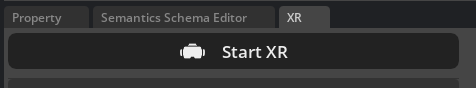
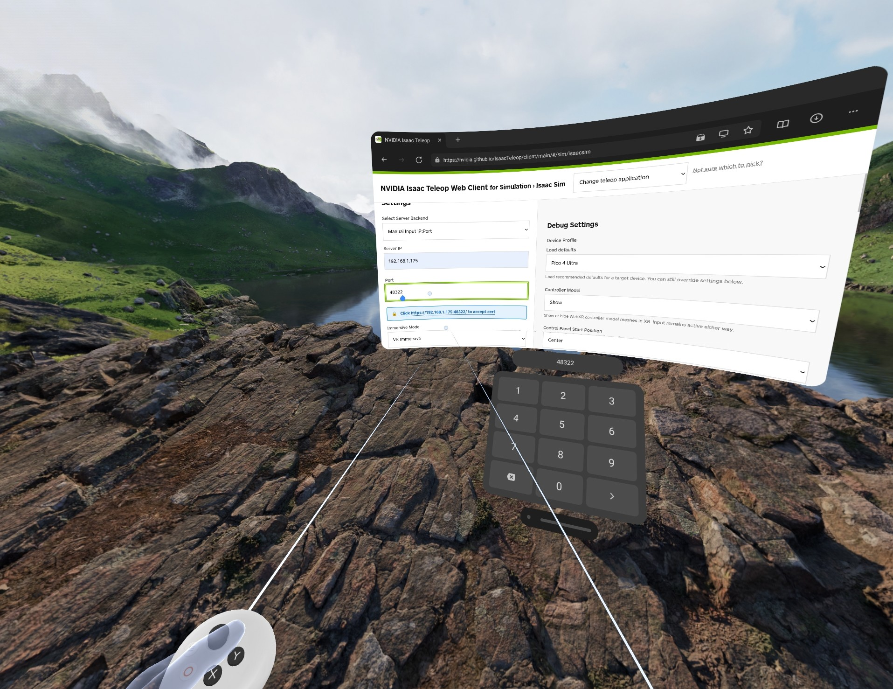
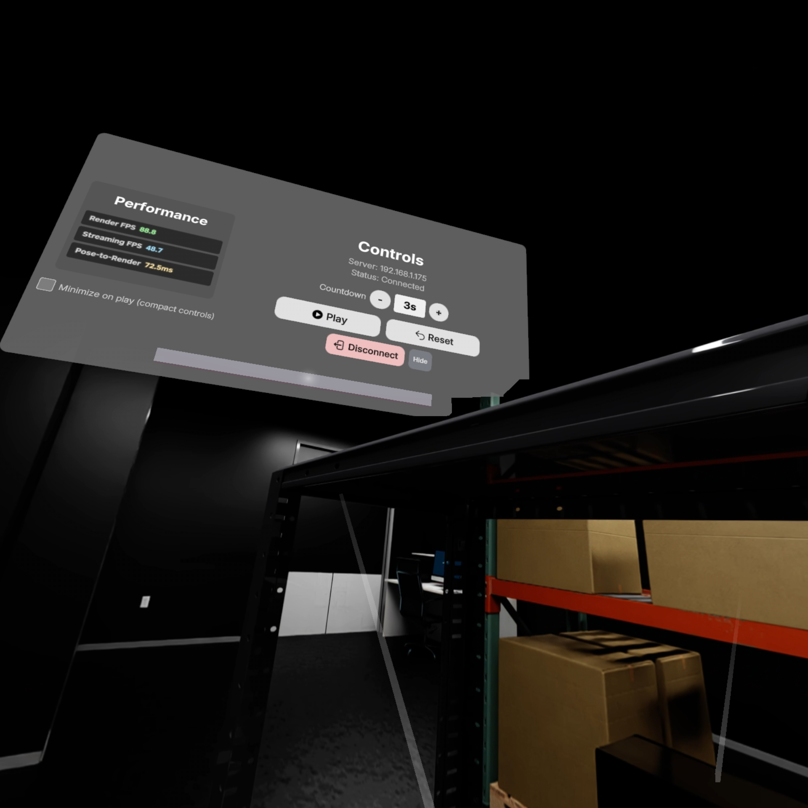
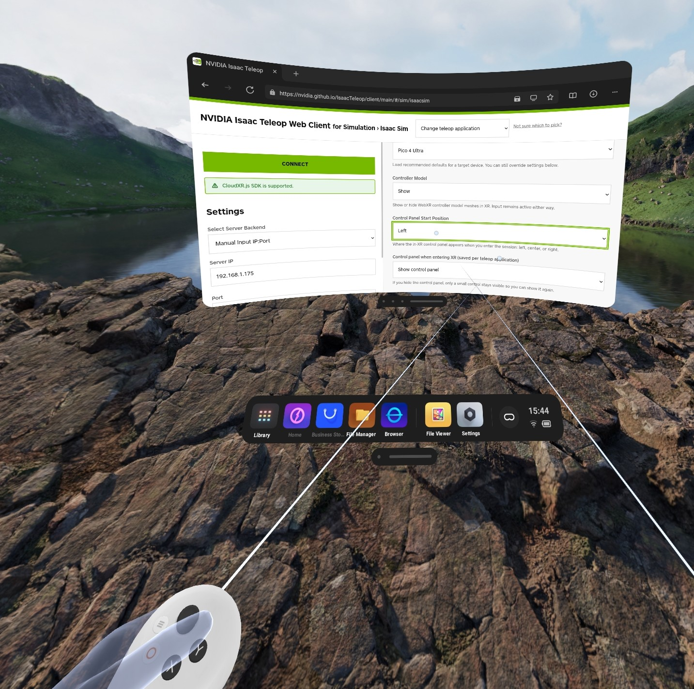
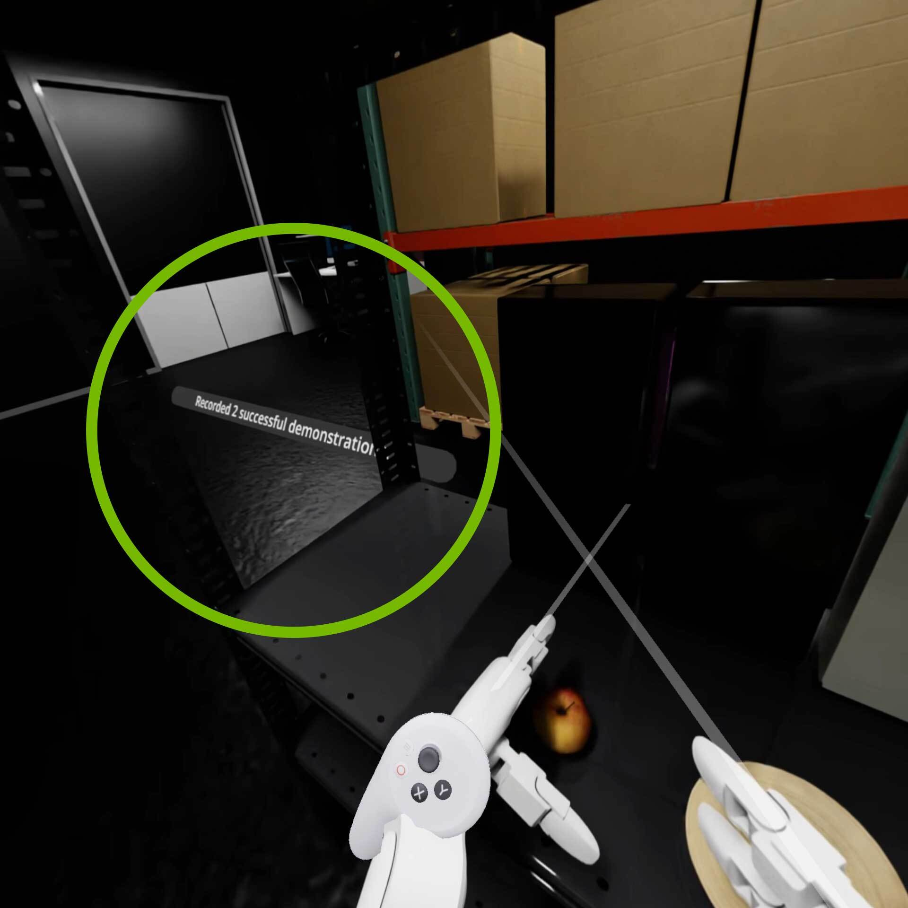
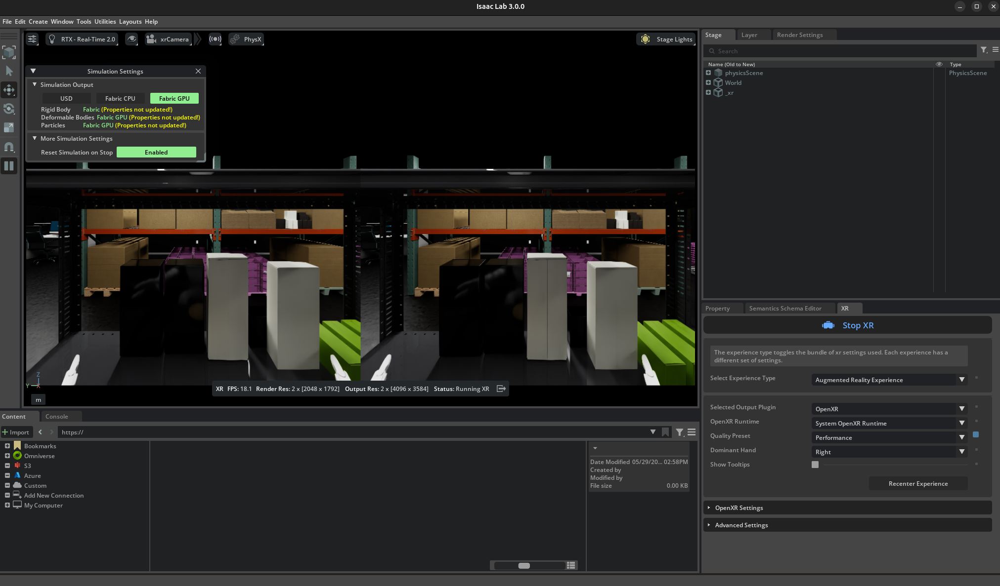
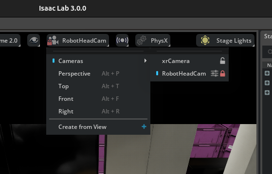
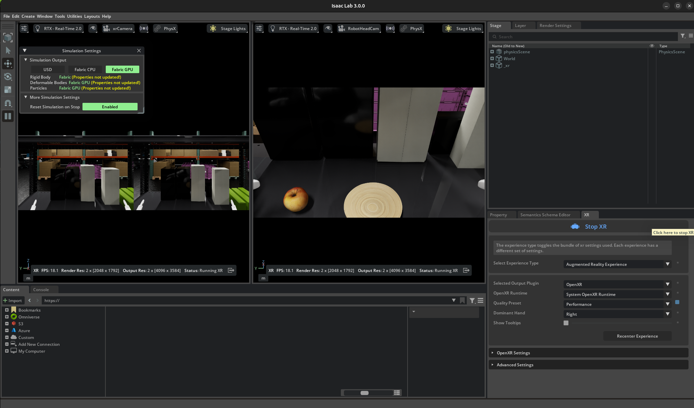

# Sim Teleop and Whole-Body Control (WBC)[#](#sim-teleop-and-whole-body-control-wbc "Link to this heading")

In this lesson, we’ll collect demonstrations for the Unitree G1 static apple-to-plate task using a Meta Quest 3 or PICO 4 Ultra headset with NVIDIA Isaac Teleop.

To do that, we’ll:

- **Start** the CloudXR runtime and Arena teleoperation session.
- **Connect** an XR headset or emulator to the running Arena scene.
- **Record** successful OpenXR teleoperation demonstrations to HDF5.
- **Replay** the recorded demonstrations to verify the dataset.

No teleoperation hardware?

If you do not have an XR headset, you can still test the pipeline with the [Immersive Web Emulator Runtime](https://github.com/meta-quest/immersive-web-emulator).

1. Open [the Isaac Teleop client](https://nvidia.github.io/IsaacTeleop/client) in desktop Chrome browser.
2. The page auto-loads IWER and emulates a Quest 3, using mouse and keyboard.
3. Follow the CloudXR, Arena teleop, headset connection, and recording steps below. The only difference is that you connect from the desktop browser tab instead of the headset browser.

The static task drops the locomotion, squat, and turn channels, but it still needs end-effector control. IWER can complete a few test demonstrations, while a real headset produces smoother data for training.

Note

For current supported input devices and system requirements, see the [Isaac Teleop supported input devices](https://nvidia.github.io/IsaacTeleop/main/overview/ecosystem.html#supported-input-devices) and [Isaac Teleop system requirements](https://nvidia.github.io/IsaacTeleop/main/references/requirements.html#teleoperation-with-isaac-sim-and-isaac-lab).

As a best practice, **update your teleop headset** before beginning this lesson.

## Start the CloudXR Runtime[#](#start-the-cloudxr-runtime "Link to this heading")

Network Requirements

Before using XR teleoperation, verify the network can support CloudXR streaming. The [CloudXR Network Setup guide](https://docs.nvidia.com/cloudxr-sdk/latest/requirement/network_setup.html#network-requirements)

On the host computer, let’s configure the firewall to allow CloudXR traffic. The required ports may change depending on the client type. This example uses `ufw` on Ubuntu.

1. In a terminal outside the Isaac Lab-Arena container, configure the firewall to allow CloudXR traffic.

   ```
   sudo ufw allow 49100/tcp # Signaling
   sudo ufw allow 47998/udp # Media stream
   sudo ufw allow 48322/tcp # Proxy (HTTPS mode only)
   ```
2. Use an existing Arena container terminal from [Setup: Isaac Lab-Arena](sim-setup-isaac-lab-arena.html), or start a new one if needed.

   ```
   ./docker/run\_docker.sh
   ```
3. Inside the container, start the CloudXR runtime.

   ```
   python -m isaacteleop.cloudxr
   ```
4. The first time you run this, it will prompt you to accept the NVIDIA CloudXR License Agreement.

   ```
   NVIDIA CloudXR EULA must be accepted to run. View: https://github.com/NVIDIA/IsaacTeleop/blob/main/deps/cloudxr/CLOUDXR\_LICENSE
   Accept NVIDIA CloudXR EULA? [y/N]: Yes
   ```

Once CloudXR is running, you will see output similar to this:

```
Activate CloudXR environment in another terminal: source /home/ubuntu/.cloudxr/run/cloudxr.env
Keep this terminal open, \*\*Ctrl+C\*\* to terminate.
```

## Start Arena Teleop[#](#start-arena-teleop "Link to this heading")

Let’s get comfortable with the teleoperation session in Arena. For now we won’t record demonstrations; we’ll use this run for teleoperation practice.

For this step, we will need a total of two terminals attached to the Arena container.

In a second terminal, start the Arena Docker container and launch the teleoperation session.

Important

Order of operation matters here. It’s important to run the following steps, as ordered.

For example, we run `source ~/.cloudxr/run/cloudxr.env`, **after** the CloudXR runtime is already running and **before** you start Isaac Lab-Arena.

This is because Arena needs to inherit the Isaac Teleop CloudXR environment variables.

If you need to restart, follow these steps in order again.

1. Attach another terminal to the Arena Docker container.

   ```
   ./docker/run\_docker.sh
   ```
2. Activate Isaac Teleop CloudXR environment variables.

   ```
   source ~/.cloudxr/run/cloudxr.env
   ```
3. Run the teleop script. **This will not record demonstrations, it is simply for teleoperation practice.**

   ```
   python isaaclab\_arena/scripts/imitation\_learning/teleop.py \
   --viz kit \
   --device cpu \
   galileo\_g1\_static\_pick\_and\_place \
   --object apple\_01\_objaverse\_robolab \
   --destination clay\_plates\_hot3d\_robolab \
   --teleop\_device openxr
   ```
4. Once Isaac Lab is running, locate the XR tab.

   [](../_images/static-apple-scene.png "Arena teleoperation session with stereoscopic XR view on the left and the XR settings panel open on the right.")

   Arena teleoperation session with XR running. The stereoscopic viewport is on the left, and the *XR* settings panel is open on the right.[#](#id1 "Link to this image")
5. Start the CloudXR session from the **XR** tab in the application window.

   [](../_images/start-xr.png "Arena teleoperation session with XR tab open.")
6. Under **OpenXR Settings**, you can also find the IP of your host machine listed under *Which is the server’s IP address?*. This is needed for the next section to connect your XR device.

Alternatively, you can use the `ifconfig` command to find the IP address of your wireless network interface.

## Connect From the XR Headset Device[#](#connect-from-the-xr-headset-device "Link to this heading")

This section assumes your headset is on the same wireless network as the host machine.

1. From your XR headset, open its browser app.
2. Navigate to [the Isaac Teleop client](https://nvidia.github.io/IsaacTeleop/client) at `https://nvidia.github.io/IsaacTeleop/client`.

[](../_images/pico-teleop-web-client-port.jpeg "Teleop web client interface as seen in an XR headset browser.")

Teleop web client interface on the XR headset.[#](#id2 "Link to this image")

3. In the **Server IP** field, enter the IP address of your Isaac Lab host machine.
4. Below that field, click the link labeled **Click https://`<ip>`:48322/ to accept cert**.
5. Accept the certificate in the new page, then navigate back to the teleop client page.
6. Click **Connect** to begin teleoperation.

Tip

For more detailed setup instructions, see [Connect an XR Device](https://isaac-sim.github.io/IsaacLab/develop/source/how-to/cloudxr_teleoperation.html#start-cloudxr-runtime). A strong wireless connection is essential for high-quality streaming. Refer to the [CloudXR Network Setup](https://docs.nvidia.com/cloudxr-sdk/latest/requirement/network_setup.html) guide for router configuration.

## Teleoperation Control[#](#teleoperation-control "Link to this heading")

1. After you press **Connect** in the web browser (upper left side of UI), you should see the control panel.

[](../_images/pico-teleop-controls-pane.jpeg "Isaac Sim view")

Isaac Sim view with the teleop control panel.[#](#id3 "Link to this image")

Tip

If the control panel is not visible, put the headset on before clicking **Start XR** in Isaac Lab-Arena and drag the control panel to a better location. You can also set the default location of the control panel in the teleop web client settings under *Control Panel Start Position*.

**Client menu option for default control pane location**

[](../_images/pico-set-left.jpeg "Teleop web client settings.")

Teleop web client settings.[#](#id4 "Link to this image")

1. Press **Play** in the virtual control panel to start teleoperation.
2. Press **Reset** in the virtual control panel to reset the scene during practice.
3. Assuming you already clicked **Start XR** in Isaac Lab-Arena, you should now see the simulated environment from the robot’s point of view in your headset. This is an immersive experience.

The teleoperation controls are:

- **Left joystick:** Move the body forward, backward, left, and right.
- **Right joystick:** Squat down or rotate the torso left and right.
- **Controllers:** Move end-effector targets for the arms.

Tip

If the simulation runs at too low FPS and teleoperation feels laggy, reduce the XR resolution from **XR > Advanced Settings > Render Resolution**.

4. When you’ve done a few practice episodes, you can exit the teleoperation session by pressing **Stop XR** in the virtual control panel.
5. In the terminal where you ran the teleop script, press **Ctrl+C** to terminate the teleop script.

## Record With the Headset Device[#](#record-with-the-headset-device "Link to this heading")

Now that we’ve had a chance to practice teleoperation, let’s actually record demonstrations.

Tip

In later modules, we provide a dataset with demonstrations pre-collected for you.

You can either:

- Collect all demonstrations yourself
- Try a few to understand the workflow, then move on and use our pre-collected dataset

1. You can re-use the same terminal we just used for teleoperation. If you are starting the recording app from a different Arena terminal, activate Isaac Teleop CloudXR environment settings again.

If you’re in a new container shell

```
source ~/.cloudxr/run/cloudxr.env
```

2. Confirm `DATASET_DIR` is still set in the Arena recording terminal.

   ```
   echo $DATASET\_DIR
   ```

If you’re in a new container shell

If you’re in a new container shell, restore the dataset directory:

```
export DATASET\_DIR=/datasets/isaaclab\_arena/static\_apple\_tutorial
mkdir -p $DATASET\_DIR
```

3. Run the recording script. Set `--num_demos` to the number of successful demonstrations you want to record.

   ```
   # Record demonstrations with OpenXR teleop
   python isaaclab\_arena/scripts/imitation\_learning/record\_demos.py \
   --viz kit \
   --device cpu \
   --enable\_cameras \
   --dataset\_file $DATASET\_DIR/arena\_g1\_static\_apple\_dataset\_recorded.hdf5 \
   --num\_demos 20 \
   --num\_success\_steps 10 \
   --disable\_full\_sim\_buffer\_reset \
   galileo\_g1\_static\_pick\_and\_place \
   --object apple\_01\_objaverse\_robolab \
   --destination clay\_plates\_hot3d\_robolab \
   --teleop\_device openxr
   ```
4. After each successful demonstration, a UI element will appear to show how many demonstrations you have recorded so far.

[](../_images/pico-sim-teleop-recorded-2-successful.jpg "Teleop as seen in an XR headset browser.")

Teleop web client interface on the XR headset.[#](#id5 "Link to this image")

## Monitor Recording With a Second Viewport (Optional)[#](#monitor-recording-with-a-second-viewport-optional "Link to this heading")

For higher-quality datasets, use a two-person workflow when collecting demonstrations: one person teleoperates from the headset, while a second person watches the host monitor to confirm each trajectory stays inside the robot’s head-camera field of view.

Anything that drifts outside the recording field of view is absent from the saved HDF5 file and absent from the policy’s view at training time. Catching field-of-view problems live reduces re-recording.

The Arena application’s default viewport shows the teleoperator’s stereoscopic perspective. This is what the headset wearer sees, not what `record_demos.py` stores. To watch both views side by side, open a second viewport bound to the robot’s head camera.

1. In the running Arena application, open the **Window** menu and toggle on **Viewport 2**.

   [](../_images/xr-dual-viewport-start.png "Isaac Lab window menu with the Viewport 2 toggle highlighted.")

   Enable a second viewport from the **Window** menu.[#](#id6 "Link to this image")
2. In the new *Viewport 2*, click the camera selector in the viewport toolbar and choose the robot’s head-mounted camera, **RobotHeadCam**. In the scene hierarchy, this is under `/World/envs/env_0/Robot/head_link`.

   This is the camera that `record_demos.py` writes to the HDF5 file, so any motion that leaves this frame will be absent from the dataset.

   [](../_images/xr-dual-viewport-menu.png "Isaac Lab viewport camera selector with the robot head camera selected.")

   Select the robot head-mounted camera for *Viewport 2*.[#](#id7 "Link to this image")
3. Keep the stereoscopic XR view and the head-camera view visible side by side during recording.

   [](../_images/xr-dual-viewport-result.png "Two viewports side by side, with stereoscopic XR view on the left and the robot head-camera view on the right.")

   Dual-viewport layout: the stereoscopic XR view on the left is the teleoperator’s perspective, and the head-camera view on the right is what the dataset captures.[#](#id8 "Link to this image")

The observer keeps every grasp and placement inside the right viewport and gives the teleoperator live feedback, such as “move a touch to your right; your hand is at the edge of frame.”

Note

`RobotHeadCam` is only spawned when `--enable_cameras` is set. The `record_demos.py` command in this lesson enables it by default, so the camera appears in the camera selector once you are recording.

The smoke-test `teleop.py` command earlier in this lesson omits `--enable_cameras` for performance. Pass `--enable_cameras` there too if you want to validate the dual-viewport layout before entering VR.

Important

The command above records only 20 demos (see argument `--num_demos 20`) for a fast tutorial pass.

For better inference results, collect about **400** high-quality demonstrations and keep `--num_success_steps 10` so each successful episode includes extra stable frames after the success condition triggers.

Policy success rate depends heavily on dataset quality and dataset size. For better success rates, collect more clean demonstrations with smooth actions, stable grasps, and no unnecessary collisions.

Follow this protocol while collecting data:

1. Complete about 5 practice runs before recording the main dataset so you’re used to XR latency and the apple’s contact behavior.
2. Move consistently and avoid jerky motions. Jerky seed demonstrations lead to poor synthetic augmentations and unstable policy behavior.
3. Keep the robot torso and body fixed during this static task. Use only the arms and hands for manipulation.
4. Include diverse grasp styles across the dataset, including top-down grasps and side grasps, so the policy does not overfit to one approach direction.
5. Save only runs with no unnecessary collisions, no dropped objects before placement, and no recovery motions that would confuse the policy.
6. After releasing the apple onto the plate, keep the scene stable and wait until the recording auto-terminates and freezes. Reset only after that happens.
7. Aim for demonstrations around 200-400 timesteps. Very long episodes slow downstream data processing, while very short episodes tend to contain abrupt motion.

Read more teleoperation tips in the [Teleoperation Data Collection Guide](../shared/teleoperation-data-collection-guide.html).

If this command fails

An error like this will occur if the DATASET\_DIR environment variable isn’t set correctly.

```
2026-05-21T22:43:33Z [65,007ms] [Error] [\_\_main\_\_] Failed to create environment: [Errno 13] Unable to synchronously create file (unable to open file: name = '/arena\_g1\_static\_apple\_dataset\_recorded.hdf5', errno = 13, error message = 'Permission denied', flags = 13, o\_flags = 242)
```

4. In the running application, start the session from the **XR** tab, connect the headset again, and complete the task for each demo.
5. After a successful placement, hold the scene stable and wait for the demo to end automatically. The simulation resets automatically after success, and the script saves successful runs to the HDF5 file path specified by `--dataset_file $DATASET_DIR/arena_g1_static_apple_dataset_recorded.hdf5`.

Note

There is no manual save button in this recording flow. The success condition ends and saves the episode automatically. Use **Reset** when you need to restart the scene during practice or after an unusable attempt.

Tip

Suggested task sequence for teleoperation:

1. Move the right arm to the side and keep it still, resting near the shelf or table surface if possible, to reduce visual clutter and self-occlusion.
2. Approach the apple smoothly with the left arm, primarily along a horizontal path. A side approach is a good default trajectory for clean demonstrations.
3. Once the hand is aligned with the apple, close the gripper or fingers firmly to establish a stable grasp.
4. Lift the apple straight upward before translating toward the plate. Avoid backtracking along the original approach path because it makes it harder for GR00T to distinguish approach and retreat motions during training.
5. Lower the apple until it is slightly above the plate surface, pause briefly in a stable pose, then release cleanly so the apple drops naturally onto the plate.
6. Keep the scene stable and wait for the automatic success termination and reset.

You can collect 20 successful demos in a short tutorial pass once the pipeline is running.

Keep the release height low and the orientation stable.

These recordings feed directly into LeRobot conversion and policy post-training, so demo quality is what the policy learns from.

Tip

Keep the release height low and the hand orientation stable so the apple lands naturally on the plate instead of rolling away.

## Merge Multiple Recording Sessions[#](#merge-multiple-recording-sessions "Link to this heading")

Collecting hundreds of clean demonstrations in one sitting is impractical because of operator fatigue and the need to stop and restart Arena for breaks. The recommended workflow is to record one HDF5 file per session, then merge the sessions into the training-ready dataset.

1. Record each session to a separate file using the commands from above. Example flow of two recording sessions - make sure to update the `--dataset_file` to a unique name, and change`--num_demos` based on desired number of demos to record per session

   ```
   # Examples - not complete
   # Session 1
   python isaaclab\_arena/scripts/imitation\_learning/record\_demos.py \
   ... \
   --dataset\_file $DATASET\_DIR/session\_a.hdf5 \
   --num\_demos 50 \
   ...
   # Session 2
   python isaaclab\_arena/scripts/imitation\_learning/record\_demos.py \
   ... \
   --dataset\_file $DATASET\_DIR/session\_b.hdf5 \
   --num\_demos 50 \
   ...
   ```
2. Merge the per-session files:

   ```
   python isaaclab\_arena/scripts/imitation\_learning/merge\_demos.py \
   -o $DATASET\_DIR/arena\_g1\_static\_apple\_dataset\_recorded.hdf5 \
   $DATASET\_DIR/session\_a.hdf5 $DATASET\_DIR/session\_b.hdf5
   ```

The merge script validates that all inputs share the same `format_version`, action shape, observation keys, and camera geometry. It renumbers successful demonstrations sequentially in the order the input files are listed.

Tip

Use `--dry_run` to inspect the merge report without writing the output file. This returns a non-zero exit code if any input would block the merge.

## Replay Recorded Demos[#](#replay-recorded-demos "Link to this heading")

Replay the recorded HDF5 to confirm that the demos look correct.

This also works as a no-XR sanity check on the environment because it drives the environment from recorded actions without launching CloudXR.

Note

Replay runs the collected actions back through the environment. It does not reproduce the exact trajectory you saw during data collection.

Sometimes the object falls during replay even though it did not fall during the original recording. Treat that as a replay-dynamics mismatch, not automatic proof that the demonstration is bad.

Do not recollect data only because replay shows a fall; first review the original recording quality and confirm the dataset contains the intended successful action sequence.

1. To replay the recorded HDF5 dataset, run the following command:

   ```
   # Replay from the recorded HDF5 dataset
   python isaaclab\_arena/scripts/imitation\_learning/replay\_demos.py \
   --viz kit \
   --device cpu \
   --dataset\_file $DATASET\_DIR/arena\_g1\_static\_apple\_dataset\_recorded.hdf5 \
   galileo\_g1\_static\_pick\_and\_place \
   --object apple\_01\_objaverse\_robolab \
   --destination clay\_plates\_hot3d\_robolab
   ```

## Key Takeaways[#](#key-takeaways "Link to this heading")

We collected static apple-to-plate demonstrations with OpenXR teleoperation and saved successful episodes to HDF5. Next, we’ll convert the HDF5 dataset to LeRobot format for GR00T 1.7 post-training.

On this page
