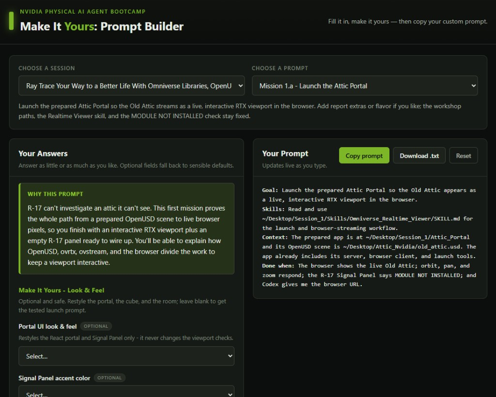

# Get Started: Initialize Your AI Agent[#](#get-started-initialize-your-ai-agent "Link to this heading")

Do this once to get your agent running and signed in.

## Start the Agent[#](#start-the-agent "Link to this heading")

First, open a terminal in your course folder — the folder you unzipped after downloading the assets, named after the course (for example, `RTXViewport/`). You have two options:

- Open a terminal and run `cd RTXViewport/` (use your course’s folder name) to change into the folder.
- Or open that folder in the file browser, right-click inside it, and select **Open in Terminal**.

Note

Paths in these courses are shown relative to the unzipped course folder using forward slashes (`/`). On Windows you can use either `/` or `\`.

With the terminal open, start your agent to begin the sign-in process. Follow the prompts to log in.

Checkpoint

The agent starts, you’re signed in, and it reports that it’s working in your course folder.

## How We Structure the Prompts[#](#how-we-structure-the-prompts "Link to this heading")

You don’t need to memorize this - just know how our prompts work. Every build step in these courses uses the same prompt shape:

```
Goal: <what the app should do after this step>
Skills: read skills/<name>/SKILL.md (+ any related)
Context: <scene path, GPU, what already exists>
Done when: <observable check - frame saved, window opens, labels print>
```

The agent reads the named `SKILL.md`, which points it to the real source snippet, then writes the code.

Important

Review-before-run: read and understand the generated diff, then run only after the code makes sense to you.

## Make It Yours: Prompt Builder[#](#make-it-yours-prompt-builder "Link to this heading")

Note

We’ve provided a **Make It Yours Prompt Builder**. You can open it any time from the [Make It Yours Prompt Builder](prompt-builder.html) link at the top of the left navigation. Keep it open as you work.

Each course ships with a carefully engineered prompt. The Prompt Builder wraps each one in a friendly fill-in-the-blank form: use **Choose a session** and **Choose a prompt** to match the course step you’re on, answer a few fun questions (your vibe, colors, target asset, behavior, thresholds), and your answers are injected live into the full prompt. You get a ready-to-copy prompt that builds the course *your* way, while the hard architectural constraints stay locked down.



You’re ready

Next, [Meet the Omniverse Libraries](meet-omniverse-libraries.html) to see the toolkit you’ll build with. Or head straight to [Ray Trace Your Way to a Better Life](lab-1-rtx-viewport/index.html), or jump into whichever course you’re here for.

On this page
