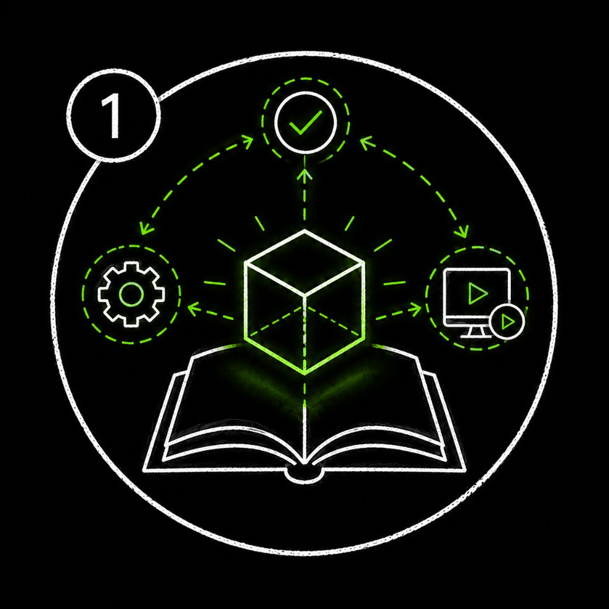
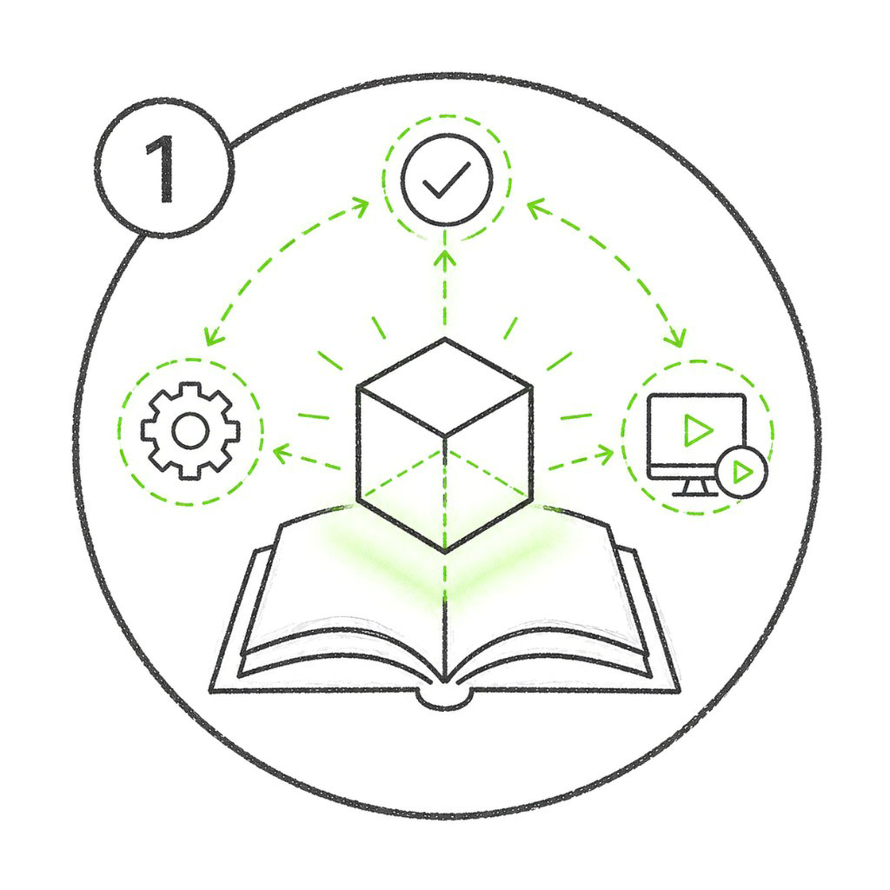
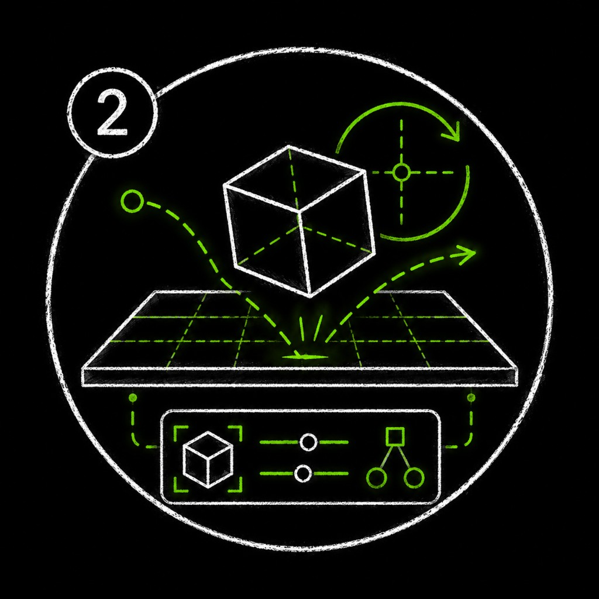
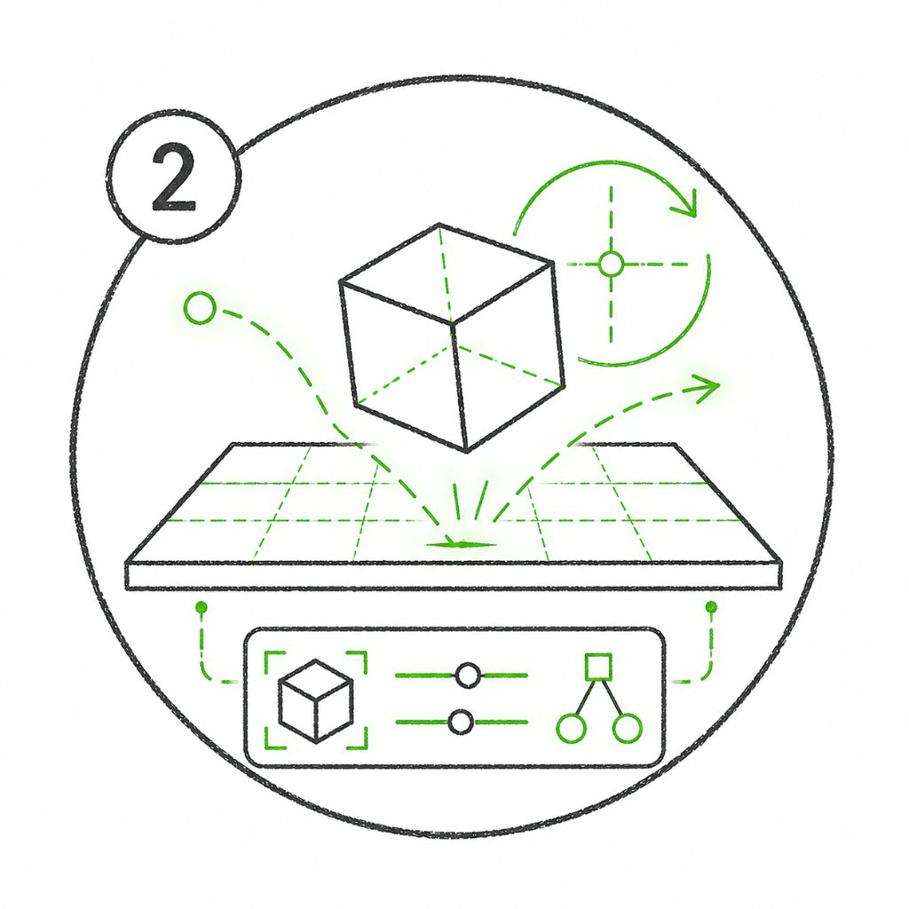
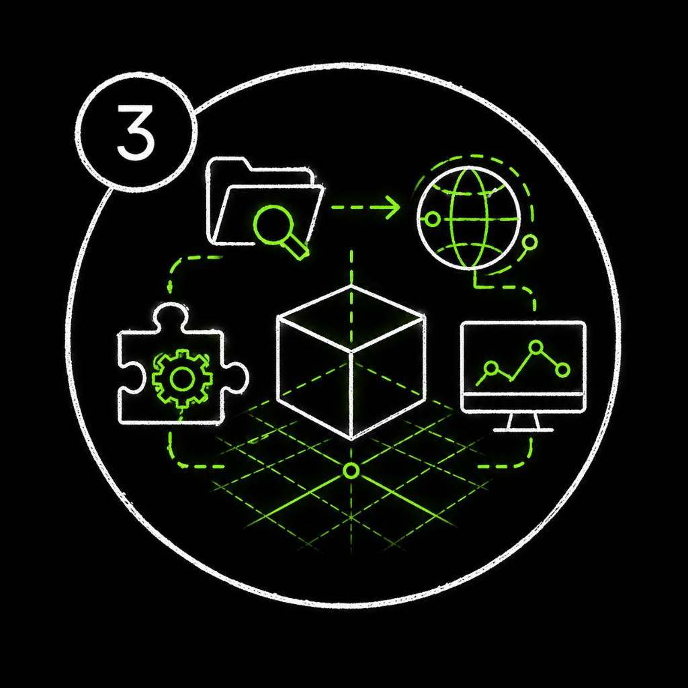
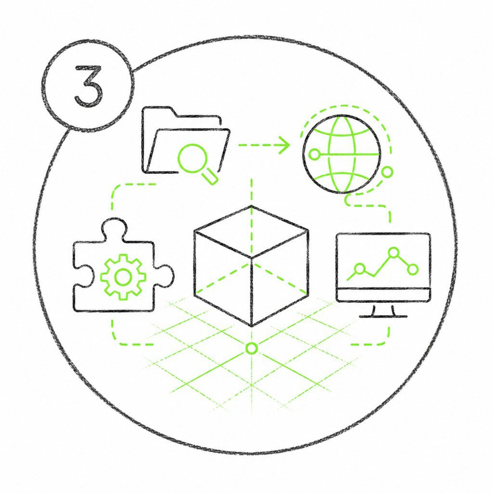
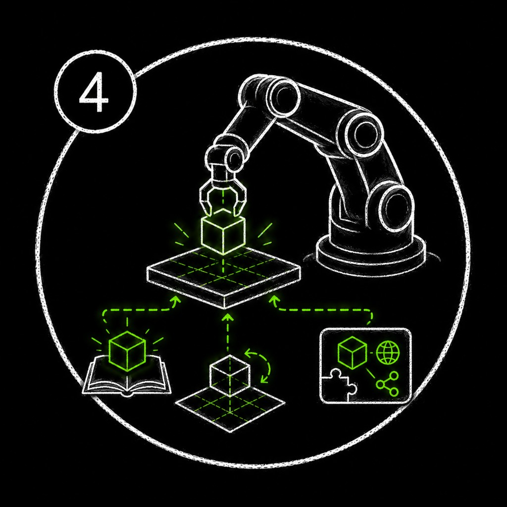
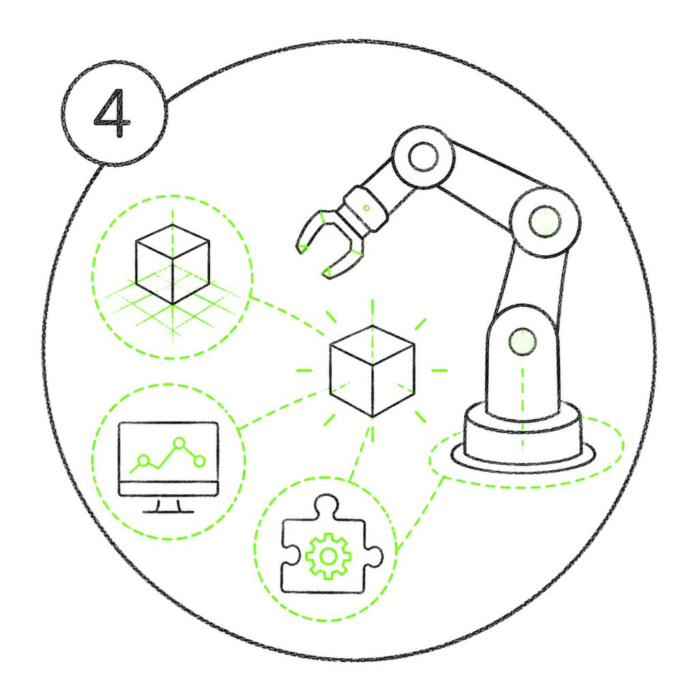

# NVIDIA Physical AI Agent Bootcamp[#](#nvidia-physical-ai-agent-bootcamp "Link to this heading")

Welcome to the NVIDIA Physical AI Agent Bootcamp — a set of free, self-paced courses where you build practical physical AI workflows one step at a time, using provided assets, NVIDIA Omniverse libraries, and AI agents to move from ingredients to a working scene, tool, or robot task.

Come for the ingredients; leave with something running. Across these courses, you’ll build a custom app to render USD scenes and drop assets with gravity. Bring your own assets or use ours, and let AI agents help with setup while you focus on what you want to build.

## How These Courses Work[#](#how-these-courses-work "Link to this heading")

Each course introduces a new ingredient and stands on its own, so you can take a single course or work through them all at your own pace.

- **Take one course or all of them.** Each course is self-contained, with everything you need in one place.
- **Every course is hands-on.** You direct an AI agent against real NVIDIA SDKs and focus on what you want to build.
- **The courses build on each other.** Work through them in order for the complete picture, from rendering raw USD to running a real-time physics simulation.
- **Start fresh anytime.** Each course stands on its own, so you can jump into whichever one matches your interest.

Tip

New here? Start with the first course to learn the agent workflow you’ll reuse throughout. Already comfortable with agents and Omniverse libraries? Jump into whichever course matches your interest.

## Courses[#](#courses "Link to this heading")

Ray Trace Your Way to a Better Life: Omniverse Libraries, OpenUSD, Agents, and You

An RTX viewport app that loads and renders OpenUSD scenes.

[Ray Trace Your Way to a Better Life: Omniverse Libraries, OpenUSD, Agents, and You](lab-1-rtx-viewport/index.html)

SimReady or Not, Here Comes Gravity: OpenUSD for Simulation

A physics scene with validated, simulation-ready assets.

[SimReady or Not, Here Comes Gravity: OpenUSD for Simulation](lab-2-simready-physics/index.html)

**More Courses Coming Soon**

Blender, Oranges, and OVRTX: Not Your Typical Smoothie

An RTX-rendered, physics-enabled scene running inside Blender. *Coming soon.*

Isaac Sim and the Fine Art of Picking Things Up

An Isaac Sim robot completing a pick-and-place task. *Coming soon.*

Learning Objectives

Across these courses, you’ll be able to:

1. **Direct** an AI agent against real NVIDIA SDKs using the Patterned Prompt Method (Goal, Skills, Context, Done When).
2. **Build** a Python application with an interactive RTX viewport that loads and renders OpenUSD scenes.
3. **Validate** and **convert** assets into simulation-ready (SimReady) USD and run a real-time physics simulation.

## What You Need[#](#what-you-need "Link to this heading")

You can run these courses on a compatible local workstation or in a cloud GPU environment. Each course’s **Overview** page will provide its downloadable assets, starter code, agent skills, and course-specific environment link.

**Minimum Local Hardware**

- **Operating system:** Windows 11 or Ubuntu 22.04/24.04.
- **Processor:** Intel Core i7/i9 or AMD Ryzen.
- **Memory:** 16 GB RAM.
- **GPU:** NVIDIA GeForce RTX 3070 or better, with a [compatible NVIDIA driver](https://docs.omniverse.nvidia.com/dev-guide/latest/common/technical-requirements.html#driver-versions).
- **Storage:** 250 GB of available space.

These are the [minimum Omniverse technical requirements](https://docs.omniverse.nvidia.com/dev-guide/latest/common/technical-requirements.html#minimum-requirements). Larger scenes and more demanding workflows benefit from additional GPU memory, system memory, and storage.

Important

**Course 4: Isaac Sim Requirements (Coming Soon)**

The fourth module uses NVIDIA Isaac Sim, which has higher [minimum system requirements](https://docs.isaacsim.omniverse.nvidia.com/latest/installation/requirements.html):

- **Operating system:** Ubuntu 22.04 or 24.04 Linux on an x86\_64 system. Although Isaac Sim also supports Windows 11 workstation installations, this module requires Linux.
- **Processor:** 7th-generation Intel Core i7 or AMD Ryzen 5, with at least four CPU cores.
- **Memory:** 32 GB RAM.
- **GPU:** NVIDIA GeForce RTX 4080 or better, with RT cores and at least 16 GB VRAM.
- **Storage:** 50 GB of available SSD space.

GPUs without RT cores, including NVIDIA A100 and H100 GPUs, are not supported.

**AI Agent Requirements**

- An AI coding agent that supports [Agent Skills](https://github.com/NVIDIA/skills), such as Cursor, Claude Code, or Codex.
- An account with your chosen agent provider and permission for the agent to read and edit the course folder and run terminal commands.
- The NVIDIA agent skills supplied with the course materials. If you install skills separately, use the [current `skills` CLI](https://github.com/NVIDIA/skills/blob/main/docs/advanced-install.mdx) (`v1.5.16` or newer).

Note

The local developer setup path is coming soon. Until then, use the course-specific environment and materials linked from each course’s **Overview** page.

**Cloud GPU Access With NVIDIA Brev**

Don’t have access to a compatible local GPU? [Launch the Kit App Template on NVIDIA Brev](https://brev.nvidia.com/launchable/deploy/now?launchableID=env-34fCURommjwcJI3NUiMzlTTyJKS) for a preconfigured cloud GPU development environment. Course-specific Brev setup instructions are coming soon.

Note

You’re welcome to use your own assets. You can download every asset and other course file used in a course from that course’s **Overview** page.

Have Fun!

This is your playground, so get a little weird with it. The prompts we give you are just a starting point, not the finish line. When you’re ready to make something that’s unmistakably yours, open the [*Make It Yours Prompt Builder*](prompt-builder.html) and see what you come up with.

On this page
