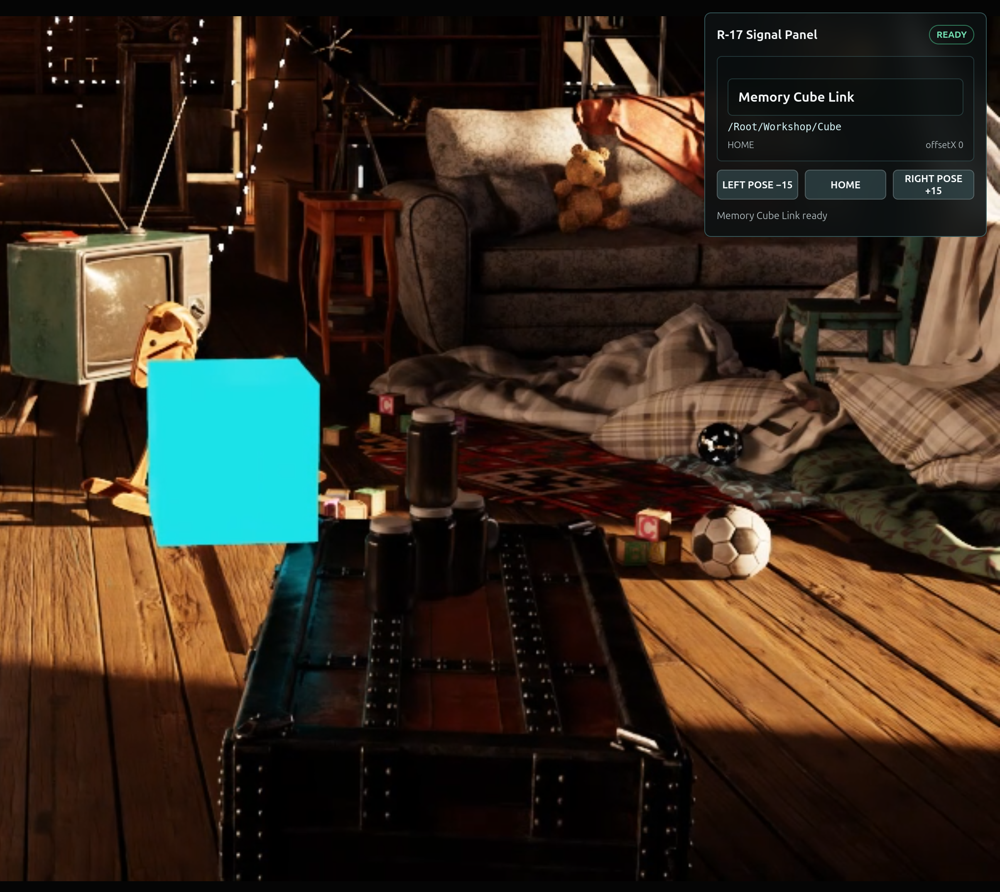
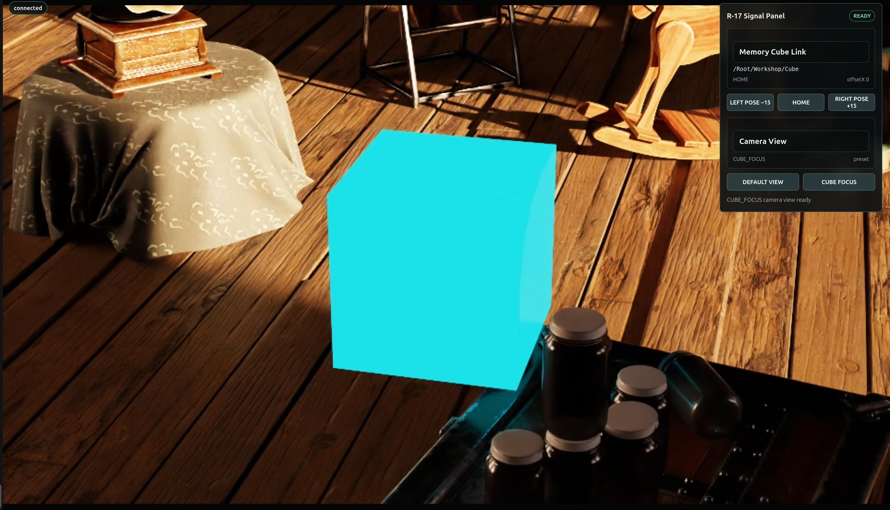

# Establish the Cube Link[#](#establish-the-cube-link "Link to this heading")

The Attic Portal is live, but it is still only a window. You can see the glowing Memory Cube; a future robot application needs a structured object identity and a command route it can trust.

**What you are learning:** `ovstream` transports browser input, application commands, rendered video, and application state. It does not call `ovrtx` directly. Your application connects the two by validating messages, queuing renderer-owned work, and publishing the result.

**Next Mission:** Prepare the Memory Cube as a dependable action target. Prove the portal can find the correct OpenUSD prim, control it without drift, and focus a camera on its full motion envelope without touching the source attic.

**Why this matters for a robot-ready scene:** A robot cannot act on “the glowing object over there.” Its software needs a stable identity, an explicit transform contract, and confirmed state. It also needs repeatable inspection views that remain valid as the target moves. These contracts let a robotics team connect perception and planning to the same object without depending on appearance or an operator’s current camera.

**Your 3D skills at work:** Scene hierarchy and naming become machine identity. Rigging and animation knowledge becomes safe transform authoring, coordinate-space discipline, and repeatable poses. Camera and layout craft becomes sensor placement, coverage, and consistent evidence rather than a purely aesthetic shot.

## Establish the Cube Link: Identity, Control, Focus[#](#establish-the-cube-link-identity-control-focus "Link to this heading")

The ideas behind this page’s build. Step through the slides, then make the 3D decisions that shape the two mission briefs below.

1

The Command Relay

Same components, one job each.

**`ovstream`** is the courier - it carries input and commands out, video and state back.

**The application** is the checkpoint and traffic controller - it validates and queues work.

**`ovrtx`** is the RTX worker - it produces the requested camera or sensor output.

**OpenUSD** is the scene record; **React** is the control surface.

```
flowchart LR
React["React: control surface"] --> ovstream["ovstream: courier"]
ovstream --> App["Application: checkpoint<br/>+ traffic control"]
App --> ovrtx["ovrtx: RTX worker"]
ovrtx --> App
App --> ovstream
ovstream --> React
USD["OpenUSD: scene record"] --- App
```

2

The Frame Lifecycle: Apply, Step, Read

The application bridges `ovstream` and `ovrtx`.

An **`ovstream`** callback stays short: it validates the command and queues an intent.

The renderer owner **applies** the change, calls **`step()`**, and **reads** the output.

Only the renderer-owning loop may write transforms or step **`ovrtx`**.

The app prepares the result and **`ovstream`** delivers it.

```
flowchart LR
CB["ovstream callback:<br/>validate + queue intent"] --> Apply["Renderer owner<br/>applies the change"]
Apply --> Step["step()"]
Step --> Read["read the output"]
Read --> Deliver["App prepares result;<br/>ovstream delivers"]
```

3

Named Poses Beat Relative Jogs

A robot application needs a deterministic state contract.

**Relative jog** adds movement from the current state: HOME → −15 → −30 → −45.

**Named pose** derives every target from a recorded HOME: LEFT, HOME, RIGHT.

**Idempotence** - replaying the same command reaches the same final transform.

Automation gets three fixed transforms it can trust and replay.

```
flowchart TD
Jog["Relative jog:<br/>HOME → −15 → −30 → −45"] --> Drift["Result depends on current state"]
Home["Recorded HOME"] --> Left["LEFT"]
Home --> HomeP["HOME"]
Home --> Right["RIGHT"]
Left --> Idem["Idempotent:<br/>replay reaches the same transform"]
HomeP --> Idem
Right --> Idem
```

## Mission 2.b — Establish the Cube Link[#](#mission-2-b-establish-the-cube-link "Link to this heading")

### 1. Inspect — Define the Object and Transform Contract[#](#inspect-define-the-object-and-transform-contract "Link to this heading")

You can recognize the glowing Memory Cube by sight. A robot application needs a more dependable connection: the cube’s exact OpenUSD prim path and a transform command with a predictable result.

Before the scene is approved for robot integration, prove the application can:

- Resolve the correct prim in the composed OpenUSD stage.
- Record its complete starting transform.
- Move it to three known poses.
- Report the resulting state in the browser.

The Signal Panel will receive three controls:

```
LEFT POSE −15
HOME
RIGHT POSE +15
```

These are the named poses we extend from the browser to the Memory Cube:

```
LEFT = HOME transform with parent-space X −15
HOME = exact recorded starting transform
RIGHT = HOME transform with parent-space X +15
```

For this lab, `15` means **15 authored scene units along the X axis of the cube’s parent** - not screen pixels or “left from the current camera.” Because every target derives from the recorded HOME, repeating a named-pose command produces the same final transform. This property is **idempotence**, and it is why R-17 uses a named-pose interface rather than a relative jog: LEFT, HOME, and RIGHT must always refer to the same three transforms.

You’ll make this concrete in [**Specify — Author Your Cube-Link Brief**](#specify-cube-link-brief) below: decide which object is safe to command and what replay-safe evidence you will require before you approve the result.

This is where rigging and animation knowledge becomes physical-AI engineering. You know that “move the cube” is incomplete until the object boundary, pivot, parent space, reference pose, and replay behavior are explicit. The application then divides the runtime work cleanly: React requests and displays; `ovstream` transports; the Python server validates and queues; OpenUSD supplies identity and authored state; and the renderer owner uses `ovrtx` to apply, step, and read.

### How the Skill Combination Divides the Work[#](#how-the-skill-combination-divides-the-work "Link to this heading")

| `ovrtx` Skill | Responsibility |
| --- | --- |
| `stage-queries` | Find and identify prims in the loaded stage. |
| `reading-attributes` | Read and preserve authored values. |
| `writing-transforms` | Write a prim’s transform safely and repeatedly. |
| `camera-outputs-rt2` | Select camera AOVs such as color, depth, or semantic IDs. |

| Responsibility | Skill |
| --- | --- |
| Find the Memory Cube prim. | `stage-queries` |
| Capture its complete HOME transform. | `reading-attributes` |
| Apply the selected named pose. | `writing-transforms` |
| Produce a frame showing the result. | `stepping-and-rendering` |

The hero skill is **`writing-transforms`**, but it cannot complete the workflow alone. The agent must first identify the prim and read its starting state, then render the result after the write.

The skills do not add a new transform feature to `ovrtx`. They give the agent the version-specific procedure for using the transform capability correctly.

### 2. Specify — Author Your Cube-Link Brief[#](#specify-author-your-cube-link-brief "Link to this heading")

Now turn that judgment into your brief. Decide which authored object the application may command, and define what evidence proves a pose is replay-safe: repeating LEFT must land on the identical transform, and HOME must restore the exact recorded pose. Open the [Prompt Builder](../prompt-builder.html), choose the **Ray Trace Your Way to a Better Life** session, and select **Mission 2.b - Establish the Cube Link**. Record your object boundary and that replay-safe evidence in `Context` and `Done when`. Leave the optional fields blank to keep `/Root/Workshop/Cube` and the tested LEFT/HOME/RIGHT contract.

### 3. Build — Add Your Transform Judgment to the Mission Brief[#](#build-add-your-transform-judgment-to-the-mission-brief "Link to this heading")

Tip

**Make It Yours:** Open the [Prompt Builder](../prompt-builder.html), choose the **Ray Trace Your Way to a Better Life** session, and select **Mission 2.b - Establish the Cube Link**. Add your `Context` and `Done when` decisions, then review the complete contract before copying it.

Show a finished prompt

```
Goal: Extend the R-17 Signal Panel with a Memory Cube Link. Query the loaded
stage for exactly one prim whose mission:role is "Memory Cube" and display
its resolved OpenUSD prim path. Record that prim's complete starting
transform once as HOME. Add LEFT POSE −15, HOME, and RIGHT POSE +15
controls. Use a short visible linear transition for accepted changes, but
derive every final target from HOME rather than the cube's current position.
Skills: Read the installed ovrtx skills for stage-queries, reading-attributes,
writing-transforms, and stepping-and-rendering. Use writing-transforms as the
hero skill. Read ~/RTXViewport/skills/omniverse-realtime-viewer/SKILL.md
and only its focused prim-transform-safety, streaming-messages,
viewer-control-patterns, viewer-feedback-status, and validation references.
Before implementing, read ~/RTXViewport/ATTIC\_PORTAL\_STARTER.md and reuse
the snippets in ~/RTXViewport/Attic\_Portal\_Starter\_Kit for AppStreamer
messages, ovrtx transform helpers, R-17 typed envelopes/hooks,
request-correlated buttons, and validation.
Context: Extend ~/RTXViewport/Attic\_Portal and its existing R-17 Signal Panel.
Use the R17CommandButton component, request-correlated r17-command-v1 sender,
and r17-state-v1 subscription created in Part 1. Do not create another React
provider, message protocol, renderer, stream, or WebRTC connection. Add these
controls to
~/RTXViewport/Attic\_Portal/frontend/src/components/R17SignalPanel.tsx:
LEFT POSE −15 sends cube.setPose with { pose: "LEFT" }; HOME sends cube.setPose
with { pose: "HOME" }; and RIGHT POSE +15 sends cube.setPose with
{ pose: "RIGHT" }. Each command carries a requestId. The server validates it and
queues one named-pose intent; only the renderer-owning loop may write omni:xform
or call renderer.step(). Capture the cube's full HOME transform before the first
mission command and preserve its rotation and scale when deriving LEFT and RIGHT.
Use a short visible linear translation inside the existing frame loop, disable
all three pose controls until matching READY or ERROR state returns, and allow
only one cube-pose request in flight. A duplicate requestId or a request for the
already active pose must acknowledge the current result without restarting
movement. If /Root/Workshop/MemoryCubeGlow exists, keep its translation
synchronized with the cube without treating the light as the mission target.
Publish server-authoritative r17-state-v1 fields for requestId, cubePath,
requestedPose, offsetX constrained to −15, 0, or +15 relative to HOME, and
WAITING, APPLYING, READY, or ERROR. The browser may change button status only
from state carrying the matching requestId. Never modify files inside
~/RTXViewport/Attic\_Nvidia.
Done when: The focused Cube Link check passes; the panel displays /Root/Workshop/Cube and
working LEFT POSE −15, HOME, and RIGHT POSE +15 controls; each accepted change
finishes at its exact HOME-relative target; duplicate or already-active commands
do not restart or change the final transform; HOME restores the complete recorded
transform; rotation and scale remain unchanged; matching server state drives
status; the existing renderer and stream remain healthy; source hashes are
unchanged; and the agent reports the changed files, browser URL, start/restart
command, and concise validation evidence. Return control without waiting for my
browser interaction.
```


### 4. Verify — Approve the Transform Contract[#](#verify-approve-the-transform-contract "Link to this heading")

Test **HOME → LEFT → LEFT → RIGHT → HOME**. The repeated LEFT request must finish at the identical transform rather than accumulating another offset. HOME must restore the complete recorded transform, including rotation and scale. Confirm that the panel reports the same stable prim path and that matching server state—not a local button animation—proves completion.

Then compare the result with the brief you authored. Your hierarchy and rigging judgment defined which prim was safe to command and what replay-safe meant; the skills taught the agent how to implement that contract with the installed `ovrtx` version.



## Mission 2.c — Build a Trustworthy Cube Focus View[#](#mission-2-c-build-a-trustworthy-cube-focus-view "Link to this heading")

### 1. Inspect — Treat the Camera as a Virtual Sensor[#](#inspect-treat-the-camera-as-a-virtual-sensor "Link to this heading")

The Cube Link proves the application can name and control the correct prim. Now commission a close inspection view without modifying the Old Attic.

**Why this matters for a robot-ready scene:** A useful inspection camera must cover the target’s full expected motion, not merely compose one attractive frame. That repeatable view gives robotics engineers a controlled observation for debugging perception, checking clearances, and comparing runs.

**Your 3D skills at work:** Camera blocking, lens choice, bounds, and composition become virtual-sensor coverage. OpenUSD layering brings the non-destructive editorial workflow you already use in production: the application can add a calibrated view while the canonical environment remains unchanged.

- Its transform defines **extrinsics** - where it is and where it points.
- Its lens attributes define **intrinsics** - how it observes the world.
- Its target bounds determine whether the object stays visible across the cube’s expected motion.
- Its viewer-owned layer keeps this inspection configuration separate from the shared digital twin.

There is no single “create a camera” skill. A camera is an OpenUSD prim, so the workflow combines several kinds of guidance:

1. **Protect the source scene.** OpenUSD composition and Realtime Viewer `stage-loading` put the camera in a viewer-owned layer above the attic.
2. **Design the observation.** Realtime Viewer `camera-controls` helps calculate a valid Z-up pose covering the full target envelope.
3. **Apply the preset.** `ovrtx` `writing-transforms` applies its pose, and `writing-attributes` applies its lens values.
4. **Connect it to the application.** Realtime Viewer `camera-picker` routes the preset command and reports the active view.

![Diagram titled Camera Preset in a Nondestructive Layer, a conceptual OpenUSD view. On the left, the stage tree shows /Root/Workshop/Cube alongside a new /Session/Cameras/R17CubeFocus camera prim. In the center, the attic viewport switches between a default view and a Cube Focus view framing the glowing cube. On the right, camera attributes for /Session/Cameras/R17CubeFocus list translate, rotate, focalLength 50.0, horizontalAperture 36.0, and clippingRange, authored in R17_Camera.usda. At the bottom, the layer stack shows viewer-owned editable R17_Camera.usda composed above the protected read-only old_attic.usd, so camera changes live in the viewer layer while the attic geometry and materials remain unchanged.](../_images/lab-1-camera-preset-nondestructive-layer.png)

The skills tell the agent how to implement the camera. They cannot decide whether the framing is useful. Your layout and cinematography experience defines coverage, readable scale, necessary context, potential occlusion, and what would make the observation unacceptable.

### 2. Specify — Author the Camera Brief[#](#specify-author-the-camera-brief "Link to this heading")

Choose the framing, required attic context, coverage margin across LEFT/HOME/RIGHT, and the condition that should fail review. Open the [Prompt Builder](../prompt-builder.html), choose the **Ray Trace Your Way to a Better Life** session, and select **Mission 2.c - Commission the Cube Focus Camera**. Turn those choices into camera intent for `Context` and acceptance criteria for `Done when`. Leave the optional fields blank to keep the tested balanced framing.

### 3. Build — Add Your Camera Judgment to the Mission Brief[#](#build-add-your-camera-judgment-to-the-mission-brief "Link to this heading")

Tip

**Make It Yours:** Open the [Prompt Builder](../prompt-builder.html), choose the **Ray Trace Your Way to a Better Life** session, and select **Mission 2.c - Commission the Cube Focus Camera**. Add your camera decisions to `Context` and `Done when`, then review the complete contract before copying it.

Show a finished prompt

```
Goal: Create an R-17 Cube Focus camera preset that frames /Root/Workshop/Cube for
close inspection. Author /Session/Cameras/R17CubeFocus in
~/RTXViewport/Attic\_Portal/usd/R17\_Camera.usda, compose that viewer-owned
layer above the protected scene, and add DEFAULT VIEW and CUBE FOCUS controls
to the R-17 Signal Panel.
Skills: Read the installed ovrtx stage-queries, writing-transforms, and
writing-attributes skills. Read
~/RTXViewport/skills/omniverse-realtime-viewer/SKILL.md and only its
stage-loading, camera-controls, camera-picker, streaming-messages,
viewer-control-patterns, and validation references. Do not use camera-outputs-rt2
as a camera-creation skill; it selects requested render outputs, often called
AOVs, rather than authoring cameras.
Context: Reuse the Cube Link's resolved prim path, R17CommandButton, request-correlated
r17-command-v1 sender, and r17-state-v1 subscription. Add DEFAULT VIEW and CUBE
FOCUS to R17SignalPanel.tsx without creating another provider or connection.
DEFAULT VIEW sends camera.setView with { view: "DEFAULT" }; CUBE FOCUS sends
camera.setView with { view: "CUBE\_FOCUS" }; every command carries a requestId.
Compute one valid Z-up focus pose from the union of the cube's LEFT, HOME, and
RIGHT world bounds so the target remains framed at every named pose while enough
attic context remains visible. Keep R17\_Camera.usda application-owned and never
save over ~/RTXViewport/Attic\_Nvidia. DEFAULT VIEW is the fitted startup transform
and lens preset captured in Part 1, not the learner's camera position when this
prompt runs. Treat R17CubeFocus as another authored preset: on a validated
command, the renderer owner uses writing-transforms for its pose and
writing-attributes for its lens values on the existing active viewer camera,
preserving one RenderProduct and one video track. Publish requestId, activeView,
and READY or ERROR as matching server state only after a successful frame. An
accepted native orbit, pan, or zoom intent changes activeView to CUSTOM. Preserve
navigation after every preset selection.
Done when: The focused camera check passes; R17\_Camera.usda contains
/Session/Cameras/R17CubeFocus; DEFAULT VIEW restores the Part 1 startup preset;
CUBE FOCUS frames the full three-pose cube envelope; the panel reports DEFAULT,
CUBE\_FOCUS, or CUSTOM from matching server state; orbit, pan, and zoom still
work; no second renderer, stream, or WebRTC connection exists; source hashes are
unchanged; and the agent reports the new layer, camera path, changed files, and
concise evidence. Return control without waiting for my clicks.
```

### 4. Verify — Approve the Observation[#](#verify-approve-the-observation "Link to this heading")

Switch between **DEFAULT VIEW** and **CUBE FOCUS**, then test LEFT, HOME, and RIGHT. Judge the result against the framing, context, margin, and rejection criteria you authored—not against whether the camera merely changed. Orbit once and confirm the view becomes `CUSTOM`, then restore the two presets.

Verify the nondestructive contract as well: `/Session/Cameras/R17CubeFocus` belongs to viewer-owned `R17_Camera.usda`, while the supplied attic remains unchanged. The prompt’s workflow skills implemented the camera; your camera judgment determined whether its evidence was trustworthy.



Identity, control, and focus are proven. Next, add observations a machine does not have to guess in [Add Machine Perception](give-r17-machine-perception.html).

On this page
