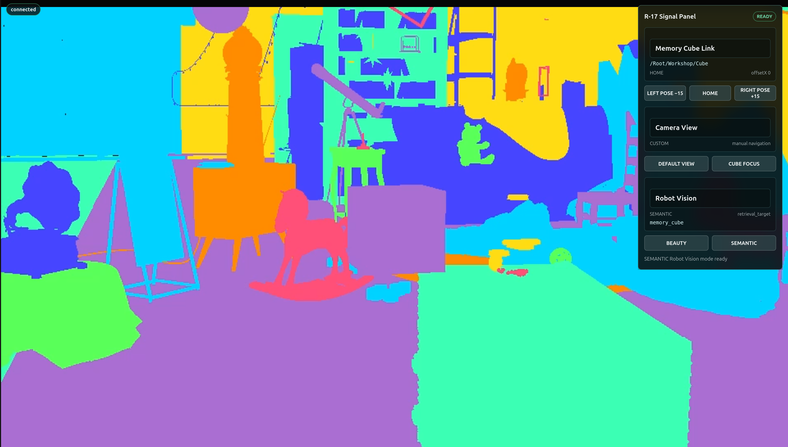

# Add Machine Perception[#](#add-machine-perception "Link to this heading")

You’ve proved that the application can control the correct scene object. Control is not enough. To make the attic useful to a future robot, the scene must also produce structured observations that do not depend on human color recognition.

**What you are learning:** `ovrtx` exposes camera annotation outputs and nonvisual sensor outputs from the same OpenUSD scene. Skills separate label authoring, output selection, readback, interpretation, and browser orchestration so the agent can combine them correctly.

**Why this matters for a robot-ready scene:** A robot does not experience a beauty render as an artist does. Perception software needs machine-readable identity and measurable spatial evidence, with clear contracts for how those observations were produced. Semantic output and lidar let the same digital scene support recognition, localization, synthetic-data validation, and sensor testing.

**Your 3D skills at work:** AOV and lookdev experience becomes ground-truth output design. Material and ray-tracing knowledge becomes sensor-return visibility. Taxonomy, masking, compositing, and render-debugging skills help you detect labels, surfaces, or outputs that would silently give a perception model bad evidence.

## Machine Perception: Semantics + Lidar[#](#machine-perception-semantics-lidar "Link to this heading")

How a robot application turns raw output into meaning. Step through the slides, then make the 3D decisions that specify and build the observations below.

1

Semantic Vision: IDs Into Meaning

A number becomes a class, then a color.

An **OpenUSD** label gives each object a semantic ID in a non-destructive layer.

The **`ovrtx`** semantic image stores that integer at every pixel - a cube pixel might be `17`.

The **semantic ID map** looks up `17` as class `retrieval_target`, label `memory_cube`.

The **server palette** colorizes it and **`ovstream`** delivers the frame to the browser.

```
flowchart LR
Label["OpenUSD label<br/>(non-destructive layer)"] --> Img["ovrtx semantic image:<br/>a cube pixel = 17"]
Img --> Map["ID map: 17 →<br/>retrieval\_target / memory\_cube"]
Map --> Palette["Server palette colorizes"]
Palette --> Browser["ovstream delivers the frame"]
```

2

Lidar Needs Nonvisual Materials

RTX lidar returns come from geometry plus material labels.

RTX lidar hits come from **renderable USD geometry** - not PhysX collision or rigid-body schemas.

Each unlabeled `Material` prim needs default-preserving sensor-return metadata so its surface returns hits.

Author labels under both `omni:simready:nonvisual` and `inputs:nonvisual` in viewer-owned `R17_Lidar.usda` - never the source.

`lidarNonvisualMaterialCount` reports how many materials you labeled.

```
flowchart TD
Geo["Renderable USD geometry"] --> Hits["Lidar returns"]
Mat["Unlabeled Material prims"] --> Label["nonvisual base/coating/attributes = none"]
Label --> Layer["Viewer-owned R17\_Lidar.usda"]
Layer --> Count["lidarNonvisualMaterialCount"]
```

## Mission 3.a — Add Machine-Readable Perception[#](#mission-3-a-add-machine-readable-perception "Link to this heading")

### 1. Inspect — Define Meaning That Survives Appearance[#](#inspect-define-meaning-that-survives-appearance "Link to this heading")

Humans see a glowing cyan cube. A robot application needs per-pixel IDs connected to semantic meaning.

**Physical-AI translation:** In film and games, mattes, cryptomattes, object IDs, and render passes isolate visual elements for downstream work. Here that same discipline creates ground truth: every pixel can carry a stable class and object identity that perception systems can train against or validate.

An **AOV** is one requested render output, such as beauty color, depth, or semantic IDs. This step adds a semantic AOV to the existing camera RenderProduct.

### Find the Skill Chain[#](#find-the-skill-chain "Link to this heading")

Start with the hero skill **`semantic-labels`**. It authors `SemanticsAPI` metadata; it does not create a display-ready image by itself.

| Skill or reference | Job in the workflow |
| --- | --- |
| `semantic-labels` | Add class and label meaning in a non-destructive override layer; each object gets a semantic ID. |
| `camera-outputs-rt2` | Request the semantic image and ID-map RenderVars. |
| `reading-render-output` | Map the outputs returned by `ovrtx`. |
| Viewer `aov-switching` | Colorize and select the streamed display mode without creating a second stream. |

This is another workflow, not one magic skill. The current pinned `ovrtx` skill and the actual runtime output keys are the source of truth; do not guess an AOV name from memory. The agent will run the provided focused semantic-view check before returning control.

Your lookdev, matte, and compositing experience is essential here. You already know that color, lighting, material, and helper effects can change without changing the object. That production distinction becomes the difference between trustworthy ground truth and a label that silently teaches a perception system the wrong identity.

### 2. Specify — Author the Semantic Brief[#](#specify-author-the-semantic-brief "Link to this heading")

Test identity against appearance changes, decide which authored object owns the label, and define the task-oriented class and label that should appear in the result. Open the [Prompt Builder](../prompt-builder.html), choose the **Ray Trace Your Way to a Better Life** session, and select **Mission 3.a - Add Semantic Perception**. Turn your taxonomy and object-boundary decision into additions for `Context` and `Done when`. Leave the optional fields blank to keep the tested `retrieval_target / memory_cube` contract.

### 3. Build — Add Your Taxonomy to the Mission Brief[#](#build-add-your-taxonomy-to-the-mission-brief "Link to this heading")

Tip

**Make It Yours:** Open the [Prompt Builder](../prompt-builder.html), choose the **Ray Trace Your Way to a Better Life** session, and select **Mission 3.a - Add Semantic Perception**. Add your taxonomy decisions to `Context` and `Done when`, then review the complete contract before copying it.

Show a finished prompt

```
Goal: Add Robot Vision to the Attic Portal: per-object candy-color ovrtx semantic
segmentation, with BEAUTY and SEMANTIC controls in the existing R-17 Signal
Panel.
Skills: Read the installed ovrtx semantic-labels, camera-outputs-rt2,
reading-render-output, and stepping-and-rendering skills. Use semantic-labels
as the hero. Read
~/RTXViewport/skills/omniverse-realtime-viewer/SKILL.md and only its
stage-loading, aov-switching, streaming-messages, viewer-control-patterns,
viewer-feedback-status, and validation references.
Context: Extend ~/RTXViewport/Attic\_Portal. Before implementing, read
~/RTXViewport/ATTIC\_PORTAL\_STARTER.md and follow the detailed Robot Vision
contract at
~/RTXViewport/Attic\_Portal\_Starter\_Kit/Attic\_Portal\_Starter\_Kit/ROBOT\_VISION\_CONTRACT.md.
Reuse the starter snippets referenced there. Do not modify
~/RTXViewport/Attic\_Nvidia.
Done when: The Robot Vision contract is satisfied; BEAUTY displays LdrColor; SEMANTIC
displays candy-colored ovrtx SemanticSegmentation from the same camera and
stream; /Root/Geometry/\* objects have distinct labels; /Root/Workshop/Cube maps
to retrieval\_target / memory\_cube; renderer\_owner\_count remains 1; protected
source hashes are unchanged; and the agent reports changed files, output keys,
browser URL, restart command, and concise validation evidence. Return control without
waiting for my browser interaction.
```

### 4. Verify — Approve the Ground Truth[#](#verify-approve-the-ground-truth "Link to this heading")

Switch between **BEAUTY** and **SEMANTIC**. Confirm that appearance changes do not change the authored identity, visual helpers are not mistaken for the target, and the cube resolves to the class and label in your brief. The semantic image provides per-pixel IDs, the ID map connects them to meaning, the server colorizes them, and `ovstream` delivers the display-ready frame; React does not invent or reinterpret the taxonomy.

If the colors look convincing but the ID map or labels disagree with your brief, reject the result. In physical AI, a pleasing visualization is not a substitute for correct ground truth.



## Mission 3.b — Commission Lidar Coverage[#](#mission-3-b-commission-lidar-coverage "Link to this heading")

### 1. Inspect — Treat Returns as Evidence, Not an Effect[#](#inspect-treat-returns-as-evidence-not-an-effect "Link to this heading")

Semantic vision tells a robot application what a surface means. Lidar supplies structured 3D returns it can measure.

**Physical-AI translation:** A lighting or lookdev artist already reasons about how rays meet geometry and materials; a VFX artist already diagnoses missing intersections and unstable samples. Lidar uses that spatial judgment for a different output. Your task is to make sure the sensor can see the right surfaces and that the application reports usable evidence, not merely a convincing picture.

### Find the Sensor Skills[#](#find-the-sensor-skills "Link to this heading")

The authoring hero is **`nonvisual-materials`** - it teaches the agent how to give scene surfaces the sensor-return metadata that makes them visible to lidar. The lidar skills are read **for validation only**:

- `configuring-lidar-sensors` to confirm the authored sensor and its `PointCloud` output.
- `reading-sensor-pointclouds` to map `PointCloud` tensors and respect `Counts`.
- `interpreting-lidar-pointclouds` to understand coordinates, validity, frames, and units.
- `stepping-and-rendering` to produce a current sensor result.

**Why author materials at all?** RTX lidar returns come from **renderable USD geometry**, not PhysX collision or rigid-body schemas - so the agent must never add physics schemas just to make a prim “visible” to the sensor. Instead, every scene `Material` prim that lacks a sensor-return label needs default-preserving metadata so its surface returns hits. The agent queries the protected stage read-only, then authors labels **only in viewer-owned `R17_Lidar.usda`** under both supported prefixes - `omni:simready:nonvisual` and `inputs:nonvisual` (each with `base/coating/attributes = none`) - and never overrides an existing source label or saves the protected scene. Labels belong on `Material` prims, not `Mesh` prims, and `lidarNonvisualMaterialCount` reports how many the agent authored.

The sensor definition is authored once. **LIDAR ON/OFF controls whether the application steps and reads the lidar RenderProduct**; it does not mutate output-defining sensor attributes every time you click. The agent will run the provided focused lidar check before returning control.

Your lighting, lookdev, blocking, and ray-tracing experience helps you see the failure cases that a point count hides: occlusion, blind spots, the wrong sensor frame, missing return materials, and geometry that is visible to a camera but irrelevant to the task. The sensor API can return data; your spatial judgment decides whether it observes what matters.

### 2. Specify — Author the Sensor-Coverage Brief[#](#specify-author-the-sensor-coverage-brief "Link to this heading")

Choose the task surfaces the sensor must observe, inspect the likely occlusion, and define which compact telemetry would count as credible evidence. Open the [Prompt Builder](../prompt-builder.html), choose the **Ray Trace Your Way to a Better Life** session, and select **Mission 3.b - Commission Lidar Coverage**. Turn those choices into coverage intent for `Context` and rejection criteria for `Done when`. Leave the optional fields blank to keep the tested sensor contract.

### 3. Build — Add Your Coverage Judgment to the Mission Brief[#](#build-add-your-coverage-judgment-to-the-mission-brief "Link to this heading")

Tip

**Make It Yours:** Open the [Prompt Builder](../prompt-builder.html), choose the **Ray Trace Your Way to a Better Life** session, and select **Mission 3.b - Commission Lidar Coverage**. Add your coverage decisions to `Context` and `Done when`, then review the complete contract before copying it.

Show a finished prompt

```
Goal: Add the prepared R-17 Lidar Link to the Attic Portal.
Skills: Read the ovrtx nonvisual-materials skill for sensor-return material authoring.
Read configuring-lidar-sensors, reading-sensor-pointclouds,
interpreting-lidar-pointclouds, and stepping-and-rendering for validation only.
Read the Attic Portal starter recipe:
~/RTXViewport/ATTIC\_PORTAL\_STARTER.md#r-17-lidar-link.
Context: Reuse the starter Lidar implementation from
~/RTXViewport/Attic\_Portal\_Starter\_Kit. Compose R17\_Lidar.usda above the
protected attic scene. Add LIDAR ON/OFF to the existing R-17 Signal Panel using
the existing request-correlated r17-command-v1 sender and r17-state-v1
subscription. Keep one renderer, one camera RenderProduct, one stream, and one
WebRTC connection. The Lidar preview must render inside the existing Lidar inset,
follow the active camera, and use validated point cloud data, not a fake scene
recolor. Lidar scene-return requirement: RTX Lidar visibility comes from
renderable USD geometry, not PhysX collision or rigid-body schemas. Do not add
physics schemas merely to make prims visible. Query the protected stage read-only
for Material prims. For each material without an existing nonvisual base label,
author default-preserving sensor-return metadata only in viewer-owned
R17\_Lidar.usda under both supported prefixes: omni:simready:nonvisual
base/coating/attributes = none and inputs:nonvisual base/coating/attributes =
none. Labels belong on Material prims, not Mesh prims. Never override an existing
source nonvisual label and never save the protected scene. Publish and validate
lidarNonvisualMaterialCount.
Done when: LIDAR ON reports READY with finite nonzero validPointCount and nearestRange; the
inset shows stable camera-framed Lidar points for the scene; R17\_Lidar.usda
contains both nonvisual material prefixes for every discovered unlabeled material;
lidarNonvisualMaterialCount is positive and matches the authored material set;
LIDAR OFF reports DISABLED and clears stale telemetry; repeated toggles do not
recreate the renderer or stream; source scene files are unchanged; and the agent
reports changed files, material-label count, browser URL, restart command, and
concise validation evidence.
```

### 4. Verify — Approve the Sensor Evidence[#](#verify-approve-the-sensor-evidence "Link to this heading")

Turn lidar on and judge the result against the coverage brief you authored. A nonzero point count is necessary but not sufficient: the returns must be current, finite, expressed in the expected frame, and cover the task surfaces you identified. `Counts` bounds the delivered entries, `Flags` identifies valid returns, `Coordinates` locates them, and `Intensity` describes processed reflection strength.

Confirm that the server interprets the mapped `ovrtx` output and sends compact evidence such as `validPointCount` and `nearestRange` through `ovstream`; React should display that evidence rather than process every raw point. Turn lidar off and confirm stale telemetry clears while the camera stream remains live. If the inset looks impressive but the evidence misses your required surface or frame, revise the brief and reject the result.

[Your browser does not support the video tag.](../_images/lab-1-lidar-pointcloud.webm)

## Validate: The Scene Is Ready for Exploration[#](#validate-the-scene-is-ready-for-exploration "Link to this heading")

This is a digital-twin integration test, not a physical-robot safety certification. Each check proves one software contract that a future physical-AI system would depend on. Exercise the console you built:

- Select **HOME → LEFT POSE −15 → LEFT POSE −15 → RIGHT POSE +15 → HOME**. Confirm the panel always reports `/Root/Workshop/Cube`, replaying LEFT produces the same transform, and HOME restores the complete recorded pose.
- Switch **DEFAULT VIEW → CUBE FOCUS**, then orbit once. Confirm both presets work, navigation stays responsive, and the server changes `activeView` to `CUSTOM` after manual navigation. Return to **DEFAULT VIEW** and confirm it restores the startup preset.
- Switch **BEAUTY → SEMANTIC**. Confirm the cube’s semantic label is `memory_cube` and the browser still uses the same stream.
- Switch **LIDAR ON**. Confirm a finite nonzero valid point count appears without interrupting the camera frame loop.
- Switch **LIDAR OFF**. Confirm sensor telemetry clears while the viewport stays live.
- Confirm the source attic hashes remain unchanged and all new cameras, semantics, and sensors live in viewer-owned layers.

Each proof maps to something a physical-AI team depends on:

| Provided proof | Why a physical-AI team cares |
| --- | --- |
| Repeating LEFT reaches the same target and HOME restores the pose. | Networks retry commands; idempotent desired states prevent cumulative drift. |
| DEFAULT and CUBE FOCUS are reproducible while navigation remains available. | Authored sensor and inspection viewpoints must be repeatable without blocking operator awareness. |
| SEMANTIC resolves the cube as `memory_cube`. | Synthetic-data generation and model evaluation require a stable taxonomy tied to the correct object. |
| Lidar reports finite valid returns without starving the camera loop. | Multiple virtual sensors share a finite compute and frame-time budget. |
| Lidar OFF clears telemetry. | Robots and operators must not mistake stale sensor evidence for current state. |
| New work lives in viewer-owned layers. | A digital twin needs a protected source of truth plus reproducible experiment and application layers. |

---

If a check fails, name the first boundary to inspect:

| Symptom | First boundary |
| --- | --- |
| Button changes locally but no server status arrives | React command → `ovstream` message → server callback |
| Command is acknowledged but the cube does not move | application queue → renderer-owner transform write |
| Focus status changes but view does not | camera preset → active camera write → next `ovrtx` frame |
| Semantic mode is blank or random | RenderVar name/format → ID map → server colorization |
| Lidar is ON but count stays empty | sensor RenderProduct step → PointCloud map → Counts/Flags |
| Server state is correct but panel is stale | `ovstream` state message → typed React subscription |

The scene now provides stable identity, controlled observation, and measurable perception outputs. Next, turn one repeatable workflow into a reusable skill in [Create Your Own Agent Skill](create-your-own-skill.html).

On this page
