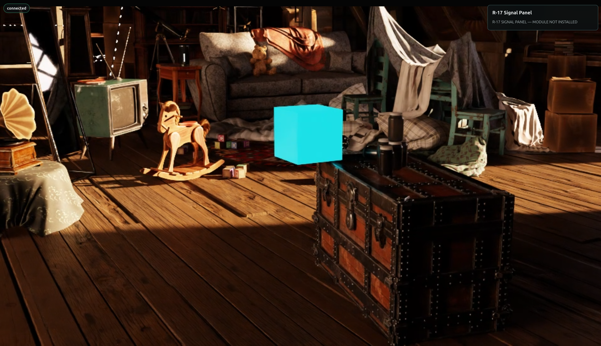

# Open the Attic Portal[#](#open-the-attic-portal "Link to this heading")

**What you are learning:** Start with the product a developer actually wants. The browser will display and control an RTX experience, but the rendering and OpenUSD work stay on the server.

**Mission:** Prepare the Old Attic as a live, inspectable environment for a future robot application. Your first proof is the complete path from the supplied OpenUSD scene to responsive browser pixels.

**Why this matters for a robot-ready scene:** Before a robotics team can commission behaviors or sensors, it needs a dependable way to inspect the same composed world the machine will use. A live viewport proves that scene composition, camera state, rendering, streaming, and input all agree; a still image cannot prove that runtime path.

**Your 3D skills at work:** Scene assembly tells you whether the correct assets, hierarchy, materials, scale, and camera context survived composition. Real-time, VFX, and pipeline experience helps you recognize the difference between a beautiful frame and a healthy render loop - exactly the judgment needed to commission a physical-AI application.

## Portal Pulse: From USD Scene to Live Pixels[#](#portal-pulse-from-usd-scene-to-live-pixels "Link to this heading")

How this page’s lifecycle fits together. Step through the slides, then start the build below.

Two Phases: Start Once, Then Repeat

Two Phases: Start Once, Then Repeat

The portal sets up once, then runs a loop.

One long-lived **`ovrtx`** renderer loads the composed OpenUSD stage.

A `Camera`, `RenderProduct`, and `LdrColor` `RenderVar` are connected.

**`ovstream`** creates a WebRTC server and registers its callbacks.

All of this happens once at startup - before the pulse begins.

```
flowchart TD
subgraph startup [Startup - happens once]
R["ovrtx loads the OpenUSD stage"] --> Conn["Connect Camera + RenderProduct + LdrColor RenderVar"]
Conn --> S["ovstream creates WebRTC server + callbacks"]
end
startup --> Loop["Then the Portal Pulse loop repeats"]
```

The Portal Pulse Loop

The Portal Pulse Loop

Input in, frame out - many times per second.

You drag inside the browser viewport.

**`ovstream`** carries the input back; the callback queues a camera intent.

The renderer-owning thread updates the Camera and **`ovrtx`** steps the RenderProduct.

The app maps `LdrColor`, **`ovstream`** sends the frame, the browser displays it - then it repeats.

```
flowchart LR
Drag["Drag in browser viewport"] --> In["ovstream carries input;<br/>callback queues camera intent"]
In --> Step["Renderer thread updates Camera;<br/>ovrtx steps the RenderProduct"]
Step --> Out["App maps LdrColor;<br/>ovstream sends frame; browser displays"]
Out --> Drag
```

## Mission 1.a — Commission the Attic Portal[#](#mission-1-a-commission-the-attic-portal "Link to this heading")

### 1. Inspect — Separate Live Pixels From Trusted World Evidence[#](#inspect-separate-live-pixels-from-trusted-world-evidence "Link to this heading")

Note

Need the files first? Download the assets, starter code, and agent skills from the [Download Course Materials](index.html#download-course-materials) section on the course Overview, then use the local paths listed below.

You’ll direct your agent to create the Attic Portal from the Old Attic OpenUSD scene, run the portal’s diagnostic check, and launch it. This USD scene is our own prepared file; you’ll orchestrate with your agent to call the skills each library needs to build the server, the React application, and the page layout, then connect them to the scene.

To give the agent the recipe it needs, use NVIDIA’s [Omniverse Realtime Viewer skill](https://github.com/NVIDIA/skills/tree/main/skills/omniverse-realtime-viewer). This packaged skill teaches the agent the right guidance for `ovrtx` rendering, `ovstream` delivery, browser input, and validation. The skill is not the renderer and it is not a ready-made application - it teaches the agent how the pieces work together, then steps away once the portal is built.

![Diagram titled What Omniverse Realtime Viewer Does, split into build time and run time. At build time, your mission brief (Goal, Skills, Context, Done when) feeds Codex, the orchestrator, which reads the Omniverse Realtime Viewer skill for version-specific guidance on stage loading, render lifecycle, browser input, stream messages, and validation, then builds one application. At run time, OpenUSD holds scene truth and prim paths, the Python application validates commands and publishes state, ovrtx is the RTX renderer worker, ovstream is the courier carrying WebRTC video and input, and the React browser client displays and sends input. The skill does not render or stream; it teaches the agent how to connect the libraries and preserve one app, one renderer, one stream.](../_images/lab-1-realtime-viewer-overview.png)

The skill does not know the museum mission or what makes this scene useful for robotics. Your prompt must explicitly ask the agent to compose two regions in the React app: the streamed viewport and an empty diagnostics panel beside it. “Empty” means the panel has a title and *MODULE NOT INSTALLED* status, but no live controls or invented telemetry. You’ll build it out one capability at a time in the next two missions.

The course files are located at:

- Realtime Viewer skill: `~/RTXViewport/skills/omniverse-realtime-viewer`
- Old Attic scene: `~/RTXViewport/Attic_Nvidia/old_attic.usd`
- Portal project the agent will create: `~/RTXViewport/Attic_Portal`

Before building, inspect the distinction you will need to approve. A responsive viewport proves that OpenUSD, `ovrtx`, `ovstream`, and the browser share a healthy runtime path. It does not, by itself, prove that scene units, axes, object identities, or camera frames are correct for a future robot application. Scene assembly and production-review experience are what let you recognize that difference.

### 2. Specify — Produce Your Portal Commissioning Brief[#](#specify-produce-your-portal-commissioning-brief "Link to this heading")

Decide the evidence you would require before treating a rendered world as trustworthy. Open the [Prompt Builder](../prompt-builder.html), choose the **Ray Trace Your Way to a Better Life** session, and select **Mission 1.a - Commission the Attic Portal**. Turn that decision into an addition for `Context` and an observable addition for `Done when`. The tested mission still owns the launch architecture; your answers tell the agent which world-quality evidence matters to you. If you want to move quickly, leave the optional fields blank and continue with the tested prompt below.

### 3. Build — Launch the Portal[#](#build-launch-the-portal "Link to this heading")

Tip

**Make It Yours:** Open the [Prompt Builder](../prompt-builder.html), choose the **Ray Trace Your Way to a Better Life** session, and select **Mission 1.a - Commission the Attic Portal**. Add your `Context` and `Done when` decisions to the generated prompt, review the complete contract, and copy your version.


Show a finished prompt

```
Goal: Launch the prepared Attic Portal so the Old Attic appears as a live,
interactive RTX viewport in the browser.
Skills: Read and use ~/RTXViewport/skills/omniverse-realtime-viewer/SKILL.md
for the launch and browser-streaming workflow.
Context: The prepared app is at ~/RTXViewport/Attic\_Portal and its OpenUSD scene
is ~/RTXViewport/Attic\_Nvidia/old\_attic.usd. The app already includes its server,
browser client, and launch tools.
Done when: The browser shows the live Old Attic; orbit, pan, and zoom respond; the R-17
Signal Panel says MODULE NOT INSTALLED; and the agent gives me the browser URL.
```

### 4. Verify — Prove the Portal Pulse[#](#verify-prove-the-portal-pulse "Link to this heading")



When the browser opens, inspect the result as a commissioning review rather than accepting the first frame. Orbit, pan, and zoom once each. Every gesture should travel through the complete loop:

```
Browser input → ovstream → application queue → active Camera
→ ovrtx steps the RenderProduct → LdrColor
→ ovstream video → Browser
```

[Your browser does not support the video tag.](../_images/lab-1-attic-portal-walkthrough.webm)

The **agent and skills** guided the build. At runtime, **OpenUSD** describes the world, **`ovrtx`** renders it, **`ovstream`** transports input and frames, and the **browser** displays the result. Compare the live portal with both the provided checks and the brief you defined. If your evidence is missing, revise the brief; do not redefine success as “a window opened.”

## Validate: Attic Portal Online[#](#validate-attic-portal-online "Link to this heading")

Your portal is ready only when all of these are true:

- The browser shows the attic - not a blank video element or static screenshot.
- Orbit, pan, and zoom each produce a newly rendered view.
- Server health becomes ready after the first valid rendered-and-converted frame.
- The browser shows the expected *Signal Panel — MODULE NOT INSTALLED* placeholder for the next mission.

With the portal live, we’ll give the Memory Cube a reliable machine identity and command route in [Establish the Cube Link](establish-the-cube-link.html).

On this page
