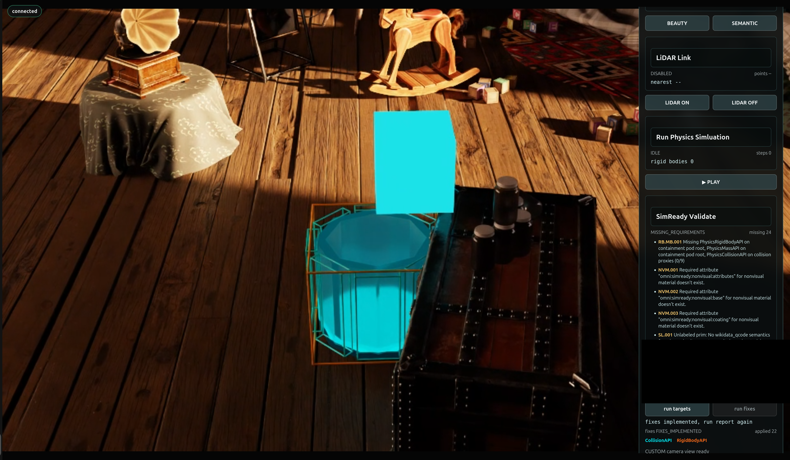

# Apply the Simulation-Ready Corrections[#](#apply-the-simulation-ready-corrections "Link to this heading")

**Mission connection:** The readiness report identifies authored conditions that prevent the selected objects from satisfying their physical contract. In a future physical-AI workflow, a wrong mass, missing rigid body, or closed collider becomes incorrect motion or contact. Your publish-gate, proxy-modeling, and nondestructive-layering skills transfer directly: route supported findings, preserve source assets, author a physically meaningful open-top collision envelope, and expose that invisible representation for inspection.

## Collider-Overlay Experience[#](#collider-overlay-experience "Link to this heading")

When the assets are physics-ready, the viewport adds a *Collider Overlay* on the cube and the containment pod. This overlay is a visual representation we added to show the physical contact geometry. Use it as a diagnostic view to validate that the fixes ran correctly.

The overlay makes it possible to inspect:

- which prims participate in collision;
- whether C-9 remains open at the top and no mesh is blocking the top of the pod;
- whether its floor and walls have appropriate coverage;
- whether the cube’s collision representation matches its intended scale; and
- whether support collision is located where the rendered surface appears.



Mission 3 arrives in two parts: first you add a guarded control, then you wire it to the report so a repair can only run on real, current evidence.

## Decide Before You Build[#](#decide-before-you-build "Link to this heading")

**Your call — what must be true before a repair may run?** A fix that runs on stale or missing evidence is worse than no fix. Before you build the guarded control, decide the guard conditions that must hold before `run fixes` may act, and what “non-destructive” must guarantee about the protected sources.

**Author your brief.** The tested mission owns the guard-and-apply architecture. Continue authoring both **Context** and **Done when**, now covering the guard *and* the non-destructive promise across both parts. A worked example you can adapt:

```
Context (your addition): run fixes stays disabled until run targets produces a current
report containing RB.MB.001; corrections write to \*\_Fixed.usda,
never the protected sources.
Done when (your addition): after a user-initiated fix, the collider overlay shows C-9 still
open at the top and the Mission 2 source hashes are unchanged.
```

Carry those decisions into both Prompt Builder briefs below, then judge each result against them.

## Mission Brief 3, Part 1 — Add the Guarded Repair Control[#](#mission-brief-3-part-1-add-the-guarded-repair-control "Link to this heading")

Part 1 adds a **run fixes** button next to **run targets**, but keeps it deliberately inert. Clicking it reports that fixes are not implemented and authors nothing. This proves the control and its guards exist before any USD is touched.

Tip

**Make It Yours:** Open the [Prompt Builder](../prompt-builder.html), choose the **SimReady or Not, Here Comes Gravity** session, and select **Mission 3 Part 1 - Add the Guarded Repair Control**. Review your learner-authored Expert Brief in Context and Done when before you run the mission. Goal and Skills remain tested.

Show a finished prompt

```
Goal: Extend the prepared Session 2 Attic Portal with Mission 3 Part 1. Add a button labeled exactly "run fixes" directly next to "run targets" in the "SimReady Validate" section. Keep this Part 1 button deliberately inert: clicking it must report that fixes are not implemented and must not edit USD data, apply schemas, create fixed outputs, or display physics outlines.
Skills: Read ~/SimReadyPhysics/skills/omniverse-realtime-viewer/SKILL.md and its focused guidance at references/streaming-messages/README.md, references/viewer-control-patterns/README.md, references/viewer-feedback-status/README.md, and references/validation.md.
Context: Session 2 PreWork, Mission 1, and Mission 2 are complete. Reuse ~/SimReadyPhysics/Attic\_Portal\_Mission\_3\_Part\_1 and run ~/SimReadyPhysics/scripts/apply\_and\_verify\_mission3\_part1.sh. Preserve the existing r17-command-v1/r17-state-v1 protocol and explicit userInitiated command guard. Keep ~/SimReadyPhysics/OldAttic\_Mission\_2.usda and ~/SimReadyPhysics/C9\_ContainmentPod.usda read-only, and do not create scene backups.
Done when: The frontend builds; "run targets" and "run fixes" are visibly adjacent; clicking "run fixes" returns fixes.status="NOT\_IMPLEMENTED", appliedCount=0, and outlineVisible=false; the button causes no target validation or USD authoring; both source SHA-256 values are unchanged; the browser smoke test captures r17-mission3-part1-inert-fixes.png; and renderer\_owner\_count remains 1.
```

## Mission Brief 3, Part 2 — Apply Report-Driven Fixes[#](#mission-brief-3-part-2-apply-report-driven-fixes "Link to this heading")

Part 2 wires **run fixes** to the current **run targets** report. The button stays disabled until the user has run targets and the report contains repairable `RB.MB.001` evidence. Only when the user later clicks **run fixes** does the workflow apply the report-driven rigid-body, mass, and open-top compound-collision corrections, then reload the fixed output and display `CollisionAPI` and `RigidBodyAPI` outlines.

Tip

**Make It Yours:** In the [Prompt Builder](../prompt-builder.html), select **Mission 3 Part 2 - Wire Report-Driven Fixes**. Review your Expert Brief in Context and Done when before you run the mission. Goal and Skills remain tested.

Show a finished prompt

```
Goal: Implement Mission 3 Part 2 by wiring "run fixes" to the current SimReady "run targets" report. Keep the button disabled and reject the command until the user has run targets and the current report contains repairable RB.MB.001 evidence. When—and only when—the user later clicks "run fixes", apply the report-driven rigid-body, mass, and open-top compound-collision fixes; reject top, lid, ceiling, or cap colliders and preserve enough opening clearance for the Memory Cube; report exactly "fixes implemented, run report again"; reload the fixed mission output; and display visible CollisionAPI and RigidBodyAPI outlines in the scene.
Skills: Read ~/SimReadyPhysics/skills/omniverse-realtime-viewer/SKILL.md and its focused guidance at references/streaming-messages/README.md, references/viewer-control-patterns/README.md, references/viewer-feedback-status/README.md, references/viewport-overlays/README.md, and references/validation.md. Read ~/SimReadyPhysics/skills/omniverse-cad-to-simready/references/simready-validate/README.md and references/simready-conform-profile/README.md; use the FET004/RB.MB.001 repair guidance and existing authored collision proxies.
Context: Mission 3 Part 1 is the starting application state. Reuse ~/SimReadyPhysics/Attic\_Portal\_Mission\_3\_Part\_2. The current ~/SimReadyPhysics/scripts/apply\_and\_verify\_mission3\_part2.sh is not safe to run unmodified because its browser workflow clicks "run fixes". Update the apply/verification workflow so its default path installs, builds, restarts, proves the pre-report client and server guards, clicks only "run targets", confirms RB.MB.001 enables "run fixes", and then stops without clicking or sending simready.fixTargets. The guarded fixer must confirm that report targets and hashes still match the active Mission 2 sources. Preserve those sources. If the user later clicks "run fixes", author explicit outputs at ~/SimReadyPhysics/OldAttic\_Mission\_3\_Fixed.usda and ~/SimReadyPhysics/C9\_ContainmentPod\_Mission\_3\_Fixed.usda and use the viewer-owned R17\_PhysicsOutlines.usda layer for outlines. Do not create backup scene files. Unrelated validator findings may remain and must still be reported honestly.
Safety: During implementation and automated verification, do not click "run fixes", do not send simready.fixTargets, do not author or overwrite either fixed output, and do not create or display R17\_PhysicsOutlines.usda. Leave the live app on the original Mission 2 sources with the current validation report loaded and "run fixes" enabled for the user. Any end-to-end fix execution and post-fix revalidation belong to a separate user-initiated test after handoff.
Done when: The frontend builds; before validation, "run fixes" is disabled and a focused server-side test proves the command is rejected without a current report; the automated browser smoke clicks only "run targets" and confirms the report contains RB.MB.001 and "run fixes" becomes enabled; no simready.fixTargets command appears in the apply-run log; fixes remain unapplied, outlineVisible=false, and the active stage remains ~/SimReadyPhysics/OldAttic\_Mission\_2.usda; renderer\_owner\_count remains 1; both Mission 2 source hashes are unchanged; readiness evidence captures r17-mission3-part2-ready.png; and the app is left open with "run fixes" enabled for the user to test manually.
```

## Validate: Corrections Applied and Visible[#](#validate-corrections-applied-and-visible "Link to this heading")

Before you move on, confirm you can answer:

- In Part 1, does **run fixes** stay inert (`fixes.status="NOT_IMPLEMENTED"`, `appliedCount=0`, `outlineVisible=false`) and author nothing?
- In Part 2, is **run fixes** disabled until the report contains repairable `RB.MB.001` evidence?
- After a user-initiated fix, do the `CollisionAPI` and `RigidBodyAPI` outlines appear, and does C-9 stay open at the top?
- Are the protected Mission 2 sources unchanged, with corrected outputs authored to separate `*_Fixed.usda` files?

### When a Run Doesn’t Match[#](#when-a-run-doesn-t-match "Link to this heading")

If a check fails, find the first boundary to inspect:

| Symptom | First boundary |
| --- | --- |
| **run fixes** is enabled before you ran targets | the guard is missing - fixes must stay disabled until a current report contains `RB.MB.001` |
| C-9 is closed at the top after the fix | a top, lid, or ceiling collider was added - the pod must stay open with clearance for the cube |

With the assets corrected and the colliders visible, we’ll prove behavior at runtime in [Prove the Physical Rehearsal](prove-the-rehearsal.html).

On this page
