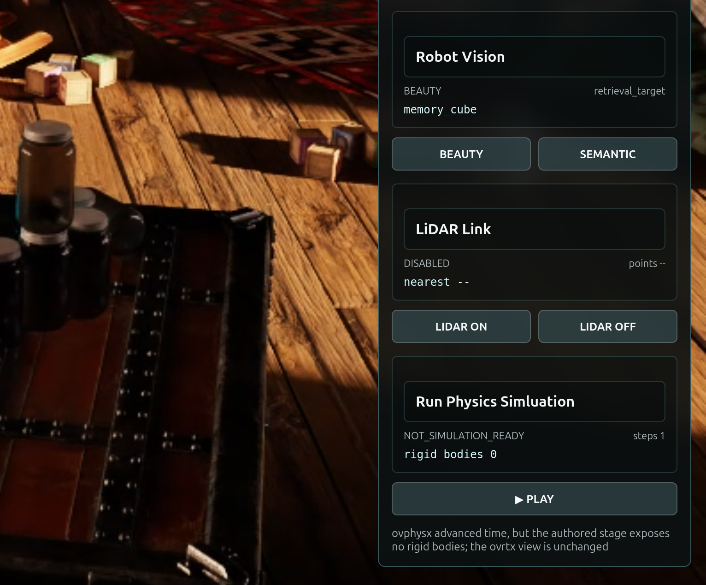

# Connect ovphysx and Run the First Drop Test[#](#connect-ovphysx-and-run-the-first-drop-test "Link to this heading")

**Mission connection:** A future robotics workflow cannot be trained or tested from a static viewport. Before deployment, the team needs a real-time physics rehearsal that can release the Memory Cube, observe its motion, and measure whether it contacts C-9 and the support surfaces as intended. Your FX simulation and cache-troubleshooting experience transfers directly: you know that a motionless frame is a symptom, not a diagnosis, and how to separate a live solver from a scene with no usable bodies.

## What Changes in the Application[#](#what-changes-in-the-application "Link to this heading")

Mission 1 introduces a new *Physics Rehearsal* section in the existing *Signal Panel* (the panel titles it *Run Physics Simluation*). It includes:

- a **PLAY** drop test control;
- *simulation status*;
- *simulation time*;
- *fixed timestep*;
- *step count*; and
- *rigid-body count*.

The application initializes `ovphysx` and connects it to the existing sole simulation and render owner loop. It does not create another renderer, stream, React provider, or browser connection.

## Decide Before You Build[#](#decide-before-you-build "Link to this heading")

**Your call — what proves a live solver on an empty scene?** By design, once you build the probe the drop test will report `rigidBodyCount: 0`. Before you build, decide the one runtime signal that separates *“physics is connected”* from *“the scene has usable bodies.”* A frozen frame alone cannot tell you which is true.

**Author your brief.** The tested mission owns the probe architecture; your job is to add the observable evidence *you* would trust. This is your first brief, so author just the **Done when** line yourself and leave the rest on the tested route. A worked example you can adapt:

```
Done when (your addition): stepCount increases and elapsedTime rises on Play while
rigidBodyCount stays 0 - a live solver stepping an empty scene.
```

Carry that decision into the Prompt Builder below, then judge the agent’s result against it.

## Mission Brief 1 — Add the ovphysx Simulation Probe[#](#mission-brief-1-add-the-ovphysx-simulation-probe "Link to this heading")

Tip

**Make It Yours:** Open the [Prompt Builder](../prompt-builder.html), choose the **SimReady or Not, Here Comes Gravity** session, and select **Mission 1 - Run the ovphysx Simulation Probe**. Before you run it, separate what the viewport proves from the physical claims that still need evidence, choose the scene-intent risk Mission 1 must expose, and send those decisions into Context and Done when. If you get stuck, use the provided default to check your work.

Show a finished prompt

```
Goal: Extend the cumulative Session 1 Attic Portal with an ovphysx simulation probe for Mission 1. Add a panel section titled exactly "Run Physics Simluation" with a Play button. On Play, load the physical stage into ovphysx, advance it by a fixed simulation step, and expose simulation state for a future renderer handoff. Preserve the teaching outcome: ovphysx runs, but the current authored scene has no usable rigid bodies, so the rendered scene must not move.
Skills: Read ~/SimReadyPhysics/skills/omniverse-realtime-viewer/SKILL.md, then its focused guidance at references/streaming-messages/README.md, references/viewer-control-patterns/README.md, references/viewer-feedback-status/README.md, references/dependencies/README.md, and references/validation.md. Follow the installed ovphysx API contract: import ovrtx before ovphysx; use PhysX.add\_usd(), wait for the load, step with a fixed dt, query RIGID\_BODY\_POSE state, and release the runtime cleanly.
Context: ~/SimReadyPhysics/PreWork has already restored the checkpoint\_3 app, opened OldAttic\_Mission\_2.usda, and preflighted ovphysx. Work in ~/SimReadyPhysics/Attic\_Portal without rerunning PreWork or checkpoint\_00. Preserve the existing camera, robot-vision, and Lidar features. Use the existing r17-command-v1/r17-state-v1 protocol and run physics on the renderer-owner thread. Keep all USD files read-only: add no physics schemas, renderer pose bridge, or backup scene files.
Done when: The frontend builds; the panel visibly contains "Run Physics Simluation" and a "▶ PLAY" button; clicking Play performs a real ovphysx stage load and fixed-time step; state.json reports runtimeInstalled=true, stepCount>=1, elapsedTime>0, rigidBodyCount=0, status="NOT\_SIMULATION\_READY", bridgeReady=false, renderer\_owner\_count=1, and the Mission 2 stage path; a browser smoke test captures r17-physics-probe.png; the Mission 2 USD SHA-256 is identical before and after; the running app preserves the complete checkpoint\_3 camera, robot-vision, and Lidar capabilities.
```

## Run the First Drop Test[#](#run-the-first-drop-test "Link to this heading")

Now that the probe is built, run it.

Tip

**Predict first:** Before you press PLAY, restate what your `Done when` predicted - what `rigidBodyCount` will be and whether the scene should move - then compare it to the panel.

Select **PLAY** in the *Signal Panel* of your Attic Portal and watch the scene. Nothing moves. The panel reports:

```
rigidBodyCount: 0
```

This is the first piece of engineering evidence. The viewport is functioning and `ovphysx` is now connected, but the loaded rehearsal currently contains no objects registered as rigid bodies.



## Validate: Physics Probe Connected[#](#validate-physics-probe-connected "Link to this heading")

Before you move on, confirm you can answer:

- Is `ovphysx` installed and stepping (`runtimeInstalled=true`, `stepCount>=1`, `elapsedTime>0`)?
- Does the scene still report `rigidBodyCount=0` and `status="NOT_SIMULATION_READY"`?
- Did the app preserve one renderer owner and the Session 1 camera, robot-vision, and Lidar features?

### When a Run Doesn’t Match[#](#when-a-run-doesn-t-match "Link to this heading")

If a check fails, find the first boundary to inspect:

| Symptom | First boundary |
| --- | --- |
| No *Run Physics Simluation* section or PLAY button | frontend did not build or restart - rerun the apply and reload the browser |
| PLAY does nothing and `stepCount` stays 0 | `ovphysx` is not stepping - confirm `runtimeInstalled=true` and the probe runs on the renderer-owner thread |
| `rigidBodyCount` is not 0 after the probe | wrong stage loaded - confirm the Mission 2 stage path; the teaching outcome needs a scene with no usable bodies |

With a live solver and a clear symptom, we’ll turn “physics is broken” into a structured report in [Inspect What the Scene Is Missing](inspect-simready-readiness.html).

On this page
